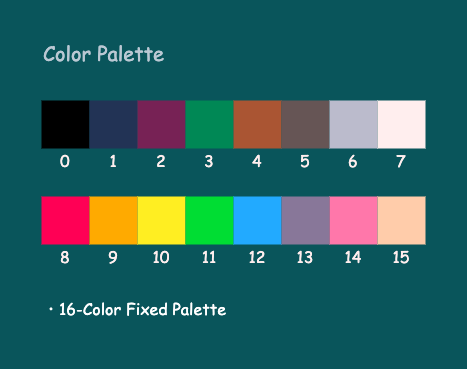
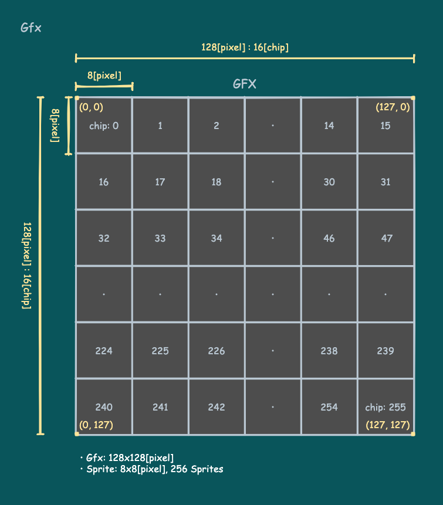
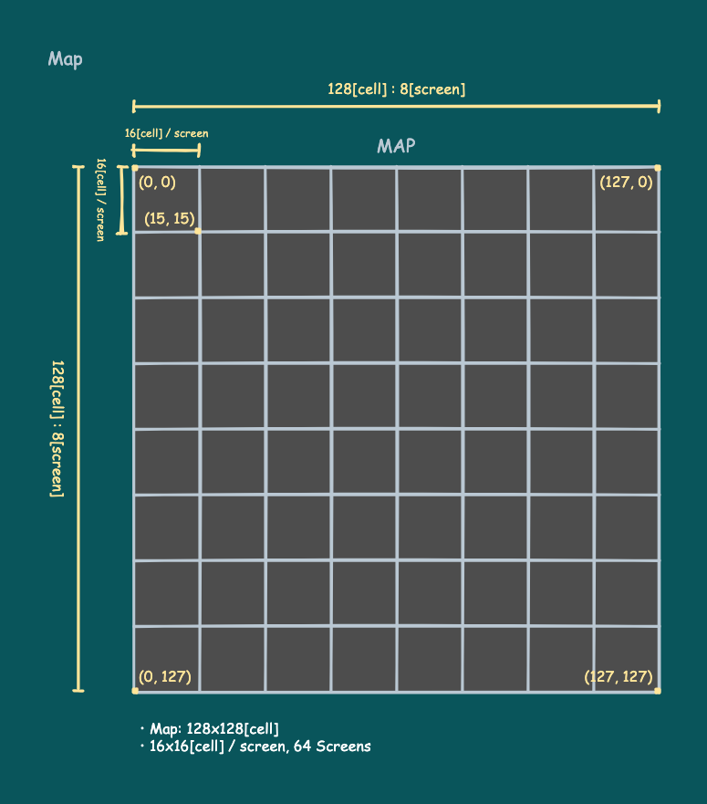
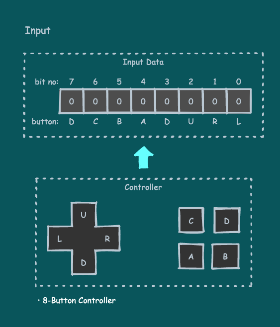
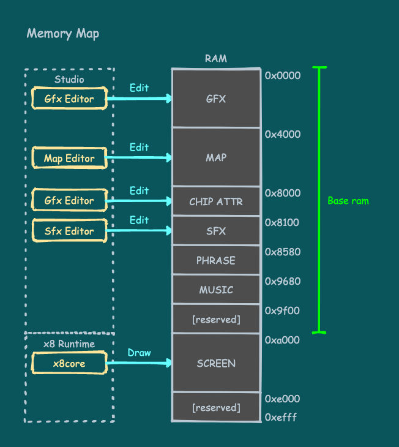

# リファレンスマニュアル

## x8マシン概要

- 表示 : 128x128、16色固定パレット
- サウンド : 4ch、簡易シンセ
- 入力 : 8ボタン
- プログラム言語 : Lua 5.3
- スプライト : 256(8x8スプライト)
- マップ : 128x128(8x8チップ)
- オーディオ : 32Sfx

---

## 表示仕様

### 画面

画面のサイズは**128x128[pixel]**です。

画面座標の原点は左上隅で、x座標は右が正の方向、y座標は下が正の方向です。


### カラー

カラーは**16色固定パレット**です。各色は**0〜15のカラー番号**で表されます。



### グラフィックスとチップ属性

Gfxエディタで作成した画像データは**128x128[pixel]**の**グラフィックス領域（Gfx領域）**に格納されます。

Gfx領域にはピクセル毎のカラー番号が**1[pixel]あたり1[byte]（下位4ビットのみ有効）**で格納されます。

Gfx領域を**8x8[pixel]**で分割した単位が**チップ**です。**256個**あるチップには左上から順に**0〜255のチップ番号**が振られています。

**スプライト**はチップ単位の画像を画面に表示したものです。

各チップは画像データとは別に**8[bit]のチップ属性**を持っています。チップ属性はGfxエディタでビット毎に設定でき、**チップ属性領域**に格納されます。



### マップ

Mapエディタで作成したマップデータは**128x128[cell]**の**マップ領域（Map領域）**に格納されます。

Map領域にはセルに配置されたチップ番号が**1[cell]あたり1[byte]**で格納されます。

16x16[cell]が1画面分の広さなので、Map領域全体では**64画面分**の広さになります。



---

## サウンド仕様

### オーディオチャンネル

x8は**最大4つのチャンネル**から音を出すことが出来ます。システムはできるだけ多くの音が出るよう、自動でチャンネルを振り分けます。

---

## 入力仕様

x8は**8ボタンのコントローラ入力**に対応しています。各ボタンのON/OFFは、入力データビットの1/0に対応しています。



---

## メモリマップ

x8はアドレス空間にマッピングされたメモリを持っています。これは**Luaプログラムが動的に利用するメモリとは別のもの**です。



**Base ram**はx8studioで作成された画像やサウンドのデータが配置される領域です。

**SCREEN**は描画命令の描画先である**画面イメージ**領域です。画面イメージ領域にはピクセル毎のカラー番号が**1[pixel]あたり1[byte]（下位4ビットのみ有効）**で格納されます。

---

## 描画

### 画面イメージ

全ての描画命令は、**画面イメージ**と呼ばれる領域に描画を行います。描画結果の画面イメージは、**画面パレット**で色を置き換えらた後、実際の画面に表示されます。

### 描画ステート

**描画ステート**はビデオ関連の命令に影響するいくつかの状態のことです。描画ステートには以下のものがあります。

- **描画座標オフセット**：全ての描画命令は、位置をこのオフセット分ずらして描画します。
- **描画クリップ矩形**：全ての描画命令は、この矩形の内側にだけ描画結果を反映します。
- **描画パレット**：全ての描画命令は、描画する色をこのパレットで置き換えます。
- **抜き色情報**：全ての描画命令は、この情報で抜きになっている色を描画しません。
- **デフォルト描画色**：色を指定可能な描画命令で、色を指定しなかった場合、この色で描画します。
- **フォントスケール**：フォント描画命令は、このスケールを反映して描画します。
- **フォント間隔**：フォント描画命令は、各々の文字をこの間隔を開けて描画します。
- **画面パレット**：描画結果の画面イメージは、最終的にこのパレットで色を置き換えて、表示されます。

---

## フォント

x8にはいくつかの組み込みフォントが用意されています。

カタカナや特殊文字を含む文字列は、APIなどで扱う前にまず、[x8.enc](#x8.enc)で8bitコードに変換する必要があります。

```
x8.fnt(x8.enc("ｶﾀｶﾅ ﾄｶ ←→↑↓ ﾄｶ ｶﾞ ﾊｲｯﾃｲﾙ ﾓｼﾞﾚﾂ ﾊ enc()ﾃﾞ 8bit ｺｰﾄﾞ ﾆ ﾍﾝｶﾝ ｽﾍﾞｼ"))
str_len = string.len(x8.enc("ｶﾀｶﾅ ﾄｶ ⒶⒷⒸⒹ ﾄｶ ｱｯﾃﾓ stringﾗｲﾌﾞﾗﾘ ﾊ ｿﾉﾏﾏ ﾂｶｴﾏｽ"))
```

---

## オーディオ

### オーディオハンドル

オーディオの再生APIは再生されたサウンドを操作するための**オーディオハンドル**を返します。オーディオハンドルを利用して再生中のサウンドを個別に停止させることが出来ます。

---

## API_ビデオ

### x8.cls

> `x8.cls([col])`

色`col`で画面をクリアします。

描画パレットの影響を受けますが、描画オフセット、描画クリップ、抜き色情報の影響は受けません。

引き数のデフォルト値 : `col=0`

### x8.clip

> `x8.clip([x[,y[,w[,h]]]])`

描画クリップ矩形に、位置`x,y`とサイズ`w,h`を設定します。引き数なしで呼ぶとリセットします。

全ての描画命令は、この矩形の内側にだけ描画結果を反映します。

引き数のデフォルト値 : `x=0`,`y=0`,`w=128`,`h=128`

### x8.camera

> `x8.camera([x[,y]])`

描画座標オフセットに`x,y`を設定します。引き数なしで呼ぶとリセットします。

全ての描画命令は、位置をこのオフセット分ずらして描画します。

引き数のデフォルト値 : `x=0`,`y=0`

### x8.color

> `x8.color([col])`

デフォルト描画色に`col`を設定します。

色を指定可能な描画命令で、色を指定しなかった場合、この色で描画します。

引き数のデフォルト値 : `col=7`

### x8.drwpal

> `x8.drwpal([col0[,col1]])`

描画パレットに、色`col0`を`col1`に置き換わるよう設定します。引き数なしで呼ぶとリセットします。

全ての描画命令は、描画する色をこのパレットで置き換えます。

引き数のデフォルト値 : `col0=0`,`col1=col1`

### x8.scrpal

> `x8.scrpal([col0[,col1]])`

画面パレットに、色`col0`を`col1`に置き換わるよう設定します。引き数なしで呼ぶとリセットします。

描画結果の画面イメージは、最終的にこのパレットで色を置き換えて、表示されます。

引き数のデフォルト値 : `col0=0`,`col1=col1`

### x8.colorkey

> `x8.colorkey([col[,trs]])`

抜き色情報に、色`col`を抜きにするかどうかを`trs`(boolean)に設定します。引き数なしで呼ぶとリセットします。

全ての描画命令は、この情報で抜きになっている色を描画しません。

引き数のデフォルト値 : `col=0`,`trs=true`

### x8.spr

> `x8.spr(n,x,y[,w[,h,[,flpx[,flpy]]]])`

`n`番のチップを位置`x,y`に描画します。サイズ`w,h`はチップ単位です。`flpx`で左右の、 `flpy`で上下の反転を指定できます。

描画ステートの影響を受けます。

引き数のデフォルト値 : `w=1`,`h=1`,`flpx=false`,`flpy=false`

### x8.gfx

> `x8.gfx(gx,gy,gw,gh,x,y[,w[,h[,flpx[,flpy]]]])`

Gfx内の位置`gx,gy`、サイズ`gw,gh`の矩形領域を、画面の位置`x,y`に描画します。`w,h`で描画サイズを指定できます。全てピクセル単位です。`flpx`で左右の、 `flpy`で上下の反転を指定できます。

描画ステートの影響を受けます。

引き数のデフォルト値 : `w=gw`,`h=gh`,`flpx=false`,`flpy=false`

### x8.map

> `x8.map(mapx,mapy,x,y[,mapw[,maph]])`

Map内の位置`mapx,mapy`のチップを、画面の位置`x,y`に描画します。Map内のサイズを`mapw,maph`によりチップ単位で指定できます。

描画ステートの影響を受けます。

引き数のデフォルト値 : `mapw=1`,`maph=1`

### x8.mapget

> `x8.mapget(mapx,mapy)`

Map内の位置`mapx,mapy`のチップ番号を取得して返します。

### x8.mapset

> `x8.mapset(mapx,mapy,val)`

Map内の位置`mapx,mapy`のチップ番号を`val`に設定します。

### x8.atrget

> `x8.atrget(n[,bit])`

`n`番のチップ属性を取得して返します。`bit`があればそのビット値をbooleanで、なければチップ属性値をそのまま返します。

### x8.atrset

> `x8.atrset(n[,bit][,val])`

`n`番のチップ属性を`val`に設定します。`bit`があれば`val`をbooleanとしてそのビット値を、なければ`val`をチップ属性値としてそのまま設定します。

引き数のデフォルト値 : `bit`がある場合`val=false`

### x8.scrget

> `x8.scrget(x,y)`

画面の位置`x,y`のピクセルの色を取得して返します。

### x8.scrset

> `x8.scrset(x,y,col)`

画面の位置`x,y`のピクセルに色`col`を設定します。

描画命令ではないため描画ステートの影響を受けません。

### x8.gfxget

> `x8.gfxget(gx,gy)`

Gfx内の位置`x,y`のピクセルの色を取得して返します。

### x8.gfxset

> `x8.gfxset(gx,gy,col)`

Gfx内の位置`x,y`のピクセルに色`col`を設定します。

描画命令ではないため描画ステートの影響を受けません。

### x8.pixel

> `x8.pixel(x,y[,col])`

画面の位置`x,y`にピクセルを描画します。`col`で色を指定出来ます。

描画ステートの影響を受けます。

引き数のデフォルト値 : `col=デフォルト描画色`

### x8.line

> `x8.line(x0,y0,x1,y1[,col])`

画面に始点`x0,y0`終点`x1,y1`の直線を描画します。`col`で色を指定出来ます。

描画ステートの影響を受けます。

引き数のデフォルト値 : `col=デフォルト描画色`

### x8.rectbdr

> `x8.rectbdr(x0,y0,x1,y1[,col])`

画面に左上`x0,y0`右下`x1,y1`の矩形を描画します。`col`で色を指定出来ます。

描画ステートの影響を受けます。

引き数のデフォルト値 : `col=デフォルト描画色`

### x8.rect

> `x8.rect(x0,y0,x1,y1[,col])`

画面に左上`x0,y0`右下`x1,y1`の塗りつぶされた矩形を描画します。`col`で色を指定出来ます。

描画ステートの影響を受けます。

引き数のデフォルト値 : `col=デフォルト描画色`

### x8.circbdr

> `x8.circbdr(x,y,r[,col])`

画面に中心点`x,y`半径`r`の円を描画します。`col`で色を指定出来ます。

描画ステートの影響を受けます。

引き数のデフォルト値 : `col=デフォルト描画色`

### x8.circ

> `x8.circ(x,y,r[,col])`

画面に中心点`x,y`半径`r`の塗りつぶされた円を描画します。`col`で色を指定出来ます。

描画ステートの影響を受けます。

引き数のデフォルト値 : `col=デフォルト描画色`

---

## API_オーディオ

### x8.sfx

> `x8.sfx(n[,spd[,pitch[,start[,len]]]])`

`n`番のSfxを再生してオーディオハンドルを返します。以下を指定して再生できます。

- `spd`: 再生速度の倍率（実数）
- `pitch`: 音高のオフセット値（整数）
- `start`: 再生開始位置（整数）
- `len`: 再生ノート数（整数）

引き数のデフォルト値 : `spd=1.0`,`pitch=0`,`start=0`,`len=Sfxの長さ`

### x8.hdlstop

> `x8.hdlstop(hdl)`

オーディオハンドル`hdl`で指定された再生中のサウンドを停止します。

### x8.sfxstop

> `x8.sfxstop()`

再生中の全てのSfxを停止します。

---

## API_フォント

### x8.fnt

> `x8.fnt(str,x,y[,col])`

文字列`str`を画面の位置`x,y`に描画します。`col`で色を指定出来ます。

描画ステートの影響を受けます。

引き数のデフォルト値 : `col=デフォルト描画色`

### x8.fntscale

> `x8.fntscale([sclx[,scly]])`

フォント描画の際に反映されるスケール値を設定します。

引き数のデフォルト値 : `sclx=1.0`,`scly=1.0`

### x8.fntspace

> `x8.fntspace([spcx[,spcy]])`

フォント描画の際に反映される文字間隔を設定します。

引き数のデフォルト値 : `spcx=0`,`spcy=0`

### x8.fntmeas

> `x8.fntmeas(str)`

描画ステートと各文字サイズを考慮して算出した、文字列`str`を描画した場合のサイズを、ピクセル単位の整数`w,h`として返します。

### x8.enc

> `x8.enc(str)`

文字列`str`に含まれるカタカナや特殊文字のコードを、全て8bitコードに変換して結果の文字列を返します。

---

## API_入力

### x8.btnprs

> `x8.btnprs([bit])`

現フレームでの、ボタンの押下情報を返します。`bit`があればそのビット値をbooleanで、なければ全ボタン情報のビットマスクを整数で返します。

### x8.btntrg

> `x8.btntrg([bit])`

現フレームでの、ボタンのトリガー情報（OFFからONに変化したか）を返します。`bit`があればそのビット値をbooleanで、なければ全ボタン情報のビットマスクを整数で返します。

---

## API_その他

### x8.log

> `x8.log(str)`

文字列`str`をログに出力します。

### x8.wait

> `x8.wait([frms])`

この関数で`frms`回のフレームを待ちます。これを呼ぶことでシステムに処理が戻り、フレームが進行します。どのスレッドでも`1`以上の引き数でこれを呼ばないと、プログラムは一定時間後にタイムアウトエラーで停止します。

引き数のデフォルト値 : `frms=1`

### x8.clock

> `x8.clock()`

プログラム実行を開始してからの経過時間を秒単位で返します。
