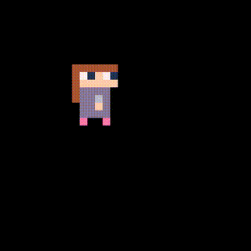
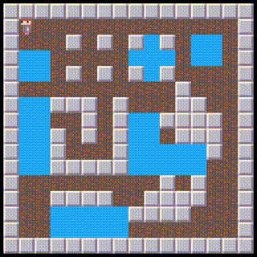

# コードサンプル集

## 変数

---

### 局所的な変数を使いたい（local）

```
a = 10                  -- グローバル変数 a
do                      -- 新しいブロック
   local a = a             -- 新しいローカル変数
   x = a                   -- x:10
   a = a + 1
   do                      -- 別の新しいブロック
      local a = a + 1         -- 別の新しいローカル変数 a
      x = a                   -- x:12
   end
   x = a                   -- x:11
end
x = a                   -- x:10, aはグローバル変数
```

ローカル宣言`local`で新しいローカル変数を作ることができます。

ローカ宣言には初期値の代入をつけることも出来ます。

ローカル変数のスコープ（参照できる範囲）は、その宣言の次の文から、その宣言を含む最も内側のブロックが終わるまでです。スコープ外からは参照できません。

---

### 変数を空にしたい

```
a = 100
a = nil
```

`nil`を代入して変数を空にすることができます。

`nil`は値が無いことを表します。

変数に最初の代入が行われるまで、その変数の値は`nil`です。

---

## 文字列

---

### 文字列を連結したい


```
x = "foo" .. "bar"      -- x:"foobar"
```

文字列連結演算子`..`を使って文字列を連結することができます。

---

### 文字列の長さを取得したい

```
x = #"abc"          -- x:3
x = #"foo bar baz"  -- x:11
```

長さ演算子`#`を使って文字列の長さを取得することができます。

---

## 式

---

### 2つの値を比較したい（関係演算子）

```
x = 3 == 3      -- x:true
x = 2 == 3      -- x:false
x = 2 ~= 3      -- x:true
x = 3 ~= 3      -- x:false
x = 5 < 8       -- x:true
x = 5 > 8       -- x:false
x = 5 <= 8      -- x:true
x = 5 >= 8      -- x:false
```

関係演算子を使って2つの値を比較することができます。

関係演算子は2つの引数をとり、それらの関係が演算子の意味する関係になっているかどうかを`false`か`true`で返します。

- `==` : 左の値と右の値が等しい
- `~=` : 左の値と右の値が等しくない
- `<` : 左の値が右の値より小さい
- `>` : 左の値が右の値より大きい
- `<=` : 左の値が右の値より小さい、または等しい
- `>=` : 左の値が右の値より大きい、または等しい

---

### 四則演算を行いたい（算術演算子）

```
x = 3 + 4       -- x:7
x = 5 - 8       -- x:-3
x = 4 * 5       -- x:20
x = 9 / 4       -- x:2.25

x = 3 + 4 * 2 - 2 / 2       -- x:10.0
x = ((3 + 4) * 2 - 2) / 2   -- x:6.0
```

以下の算術演算子を使って四則演算を行うことができます。

- `+` : 加算
- `-` : 減算
- `*` : 乗算
- `/` : 浮動小数点数除算

一般的な数式と同じように、括弧`(` ` )`を使って式の優先度を変えることができます。

---

### 割り算の商と余りを取得したい（算術演算子）

```
q = 11 // 4     -- q:2
r = 11 % 4      -- r:3
```

割り算の商は切り捨て除算演算子`//`で算出できます。

割り算の余りは剰余演算子`%`で算出できます。

---

### 累乗を計算したい（算術演算子）

```
x = 3 ^ 3       -- x:27
x = 3.6 ^ 2.4   -- x:21.633460842026
x = 3 ^ -2      -- x:0.11111111111111
```

累乗は累乗演算子`^`で算出できます。

---

### 複数の条件式を組み合わせたい（論理演算子）

```
x = not (2 > 5)         -- x:true   = not false

x = 2 > 5 and 5 == 7    -- x:false  = false and false
x = 2 < 5 and 5 == 7    -- x:false  = true and false
x = 2 < 5 and 5 == 5    -- x:true   = true and true

x = 2 > 5 or 5 == 7     -- x:false  = false or false
x = 2 < 5 or 5 == 7     -- x:true   = true or false
x = 2 < 5 or 5 == 5     -- x:true   = true or true
```

以下の論理演算子を使って条件式を組み合わせることができます。

- `not` : 右に1つの引数をとり、引数が真なら結果は偽、引数が偽なら結果は真になります。
- `and` : 左右2つの引数をとり、引数が両方とも真なら結果は真、それ以外なら結果は偽になります。
- `or` : 左右2つの引数をとり、引数のどちらか一方でも真なら結果は真、それ以外なら結果は偽になります。

すべての論理演算子は`false`と`nil`を偽とみなし、それ以外のすべてを真とみなします。

論理演算の**結果の値**については[こちら](lua_basics.md#論理演算子)で説明しています。

---

## ビット演算

---

### ビットごとの演算を行いたい（ビット演算子）

```
x = 9 & 10      -- x:8  .. 1001 & 1010 -> 1000
x = 9 | 10      -- x:11 .. 1001 | 1010 -> 1011
x = 9 ~ 10      -- x:3  .. 1001 ~ 1010 -> 0011
x = 5 >> 2      -- x:1  .. 0101 -> 0010 -> 0001
x = 5 << 2      -- x:20 .. 0101 -> 1010 -> 10100
```

以下のビット演算子を使い、整数をビット列とみなしてビット単位の演算を行うことができます。

- `&` : ビットごとの論理積（左右の値の両方が`1`なら`1`、それ以外なら`0`を返す）
- `|` : ビットごとの論理和（左右の値のうち、一方もしくは両方が`1`なら`1`、それ以外なら`0`を返す）
- `~` : ビットごとの排他的論理和（左右の値が違えば`1`、同じなら`0`を返す）
- `>>` : 右シフト（左の値の全ビット列を、右の値を変位としてその分右にずらす）
- `<<` : 左シフト（左の値の全ビット列を、右の値を変位としてその分左にずらす）
- `~` : 単項ビットごとの否定（右の値の全ビットを反転する）

すべてのビット演算子は、引数を整数に変換し、その整数の全ビットを演算し、結果を整数で返します。
右シフトと左シフトは両方とも、空いたビットをゼロで埋めます。変位に負の値を指定すると逆方向にシフトします。

---

### 特定のビットが1かどうかを知りたい

```
bits = 12               -- bits:12  .. 1100

bit0 = bits & (1 << 0)  -- bit0:0   .. 0    = 1100 &    1
bit1 = bits & (1 << 1)  -- bit1:0   .. 0    = 1100 &   10
bit2 = bits & (1 << 2)  -- bit2:4   .. 100  = 1100 &  100
bit3 = bits & (1 << 3)  -- bit3:8   .. 1000 = 1100 & 1000

x = bit0 > 0            -- x:false
x = bit1 > 0            -- x:false
x = bit2 > 0            -- x:true
x = bit3 > 0            -- x:true
```

調べたいビットだけが`1`の整数と、ビットごとの論理積を取ることで、特定のビットが`1`かどうかを調べることができます。調べたいビットは、論理積の結果が`0`なら`0`、それ以外なら`1`です。

---

### 特定のビットを1にしたい

```
bits = 12               -- bits:12  .. 1100

x = bits | (1 << 0)     -- x:13     .. 1101 = 1100 |    1
x = bits | (1 << 1)     -- x:14     .. 1110 = 1100 |   10
x = bits | (1 << 2)     -- x:12     .. 1100 = 1100 |  100
x = bits | (1 << 3)     -- x:12     .. 1100 = 1100 | 1000
```

`1`にしたいビットだけが`1`でそれ以外が`0`の整数と、ビットごとの論理和を取ることで、特定のビットを`1`にすることができます。

---

### 特定のビットを0にしたい

```
bits = 12               -- bits:12  .. 1100

x = bits & ~(1 << 0)    -- x:12     .. 1100 = 1100 & ..11111110
x = bits & ~(1 << 1)    -- x:12     .. 1100 = 1100 & ..11111101
x = bits & ~(1 << 2)    -- x:8      .. 1000 = 1100 & ..11111011
x = bits & ~(1 << 3)    -- x:4      .. 0100 = 1100 & ..11110111
```

`0`にしたいビットだけが`0`でそれ以外が`1`の整数と、ビットごとの論理積を取ることで、特定のビットを`0`にすることができます。

---

### 複数のビットのうちどれか1つでも1かどうか知りたい

```
bits = 12           -- bits:12  .. 1100

m_0011 = (1 << 0) | (1 << 1)    -- m:3 ..  11
m_0110 = (1 << 1) | (1 << 2)    -- m:6 .. 110

a = bits & m_0011   -- a:0   .. 0   = 1100 & 11
b = bits & m_0110   -- b:4   .. 100 = 1100 & 110

x = a > 0           -- x:false
x = b > 0           -- x:true
```

全ての調べたいビットが`1`の整数と、ビットごとの論理積を取ることで、複数のビットのうちどれか1つでも`1`かどうかを調べることができます。論理積の結果が`0`以外なら調べたいビットに`1`が含まれます。

---

## 制御構造

---

### 条件が成立している間処理を繰り返したい（while,repeat）

```
a = 0
while a < 10 do
   a = a + 1
end
x = a           -- x:10
```

`while`文を使って処理をループすることができます。

この場合、`a < 10`の結果が真の間、`do`ブロックを繰り返し実行します。

```
a = 0
repeat
   a = a + 1
until a >= 10
x = a           -- x:10
```

`repeat`文を使って処理をループすることもできます。

この場合、最初に`repeat`ブロックを実行した後、`a >= 10`の結果が偽である間、`repeat`ブロックを繰り返し実行します。`repeat`ブロックは必ず１回以上実行されます。

---

### ループ変数を更新しながら処理を繰り返したい（for）

```
a = 0
for i = 1, 4 do     -- i:1,2,3,4
   a = a + i
end
x = a               -- x:10

b = 0
for i = 0, 10, 3 do -- i:0,3,6,9
   b = b + i
end
x = b               -- x:18
```

`for`文を使って、ループ変数を更新しながら処理をループすることができます。

上の`for`文の場合、ループ変数`i`が`1`から始まり、`1`づつ増えながら、`4`を超えない間、`do`ブロックを繰り返し実行します。

下の`for`文の場合、ループ変数`i`が`0`から始まり、`3`づつ増えながら、`10`を超えない間、`do`ブロックを繰り返し実行します。

---

### ループを途中で抜けたい（break）

```
a = 0
while true do
   a = a + 1
   break
   a = a + 1
end
x = a           -- x:1
```

`break`文を使ってループを途中で抜けることができます。

`break`文はそれを囲んでいる最も内側の`while`、`repeat`、`for`ループの実行を終了し、制御をループブロックの次へ移動します。

---

### 条件により処理を分岐したい（if）

```
a = 0

if a == 0 then
   a = 1            -- ここを通る
end

if a == 0 then
   a = 100          -- ここは通らない
elseif a == 1 then
   a = 101          -- ここを通る
else
   a = 102          -- ここは通らない
end

x = a               -- x:101
```

`if`文を使って条件分岐を行うことができます。

`if`文は条件式の結果が真になるか偽になるかで制御を分けます。結果が真なら`then`ブロックを実行し、偽なら`else`ブロックを実行します。偽の場合`elseif`でさらに制御を分けることができます。

条件の結果について、**`false`と`nil`は偽とみなされ、それ以外のすべての値（`0`や空文字列`""`なども）は真とみなされます。**

---

### プログラムの制御を別の場所に飛ばしたい（goto）

```
a = 1
goto foo    -- ラベル foo へジャンプ
a = 2       -- ここは通らない

::foo::     -- ラベル foo
x = a       -- x:1
```

`goto`文で制御をラベルの場所へ飛ばすことができます。

ラベル文自体は何もしません。`goto`文の飛び先になるだけです。

---

## テーブル

---

### 空のテーブルを作りたい

```
t = {}
```

テーブルコンストラクタで空のテーブルを作ることができます。

---

### テーブル要素の取得、設定を行いたい

```
t = {}

t[3] = 100
t[true] = 200
t["foo"] = 300
t.bar = 400

x = t[3]        -- x:100
x = t[true]     -- x:200
x = t["foo"]    -- x:300
x = t.foo       -- x:300
x = t["bar"]    -- x:400
x = t.bar       -- x:400

x = t[5]        -- x:nil
```

テーブルの要素にはインデックスを`[` `]`で指定してアクセスできます。

インデックスが識別子のルールに従う文字列の場合は`.`でアクセスできます。

存在しないインデックスで値を取得すると`nil`になります。

---

### 中身を指定してテーブルを作りたい

```
t = { [3] = 100, [true] = 200, ["foo"] = 300, bar = 400 }

x = t[3]        -- x:100
x = t[true]     -- x:200
x = t["foo"]    -- x:300
x = t.foo       -- x:300
x = t["bar"]    -- x:400
x = t.bar       -- x:400
```

テーブルコンストラクタでテーブルを作る際、**`[`式1`] =`式2** の形式でフィールドを設定することができます。

インデックスが識別子のルールに従う文字列の場合は **名前`=`式** の形式が使えます。

---

## 配列

---

### テーブルを配列として使いたい

```
a = { 100, 200, true, "foo" }

x = #a          -- x:4

a[#a + 1] = "bar"
a[#a + 1] = "baz"

x = #a          -- x:6

x = a[0]        -- x:nil

x = a[1]        -- x:100
x = a[2]        -- x:200
x = a[3]        -- x:true
x = a[4]        -- x:"foo"
x = a[5]        -- x:"bar"
x = a[6]        -- x:"baz"

x = a[7]        -- x:nil
```

テーブルをシーケンスにすると、テーブルを配列として使うことができます。

**シーケンスとは、空のテーブル`{}`を含む、インデックスが`1`から始まる連続する自然数だけ（途中に値の抜けがない）であるテーブルのことを言います。**

テーブルコンストラクタでフィールドを **式** だけの形式で指定すると、インデックスが`1`から始まる連番の整数になるため、そのまま配列として使えます。

配列`t`の長さは長さ演算子`#`を使って`#t`で取得出来ます。また、フィールドを追加する際は`t[#t + 1] = v`のように末尾に追加すると抜けがない状態を維持できます。

**配列のインデックスは`1`から始まることに注意してください。**

---

### 配列の長さを取得したい

```
a = { 5, 3, 7, 9, 2 }
x = #a  -- x:5
```

長さ演算子`#`を使って配列の長さを取得することができます。

---

### 配列の全ての要素について処理を行いたい

```
es = { 2, 7, 5, 1, 4 }

a = 0
for i = 1, #es do
   a = a + es[i]
end

x = a       -- x:19
```

`for`文と長さ演算子`#`を使って、配列の全ての要素を巡回することができます。

この例では配列`es`の要素を全て加算しています。

---

### 配列の要素を条件を満たすものだけにしたい

```
es = { 5, 8, 11, 7, 1, 6 }

new_es = {}
for i = 1, #es do
   local e = es[i]
   if e % 2 == 0 then   -- Even number
      new_es[#new_es + 1] = e
   end
end
es = new_es     -- es:{ 8, 6 }
```

条件を満たす要素だけの新たな配列を作成して元の変数に代入することで、配列の要素を条件を満たすものだけにすることができます。

この例では配列`es`を値が偶数の要素だけにしています。

---

## 関数

---

### 処理をまとめて関数にしたい（function）

```
function add(a, b)
   return a + b
end

sub = function(a, b)
   return a - b
end

function foo()
   local function add_sub(a, b)
      return add(a, b), sub(a, b)
   end
   local x, y = add_sub(5, 3)
   x8.log("x:"..x..", ".."y:"..y)   -- "x:8, y:2"
end

foo()
```

`function`で関数を定義して処理をまとめることができます。

上記の`add`のような書き方でも、`sub`のような書き方でも意味は同じです。`add_sub`のようにローカル宣言も可能です。

関数は`return`文で戻り値を返すことができます。**`return`文はブロックの最後にしか記述出来ません。**ブロックの途中に記述したい場合は以下のように`do`ブロックで囲みます。

```
do return 1, 2, 3 end
```

---

## 画像

---

### Gfx領域の画像を表示したい

```
-- x8.spr(n,x,y[,w[,h,[,flpx[,flpy]]]])
x8.spr(22, 8, 8)
x8.spr(64, 24, 8, 2, 3)
x8.spr(64, 48, 8, 2, 3, false, true)

-- x8.gfx(gx,gy,gw,gh,x,y[,w[,h[,flpx[,flpy]]]])
x8.gfx(48, 8, 8, 8, 8, 64)
x8.gfx(0, 32, 16, 24, 24, 64)
x8.gfx(0, 32, 16, 24, 48, 64, 16, 24, false, true)
x8.gfx(48, 8, 8, 8, 72, 64, 32, 32)
```


[x8.spr](api_reference.md##x8.spr)、または[x8.gfx](api_reference.md##x8.gfx)を使ってGfx領域の画像を描画することができます。

`x8.spr`に指定するチップ番号`n`はGfxエディタで確認できます。描画したいチップをGfxビューで選択すると画面左上に **spr:?** と表示されます。この **?** の部分がチップ番号です。

`x8.gfx`に指定するGfx領域`gx,gy,gw,gh`はGfxエディタで確認できます。描画したい領域をGfxビューで選択すると画面右上に **gfx:?,?,?,?** と表示されます。この **?,?,?,?** の部分がGfx領域の **x,y,w,h** です。

`x8.spr`はGfxのチップ単位の領域を簡単な指定で表示したい場合に便利です。

`x8.gfx`はGfxの領域をピクセル単位で指定でき、拡大、縮小して表示することも可能です。

---

### 画像を切り替えてアニメーションしたい

```
ptns = {
   { x = 32, y = 8, w = 8, h = 8, t = 20 },
   { x = 40, y = 8, w = 8, h = 8, t = 10 },
   { x = 48, y = 8, w = 8, h = 8, t = 20 },
   { x = 40, y = 8, w = 8, h = 8, t = 10 },
}

idx = 1
frm = 0

chr_x = 32
chr_y = 32
chr_w = 32
chr_h = 32

while true do
   -- Animation
   local ptn = ptns[idx]
   frm = frm + 1
   if frm >= ptn.t then
      frm = 0
      idx = idx + 1
      if idx > #ptns then
         idx = 1
      end
   end
   -- Draw
   x8.cls()
   x8.gfx(ptn.x, ptn.y, ptn.w, ptn.h, chr_x, chr_y, chr_w, chr_h)
   -- Next frame
   x8.wait()
end
```




パターン毎の情報を並べたアニメーション情報を使って、パターンを順番に表示するアニメーションを行っています。

`ptns`はパターン情報を並べたアニメーション情報です。パターン情報の`x` `y` `w` `h`はパターン画像のGfx領域、`t`は表示し続けるフレーム数です。

`idx`は現在のパターンのインデックス、`frm`は現在のパターンの経過フレーム数です。

`chr_?`はアニメーションの表示位置とサイズです。

---

### パターン毎にオフセット位置とサイズを指定してアニメーションしたい

```
ptns = {
   { x = 48, y = 8, t = 10, dw = 16, dh = 16 },
   { x = 40, y = 8, t = 10, dw = 16, dh = 16 },
   { x = 32, y = 8, t = 10, dw = 16, dh = 16 },
   { x = 40, y = 8, t = 10, dw = 16, dh = 16 },
   { x = 48, y = 8, t = 10, dw = 16, dh = 16 },
   { x = 48, y = 8, t = 10, dx =  -8, dy = -16, dw = 32, dh = 32 },
   { x = 48, y = 8, t = 20, dx = -16, dy = -32, dw = 48, dh = 48 },
   { x = 48, y = 8, t = 10, dx =  -8, dy = -16, dw = 32, dh = 32 },
}

idx = 1
frm = 0

chr_x = 40
chr_y = 56

while true do
   -- Animation
   local ptn = ptns[idx]
   frm = frm + 1
   if frm >= ptn.t then
      frm = 0
      idx = idx + 1
      if idx > #ptns then
         idx = 1
      end
   end
   -- Draw
   x8.cls()
   local w = ptn.w or 8
   local h = ptn.h or 8
   local dx = ptn.dx or 0
   local dy = ptn.dy or 0
   local dw = ptn.dw or w
   local dh = ptn.dh or h
   x8.gfx(ptn.x, ptn.y, w, h, chr_x + dx, chr_y + dy, dw, dh)
   -- Next frame
   x8.wait()
end
```


パターン情報にオフセット位置とサイズ情報を含めることで、位置と大きさも変化するアニメーションを行っています。

アニメーションの仕組みは[ここで紹介したもの](code_samples.md#画像を切り替えてアニメーションしたい)と同じです。

パターン情報の`dx`、`dy`はオフセット位置情報、`dw`、`dh`はサイズ情報です。

`w = ptn.w or 8`は、`ptn.w`があればそれを、なければ`8`を`w`に代入する、という意味になります。こうすることでパターン情報の詳細な設定をオプションにしています。


---

## キャラクター

---

### キャラクター情報をテーブルにして表示を管理したい

#### キャラクターの作成関数

```
-- New character
function newChar(tid, x, y, w, h, ptns)
   return {
      tid = tid or 0,
      x = x or 0,
      y = y or 0,
      w = w or 8,
      h = h or 8,
      ptns = ptns or { { x = 0, y = 0, w = 8, h = 8 } },
      ptn = 0,
      frm = 0,
      trs = false,
   }
end
```

上記のコードは一般的なキャラクターの情報を格納したキャラクターテーブルを作成する関数です。

`tid`はキャラクターのタイプを表す汎用的な情報としての利用を想定しています。

`x`、`y`、`w`、`h`はキャラクターの位置とサイズです。当たり判定などでの利用を想定しています。

`ptns`はパターン情報を並べたアニメーション情報です。

`ptn`、`frm`はアニメーションの現在のパターンインデックスと、その経過フレーム数です。

`trs`は透明かどうかです。透明なら描画しません。

#### キャラクターのアニメーション更新関数

```
-- Update character animation
function updateCharAnim(chr)
   -- Check pattern
   if chr == nil or chr.ptns == nil then return end
   if chr.ptn >= #chr.ptns then
      chr.ptn = 0
      chr.frm = 0
   end
   -- Get current pattern
   local ptn = chr.ptns[chr.ptn + 1] -- Index starts 1
   if ptn == nil then return end
   -- Update frame of pattern
   chr.frm = chr.frm + 1
   if ptn.t and chr.frm >= ptn.t then
      chr.frm = 0
      chr.ptn = chr.ptn + 1
      -- Update pattern
      if chr.ptn >= #chr.ptns then
         chr.ptn = 0
      end
   end
end
```

上記のコードは渡されたキャラクターテーブルのアニメーションを更新する関数です。

引数の`chr`がキャラクターテーブルです。

アニメーションの仕組みは[ここで紹介したもの](code_samples.md#パターン毎にオフセット位置とサイズを指定してアニメーションしたい)と同じです。

#### キャラクターの描画関数

```
-- Draw character
function drawChar(chr, flpx, flpy)
   if chr == nil or chr.ptns == nil or chr.trs then return end
   local ptn = chr.ptns[chr.ptn + 1] -- Index starts 1
   if ptn == nil then return end
   local w = ptn.w or 8
   local h = ptn.h or 8
   local dx = ptn.dx or 0
   local dy = ptn.dy or 0
   local dw = ptn.dw or w
   local dh = ptn.dh or h
   local x
   if flpx then
      x = chr.x + chr.w - dw - dx
   else
      x = chr.x + dx
   end
   local y
   if flpy then
      y = chr.y + chr.h - dh - dy
   else
      y = chr.y + dy
   end
   x8.gfx(ptn.x, ptn.y, w, h, x, y, dw, dh, flpx, flpy)
   -- for debug
   if DEBUG then
      x8.rectbdr(chr.x, chr.y, chr.x + chr.w - 1, chr.y + chr.h - 1, 8)
   end
end
```

上記のコードは渡されたキャラクターテーブルの描画を行う関数です。

引数の`chr`がキャラクターテーブル、`flpx`と`flpy`は表示の反転情報です。

[ここで紹介した](code_samples.md#パターン毎にオフセット位置とサイズを指定してアニメーションしたい)描画処理に反転処理を追加したものです。表示位置も反転を考慮した位置になります。

`if DEBUG then`から続く部分は開発用のコードです。変数`DEBUG`が真の場合、キャラクターの矩形を分かりやすく表示します。

#### キャラクターテーブルのサンプルコード

```
DEBUG = true

ptns_walk = {
   { x = 32, y = 8, dw = 32, dh = 32, t = 5 },
   { x = 40, y = 8, dw = 32, dh = 32, t = 5 },
   { x = 48, y = 8, dw = 32, dh = 32, t = 5 },
   { x = 40, y = 8, dw = 32, dh = 32, t = 5 },
}

function main()
   chr = newChar(0, 32, 40, 32, 32)
   chr.ptns = ptns_walk
   chr.vx = 1.0

   while true do
      -- Move
      chr.x = chr.x + chr.vx
      if chr.vx > 0 and chr.x > 96 then
         chr.vx = -chr.vx
         chr.x = 96
      end
      if chr.vx < 0 and chr.x < 0 then
         chr.vx = -chr.vx
         chr.x = 0
      end
      -- Update
      updateCharAnim(chr)
      -- Draw
      x8.cls()
      drawChar(chr, chr.vx < 0)
      -- Next frame
      x8.wait()
   end
end

main()
```

上記のコードはキャラクターテーブルの使用例です。実行するには先程の3つの関数`newChar`、`updateCharAnim`、`drawChar`を、`main`関数より前のどこかに配置する必要があります。

キャラクターの矩形が分かりやすいように`DEBUG`を`true`にしています。


---

### キャラクターをボタン入力で移動させたい

```
ptn_player_stopped = {
   { x = 40, y = 8, dw = 16, dh = 16, t = 2 }
}

ptn_player_walk = {
   { x = 32, y = 8, dw = 16, dh = 16, t = 2 },
   { x = 40, y = 8, dw = 16, dh = 16, t = 2 },
   { x = 48, y = 8, dw = 16, dh = 16, t = 2 },
   { x = 40, y = 8, dw = 16, dh = 16, t = 2 }
}

PLY_WALK_SPD = 2.0

-- Move player
function movePlayer(chr)
   -- Move left
   if x8.btnprs(0) then
      chr.flpx = true
      chr.ptns = ptn_player_walk
      chr.x = chr.x - PLY_WALK_SPD
   -- Move right
   elseif x8.btnprs(1) then
      chr.flpx = false
      chr.ptns = ptn_player_walk
      chr.x = chr.x + PLY_WALK_SPD
   -- Move up
   elseif x8.btnprs(2) then
      chr.ptns = ptn_player_walk
      chr.y = chr.y - PLY_WALK_SPD
   -- Move down
   elseif x8.btnprs(3) then
      chr.ptns = ptn_player_walk
      chr.y = chr.y + PLY_WALK_SPD
   -- Stopped
   else
      chr.ptns = ptn_player_stopped
   end
end

function main()
   local player = newChar(0, 56, 56, 16, 16, ptn_player_stopped)
   player.flpx = true

   while true do
      -- Move player
      movePlayer(player)
      -- Update animation
      updateCharAnim(player)
      -- Draw
      x8.cls()
      drawChar(player, player.flpx)
      -- Next frame
      x8.wait()
   end
end

-- Start
main()
```


上記のコードを実行するには[ここで紹介した](code_samples.md#キャラクター情報をテーブルにして表示を管理したい)関数`newChar`、`updateCharAnim`、`drawChar`が必要です。

`movePlayer`関数がキャラクターを制御しています。`x8.btnprs`を使ってボタンの状態を取得し、キャラクターの位置、アニメーション、向きを制御しています。

`PLY_WALK_SPD`はプレイヤーの移動スピードです。

`ptn_player_stopped`、`ptn_player_walk`はそれぞれ、プレイヤーの停止中のアニメーション情報、移動中のアニメーション情報です。

---

### 複数のキャラクターを管理したい

```
PLY_WALK_SPD = 1.0
ENM_WALK_SPD = 0.5

ptn_player_stopped = {
   { x = 40, y = 8, t = 2 }
}

ptn_player_walk = {
   { x = 32, y = 8, t = 2 },
   { x = 40, y = 8, t = 2 },
   { x = 48, y = 8, t = 2 },
   { x = 40, y = 8, t = 2 }
}

ptn_enemy_walk = {
   { x = 0, y = 8, t = 2 },
   { x = 8, y = 8, t = 2 }
}

-- Move player
function movePlayer(chr)
   -- Move left
   if x8.btnprs(0) then
      chr.flpx = true
      chr.ptns = ptn_player_walk
      chr.x = chr.x - PLY_WALK_SPD
   -- Move right
   elseif x8.btnprs(1) then
      chr.flpx = false
      chr.ptns = ptn_player_walk
      chr.x = chr.x + PLY_WALK_SPD
   -- Move up
   elseif x8.btnprs(2) then
      chr.ptns = ptn_player_walk
      chr.y = chr.y - PLY_WALK_SPD
   -- Move down
   elseif x8.btnprs(3) then
      chr.ptns = ptn_player_walk
      chr.y = chr.y + PLY_WALK_SPD
   -- Stopped
   else
      chr.ptns = ptn_player_stopped
   end
end

-- Move enemy
function moveEnemy(chr)
   if not chr.cnt or chr.cnt <= 0 then
      -- Change movement
      chr.cnt = math.random(10, 30 * 2)
      local dir = math.random(4)
      if dir == 1 then
         chr.vx = -ENM_WALK_SPD
         chr.vy = 0
         chr.flpx = true
      elseif dir == 2 then
         chr.vx = ENM_WALK_SPD
         chr.vy = 0
         chr.flpx = false
      elseif dir == 3 then
         chr.vx = 0
         chr.vy = -ENM_WALK_SPD
      else
         chr.vx = 0
         chr.vy = ENM_WALK_SPD
      end
   else
      chr.cnt = chr.cnt - 1
      -- Move
      chr.x = chr.x + chr.vx
      chr.y = chr.y + chr.vy
      -- Check movement range
      if chr.x < 0 then chr.x = 0 end
      if chr.x > 120 then chr.x = 120 end
      if chr.y < 0 then chr.y = 0 end
      if chr.y > 120 then chr.y = 120 end
   end
end

-- Spawn an enemy
function spawnEnemy()
   local chr = newChar(1, math.random(0, 120), math.random(0, 120))
   chr.ptns = ptn_enemy_walk
   chr.isDead = false
   chr.flpx = false
   return chr
end

-- Hit check
function isHit(a, b)
   return (a ~= b)
      and (a.x <= (b.x + b.w - 1)) and (b.x <= (a.x + a.w - 1))
      and (a.y <= (b.y + b.h - 1)) and (b.y <= (a.y + a.h - 1))
end

-- Main
function main()
   local player = newChar(0, 32, 40)
   local enemies = {}
   local spawn_cnt = 30

   while true do
      -- Filter only those that are alive
      local es = {}
      for i = 1, #enemies do
         e = enemies[i]
         if not e.isDead then
            es[#es + 1] = e
         end
      end
      enemies = es

      -- Spawn an enemy
      spawn_cnt = spawn_cnt - 1
      if spawn_cnt <= 0 then
         enemies[#enemies + 1] = spawnEnemy()
         spawn_cnt = math.random(30 * 1, 30 * 3)
      end

      -- Move player
      movePlayer(player)

      -- Move enemies
      for i = 1, #enemies do
         e = enemies[i]
         if not e.isDead then
            moveEnemy(e)
         end
      end

      -- Hit check
      for i = 1, #enemies do
         e = enemies[i]
         if not e.isDead and isHit(player, e) then
            e.isDead = true
         end
      end

      -- Update character animations
      updateCharAnim(player)
      for i = 1, #enemies do
         e = enemies[i]
         if not e.isDead then
            updateCharAnim(e)
         end
      end

      -- Draw
      x8.cls()
      drawChar(player, player.flpx)
      for i = 1, #enemies do
         e = enemies[i]
         if not e.isDead then
            drawChar(e, e.flpx)
         end
      end

      -- Next frame
      x8.wait()
   end
end

-- Start
main()
```


上記のコードを実行するには[ここで紹介した](code_samples.md#キャラクター情報をテーブルにして表示を管理したい)関数`newChar`、`updateCharAnim`、`drawChar`が必要です。

プレイヤーを上下左右ボタンで移動できます。敵キャラクターはランダムに増えていき、プレイヤーに接触すると消えます。

`main`関数が複数のキャラクターを管理しています。敵キャラクター情報は配列`enemies`に格納され、フレーム処理の先頭で消えた敵キャラクターは取り除かれます。

`PLY_WALK_SPD`、`ENM_WALK_SPD`はそれぞれプレイヤーの移動スピード、敵の移動スピードです。

`ptn_player_stopped`、`ptn_player_walk`はそれぞれ、プレイヤーの停止中のアニメーション情報、移動中のアニメーション情報です。

`ptn_enemy_walk`は敵の移動中のアニメーション情報です。

`movePlayer`と`moveEnemy`はそれぞれプレイヤーの移動関数、敵の移動関数です。

`spawnEnemy`は敵を生成する関数です。

`isHit`は[ここで紹介した](code_samples.md#矩形どうしのヒットチェックをしたい)矩形どうしのヒットチェックを行う関数です。

---

### キャラクターがマップの壁で止まるようにしたい

```
PLY_WALK_SPD = 0.8
BIT_WALL = 0

ptn_player_stopped = {
   { x = 40, y = 8, dx = -2, dy = -4, t = 2 }
}

ptn_player_walk = {
   { x = 32, y = 8, dx = -2, dy = -4, t = 2 },
   { x = 40, y = 8, dx = -2, dy = -4, t = 2 },
   { x = 48, y = 8, dx = -2, dy = -4, t = 2 },
   { x = 40, y = 8, dx = -2, dy = -4, t = 2 }
}

-- Move player
function movePlayer(chr)
   -- Move left
   if x8.btnprs(0) then
      chr.flpx = true
      chr.ptns = ptn_player_walk
      if not isWallL(chr) then
         chr.x = chr.x - PLY_WALK_SPD
      end
   -- Move right
   elseif x8.btnprs(1) then
      chr.flpx = false
      chr.ptns = ptn_player_walk
      if not isWallR(chr) then
         chr.x = chr.x + PLY_WALK_SPD
      end
   -- Move up
   elseif x8.btnprs(2) then
      chr.ptns = ptn_player_walk
      if not isWallU(chr) then
         chr.y = chr.y - PLY_WALK_SPD
      end
   -- Move down
   elseif x8.btnprs(3) then
      chr.ptns = ptn_player_walk
      if not isWallD(chr) then
         chr.y = chr.y + PLY_WALK_SPD
      end
   -- Stopped
   else
      chr.ptns = ptn_player_stopped
   end
end

-- Get chip attribute of map position
function getAttr(x, y, bit)
   return x8.atrget(x8.mapget(x // 8, y // 8), bit)
end

-- Left wall check
function isWallL(chr)
   local ty = chr.y -- Top
   local by = chr.y + chr.h - 1 -- Bottom
   local x = chr.x - 1
   return getAttr(x, ty, BIT_WALL)
      or getAttr(x, by, BIT_WALL)
end

-- Right wall check
function isWallR(chr)
   local ty = chr.y -- Top
   local by = chr.y + chr.h - 1 -- Bottom
   local x = chr.x + chr.w
   return getAttr(x, ty, BIT_WALL)
      or getAttr(x, by, BIT_WALL)
end

-- Upper wall check
function isWallU(chr)
   local lx = chr.x -- Left
   local rx = chr.x + chr.w - 1 -- Right
   local y = chr.y - 1
   return getAttr(lx, y, BIT_WALL)
      or getAttr(rx, y, BIT_WALL)
end

-- Lower wall check
function isWallD(chr)
   local lx = chr.x -- Left
   local rx = chr.x + chr.w - 1 -- Right
   local y = chr.y + chr.h
   return getAttr(lx, y, BIT_WALL)
      or getAttr(rx, y, BIT_WALL)
end

function main()
   local player = newChar(0, 10, 12, 4, 4, ptn_player_stopped)
   player.flpx = true

   while true do
      -- Move player
      movePlayer(player)
      -- Update animation
      updateCharAnim(player)
      -- Draw
      x8.cls()
      x8.map(0, 0, 0, 0, 16, 16)
      drawChar(player, player.flpx)
      -- Next frame
      x8.wait()
   end
end

-- Start
main()
```




上記のコードを実行するには[ここで紹介した](code_samples.md#キャラクター情報をテーブルにして表示を管理したい)関数`newChar`、`updateCharAnim`、`drawChar`が必要です。

プレイヤーを上下左右ボタンで移動できます。移動先が通り抜けられない壁チップの場合は移動できないようにしています。

この例では壁チップの判定にチップ属性を利用していますが、チップ番号を利用することも出来ます。

移動しやすくするために、キャラクターの当たり判定を見た目より小さくしてあります。

`PLY_WALK_SPD`はプレイヤーの移動スピードです。

`BIT_WALL`は壁チップであることを表すチップ属性のビット位置です。チップ属性の`BIT_WALL`ビットが`1`なら壁チップと判断します。

`ptn_player_stopped`、`ptn_player_walk`はそれぞれ、プレイヤーの停止中のアニメーション情報、移動中のアニメーション情報です。

`movePlayer`はプレイヤーの移動関数です。ここで移動方向毎に移動先を調べ、壁チップでない場合だけ移動するようにしています。

`getAttr`はマップのピクセル位置のチップ属性を取得する関数です。この例では、マップ座標(0,0)から(15,15)までのマップを画面に表示しているので、マップのピクセル単位の座標と画面座標は同じになります。

関数`isWallL`、`isWallR`、`isWallU`、`isWallD`はそれぞれ、キャラクターの左右上下に隣接するマップチップが壁チップかどうかを`true`か`false`で返します。調べたい方向に面している当たり判定矩形の2つの頂点について、その1ピクセル先のチップ属性の`BIT_WALL`ビットを調べています。


---

## マップ

---

### Map領域のマップを表示したい

```
-- x8.map(mapx,mapy,x,y[,mapw[,maph]])
x8.map(16,  0,  0,  0, 16, 16)
x8.map(16, 16,  0,  0, 16,  8)
x8.map(16, 24,  0, 88, 16,  3)
x8.map( 0, 16,  0,  0, 16, 16)
```


[x8.map](api_reference.md##x8.map)を使って、Map領域のマップを描画することができます。

`x8.map`に指定するMap領域`mapx,mapy,mapw,maph`はMapエディタで確認できます。描画したいMap領域を選択ツールで選択すると画面左上に **sel:?,?,?,?** と表示されます。この **?,?,?,?** の部分がMap領域の **x,y,w,h** です。

Map領域の指定はチップ単位、表示位置の指定はピクセル単位であることに注意してください。

Gfx左上隅の**0番のチップ**は描画されない**抜きチップ**として機能します。

重ねて表示する場合は奥のMapから描画していきます。

---

### マップをスクロールさせたい

```
SCROLL_SPD = 2.0

scroll_x = 0
scroll_y = 0

while true do
   -- Move left
   if x8.btnprs(0) then
      scroll_x = scroll_x - SCROLL_SPD
   -- Move right
   elseif x8.btnprs(1) then
      scroll_x = scroll_x + SCROLL_SPD
   end
   -- Move up
   if x8.btnprs(2) then
      scroll_y = scroll_y - SCROLL_SPD
   -- Move down
   elseif x8.btnprs(3) then
      scroll_y = scroll_y + SCROLL_SPD
   end

   -- Draw
   x8.cls()
   local mx = scroll_x // 8
   local my = scroll_y // 8
   local sx = scroll_x % 8
   local sy = scroll_y % 8
   x8.map(mx, my, -sx, -sy, 16 + 1, 16 + 1)

   -- Draw info
   x8.fnt("mx: "..mx, 8 + 1, 8 * 1 + 1, 14)
   x8.fnt("my: "..my, 8 + 1, 8 * 2 + 1, 14)
   x8.fnt("sx: "..sx, 8 + 1, 8 * 3 + 1, 14)
   x8.fnt("sx: "..sy, 8 + 1, 8 * 4 + 1, 14)
   x8.fnt("mx: "..mx, 8, 8 * 1)
   x8.fnt("my: "..my, 8, 8 * 2)
   x8.fnt("sx: "..sx, 8, 8 * 3)
   x8.fnt("sx: "..sy, 8, 8 * 4)

   -- Next frame
   x8.wait()
end
```


マップを画面いっぱいに表示して、上下左右のボタン入力でスクロールさせています。

`SCROLL_SPD`はスクロールのスピードです。

`scroll_x`、`scroll_y`は表示するMap領域のピクセル単位の座標です。

`mx`、`my`は表示するMap領域のチップ単位の座標です。

`sx`、`sy`はチップサイズに満たない端数分のピクセル座標です。

マップを表示する際は、画面サイズより縦横1チップ分大きなマップを、画面左上端から`-sx, -sy`だけずらして表示しています。


---

### マップのピクセル位置のチップ番号を取得したい

```
-- Get chip
function getChip(x, y)
   return x8.mapget(x // 8, y // 8)
end
```

この関数はピクセル単位のマップ座標`x`、`y`の位置に設定されているチップ番号を返します。

---

### マップのピクセル位置のチップ属性を取得したい

```
-- Get chip attribute
function getAttr(x, y, bit)
   return x8.atrget(x8.mapget(x // 8, y // 8), bit)
end
```

この関数はピクセル単位のマップ座標`x`、`y`の位置に設定されているチップの属性を返します。

`bit`があればそのビット値をbooleanで、なければチップ属性値をそのまま返します。

---

## その他

---

### ホーム画面で表示されるプロジェクトコメントを設定したい

```
--AWESOME GAME
-- - Ver.1.0
-- - My first game
-- - 2020/01/01
```


コードの先頭から**最大4行**の`--`コメントがプロジェクトコメントとして認識されます。**各行は`--`で始まらなければいけません。**

行頭が`--`でない行（改行だけの行も）が現れると、それ以降はプロジェクトコメントとして認識されません。

プロジェクト情報として表示可能な**1行の文字数は最大30文字**です。

---

### グローバルな変数や関数を全て定義済みにしたい

```
function main()
   x = g_var .. g_func()    -- x:foobar
end

g_var = "foo"       -- Global variable

function g_func()   -- Global function
   return "bar"
end

-- Starting point of processing
main()
```

処理の起点をプログラムの最後に置くことで、グローバルな変数や関数を全て定義された状態で処理を開始出来ます。

この場合の処理の起点は`main`関数です。

---

### 矩形どうしのヒットチェックをしたい

```
-- Hit check
function isHit(a, b)
   return (a ~= b)
      and (a.x <= (b.x + b.w - 1)) and (b.x <= (a.x + a.w - 1))
      and (a.y <= (b.y + b.h - 1)) and (b.y <= (a.y + a.h - 1))
end
```

上記の関数は`x`、`y`、`w`、`h`のフィールドを持つテーブル`a`、`b`を受け取り、2つの矩形領域が重なっているかどうかを`true`か`false`で返します。

`a`、`b`が同じテーブルの場合、`false`を返します。

---

### 数値を整数にしたい

```
x = 3.14 // 1           -- x:3.0
x = math.ceil(3.14)     -- x:4
x = math.floor(3.14)    -- x:3
x, y = math.modf(3.14)  -- x:3, y:0.14
```

上記のコードは`3.14`を整数にする例です。

切り捨て除算`//`は、商を負の無限大に向かって丸めた除算です。

`math.ceil(x)`は、**x** より大きいまたは等しい最小の整数値を返します。

`math.floor(x)`は、**x** より小さいまたは等しい最大の整数を返します。

`math.modf(x)`は、**x** の整数部と **x** の小数部を返します。2番目の戻り値は常に浮動小数点数です。

---

