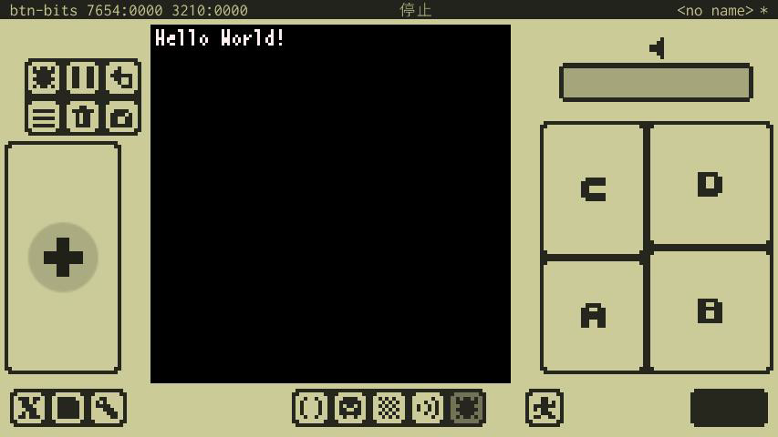
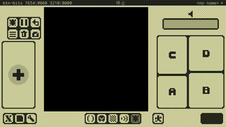
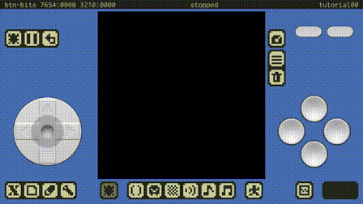

# プログラムのチュートリアル

プログラムはCodeエディタで書くことができます。
プログラムはLua言語（Lua 5.3）で書きます。
Codeエディタで入力と表示に対応しているのは、ASCIIコード（半角英数記号）と一部の文字（カナ、特殊記号）だけなことに注意してください。

---

## Hello World!



画面に文字列を表示してみます。
```
x8.fnt("Hello World!",0,0)
```
- `fnt(..)`が文字列を画面に表示する命令（関数）です。（APIという時もあります）
- `x8.`はx8独自のAPIであることを表しています。x8独自APIを使う場合は`x8.`を頭に付けます。
- 関数には処理に必要な情報（引き数）を渡します。`"`で囲まれた部分が表示する文字列で、その後の`0,0`は画面での座標(x,y)を表しています。

---

## プログラムにコメントを入れる

プログラムの中にプログラムとは解釈されないメモ（コメント）を書くことができます。
```
--[[
   This is
   all comments.
]]
x8.fnt("Hello World!",0,0) -- Comments until the end of the line
```
- `--`の後、行の終わりまではコメントになります。（行末コメント）
- `--[[`から`]]`までの間は全てコメントになります。（ブロックコメント）

---

## 図形を描く


画面に図形を描いてみます。

```
-- Draw shapes on the screen.

-- Draw a pixel.
x8.pixel(30,20,7)

-- Draw a straight line.
x8.line(70,30,110,10,8)

-- Draw a rectangle.
x8.rect(20,50,60,70,9)

-- Draw a filled rectangle.
x8.rectbdr(80,45,100,75,11)

-- Draw a circle.
x8.circ(40,100,10,12)

-- Draw a filled circle.
x8.circbdr(90,100,15,13)
```
- `pixel()`は画面に点を描きます。
- `line()`は始点(x,y)と終点(x,y)を指定して、画面に直線を描きます。
- `rectbdr()`は左上(x,y)と右下(x,y)を指定して、画面に矩形を描きます。
- `rect()`は左上(x,y)と右下(x,y)を指定して、画面に塗りつぶされた矩形を描きます。
- `circbdr()`は中心(x,y)と半径を指定して、画面に円を描きます。
- `circ()`は中心(x,y)と半径を指定して、画面に塗りつぶされた円を描きます。

---

## メインループを作る



無限に回るループを作って、プログラムが終了しないようにしてみます。
これは、ゲームでよくあるメインループになります。
```
-- Main Loop

count = 0 -- Frame counter

-- Infinite loop
while true do

   -- You must always call wait() in an infinite loop.
   x8.wait()

   -- Clear the screen.
   x8.cls()

   -- Describes the processing of the frame.
   x8.fnt(count, 0, 0)
   count = count + 1

end
```
- 無限ループ内では、必ず`wait()`を呼ぶ必要があることに注意してください。
- `wait()`が無い場合、一定時間でタイムアウトエラーによりプログラムが停止します。
- `cls()`は画面に描かれたものを全て消します。

---

## 図形をランダムにたくさん描く


たくさんの円をランダムに描いてみます。

```
-- Draw a lot of circles.

-- Main loop.
while true do

   -- Wait for frame update.
   x8.wait()

   -- Draw a circle at random.
   x = math.random(128)
   y = math.random(128)
   r = math.random(20)
   c = math.random(15)
   x8.circ(x, y, r, c)

end
```
- `math.random(n)`は1〜nまでのランダムな数を返します。

---

## 画面をクリアする



フレーム毎に、画面をクリアしてから図形を描いてみます。

```
-- Clean the screen.

-- Main loop.
while true do

   -- Wait for 20 frames update.
   x8.wait(20)

   -- Clean the screen.
   x8.cls()

   -- Draw a circle at random.
   x = math.random(128)
   y = math.random(128)
   r = math.random(20)
   c = math.random(15)
   x8.circ(x, y, r, c)

end
```
- `cls()`は画面に描かれたものを全て消します。
- `wait(n)`は、ここでnフレーム待ちます。省略時のnは1です。

---

## 図形を動かす


図形を描く位置をフレーム毎に変えることで、図形を動かしてみます。
```
-- Move the circle.

x = 20 -- x
v = 2  -- velocity

-- Main loop.
while true do

   -- Wait for frame update.
   x8.wait()

   -- Clean the screen.
   x8.cls()

   -- Draw the circle.
   x8.circ(x, 50, 10, 3)

   -- Update the position of the circle.
   x = x + v

   -- Invert velocity at screen edge.
   if (x < 20) or (x > 100) then v = -v end

end
```
- よくあるアニメーションは普通、フレーム毎に位置や画像を少しずつ変更することで実現します。

---

## ボタンの入力を取得する


ボタンの入力を取得して、ボタンの状態を表示してみます。
```
-- Get button input.

-- Main loop.
while true do

   -- Wait for frame update.
   x8.wait()

   -- Clean the screen.
   x8.cls()

   -- Show button trigger status.
   x8.color(7)
   if x8.btntrg(0) then x8.rect(10-2, 50-2, 20+2, 60+2) end -- ←
   if x8.btntrg(1) then x8.rect(40-2, 50-2, 50+2, 60+2) end -- →
   if x8.btntrg(2) then x8.rect(25-2, 35-2, 35+2, 45+2) end -- ↑
   if x8.btntrg(3) then x8.rect(25-2, 65-2, 35+2, 75+2) end -- ↓
   if x8.btntrg(4) then x8.circ(95, 70, 6+2) end -- Ⓐ
   if x8.btntrg(5) then x8.circ(110,55, 6+2) end -- Ⓑ
   if x8.btntrg(6) then x8.circ(80, 55, 6+2) end -- Ⓒ
   if x8.btntrg(7) then x8.circ(95, 40, 6+2) end -- Ⓓ

   -- Draw buttons.
   x8.color(1)
   x8.rect(10, 50, 20, 60) -- ←
   x8.rect(40, 50, 50, 60) -- →
   x8.rect(25, 35, 35, 45) -- ↑
   x8.rect(25, 65, 35, 75) -- ↓
   x8.circ(95, 70, 6) -- Ⓐ
   x8.circ(110,55, 6) -- Ⓑ
   x8.circ(80, 55, 6) -- Ⓒ
   x8.circ(95, 40, 6) -- Ⓓ

   -- Show button press status.
   x8.color(7)
   if x8.btnprs(0) then x8.rect(10+2, 50+2, 20-2, 60-2) end -- ←
   if x8.btnprs(1) then x8.rect(40+2, 50+2, 50-2, 60-2) end -- →
   if x8.btnprs(2) then x8.rect(25+2, 35+2, 35-2, 45-2) end -- ↑
   if x8.btnprs(3) then x8.rect(25+2, 65+2, 35-2, 75-2) end -- ↓
   if x8.btnprs(4) then x8.circ(95, 70, 6-2) end -- Ⓐ
   if x8.btnprs(5) then x8.circ(110,55, 6-2) end -- Ⓑ
   if x8.btnprs(6) then x8.circ(80, 55, 6-2) end -- Ⓒ
   if x8.btnprs(7) then x8.circ(95, 40, 6-2) end -- Ⓓ

end
```
- `btnprs(n)`は、n番のボタンが現在押されているかどうかを`true`か`false`で返します。
- `btntrg(n)`は、n番のボタンがこのフレームで、押されていない → 押された、と変化したかどうかを`true`か`false`で返します。

---

## 図形をボタン入力で制御する


図形をボタン入力によって動かしたり、色や大きさを変えたりしてみます。
```
-- Move circle with button input.

x = 50 -- x
y = 50 -- y
r = 20 -- radius
c = 7  -- color 
v = 2  -- velocity

-- Main loop.
while true do

   -- Wait for frame update.
   x8.wait()

   -- Clean the screen.
   x8.cls()

   -- Move with direction buttons.
   if x8.btnprs(0) then x = x - v end -- ←
   if x8.btnprs(1) then x = x + v end -- →
   if x8.btnprs(2) then y = y - v end -- ↑
   if x8.btnprs(3) then y = y + v end -- ↓

   -- Change color and size with A and B button.
   if x8.btntrg(4) then c = math.random(15) end -- Ⓐ
   if x8.btntrg(5) then r = math.random(30) end -- Ⓑ

   -- Draw the circle
   x8.circ(x, y, r, c)

end
```
- ゲームでキャラクターを動かしたりする基本的な方法になります。

---

