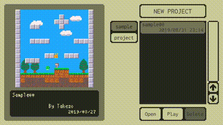
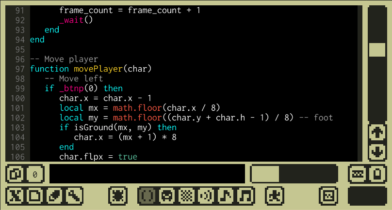
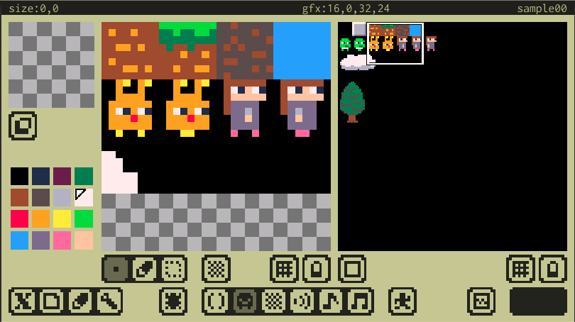
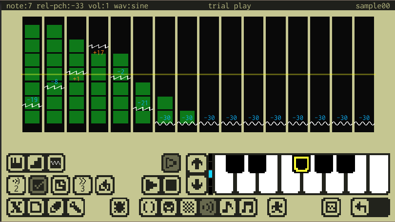
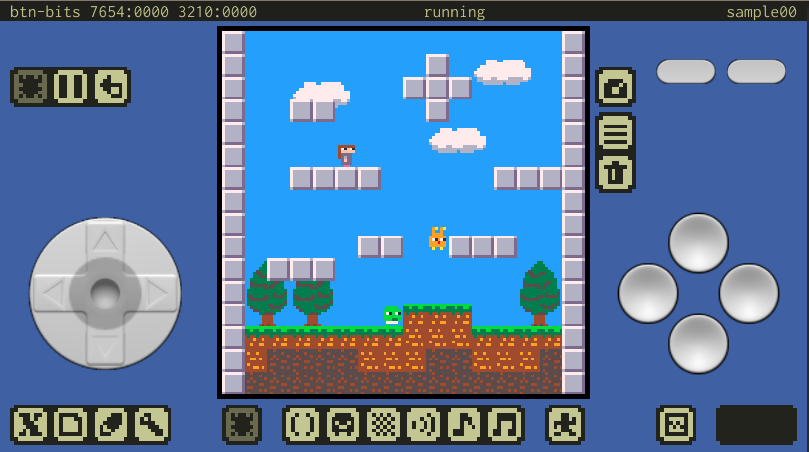

#  x8studio

## これはなに？

x8studioは、レトロで小さなゲームを作るスマホ向けアプリです。（開発中）
小さな機能にデザインされた架空のマシンと、そこで動くゲームを作るための開発環境が全て含まれています。

---

## 仮想マシン仕様

---

## 使い方

---

## APIリファレンス

---

## サンプル

---

##  作ってる人

Twitter : https://twitter.com/takezoffcom

Youtube : https://www.youtube.com/channel/UCwgcWt5PxUglr_n14SEIo5Q

---

## プライバシーポリシー

[プライバシーポリシー](PrivacyPolicy.md)
