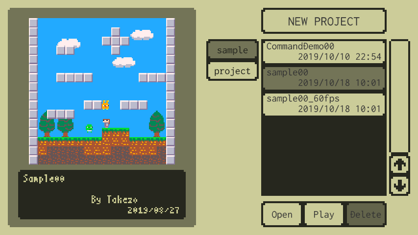
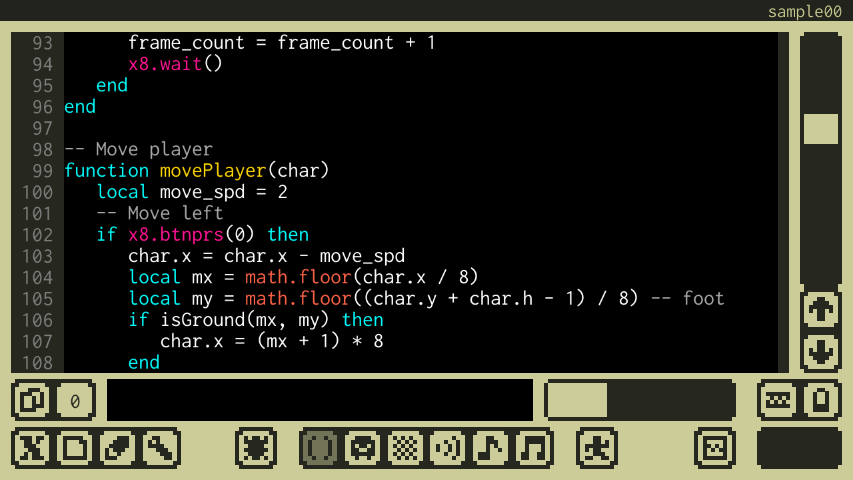
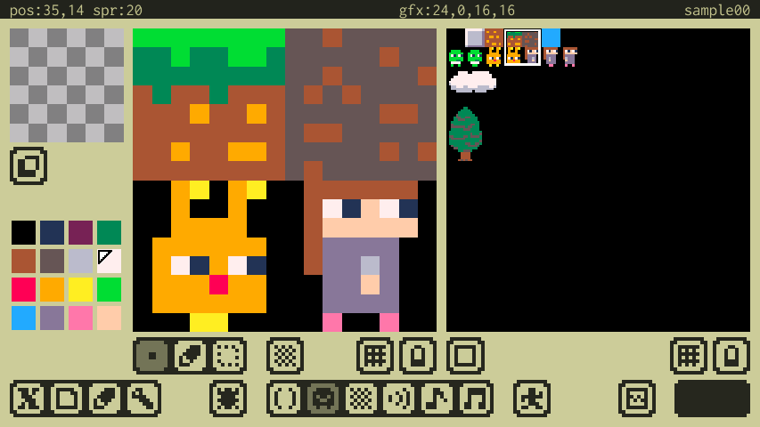
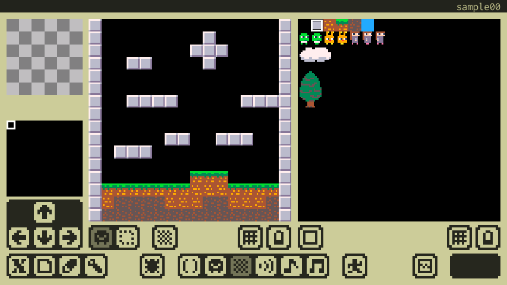
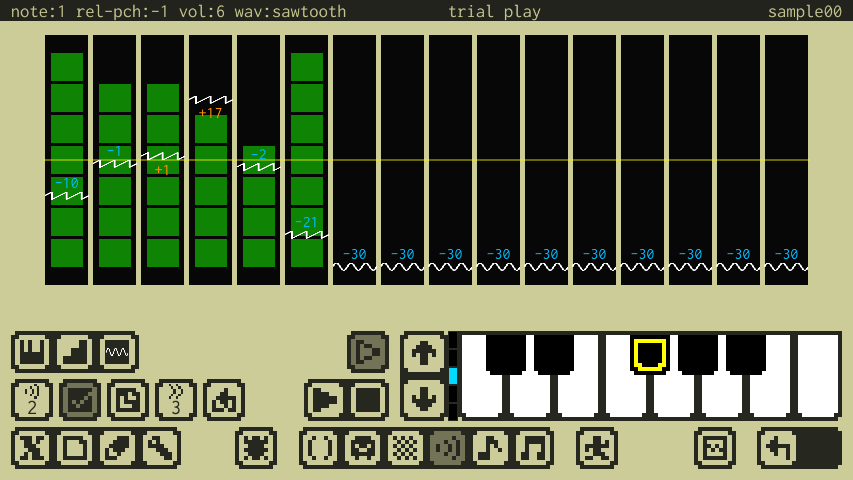
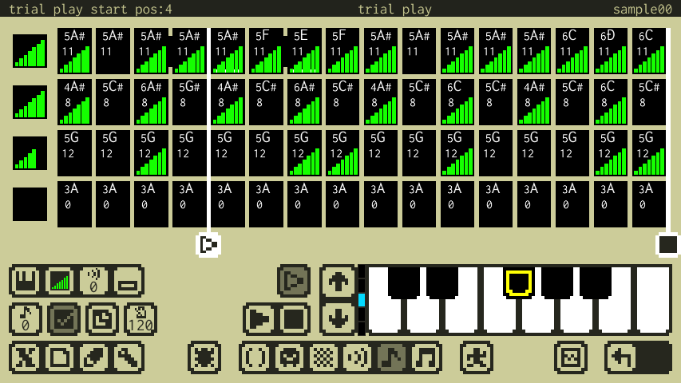
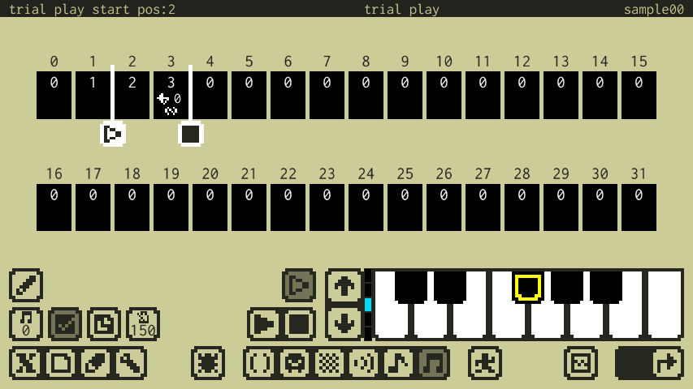
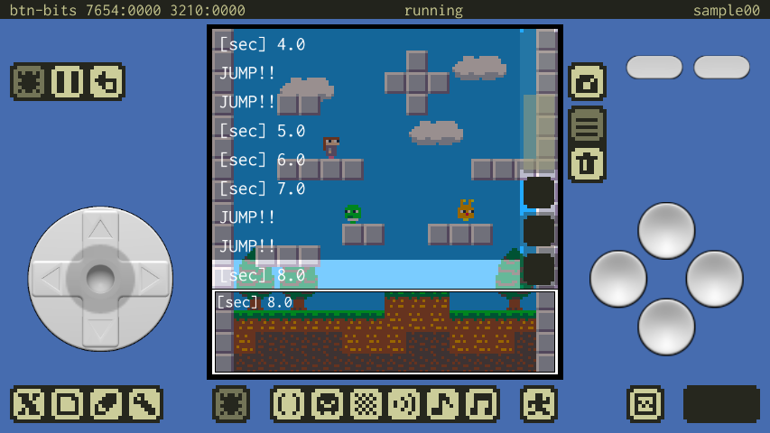
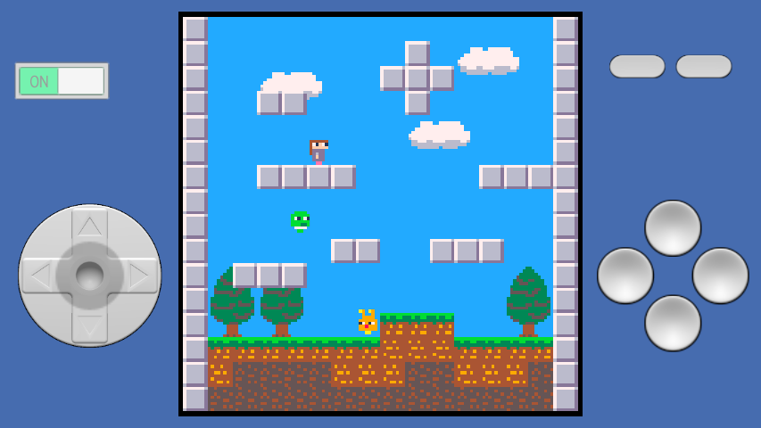

#  x8studio

## これはなに？

**x8studio**は、レトロで小さなゲームを作って遊べるスマホ向けアプリです。（開発中）
小さな機能にデザインされた架空のマシン**x8**と、そこで動くゲームを作るための開発環境が全て含まれています。

---

## マシン仕様

- **表示**          : 128x128、16色固定パレット
- **サウンド**      : 4ch、簡易シンセ、曲再生
- **入力**          : 8ボタン
- **プログラム**    : Lua 5.3
- **スプライト**    : 256(8x8スプライト)
- **マップ**        : 128x128(8x8チップ)
- **オーディオ**    : 32Sfx、32Phrase、32Music

---

## Lua

x8studioではプログラミングにLua言語を利用します。
オフィシャルサイトはこちら

---

## Home画面

 Home画面では、作ったゲームのプレイやプロジェクトの新規作成／削除などが行なえます。

---

## Codeエディタ

 Codeエディタでは、Lua言語でプログラムを書くことが出来ます。x8独自APIと、Luaの標準ライブラリ（一部を除く）が利用出来ます。

---

## Gfxエディタ

 スプライトやマップに利用される画像データを作成出来ます。

---

## Mapエディタ

 Gfxエディタで作成した画像データをチップとして並べて、より大きな画像のデータを作成出来ます。

---

## Sfxエディタ

 ゲームのSEや、Phraseエディタで楽器として利用できる、ごく短いサウンド素材を作成出来ます。

---

## Phraseエディタ

 Sfxエディタで作成したサウンドを並べて、ゲームのジングルやMusicエディタで曲を作成する際に利用できる、短いフレーズを作成出来ます。

---

## Musicエディタ

 Phraseエディタで作成したフレーズを並べて、曲を作成出来ます。

---

## Debugモード

 開発中のゲーム動かしてテストするモードです。

---

## Runモード

 完成したゲームを遊ぶモードです。

---

##  作ってる人

Twitter : https://twitter.com/takezoffcom

Youtube : https://www.youtube.com/channel/UCwgcWt5PxUglr_n14SEIo5Q

Email : <a href="mailto:takezogames.sprt@gmail.com">takezogames.sprt@gmail.com</a>

---

## クレジット

- The Lua logos are Graphic design by A. Nakonechnyj. Copyright © 1998. All rights reserved. (see http://www.lua.org/images)
