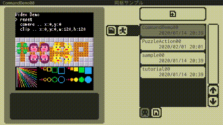

#  x8studio

## これはなに？

**x8studio**は、レトロで小さなゲームをつくって遊べるスマホ向けアプリです。
小さな機能にデザインされた架空のマシン**x8**と、そこで動くゲームをつくるための開発環境が含まれています。
プログラミングを始めてみたい初心者の方にもおすすめです！
今すぐゲームプログラミングを初められます！

---

## アプリのダウンロード

---

## 架空のマシン

- **表示**          : 128x128、16色固定パレット
- **サウンド**      : 4ch、簡易シンセ（近い将来、曲再生にも対応予定）
- **入力**          : 8ボタン
- **プログラム**    : Lua 5.3
- **スプライト**    : 256(8x8スプライト)
- **マップ**        : 128x128(8x8チップ)
- **オーディオ**    : 32Sfx(近い将来、曲データにも対応予定)

---

##  Lua でプログラミング

x8studioではプログラミングにLua言語(Lua 5.3)を利用します。以下の外部リンクの資料が参考になります。

- Luaのオフィシャルサイトは[こちら](https://www.lua.org/home.html)です。
- オフィシャルの**Lua 5.3 リファレンスマニュアル**は[こちら](https://www.lua.org/manual/5.3/)です。
- **Lua 5.3 リファレンスマニュアルの日本語訳（非公式）**は[こちら](http://milkpot.sakura.ne.jp/lua/lua53_manual_ja.html)です。(リンクさせていただき感謝です！)

The Lua logos are Graphic design by A. Nakonechnyj. Copyright © 1998. All rights reserved. (see http://www.lua.org/images)

---

## いろんなエディタ

プログラム、画像、サウンドなど、ゲームにをつくるために必要なエディタが含まれています。(近い将来、作曲にも対応予定)

---

## テストしたり遊んだり

開発中のゲームをテストしたり、つくったゲームを遊んだり出来ます。

---

## 資料とか

### 動画

アップされている動画には、**既に廃止された機能や開発中のデモも含まれています。**
Youtube : https://www.youtube.com/channel/UCwgcWt5PxUglr_n14SEIo5Q

---

##  開発者と連絡先

### 開発者

**takezo**です。田舎でひっそりとプログラムを書いてます。
１人でやってます。応援して頂けたら嬉しいです。

### 連絡先

お問い合わせなどは以下のどちらからでもお気軽にどうぞ。

Twitter : https://twitter.com/takezoffcom

Email : <a href="mailto:takezogames.sprt@gmail.com">takezogames.sprt@gmail.com</a>

