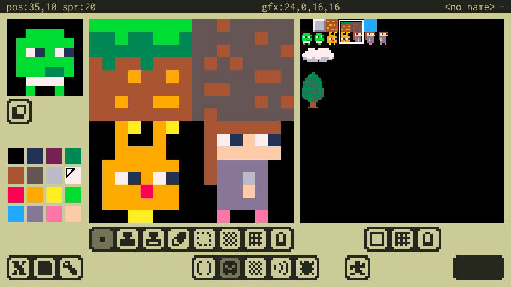
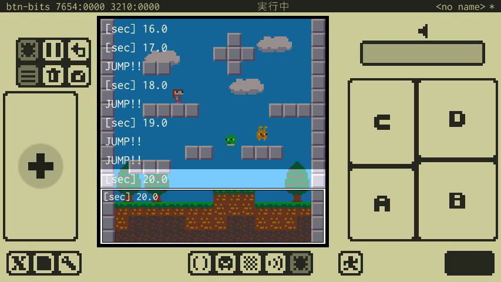

#  x8studio

## これはなに？

**x8studio**はレトロで小さなゲームをつくって遊べるスマホ向けアプリです。

小さな機能にデザインされた架空のマシン**x8**と、そこで動くゲームをつくるための開発環境が含まれています。

今すぐゲームプログラミングを初められます！プログラミングを始めてみたい初心者の方にもおすすめです！

---

## アプリのダウンロード

---

## x8マシンの概要

- **表示**           : 128x128、16色固定パレット
- **サウンド**       : 4ch、簡易シンセ
- **入力**           : 8ボタン
- **プログラム言語** : Lua 5.3
- **スプライト**     : 256(8x8スプライト)
- **マップ**         : 128x128(8x8チップ)
- **オーディオ**     : 32Sfx

---

##  Lua でプログラミング

x8studioではプログラミングに[Lua言語(Lua 5.3)](lua_basics.md)を利用します。

Lua言語はシンプルで覚えやすい仕様でありながら、いろいろなプログラミングの考え方をサポートし、かつ高速なスクリプト言語です。

Lua言語のオフィシャルサイトは[こちら](https://www.lua.org/home.html)です。
The Lua logos are Graphic design by A. Nakonechnyj. Copyright © 1998. All rights reserved. (see http://www.lua.org/images)

---

## いろんなエディタ

ゲームを作るために必要なプログラム、画像、サウンドなどのエディタが含まれています。(近い将来、作曲にも対応予定)

---

## テストしたり遊んだり

開発中のゲームをテストしたり、つくったゲームを遊んだりできます。

---

## 友達に遊んでもらう

作ったゲームはプロジェクトファイルとして出力できます。友達のx8studioで読み込めば友達もゲームを遊んだり改造したりできます。

---

## 資料とか

### プレスキット

**プレスキット**的なものは[こちら](press/press_kit.md)です。

### 動画

アップされている動画には、**既に廃止された機能や開発中のデモも含まれています。**
Youtube : https://www.youtube.com/channel/UCwgcWt5PxUglr_n14SEIo5Q

---

##  開発者と連絡先

### 開発者

**takezo**です。田舎でひっそりとプログラムを書いてます。
個人開発しています。応援して頂けたら嬉しいです。

### 連絡先

お問い合わせなどは以下のどちらからでもお気軽にどうぞ。

Twitter : https://twitter.com/takezoffcom

Email : <a href="mailto:takezogames.sprt@gmail.com">takezogames.sprt@gmail.com</a>

