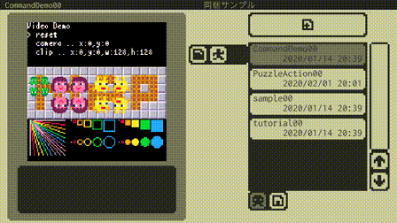
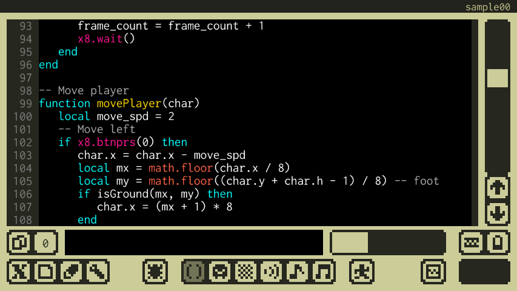
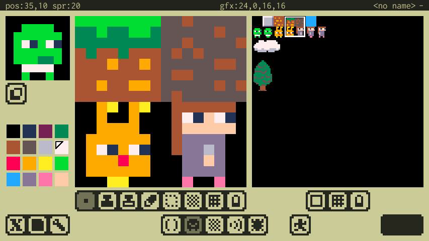
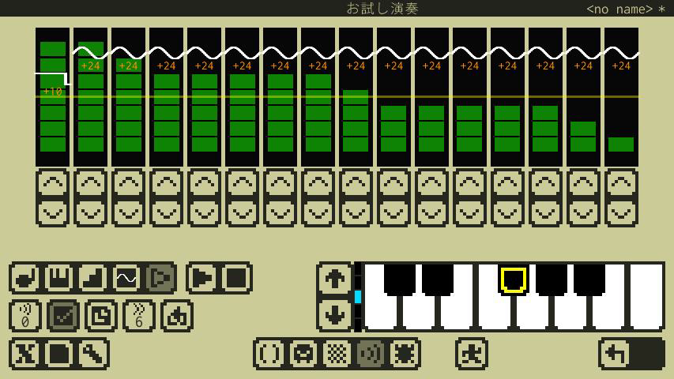
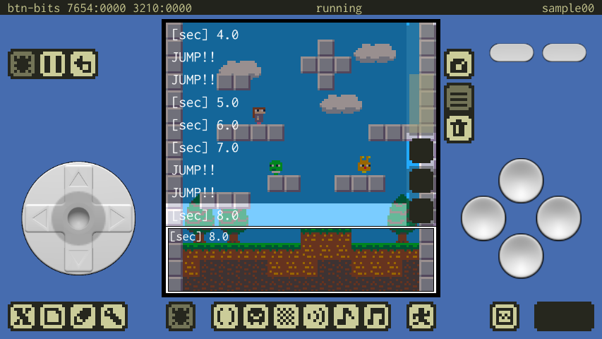
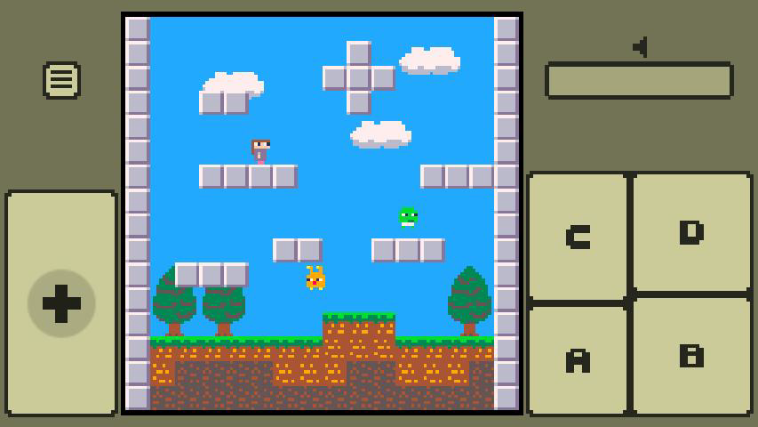

#  x8studio

## What's this?

**x8studio** is an application for smartphones that allows you to make and play retro small games.
It includes a fictional machine **X8** designed for small functions and a development environment for creating games that run on it.
It is also recommended for beginners who want to start programming!
You can get started with game programming now!

---

## Download the app

---

## Fictional machine

- **Display** : 128x128, 16 colors fixed palette
- **Sound** : 4ch, simple synth (song playback will be supported in the near future)
- **Input** : 8 buttons
- **Programming Language** : Lua 5.3
- **Sprite** : 256(8x8 sprites)
- **Map** : 128x128(8x8 chip)
- **Audio** : 32Sfx (song data will be supported in the near future)

---

##  Programming in Lua

x8studio uses the Lua language (Lua 5.3) for programming. The following external link materials are helpful.

- Lua's official website is [here](https://www.lua.org/home.html).
- The official **Lua 5.3 Reference Manual** is [here](https://www.lua.org/manual/5.3/).
- **The Japanese translation (unofficial)** of the Lua 5.3 Reference Manual is [here](http://milkpot.sakura.ne.jp/lua/lua53_manual_ja.html). (Thank you for linking to it!)

The Lua logos are Graphic design by A. Nakonechnyj. Copyright © 1998. All rights reserved. (see http://www.lua.org/images)

---

## Various editors

It contains all the programs, images, sounds, and other editors you need to create your game. (In the near future, we will be working on a composition.)

---

## Testing and playing

You can test games under development and play the games you've made.

---

## Resources

### Press Kit

The **press kit** kind of thing is [here](press/press_kit.md).

### Videos

The videos that are up include **deprecated features and demos that are in development. **
Youtube : https://www.youtube.com/channel/UCwgcWt5PxUglr_n14SEIo5Q

---

##  Developer and contact information

### Developer

I'm **takezo**. I'm writing a program in the countryside.
It's a personal development. I'd be happy to support you.

### Contact

If you have any questions, please feel free to contact us at any of the following

Twitter : https://twitter.com/takezoffcom

Email : <a href="mailto:takezogames.sprt@gmail.com">takezogames.sprt@gmail.com</a>

