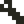

# マニュアル

## Home

- **プロジェクト情報**にはファイルリストで選択されたプロジェクトファイルの情報が表示されます。
    - **スクリーンショット**はDebugモードで撮影されたスクリーンショットです。
    - **プロジェクトコメント**はコード先頭に記述されたコメントです。コードの先頭から行頭が`--`で始まる、最大４行のコメントがここに表示されます。
- **プロジェクト新規作成**ボタンを押すと、空のプロジェクトを作成してStudioに遷移します。
- **フォルダタブ**はファイルリストを表示するフォルダを選択します。
    -  **サンプルフォルダ**はアプリに同梱されているサンプルファイルが入っているフォルダです。ファイルをセーブしたり削除したりすることは出来ません。サンプルファイルのカスタマイズは可能ですが、セーブはプロジェクトフォルダで行われます。
    -  **プロジェクトフォルダ**はユーザー作成のプロジェクトが保存されるフォルダです。ファイルをセーブしたり削除することが出来ます。
- **ファイルリスト**にはフォルダタブで選択されているフォルダのファイルが表示されます。ファイルを選択して、行いたい操作を**ファイル操作**で選択します。
- **ファイル操作**では選択しているファイルを操作します。
    -  **開く**で選択しているプロジェクトを開いてStudioに遷移します。
    -  **あそぶ**で選択しているプロジェクトを直接Runモードで開始します。
    -  **削除**で選択しているファイルを削除します。

---

## Studio共通のUIと操作

### トップバーとボトムバー
トップバーとボトムバーは、全てのエディタで共通のUIです。

- **ヒント**にはタッチしているUIのヒントや、一時的な通知などが表示されます。
- **ステータス**には現在の状態に関連する情報が表示されます。
- **プロジェクト名**には現在エディット中のプロジェクト名が表示されます。
- **プロジェクトステータス**にはプロジェクトの状態（`-`変更なし、`*`変更あり）が表示されます。
- **メニュー**
    -  **x8メニュー**
        - 本アプリの情報やサポートページへのリンクなど
    -  **ファイルメニュー**
        - 開いているプロジェクトファイルの操作など
    -  **オプションメニュー**
        - 入力設定など
- **エディタ**
    -  **Codeエディタ**
    -  **Gfxエディタ**
    -  **Mapエディタ**
    -  **Sfxエディタ**
    -  **Debugモード**
- **Runモード**
    -  **Runモード**
- **Undo/Redo**
    -  **Undo**（もとに戻す）
    -  **Redo**（やり直す）

###  タッチカーソル
**タッチカーソル**は指でのタッチでは難しい細かい作業を行う場合に利用します。

- ボタン以外の部分をドラッグすると、タッチカーソルを移動できます。
- ボタンを押すと、タッチカーソルのポインタ（タッチカーソル上方の点）の位置をタッチできます。
- ボタンを押しながら移動すると、タッチカーソルのポインタの位置でラッグができます。

###  スクリーンキーボード
**スクリーンキーボード**は外部キーボードを使わずに文字入力を行う場合に利用します。`Shift`、`Ctrl`、`Alt`の修飾トグルには、その左にロックするトグルがあり、ロックされていないと１回の文字入力で修飾がオフになります。`Mode`キーで、**通常文字** → **特殊文字** → **カナ**、の順に入力モードが切り替わります。（カナはJPキーボードの場合だけです）

---

## Codeエディタ

- **コードエリア**にはプログラムコードが表示されます。ここでプログラミングを行います。
- **コード選択**
    -  **コード切り替え**はエディットするコードを、直前にエディットしていたコードと切り替えます。
    -  **コード選択**はエディットするコードを選択します。
- **エディットツール**
    -  **編集メニュー**はコピーやペーストなどの編集機能のメニューです。
    -  **移動メニュー**はページ移動や行頭へ移動などのカーソル移動機能のメニューです。
    -  **検索メニュー**は検索機能のメニューです。
    -  **入力モードメニュー**は入力モードを切り替えるメニューです。

### コード補完とコードスニペット
コードエリアに文字を入力すると、補完候補があれば補完ポップアップが開きます。ワードの末尾にカーソルを合わせて`Alt+Tab`でも（補完候補があれば）開くことができます。

- そのまま文字入力を続けると、候補が絞られます。
- `Tab`,`Shift+Tab`で候補を選択して、`Enter`で確定出来ます。
- `Ctrl+Tab`または`Esc`を押すかカーソル移動操作を行うと、ポップアップは閉じます。
- 補完中に`Alt+Tab`で、補完候補に対応するコードスニペットを入力できます。

---

## Gfxエディタ

- **エディットビュー**ではGfxビューで選択されたエリアをエディットします。
- **Gfxビュー**ではエディットするGfxエリアを選択します。
- **スタンプビュー**にはキャプチャされたスタンプデータが表示されます。
    -  はスタンプデータの`color:0`の抜き設定を切り替えます。
- **カラーパレット**は描画ツールで参照されるカラーを選択します。
- **描画ツール**
    -  ペンで描画する（※タッチしたまま選択、離して確定）
        -  ピクセルペン
        -  四角いペン
        -  丸いペン
    -  スタンプデータを描画する
    -  スタンプデータをキャプチャする
    -  チップ属性をエディットする
    -  エディットビューでエリアを選択します。
    -  選択エリアの効果を選ぶ
        -  選択エリアに関係なくエディットを可能にします。
        -  選択エリアの内側だけをエディットを可能にします。
        -  選択エリアの外側だけをエディットを可能にします。
    -  グリッドを表示します。
- **Gfx選択ツール**
    -  エディットするGfx選択エリアの形とサイズを固定します。
    -  グリッドを表示します。

-  **チップ属性エディット**
    - チップ(8x8)に対応する1byte(8bit)の属性データをエディットします。
    - 8色のカラーパレットがエディットする属性データのビット位置に対応しています。
    - エディットビューで色を塗ることで対応するビットをONに出来ます。

---

## Mapエディタ

- **エディットビュー**ではMap選択ビューで選択されたエリアをエディットします。
- **Gfxビュー**ではエディットビューに設定するチップ矩形を選択します。
- **チップ番号：0**のチップはMapエディタおよび実際のマップ描画において、描画されないチップ（抜きのチップ）として機能します。スプライトとしては他の領域と区別なく描画されます。
- **スタンプビュー**にはキャプチャされたスタンプデータが表示されます。
- **Map選択ビュー**ではエディットするMapエリアをタッチで選択します。
- **Mapカーソルキー**はMap選択ビューの選択矩形を操作します。
    -     選択エリアを移動します。
    -  選択エリアを左上にリセットします。
    -  現在の選択エリアの左上を固定します。固定した状態でカーソルを移動するとエリアのサイズを変更できます。
- **配置ツール**
    -  Gfxビューで選択されているチップを配置する
    -  スタンプデータを配置する
    -  スタンプデータをキャプチャする
    -  エディットビューでエリアを選択します。
    -  選択エリアの効果を選ぶ
        -  選択エリアに関係なくエディットを可能にします。
        -  選択エリアの内側だけをエディットを可能にします。
        -  選択エリアの外側だけをエディットを可能にします。
    -  グリッドを表示します。
- **Gfx選択ツール**
    -  エディットするGfx選択エリアの形とサイズを固定します。
    -  グリッドを表示します。

---

## Sfxエディタ

- **エディットビュー**ではSfxを構成する16個のノートをタッチでエディット出来ます。
    - **ノート**の表示では、波線とそれに付随する数値が波形とピッチオフセットを、緑のブロックがボリューム値を表しています。
- **エディットツール**
    -  エディットするSfxを選択します。
    -  Sfxの有効／無効を切り替えます。
    -  他のSfxからコピーして設定します。
    -  再生スピードを設定します。数値が小さいほど速くなります。
    -  ループの有効／無効を切り替えます。有効な場合はエディットビュー下のをドラッグして、ループ位置を設定できます。
    -  ノートをタッチして音高を設定出来ます。調整キーでも音高を設定出来ます。
    -  タッチで選択したノートの音高を鍵盤で設定出来ます。選択位置は自動的に右へ移動します。調整キーでも音高を設定出来ます。
    -  タッチでノートのボリュームを設定出来ます。調整キーでもボリュームを設定出来ます。
    -  タッチでノートの波形を設定出来ます。（※タッチしたまま選択、離して確定）
        -  サイン波
        -  矩形波(1:1)
        -  矩形波(1:3)
        -  矩形波(1:7)
        -  ノコギリ波
        -  三角波
        -  ホワイトノイズ
        -  ノイズ(音高あり)
    -  鍵盤でピッチオフセットを指定して、試し弾きが出来ます。
- **再生ツール**
    -  Sfxを再生します。
    -  Sfxの再生を停止します。
- **鍵盤**
    - 黄色い枠は`ピッチオフセット:0`を表しています。

---

## Debugモード

- **デバッグツール**
    -  デバッグ実行を開始／停止します。
    -  デバッグ実行をポーズ／ポーズ解除します。
    -  仮想マシンをリセットします。
    -  ログビューの表示／非表示を切り替えます。
    -  ログをクリアします。
    -  Home画面のプロジェクト情報に表示されるスクリーンショットを撮影します。
- **ログビュー**
    -  ログビュー表示がONの場合、ゲーム画面上に各ログの１行目が表示されます。タッチでログを選択すると、ログ詳細ビューにそのログの詳細が表示されます。
    - **ログ詳細ビュー**をタッチすると**ログ詳細ウィンドウ**が開きます。
- **ログ詳細ウィンドウ**
    - ログにエラー箇所が表示されている場合、`エラーに移動`ボタンを押すとCodeエディタに遷移してエラー位置に移動出来ます。
- **ボリューム**
    - 仮想マシンのボリュームを変更出来ます。何らかの要因で仮想マシンがポーズされると自動的に0に設定されます。
- **ゲームパッドボタン**
    - 仮想マシンのゲームパッドのボタンです。赤い数字で示されているのは、APIでボタン情報を取得する際のビット位置です。

---

## Runモード

- **メニューボタン**を押すと仮想マシンの**再起動**または**終了**を実行するメニューが開きます。

---

## 画面キーボード

-  **オプションメニュー**の**入力設定**で画面キーボードを以下のものから選べます。
    - **QWERTY JP**で日本語キーボードになります。**カナ**が入力出来ます。
    - **QWERTY US**で英語キーボードになります。**カナ**は入力出来ません。

---

## 外部キーボード

- **外部キーボード**については、QWERTY配列の英語(US)キーボードと日本語(JIS)キーボードに対応しています。
- 接続されているキーボードタイプは自動的には判別されないため、**オプションメニュー** → **入力設定** → **外部キーボード**で、接続されているキーボードタイプを設定する必要があります。
    - **QWERTY US**でQWERTY配列の英語(US)キーボードとして認識します。カナは入力出来ません。
    - **QWERTY JP**で**一部のサードパーティー製日本語(JIS)キーボード**として認識します。カナが入力出来ます。
    - **Apple JP**で日本語(JIS)キーボードとして認識します。カナが入力出来ます。
- Apple純正のキーボードであれば**QWERTY US**か**Apple JP**に設定します。
- `caps lock`キーは本来の**CapsLock**としては機能しません。アプリ側で入力が取得出来る場合は`control`キーとして動作します。

### 外部キーボードの設定と動作確認状況

|動作|機種|配列|設定|
|:--:|:---|:--:|:---|
|OK|Apple Wireless Keyboard 2011 英語(US)|US|**QWERTY US**|
|OK|Magic Keyboard 日本語(JIS)|JIS|**Apple JP**|
|OK|Anker Ultra-Slim Bluetooth Keyboard (A7726)|US|**QWERTY US**|
|OK|ロジクール K380 マルチデバイス Bluetooth キーボード（日本語配列）|JIS|**QWERTY US**または**QWERTY JP** `※`|
|未確認|その他の英語(US)キーボード|US|**QWERTY US**|
|未確認|その他のApple純正日本語(JIS)キーボード|JIS|**Apple JP**|
|未確認|その他のサードパーティー製日本語(JIS)キーボード|JIS|**QWERTY US**|

- サードパーティー製日本語(JIS)キーボードは基本的に**QWERTY US**に設定することにご注意下さい。
- `※`一部のサードパーティー製日本語(JIS)キーボードについては**QWERTY JS**に設定することにより、キーを刻印どおり入力出来るようアプリ側で対処することができます。ただし、以下につては別のキーで代用して入力します。
    - `\`（バックスラッシュ）は`漢字`キーで入力
    - `_`（アンダースコア）は`Shift+漢字`で入力
    - `|`（パイプ）は`Shift+0`で入力
    - 半角カナの`ﾛ`は`漢字`キーで入力
    - 半角カナの`ｰ`は`Shift+漢字`キーで入力
- `※`サードパーティー製日本語(JIS)キーボードのうち**QWERTY JS**設定での動作確認済み機種は以下の通りです。
    - ロジクール K380 マルチデバイス Bluetooth キーボード（日本語配列）

---

## ショートカットキー

- キーの記号の意味
    - `#`はShiftキーと同時押し
    - `^`はCtrlキーと同時押し
    - `&`はAltキーと同時押し

### Codeエディタ

- **Shiftを押しながら移動系のキーやショートカットを押すと、選択しながら移動出来ます。**

|キー|機能|
|:--:|:---|
|`&Tab`|行をインデント|
|`#Tab`|行をアウトデント|
|`^Tab`|カーソル位置で可能なら補完ポップアップを開く|
|`^Enter`|上に行を挿入|
|`#^Enter`|下に行を挿入|
|`^↑`|ページUp|
|`^↓`|ページDown|
|`^←`|前のワード境界へ|
|`^→`|次のワード境界へ|
|`&↑`|テキスト先頭へ|
|`&↓`|テキスト末尾へ|
|`&←`|行頭へ|
|`&→`|行末へ|
|`^A`|全選択|
|`^C`|コピー|
|`^D`|削除（コピーバッファに追加しない）|
|`^F`|前方検索ポップアップを開く|
|`#^F`|後方検索ポップアップを開く|
|`^&G`|グリフ入力モード|
|`^K`|カーソルから行末まで削除|
|`^&K`|カナ入力モード|
|`^L`|カーソルが画面中央に来るようにスクロール|
|`^&N`|通常入力モード|
|`^V`|貼り付け|
|`#^V`|行頭に貼り付け|
|`^X`|カット（コピーバッファに追加する）|
|`^Z`|アンドゥ|
|`#^Z`|リドゥ|

### Codeエディタの補完ポップアップ

|キー|機能|
|:--:|:---|
|`Enter`|確定して閉じる|
|`Esc`|キャンセルして閉じる|
|`Tab`|次の候補へ|
|`#Tab`|前の候補へ|
|`&Tab`|補完モードとスニペットモードを切り替える|
|`^Tab`|キャンセルして閉じる|

### Codeエディタの検索ウィンドウ

|キー|機能|
|:--:|:---|
|`^F`|次の前方の検索結果へ|
|`#^F`|次の後方の検索結果へ|

