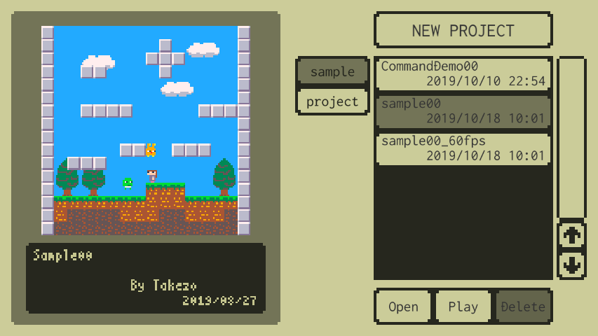
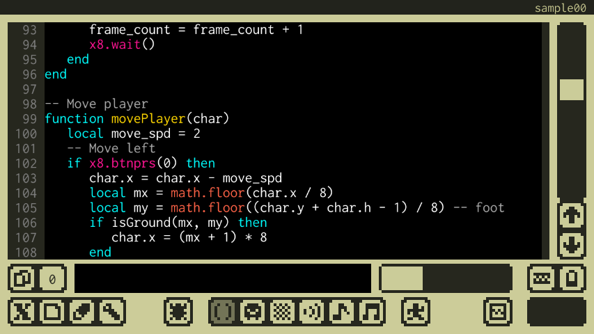
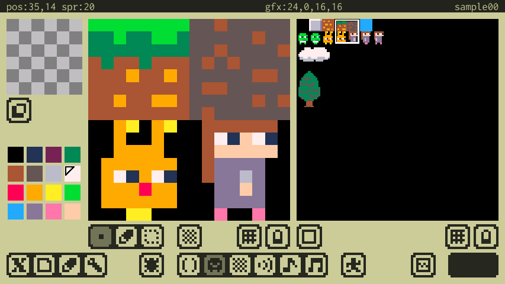
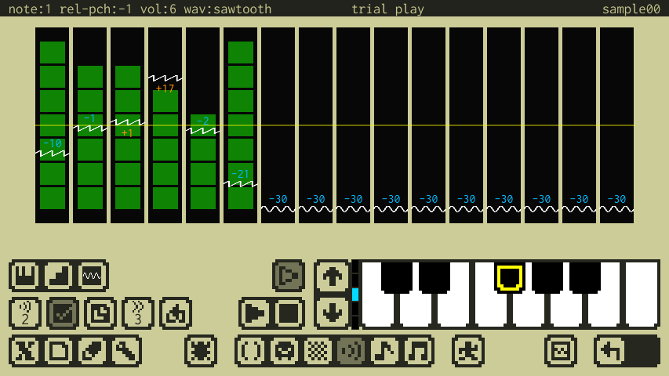
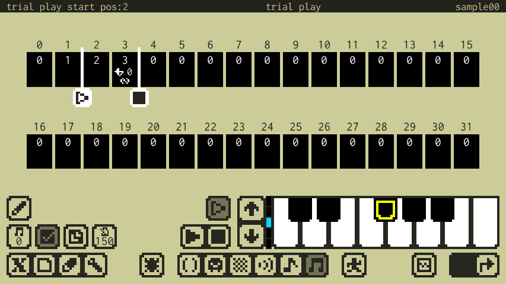
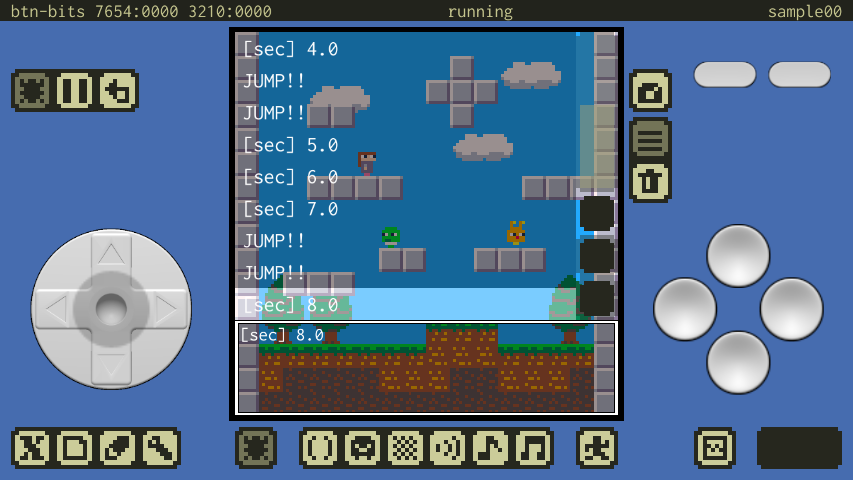
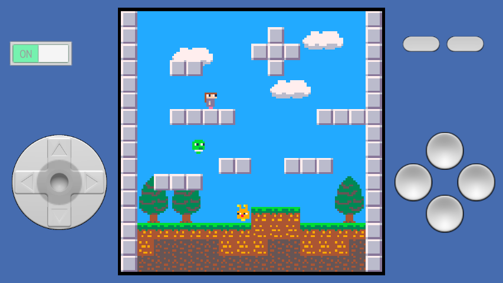

# 操作マニュアル

## Home

- プロジェクトの情報（画面左、大きなビュー）
    - スクリーンショット
        - Debugモードで撮影されたスクリーンショットです。
    - コメント
        - コード先頭に記述された、プロジェクトに関するコメントです。
- 新規プロジェクト作成（画面右上）
    - 空のプロジェクトを作成してStudioに遷移します。
- フォルダタブ（画面中央）
    - sampleフォルダ
        - アプリに同梱されているサンプルファイルが入っているフォルダです。
        - ここでファイルをセーブしたり削除したりすることは出来ません。
        - サンプルファイルをカスタマイズして独自のゲームを作成可能ですが、セーブはprojectフォルダで行われます。
    - projectフォルダ
        - ユーザー作成プロジェクトが保存されるフォルダです。
        - ここではファイルをセーブしたり削除することが出来ます。
- ファイルリスト（画面右、スクロールビュー）
    - フォルダのファイルリストです。

---

## Studio共通

- **ポップアップメニューの操作**
    - ボタンをタッチすると現れるポップアップメニューでは、タッチしたまま選択したい項目に移動し、タッチを放すことで確定されます。
- **タッチカーソルの操作**
    - タッチカーソルは、指でのタッチでは難しい細かい作業を行う場合に利用します。タッチカーソルのボタン以外の部分をドラッグしてポインタを移動したあと、タッチカーソルのボタンを押しながら移動させることでポインタをドラッグ出来ます。

- トップバー（左から..）
    - ヒントメッセージ
        - タッチしているUIのヒントや、一時的な通知などが表示されます。
    - ステータスメッセージ
        - 現在の状態に関連する情報が表示されます。
    - プロジェクト名
        - 現在エディット中のプロジェクト名が表示されます。
- ボトムバー（左から..）
    - メニューパレット
        - x8メニュー
        - ファイルメニュー
        - エディットメニュー
        - オプションメニュー
    - Debugモード
    - エディタパレット
        - Codeエディタ
        - Gfxエディタ
        - Mapエディタ
        - Sfxエディタ
        - Phraseエディタ
        - Musicエディタ
    - Runモード
    - チートシート
    - Undo／Redo

---

## Codeエディタ

- コードエリア（画面中央、大きなビュー）
    - ここでプログラミングを行います。
- コード切り替え（画面左下、左から１番目）
    - 編集するコードを直前に編集していたコードと切り替えます。
- コード選択（画面左下、左から２番目）
    - 編集するコードを選択します。
- キーボード（画面右下、左から１番目）
    - スクリーンキーボードの表示します。 
- タッチカーソル（画面右下、左から２番目）
    - タッチカーソルを表示します。
- コード補完とコードスニペット
    - コードエリアに文字を入力すると、補完候補があれば補完ポップアップが表示されます。そのまま文字入力を続けると候補が絞られます。上下キーで候補を選択してEnterキーで確定出来ます。Escキーを押すかカーソル移動操作を行うとポップアップは消えます。
    - 補完中にTabキーを押すと補完の代わりに候補に対応するコードスニペットを入力できます。

---

## Gfxエディタ

- エディットビュー（画面左、大きなビュー）
    - Gfxビューで選択されたエリアをここでエディットします。
- Gfxビュー（画面右、大きなビュー）
    - エディットするGfxエリアを選択します。
- スタンプビュー（画面左上、小さなビュー）
    - キャプチャされたスタンプデータです。
- スタンプの抜き設定ボタン（スタンプビュー左下）
    - スタンプデータのカラー:0を抜きにするかの設定ボタンです。
- カラーパレット（画面左下）
    - 描画ツールで参照されるカラーを選択します。
- 描画ツールパレット（エディットビュー下、左から1番目）
    - ペン1
    - ペン2
    - ペン3
    - スタンプデータを描画する
    - スタンプデータをキャプチャする
- チップ属性エディット（エディットビュー下、左から2番目）
    - チップ(8x8)に対応する1byte(8bit)の属性データをエディットします。
    - 8色のカラーパレットで、エディットする属性のビットを選択出来ます。
- 選択ツール（エディットビュー下、左から3番目）
    - エディットビューでエリアを選択します。
- エディットエリア選択（エディットビュー下、左から4番目）
    - 選択エリアに関係なくエディットを可能にします。
    - 選択エリアの内側だけをエディットを可能にします。
    - 選択エリアの外側だけをエディットを可能にします。
- グリッド（エディットビュー下、左から5番目）
    - グリッドを表示します。
- タッチカーソル（エディットビュー下、左から6番目）
    - タッチカーソルを表示します。
- Gfxエリアシェイプ固定（Gfxビュー下、左から1番目）
    - エディットするGfxエリアの形とサイズを固定します。

---

## Mapエディタ

- エディットビュー（画面左、大きなビュー）
    - Mapエリア選択ビューで選択されたエリアをここでエディットします。
- Gfxビュー（画面右、大きなビュー）
    - エディットビューに設定するチップ矩形を選択します。
- スタンプビュー（画面左上、小さなビュー）
    - キャプチャされたスタンプデータです。
- Mapエリア選択ビュー（画面左下、小さなビュー）
    - エディットするMapエリアを選択します。
- Mapエリア選択カーソル（Mapエリア選択ビュー下）
    - Mapエリア選択ビューの選択矩形を移動します。
- 描画ツールパレット（エディットビュー下、左から1番目）
    - チップを配置する
    - スタンプデータを配置する
    - スタンプデータをキャプチャする
- 選択ツール（エディットビュー下、左から2番目）
    - エディットビューでエリアを選択します。
- エディットエリア選択（エディットビュー下、左から3番目）
    - 選択エリアに関係なくエディットを可能にします。
    - 選択エリアの内側だけをエディットを可能にします。
    - 選択エリアの外側だけをエディットを可能にします。
- グリッド（エディットビュー下、左から4番目）
    - グリッドを表示します。
- タッチカーソル（エディットビュー下、左から5番目）
    - タッチカーソルを表示します。
- Gfxエリアシェイプ固定（Gfxビュー下、左から1番目）
    - Gfxビューで選択されたチップ矩形の形とサイズを固定します。

---

## Sfxエディタ

- エディットビュー（画面中央、大きなビュー）
    - Sfxを構成する16個のノートを、タッチでエディット出来ます。
- Sfx選択（画面左、下から1番目、左から1番目）
    - エディットするSfxを選択します。
- 有効化（画面左、下から1番目、左から2番目）
    - Sfxを有効化します。
- コピー設定（画面左、下から1番目、左から3番目）
    - 他のSfxからコピーして設定します。
- スピード設定（画面左、下から1番目、左から4番目）
    - 再生スピードを設定します。
- ループ設定（画面左、下から1番目、左から5番目）
    - ループを有効化して、ループ位置をエディット出来るようにします。
- ピッチツール（画面左、下から2番目、左から1番目）
    - ピッチエディット
        - MIDIキーボードで、カレントノートのピッチを変更出来ます。
        - エディットビューをタッチして、ノートのピッチを変更出来ます。
    - ピッチペン
        - MIDIキーボードで、カレントピッチを選択出来ます。
        - エディットビューをタッチして、ノートにカレントピッチを設定出来ます。
- ボリュームツール（画面左、下から2番目、左から2番目）
    - エディットビューをタッチして、ノートのボリュームを設定出来ます。
- 波形ツール（画面左、下から2番目、左から3番目）
    - エディットビューをタッチして、ノートの波形を設定出来ます。
- 再生（画面中央、下から1番目、左から1番目）
    - Sfxを再生します。
- 停止（画面中央、下から1番目、左から2番目）
    - Sfxの再生を停止します。
- 試し弾き（画面中央、下から2番目）
    - MIDIキーボードでピッチオフセットを指定して、試し弾きが出来ます。
- MIDIキーボード（画面右下）
    - 黄色い枠は、ピッチオフセット:0を表しています。
    - オレンジ色のマークは、カレントピッチを表しています。

---

## Phraseエディタ

- エディットビュー（画面中央、大きなビュー）
    - Phraseを構成する16個のSfxトリガーx4トラックを、タッチでエディット出来ます。
- Phrase選択（画面左、下から1番目、左から1番目）
    - エディットするPhraseを選択します。
- 有効化（画面左、下から1番目、左から2番目）
    - Phraseを有効化します。
- コピー設定（画面左、下から1番目、左から3番目）
    - 他のPhraseからコピーして設定します。
- スピード設定（画面左、下から1番目、左から4番目）
    - 再生スピードを設定します。
- ピッチツール（画面左、下から2番目、左から1番目）
    - ピッチエディット
        - MIDIキーボードで、カレントトリガーのピッチを変更出来ます。
        - エディットビューをタッチして、トリガーのピッチを変更出来ます。
    - ピッチペン
        - MIDIキーボードで、カレントピッチを選択出来ます。
        - エディットビューをタッチして、トリガーにカレントピッチを設定出来ます。
- ボリュームツール（画面左、下から2番目、左から2番目）
    - エディットビューをタッチして、トリガーのボリュームを設定出来ます。
- Sfxツール（画面左、下から2番目、左から3番目）
    - エディットビューをタッチして、トリガーのSfxを設定出来ます。
- エフェクトツール（画面左、下から2番目、左から4番目）
    - Tie
        - 次のトリガーとの間に自動で無音部分を挟む処理を禁止します。
    - Mute
        - （工事中）
- 再生（画面中央、下から1番目、左から1番目）
    - Phraseを再生します。
- 停止（画面中央、下から1番目、左から2番目）
    - Phraseの再生を停止します。
- 試し弾き（画面中央、下から2番目）
    - MIDIキーボードでピッチオフセットを指定して、試し弾きが出来ます。
- MIDIキーボード（画面右下）
    - 黄色い枠は、ピッチオフセット:0を表しています。
    - オレンジ色のマークは、カレントピッチを表しています。

---

## Musicエディタ

- エディットビュー（画面中央、大きなビュー）
    - Musicを構成する32個のPhraseトリガーを、タッチで選択出来ます。
- Music選択（画面左、下から1番目、左から1番目）
    - エディットするMusicを選択します。
- 有効化（画面左、下から1番目、左から2番目）
    - Musicを有効化します。
- コピー設定（画面左、下から1番目、左から3番目）
    - 他のMusicからコピーして設定します。
- スピード設定（画面左、下から1番目、左から4番目）
    - 再生スピードを設定します。
- エディット（画面左、下から2番目、左から1番目）
    - カレントトリガーの内容をエディットします。
- Phrase選択（画面左、下から2番目、左から2番目）
    - カレントトリガーのPhraseを設定します。
- ジャンプ回数（画面左、下から2番目、左から3番目）
    - カレントトリガーの再生後にジャンプする回数を設定します。
    - 1回以上ジャンプする場合は、ジャンプ先をエディットビューで設定出来ます。
- 再生（画面中央、下から1番目、左から1番目）
    - Musicを再生します。
- 停止（画面中央、下から1番目、左から2番目）
    - Musicの再生を停止します。
- 試し弾き（画面中央、下から2番目）
    - MIDIキーボードでピッチオフセットを指定して、試し弾きが出来ます。
- MIDIキーボード（画面右下）
    - 黄色い枠は、ピッチオフセット:0を表しています。

---

## Debugモード

- ディスプレイ（画面中央、大きなビュー）
    - ゲーム画面です。
    - ログ表示がONの場合、ゲーム画面上にログが表示され、タッチでログを選択出来ます。
    - **プログラムでエラーが発生した際は、このログを確認してください。**
- デバッグ（画面左上、左から1番目）
    - デバッグ実行のスタート／ストップのトグルです。
- ポーズ（画面左上、左から2番目）
    - デバッグ実行のポーズのトグルです。
- リセット（画面左上、左から3番目）
    - x8マシンをリセットします。
- スクリーンショット撮影（ディスプレイ右、上から1番目）
    - Home画面のプロジェクト情報に表示されるスクリーンショットを撮影します。
- ログ表示（ディスプレイ右、上から2番目）
    - ログ表示のトグルです。
- ログクリア
    - ログをクリアします。

---

## Runモード

- 電源スイッチ（画面左上、左から1番め）
    - x8マシンの電源をON/OFFするスライドスイッチです。左右にスライドで切り替えます。
- 戻る（画面左上、左から2番め）
    - Runモードに遷移する直前の画面に戻ります。
    - **電源スイッチがOFFの場合だけ有効です。**

