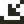
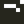
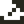
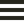
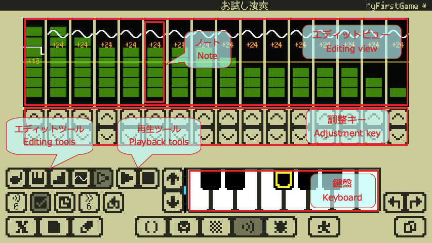
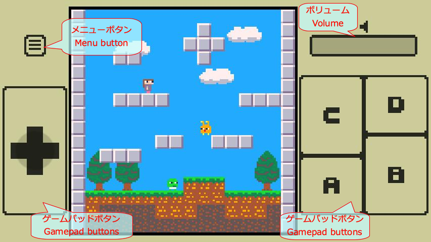

# 操作マニュアル

## Home画面

Home画面では同梱のサンプルゲームを遊んだり、ユーザーが作ったファイルの管理ができます。

### プロジェクト情報

**プロジェクト情報**には選択されているプロジェクトファイルの情報が表示されます。

**スクリーンショット**はDebugモードで撮影されたスクリーンショットです。

**プロジェクトコメント**はコード先頭に記述されたコメントです。コードの先頭から行頭が`--`で始まる、最大４行のコメントがここに表示されます。

### フォルダとファイルリスト

**フォルダタブ**は**ファイルリスト**に表示するフォルダを選択します。

 **サンプルフォルダ**はアプリに同梱されているサンプルファイルが入っているフォルダです。ファイルを開けますがセーブはプロジェクトフォルダで行われます。ファイルの削除はできません。

 **プロジェクトフォルダ**はユーザー作成のプロジェクトが保存されるフォルダです。**プロジェクトのセーブは必ずここで行われます**。

 **インポートフォルダ**はインポートされたファイルが保存されるフォルダです。ファイルを開けますがセーブはプロジェクトフォルダで行われます。

Note: 既にインポートフォルダに存在するファイルと**同じ名前のファイルをインポートすると上書きされる**ことに注意してください。インポートしたファイルは必要に応じてプロジェクトフォルダにセーブし直しておくと安全です。

### ファイルの操作

**ファイル操作**で選択しているファイルを操作できます。

 **開く**です。プロジェクトを開いてStudioに遷移します。

 **遊ぶ**です。プロジェクトを直接Runモードで開始します。

 **削除**です。ファイルを削除します。

 **エクスポート**です。ファイルを本アプリの外に書き出す事ができます。

Hint: **書き出し先がないとエクスポートはできません。**iCloud Driveを有効にして作成したプロジェクトのバックアップなどに利用することをおすすめします。

 サブメニューを開きます。

### プロジェクトの新規作成とインポート

 **プロジェクト新規作成**です。空のプロジェクトを作成してStudioに遷移します。

 **インポート**です。本アプリの外からx8studioのプロジェクトファイルを読み込むことができます。

---

## Studio共通の操作

Studioのトップバーとボトムバー周辺のUIは全てのエディタで共通です。

### トップバーのメッセージ

**ヒント**にはタッチしているUIのヒントや一時的な通知などが表示されます。

**ステータス**には現在の状態に関する情報が表示されます。

**プロジェクト名**には現在エディット中のプロジェクト名が表示されます。

**プロジェクトステータス**にはプロジェクトの状態（`-`変更なし、`*`変更あり）が表示されます。

### 各種メニューとエディタ

 **x8メニュー**です。本アプリの情報やサポートサイトへのリンクなどがあります。

 **ファイルメニュー**です。プロジェクトのセーブ、参照読み込み、閉じる操作などがあります。

 **エディットメニュー**です。入力設定や現在のエディタに対応するコピー＆ペーストなどがあります。

 **Codeエディタ**に移動します。

 **Gfxエディタ**に移動します。

 **Mapエディタ**に移動します。

 **Sfxエディタ**に移動します。

 **Debugモード**に移動します。

 **Runモード**に移動します。

### UndoとRedo

 **Undo**（元に戻す）です。

 **Redo**（やり直す）です。

Hint: Codeエディタでは**コード単位のUndoとRedo**が可能です。それ以外のエディタでは**エディタ単位のUndoとRedo**が可能です。

### プロジェクト切り替え

 **プロジェクト切り替え**です。**編集プロジェクト**と**参照プロジェクト**を切り替えます。

**編集プロジェクト**とは、Home画面で開いた開発作業中プロジェクトです。

**参照プロジェクト**とは、他のプロジェクトを参照するためなどに利用されるプロジェクトで、エディットや実行はできますが**セーブはできません**。常に一つだけ存在し、ファイルメニューの**参照読み込み**で他のプロジェクトを読み込むことができます。

編集プロジェクトと参照プロジェクトの間でもコピーや貼り付けが可能です。現在の状態が編集プロジェクトなら背景は**明るく**、参照プロジェクトなら背景は**暗く**なります。

### タッチカーソル

 **タッチカーソル**は指でのタッチでは難しい細かい作業を行うのに便利です。

ボタンを押すとタッチカーソルのポインタ（タッチカーソル上方の点）の位置をタッチでき、そのまま移動することでドラッグもできます。

ボタン以外の部分をタッチまたはドラッグするとタッチカーソルを移動できます。

### 画面キーボード

 **画面キーボード**はアプリ独自の画面キーボードです。外部キーボードを使わずに文字入力を行う場合に利用します。

`Shift`、`Ctrl`、`Alt`の修飾トグルにはその左にロックするトグルがあり、ロックされていないと１回の文字入力で修飾がオフになります。

`Mode`キーで、**通常文字** → **特殊文字** → **カナ**、の順に入力モードが切り替わります。（カナはJPキーボードの場合だけです）

 **エディットメニュー**の**入力設定**でキーボードの種類を設定できます。

- **QWERTY JP** は日本語キーボードです。**カナ**入力が可能です。
- **QWERTY US** は英語キーボードです。**カナ**入力はできません。

---

## Codeエディタ

Codeエディタでは[Lua言語](lua_basics.md)でプログラミングができます。[x8独自API](reference.md#API_ビデオ)と[Luaの標準ライブラリ](lua_stdlib.md)（一部を除く）が利用できます。

Note: Codeエディタで入力と表示に対応しているのは**ASCIIコード（半角英数記号）と一部の文字（カナ、特殊記号）だけ**なことに注意してください。

### コードエリア

**コードエリア**にはプログラムコードが表示されます。ここにプログラムを書いていきます。

### コード選択

 **コード切り替え**です。エディットするコードを直前にエディットしていたコードと切り替えます。

 **コード選択**です。エディットするコードを選択します。

Hint: 1つのプロジェクトは`0`番から`7`番の8つのコードを持っています。コードは実行時に番号順に連結されて実行されます。

### エディットツール

 **編集メニュー**です。コピーやペーストなどの編集機能があります。

 **移動メニュー**です。ページ移動や行頭へ移動などのカーソル移動機能があります。

 **検索メニュー**です。検索を行えます。

 **入力モードメニュー**です。入力モードを切り替えられます。

### ボトムバーのエディットメニュー

 ボトムバーのエディットメニューの機能は、Codeエディタでは以下のようになります。

**コピー**で選択中の**コード単位**をコピーします。

**貼り付け**で選択中の**コード単位**をコピー済みの**コード単位**で置き換えます。コピー済みのコード単位がなければ何もしません。

Note: ボトムバーのエディット機能は**コード単位**の操作であり、**文字列単位ではない**ことに注意してください。

### コード補完とコードスニペット

コードエリアに文字を入力すると、補完候補があれば補完ポップアップが開きます。ワードの末尾にカーソルを合わせて`Alt+Tab`でも（補完候補があれば）開くことができます。

文字入力を続けると候補が絞られます。`Tab`,`Shift+Tab`で候補を選択して`Enter`で確定できます。

`Ctrl+Tab`または`Esc`を押すかカーソル移動操作を行うとポップアップは閉じます。

`Alt+Tab`で補完候補に対応するコードスニペットを入力するモードに切り替えられます。

---

## Gfxエディタ

Gfxエディタではスプライトやマップに利用される画像データを作成できます。

### 各種ビューとカラーパレット

**エディットビュー**ではGfxビューで選択されたエリアをエディットします。

**Gfxビュー**ではエディットするGfxエリアを選択します。

**スタンプビュー**にはキャプチャされたスタンプデータが表示されます。

 スタンプデータの`color:0`の抜き設定を切り替えるボタンです。

**カラーパレット**は描画ツールで参照されるカラーを選択します。

 描画ツールの**トグルモード**の設定を切り替える。トグルモードでは２つのカラーを選択できます。描画開始位置のカラーがどちらのカラーでもなければ左上にマークのあるカラーが設定され、描画開始位置のカラーがどちらかのカラーであればもう一方のカラーが設定されます。スタンプでの描画には影響しません。

### 描画ツール

 ピクセルペンの描画モードにする。

 四角いペンの描画モードにする。

 丸いペンの描画モードにする。

 スタンプデータの描画モードにする。

 スタンプデータのキャプチャモードにする。

 チップ属性エディットモードにする。

 エリア選択モードにする。現在の選択エリアは解除される。

 選択エリアに関係なくエディット可能にする。

 選択エリアの内側だけをエディット可能にする。

 選択エリアの外側だけをエディット可能にする。

 グリッドを表示する。

Hint: ペンを選ぶサブメニューはタッチしたまま選択、離して確定です。

### Gfx選択ツール

 エディットするGfxエリアのサイズを固定する。

 グリッドを表示する。

### チップ属性エディットモード

 **チップ属性エディットモード**ではチップ(8x8)に対応する1byte(8bit)の**チップ属性**をエディットできます。

8色のカラーパレットがエディットするチップ属性のビット位置に対応しています。カラーパレットでカラーを選択することでエディットするビット位置を選択できます。

エディットビューでチップに色を塗ることでそのチップの属性ビットを`1`に設定できます。色が塗られていないチップの属性ビットは`0`です。

### ボトムバーのエディットメニュー

 ボトムバーのエディットメニューの機能は、Gfxエディタでは以下のようになります。

#### Gfxエリアをエディット中の場合

**コピー**で選択中のGfxエリアのGfxデータをコピーします。

**貼り付け**で選択中のGfxエリアにコピー済みのGfxデータを貼り付けます。コピー済みのGfxデータがなければ何もしません。

#### チップ属性エディットモードの場合

**コピー**で選択中の属性エリアの属性データをコピーします。

**貼り付け**で選択中の属性エリアにコピー済みの属性データを貼り付けます。コピー済みの属性データがなければ何もしません。

---

## Mapエディタ

MapエディタではGfxエディタで作成した画像データをチップとして並べて、より大きな画像データを作成できます。

### 各種ビュー

**エディットビュー**ではMap選択ビューで選択されたエリアをエディットします。

**Gfxビュー**ではエディットビューでマップに配置するチップエリアを選択します。

Hint: **チップ番号:`0`** のチップはMapエディタおよび実際のマップ描画において、描画されないチップ（抜きのチップ）として機能します。スプライトとしては他の領域と区別なく描画されます。

**スタンプビュー**にはキャプチャされたスタンプデータが表示されます。

**Map選択ビュー**ではエディットするMapエリアをタッチで選択します。

**Mapカーソルキー**の上下左右キーはMap選択ビューの選択エリアを移動させます。

 Map選択ビューの選択エリアを左上にリセットします。

 Map選択ビューの選択エリアの左上を固定します。固定した状態で上下左右に移動させるとエリアのサイズを変更できます。

### 配置ツール

 チップエリアの配置モードにする。

 スタンプデータの配置モードにする。

 スタンプデータのキャプチャモードにする。

 エリア選択モードする。

 選択エリアに関係なくエディット可能にする。

 選択エリアの内側だけをエディット可能にする。

 選択エリアの外側だけをエディット可能にする。

 グリッドを表示する。

### Gfx選択ツール

 配置ツールの**トグルモード**の設定を切り替える。**トグルモード**では配置開始位置のチップが配置するチップと違えば設定され、配置開始位置のチップが配置するチップと同じなら`0`が設定されます。配置するチップが複数の場合は左上が参照されます。スタンプでの配置には影響しません。

 マップに配置するチップエリアのサイズを固定する。

 グリッドを表示する。

### ボトムバーのエディットメニュー

 ボトムバーのエディットメニューの機能は、Mapエディタでは以下のようになります。

**コピー**で選択中のMapエリアのMapデータをコピーします。

**貼り付け**で選択中のMapエリアにコピー済みのMapデータを貼り付けます。コピー済みのMapデータがなければ何もしません。

Note: Mapエディタでのコピーと貼り付けは**Mapデータだけ**を対象とします。プロジェクトをまたいで実行する場合、**Gfxデータは変更されない**ことに注意してください。

---

## Sfxエディタ

Sfxエディタでは効果音などの短いサウンドデータを作成できます。

### エディットビュー

**エディットビュー**ではSfxを構成する16個のノートをタッチでエディットできます。

**ノート**はそれぞれ３つの情報を持っています。波線が波形、数値がピッチオフセット、緑のブロックがボリュームを表しています。

### Sfxの選択と設定

 エディットするSfxを選択する。

 Sfxの有効／無効を切り替える。初期状態では無効になっています。エディットはこれを有効にしてから始めます。

 他のSfxからコピーして設定する。

 再生スピードを設定する。数値が小さいほど速くなります。

 ループの有効／無効を切り替える。

 （ループが有効な場合だけ表示される調整キー下の2つのノブ）ドラッグすることでループ位置を設定できる。

### エディットツール

 ピッチエディットモードにする。ノートをタッチするとピッチを設定できます。調整キーはピッチを調整します。

 ピッチの演奏設定モードにする。鍵盤をタッチするとピッチを設定できます。ノートの選択位置は自動的に進みます。調整キーはピッチを調整します。

 ボリュームエディットモードにする。ノートをタッチするとボリュームを設定できます。調整キーはボリュームを調整します。

 波形エディットモードにする。ノートをタッチすると**サイン波**に設定できます。調整キーはピッチを調整します。

 波形エディットモードにする。ノートをタッチすると**矩形波(1:1)**に設定できます。調整キーはピッチを調整します。

 波形エディットモードにする。ノートをタッチすると**矩形波(1:3)**に設定できます。調整キーはピッチを調整します。

 波形エディットモードにする。ノートをタッチすると**矩形波(1:7)**に設定できます。調整キーはピッチを調整します。

 波形エディットモードにする。ノートをタッチすると**ノコギリ波**に設定できます。調整キーはピッチを調整します。

 波形エディットモードにする。ノートをタッチすると**三角波**に設定できます。調整キーはピッチを調整します。

 波形エディットモードにする。ノートをタッチすると**ホワイトノイズ**に設定できます。調整キーはピッチを調整します。

 波形エディットモードにする。ノートをタッチすると**ノイズ(ピッチあり)**に設定できます。調整キーはピッチを調整します。

Hint: 波形エディットモードの波形を選ぶサブメニューはタッチしたまま選択、離して確定です。

 試し弾きモードにする。鍵盤をタッチするとピッチオフセットを指定しながら再生できます。

### 再生ツールと鍵盤

 Sfxを再生する。

 Sfxの再生を停止する。

鍵盤の黄色い枠は **ピッチオフセット:`0`** を表しています。

### ボトムバーのエディットメニュー

 ボトムバーのエディットメニューの機能は、Mapエディタでは以下のようになります。

**コピー**で選択中のSfxデータをコピーします。

**貼り付け**で選択中のSfxデータをコピー済みのSfxデータで置き換えます。コピー済みのSfxデータがなければ何もしません。

Note: ボトムバーのエディット機能は**Sfx単位**の操作です。

---

## Debugモード

Debugモードでは開発中のゲームを実行してテストすることができます。

### デバッグツール

 デバッグ実行を開始／停止する。

 デバッグ実行をポーズ／ポーズ解除する。

 仮想マシンをリセットする。

 ログビューの表示／非表示を切り替る。

 ログをクリアする。

 スクリーンショットを撮影する。スクリーンショットはHome画面のプロジェクト情報に表示されます。

### ログビューとログ詳細ウィンドウ

 ログビューはゲーム画面上に表示されます。

ログビューにはLuaプログラムにより出力された各ログの1行目だけが表示されます。

ログビューの行をタッチすると**ログ詳細ビュー**にそのログの2行目以降も表示されます。

ログ詳細ビューをタッチすると**ログ詳細ウィンドウ**が開きます。

ログ詳細ウィンドウにエラーが表示されている場合、**エラーに移動** ボタンを押すとCodeエディタに遷移してエラー位置に移動できます。

### ゲームパッド

 **ゲームパッドボタン**で仮想マシンへのボタン入力を行えます。赤い数字で示されているのは、APIでボタン情報を取得する際のビット位置です。

 **ボリューム**で仮想マシンのボリュームを変更できます。利便性のため何らかの要因で仮想マシンがポーズされると自動的に`0`に設定されます。

---

## Runモード

Runモードでは完成したゲームを遊ぶことができます。

### メニューとゲームパッド

 **メニューボタン**を押すと仮想マシンの**再起動**または**終了**を実行するメニューが開きます。

 **ゲームパッドボタン**で仮想マシンへのボタン入力を行えます。

 **ボリューム**で仮想マシンのボリュームを変更できます。利便性のため何らかの要因で仮想マシンがポーズされると自動的に`0`に設定されます。

---

## 外部キーボード

x8studioは外部キーボード入力に対応しています。対応しているキーボードの種類は**QWERTY配列の英語(US)キーボード**と**日本語(JIS)キーボード**です。

接続されているキーボードタイプは自動的には判別されないため、**エディットメニュー** → **入力設定** → **外部キーボード**で接続されているキーボードタイプを設定する必要があります。

- **QWERTY US** でQWERTY配列の英語(US)キーボードとして認識します。カナは入力できません。
- **QWERTY JP** で**一部のサードパーティー製日本語(JIS)キーボード**として認識します。カナが入力できます。
- **Apple JP** で日本語(JIS)キーボードとして認識します。カナが入力できます。

Apple純正のキーボードであれば **QWERTY US** か **Apple JP** に設定します。

Note: キーボードタイプは自動的に判別されないことに注意してください。押したキーが正しく入力されない場合はキーボードタイプの設定を確認してください。

`caps lock`キーは本来の **CapsLock** としては機能しません。アプリ側で入力が取得できる場合は`control`キーとして動作します。

### 外部キーボードの設定と動作確認状況

|動作|機種|配列|設定|
|:--:|:---|:--:|:---|
|OK|Apple Wireless Keyboard 2011 英語(US)|US|**QWERTY US**|
|OK|Magic Keyboard 日本語(JIS)|JIS|**Apple JP**|
|OK|Anker Ultra-Slim Bluetooth Keyboard (A7726)|US|**QWERTY US**|
|OK|ロジクール K380 マルチデバイス Bluetooth キーボード（日本語配列）|JIS|**QWERTY US**または**QWERTY JP**|
|未確認|その他の英語(US)キーボード|US|**QWERTY US**|
|未確認|その他のApple純正日本語(JIS)キーボード|JIS|**Apple JP**|
|未確認|その他のサードパーティー製日本語(JIS)キーボード|JIS|**QWERTY US**|

Note: サードパーティー製日本語(JIS)キーボードは基本的に **QWERTY US** に設定することに注意してください。

### サードパーティー製日本語キーボードのサポート

一部のサードパーティー製日本語(JIS)キーボードについては **QWERTY JS** に設定することにより、キーを刻印どおり入力できるようアプリ側でサポートしています。ただし、以下につては別のキーで代用して入力します。

- `\`（バックスラッシュ）は`漢字`キーで入力
- `_`（アンダースコア）は`Shift+漢字`で入力
- `|`（パイプ）は`Shift+0`で入力
- 半角カナの`ﾛ`は`漢字`キーで入力
- 半角カナの`ｰ`は`Shift+漢字`キーで入力

サードパーティー製日本語(JIS)キーボードのうち **QWERTY JS** 設定での動作確認済み機種は以下の通りです。

- ロジクール K380 マルチデバイス Bluetooth キーボード（日本語配列）

---

## 他ユーザーとのプロジェクトファイルの交換

Home画面でエクスポートしたプロジェクトファイルは、他ユーザーのx8studioにインポートすることができます。

Hint: x8studioに他ユーザーとファイルをやり取りする機能はありません。適宜他のアプリをご利用ください。

他ユーザーから入手したプロジェクトファイルは、ファイル共有機能のあるアプリ（**ファイル**アプリなど）からx8studioに送ることでインポートすることができます。インポートされたファイルはインポートフォルダに格納されます。

Note: 既にインポートフォルダに存在するファイルと**同じ名前のファイルをインポートすると上書きされる**ことに注意してください。インポートしたファイルは必要に応じてプロジェクトフォルダにセーブし直しておくと安全です。

Hint: iOSの**ファイル**アプリを使ってx8studioにファイルを送る際、共有ボタンが反応しなくなることがあります。この場合はファイルリストに戻り、ファイルのアイコンを長押しして表示されるメニューから**共有**を行うことで、x8studioにファイルを送ることができます。

---

## ショートカットキー

画面キーボードも外部キーボードも同じショートカットキーに対応しています。

以降で紹介するキーの記号の意味は以下の通りです。

- `#` Shiftキーと同時押し
- `^` Ctrlキーと同時押し
- `&` Altキーと同時押し

### Codeエディタ

|キー|機能|
|:--:|:---|
|`&Tab`|行をインデント|
|`#Tab`|行をアウトデント|
|`^Tab`|カーソル位置で可能なら補完ポップアップを開く|
|`^Enter`|上に行を挿入|
|`#^Enter`|下に行を挿入|
|`^↑`|ページUp|
|`^↓`|ページDown|
|`^←`|前のワード境界へ|
|`^→`|次のワード境界へ|
|`&↑`|テキスト先頭へ|
|`&↓`|テキスト末尾へ|
|`&←`|行頭へ|
|`&→`|行末へ|
|`^A`|全選択|
|`^C`|コピー|
|`^D`|削除（コピーバッファに追加しない）|
|`^F`|前方検索ポップアップを開く|
|`#^F`|後方検索ポップアップを開く|
|`^&G`|グリフ入力モード|
|`^K`|カーソルから行末まで削除|
|`^&K`|カナ入力モード|
|`^L`|カーソルが画面中央に来るようにスクロール|
|`^&N`|通常入力モード|
|`^V`|貼り付け|
|`#^V`|行頭に貼り付け|
|`^X`|カット（コピーバッファに追加する）|
|`^Z`|アンドゥ|
|`#^Z`|リドゥ|

Hint: Shiftを押しながら移動系のキーやショートカットを押すと、選択しながら移動できます。

### Codeエディタの補完ポップアップ

|キー|機能|
|:--:|:---|
|`Enter`|確定して閉じる|
|`Esc`|キャンセルして閉じる|
|`Tab`|次の候補へ|
|`#Tab`|前の候補へ|
|`&Tab`|補完モードとスニペットモードを切り替える|
|`^Tab`|キャンセルして閉じる|

### Codeエディタの検索ウィンドウ

|キー|機能|
|:--:|:---|
|`^F`|次の前方の検索結果へ|
|`#^F`|次の後方の検索結果へ|
