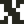
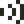
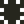
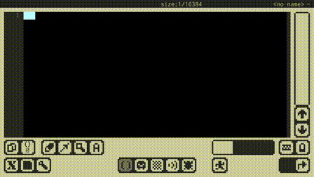
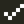
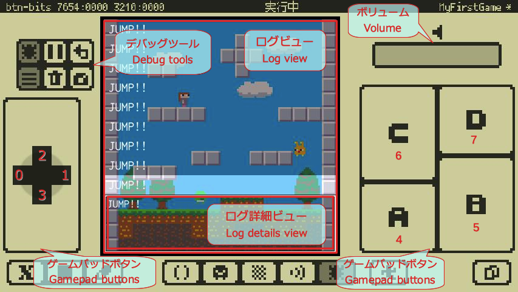

# 操作マニュアル

## Home画面

同梱のサンプルゲームを遊んだり、ユーザーが作ったファイルの管理が出来ます。

- **プロジェクト情報**にはファイルリストで選択されたプロジェクトファイルの情報が表示されます。
    - **スクリーンショット**はDebugモードで撮影されたスクリーンショットです。
    - **プロジェクトコメント**はコード先頭に記述されたコメントです。コードの先頭から行頭が`--`で始まる、最大４行のコメントがここに表示されます。
- **フォルダタブ**はファイルリストを表示するフォルダを選択します。
    -  **サンプルフォルダ**はアプリに同梱されているサンプルファイルが入っているフォルダです。ファイルを開けますがセーブはプロジェクトフォルダで行われます。ファイルの削除は出来ません。
    -  **プロジェクトフォルダ**はユーザー作成のプロジェクトが保存されるフォルダです。**プロジェクトのセーブは必ずここで行われます**。
    -  **インポートフォルダ**はインポートされたファイルが保存されるフォルダです。ファイルを開けますがセーブはプロジェクトフォルダで行われます。既に存在するファイルと**同じ名前のファイルをインポートすると上書きされる**ことにご注意ください。
- **ファイルリスト**にはフォルダタブで選択されているフォルダのファイルが表示されます。ファイルを選択して、行いたい操作を**ファイル操作**で選択します。
- **ファイル操作**では選択しているファイルを操作します。ボタンは  メニューの中にある場合があります。
    -  **開く**で選択しているプロジェクトを開いてStudioに遷移します。
    -  **遊ぶ**で選択しているプロジェクトを直接Runモードで開始します。
    -  **削除**で選択しているファイルを削除します。
    -  **エクスポート**で選択しているファイルを本アプリの外に書き出す事ができます。**書き出し先がないとエクスポートは出来ません。**iCloud Driveを有効にして作成したプロジェクトのバックアップなどに利用することをおすすめします。
-  **プロジェクトフォルダ**で  **プロジェクト新規作成**ボタンを押すと、空のプロジェクトを作成してStudioに遷移します。
-  **インポートフォルダ**で  **インポート**ボタンを押すと、本アプリの外からx8studioのプロジェクトファイルを読み込むことが出来ます。

---

## Studio共通のUI

ここで各種エディタやDebugモードを利用してゲームを作ります。

### トップバーとボトムバー周辺のUI
トップバーとボトムバー周辺のUIは全てのエディタで共通のUIです。

- **ヒント**にはタッチしているUIのヒントや、一時的な通知などが表示されます。
- **ステータス**には現在の状態に関連する情報が表示されます。
- **プロジェクト名**には現在エディット中のプロジェクト名が表示されます。
- **プロジェクトステータス**にはプロジェクトの状態（`-`変更なし、`*`変更あり）が表示されます。
- **メニュー**
    -  **x8メニュー**
        - 本アプリの情報やサポートページへのリンクなど
    -  **ファイルメニュー**
        - プロジェクトのセーブ、参照読み込み、閉じる操作など
    -  **エディットメニュー**
        - 入力設定や現在のエディタに対応するコピー＆ペーストなど
- **エディタ**
    -  **Codeエディタ**
    -  **Gfxエディタ**
    -  **Mapエディタ**
    -  **Sfxエディタ**
    -  **Debugモード**
- **Runモード**
    -  **Runモード**
- **Undo/Redo**
    -  **Undo**（元に戻す）
    -  **Redo**（やり直す）
- **プロジェクト切り替え**
    -  **プロジェクト切り替え**
        - 編集プロジェクトと参照プロジェクトを切り替えます。

### プロジェクト切り替え
**プロジェクト切り替え**は**編集プロジェクト**と**参照プロジェクト**を切り替えます。

- **編集プロジェクト**とは、現在開発中のHome画面で開いたプロジェクトです。
- **参照プロジェクト**とは、他のプロジェクトを参照するためなどに利用されるプロジェクトで、エディットや実行は出来ますが**セーブは出来ません**。常に一つだけ存在し、ファイルメニューの**参照読み込み**で他のプロジェクトを読み込むことができます。
- 編集プロジェクトと参照プロジェクトとの間でもコピーや貼り付けが可能です。
- 現在どちらのプロジェクトが表示されているかをエディタの背景で判別出来ます。
    - 背景が**明るい**場合は**編集プロジェクト**です。
    - 背景が**暗い**場合は**参照プロジェクト**です。

### タッチカーソル
**タッチカーソル**は指でのタッチでは難しい細かい作業を行う場合に利用します。

- ボタン以外の部分をドラッグすると、タッチカーソルを移動できます。
- ボタンを押すと、タッチカーソルのポインタ（タッチカーソル上方の点）の位置をタッチできます。
- ボタンを押しながら移動すると、タッチカーソルのポインタの位置でドラッグができます。

### 画面キーボード
**画面キーボード**は外部キーボードを使わずに文字入力を行う場合に利用します。`Shift`、`Ctrl`、`Alt`の修飾トグルには、その左にロックするトグルがあり、ロックされていないと１回の文字入力で修飾がオフになります。`Mode`キーで、**通常文字** → **特殊文字** → **カナ**、の順に入力モードが切り替わります。（カナはJPキーボードの場合だけです）

---

## Codeエディタ

- **Lua言語（Lua 5.3）**でプログラミングが出来ます。x8独自APIとLuaの標準ライブラリ（一部を除く）が利用出来ます。
- Codeエディタで入力と表示に対応しているのは**ASCIIコード（半角英数記号）と一部の文字（カナ、特殊記号）だけ**なことにご注意ください。

- **コードエリア**にはプログラムコードが表示されます。ここでプログラミングを行います。
- **コード選択**
    -  **コード切り替え**はエディットするコードを、直前にエディットしていたコードと切り替えます。
    -  **コード選択**はエディットするコードを選択します。
- **エディットツール**
    -  **編集メニュー**はコピーやペーストなどの編集機能のメニューです。
    -  **移動メニュー**はページ移動や行頭へ移動などのカーソル移動機能のメニューです。
    -  **検索メニュー**は検索機能のメニューです。
    -  **入力モードメニュー**は入力モードを切り替えるメニューです。
-  **エディットメニュー**
    - **コピー**で現在選択中のコードをコピーします。コード単位のコピーであり、**文字列単位ではない**ことにご注意ください。
    - **貼り付け**で現在選択中のコードをコピー済みのコードで置き換えます。コピー済みのコードがなければ何もしません。

### Luaの資料

- Luaのオフィシャルサイトは[こちら](https://www.lua.org/home.html)です。
- オフィシャルの**Lua 5.3 リファレンスマニュアル**は[こちら](https://www.lua.org/manual/5.3/)です。
- **Lua 5.3 リファレンスマニュアルの日本語訳（非公式）**は[こちら](http://milkpot.sakura.ne.jp/lua/lua53_manual_ja.html)です。(リンクさせていただき感謝です！)

### Lua標準ライブラリ

**Lua標準ライブラリ**のうちx8studioで利用可能なものは以下のとおりです。

|利用可能？|ライブラリ|テーブル|利用できない関数|
|:--:|:---|:---|:---|
|**YES**|基本ライブラリ||collectgarbage, dofile, loadfile, load, print|
|**YES**|コルーチンライブラリ|`coroutine`|-|
|NO|パッケージライブラリ|`package`|-|
|**YES**|文字列操作|`string`|dump, pack, packsize, unpack|
|NO|基本的なUTF-8のサポート|`utf8`|-|
|**YES**|テーブル操作|`table`|-|
|**YES**|数学関数|`math`|-|
|NO|入出力|`io` `file`|-|
|NO|OS機能|`os`|-|
|NO|デバッグ機能|`debug`|-|

### コード補完とコードスニペット
コードエリアに文字を入力すると、補完候補があれば補完ポップアップが開きます。ワードの末尾にカーソルを合わせて`Alt+Tab`でも（補完候補があれば）開くことができます。

- そのまま文字入力を続けると、候補が絞られます。
- `Tab`,`Shift+Tab`で候補を選択して、`Enter`で確定出来ます。
- `Ctrl+Tab`または`Esc`を押すかカーソル移動操作を行うと、ポップアップは閉じます。
- 補完中に`Alt+Tab`で、補完候補に対応するコードスニペットを入力できます。

---

## Gfxエディタ

スプライトやマップに利用される画像データを作成出来ます。

- **エディットビュー**ではGfxビューで選択されたエリアをエディットします。
- **Gfxビュー**ではエディットするGfxエリアを選択します。
- **スタンプビュー**にはキャプチャされたスタンプデータが表示されます。
    -  はスタンプデータの`color:0`の抜き設定を切り替えます。
- **カラーパレット**は描画ツールで参照されるカラーを選択します。
    -  は描画ツールの**トグルモード**の設定を切り替えます。**トグルモード**では２つのカラーを選択できます。描画開始位置のカラーがどちらのカラーでもなければ左上にマークのあるカラーが設定され、描画開始位置のカラーがどちらかのカラーであればもう一方のカラーが設定されます。スタンプでの描画には影響しません。
- **描画ツール**
    -  ペンで描画する（タッチしたまま選択、離して確定）
        -  ピクセルペン
        -  四角いペン
        -  丸いペン
    -  スタンプデータを描画する
    -  スタンプデータをキャプチャする
    -  チップ属性をエディットする
    -  エディットビューでエリアを選択します。
    -  選択エリアの効果を選ぶ
        -  選択エリアに関係なくエディットを可能にします。
        -  選択エリアの内側だけをエディットを可能にします。
        -  選択エリアの外側だけをエディットを可能にします。
    -  グリッドを表示します。
- **Gfx選択ツール**
    -  エディットするGfx選択エリアの形とサイズを固定します。
    -  グリッドを表示します。
-  **エディットメニュー**
    - **コピー**で現在選択中のGfxエリアのGfxデータをコピーします。
    - **貼り付け**で現在選択中のGfxエリアにコピー済みのGfxデータを貼り付けます。コピー済みのGfxデータがなければ何もしません。

-  **チップ属性エディット**
    - チップ(8x8)に対応する1byte(8bit)の属性データをエディットします。
    - 8色のカラーパレットがエディットする属性データのビット位置に対応しています。
    - エディットビューで色を塗ることで対応するビットをONに出来ます。
-  **エディットメニュー**
    - **コピー**で現在選択中の属性エリアの属性データをコピーします。
    - **貼り付け**で現在選択中の属性エリアにコピー済みの属性データを貼り付けます。コピー済みの属性データがなければ何もしません。

---

## Mapエディタ

Gfxエディタで作成した画像データをチップとして並べて、より大きな画像データを作成出来ます。

- **エディットビュー**ではMap選択ビューで選択されたエリアをエディットします。
- **Gfxビュー**ではエディットビューに設定するチップ矩形を選択します。
- **チップ番号：0**のチップはMapエディタおよび実際のマップ描画において、描画されないチップ（抜きのチップ）として機能します。スプライトとしては他の領域と区別なく描画されます。
- **スタンプビュー**にはキャプチャされたスタンプデータが表示されます。
- **Map選択ビュー**ではエディットするMapエリアをタッチで選択します。
- **Mapカーソルキー**はMap選択ビューの選択矩形を操作します。
    -     選択エリアを移動します。
    -  選択エリアを左上にリセットします。
    -  現在の選択エリアの左上を固定します。固定した状態でカーソルを移動するとエリアのサイズを変更できます。
- **配置ツール**
    -  Gfxビューで選択されているチップを配置する
    -  スタンプデータを配置する
    -  スタンプデータをキャプチャする
    -  エディットビューでエリアを選択します。
    -  選択エリアの効果を選ぶ
        -  選択エリアに関係なくエディットを可能にします。
        -  選択エリアの内側だけをエディットを可能にします。
        -  選択エリアの外側だけをエディットを可能にします。
    -  グリッドを表示します。
- **Gfx選択ツール**
    -  は配置ツールの**トグルモード**の設定を切り替えます。**トグルモード**では配置開始位置のチップが配置するチップと違えば設定され、配置開始位置のチップが配置するチップと同じなら**0**が設定されます。配置するチップが複数の場合は左上が参照されます。スタンプでの配置には影響しません。
    -  エディットするGfx選択エリアの形とサイズを固定します。
    -  グリッドを表示します。
-  **エディットメニュー**
    - **コピー**で現在選択中のMapエリアのMapデータをコピーします。
    - **貼り付け**で現在選択中のMapエリアにコピー済みのMapデータを貼り付けます。コピー済みのMapデータがなければ何もしません。
    - Mapエディタでのコピーと貼り付けは**Mapデータだけ**を対象とします。プロジェクトをまたいで実行する場合、この操作では**Gfxデータは変更されない**ことにご注意ください。

---

## Sfxエディタ

効果音などの短いサウンドデータを作成出来ます。

- **エディットビュー**ではSfxを構成する16個のノートをタッチでエディット出来ます。
    - **ノート**の表示では、波線とそれに付随する数値が波形とピッチオフセットを、緑のブロックがボリューム値を表しています。
- **エディットツール**
    -  エディットするSfxを選択します。
    -  Sfxの有効／無効を切り替えます。
    -  他のSfxからコピーして設定します。
    -  再生スピードを設定します。数値が小さいほど速くなります。
    -  ループの有効／無効を切り替えます。有効な場合はエディットビュー下のをドラッグして、ループ位置を設定できます。
    -  ノートをタッチして音高を設定出来ます。調整キーでも音高を設定出来ます。
    -  タッチで選択したノートの音高を鍵盤で設定出来ます。選択位置は自動的に右へ移動します。調整キーでも音高を設定出来ます。
    -  タッチでノートのボリュームを設定出来ます。調整キーでもボリュームを設定出来ます。
    -  タッチでノートの波形を設定出来ます。（タッチしたまま選択、離して確定）
        -  サイン波
        -  矩形波(1:1)
        -  矩形波(1:3)
        -  矩形波(1:7)
        -  ノコギリ波
        -  三角波
        -  ホワイトノイズ
        -  ノイズ(音高あり)
    -  鍵盤でピッチオフセットを指定して、試し弾きが出来ます。
- **再生ツール**
    -  Sfxを再生します。
    -  Sfxの再生を停止します。
- **鍵盤**
    - 黄色い枠は`ピッチオフセット:0`を表しています。
-  **エディットメニュー**
    - **コピー**で現在選択中のSfxデータをコピーします。
    - **貼り付け**で現在選択中のSfxデータをコピー済みのSfxデータで置き換えます。コピー済みのSfxデータがなければ何もしません。

---

## Debugモード

開発中のゲーム動かしてテストするモードです。

- **デバッグツール**
    -  デバッグ実行を開始／停止します。
    -  デバッグ実行をポーズ／ポーズ解除します。
    -  仮想マシンをリセットします。
    -  ログビューの表示／非表示を切り替えます。
    -  ログをクリアします。
    -  Home画面のプロジェクト情報に表示されるスクリーンショットを撮影します。
- **ログビュー**
    -  ログビュー表示がONの場合、ゲーム画面上に各ログの１行目が表示されます。タッチでログを選択すると、ログ詳細ビューにそのログの詳細が表示されます。
    - **ログ詳細ビュー**をタッチすると**ログ詳細ウィンドウ**が開きます。
- **ログ詳細ウィンドウ**
    - ログにエラー箇所が表示されている場合、`エラーに移動`ボタンを押すとCodeエディタに遷移してエラー位置に移動出来ます。
- **ボリューム**
    - 仮想マシンのボリュームを変更出来ます。何らかの要因で仮想マシンがポーズされると自動的に0に設定されます。
- **ゲームパッドボタン**
    - 仮想マシンのゲームパッドのボタンです。赤い数字で示されているのは、APIでボタン情報を取得する際のビット位置です。

---

## Runモード

完成したゲームで遊ぶモードです。

- **メニューボタン**を押すと仮想マシンの**再起動**または**終了**を実行するメニューが開きます。

---

## 画面キーボード

アプリ独自の画面キーボードを内蔵しています。

-  **エディットメニュー**の**入力設定**で画面キーボードを以下のものから選べます。
    - **QWERTY JP**で日本語キーボードになります。**カナ**が入力出来ます。
    - **QWERTY US**で英語キーボードになります。**カナ**は入力出来ません。

---

## 外部キーボード

外部キーボード入力に対応しています。

- **外部キーボード**については、QWERTY配列の英語(US)キーボードと日本語(JIS)キーボードに対応しています。
- 接続されているキーボードタイプは自動的には判別されないため、**エディットメニュー** → **入力設定** → **外部キーボード**で、接続されているキーボードタイプを設定する必要があります。
    - **QWERTY US**でQWERTY配列の英語(US)キーボードとして認識します。カナは入力出来ません。
    - **QWERTY JP**で**一部のサードパーティー製日本語(JIS)キーボード**として認識します。カナが入力出来ます。
    - **Apple JP**で日本語(JIS)キーボードとして認識します。カナが入力出来ます。
- Apple純正のキーボードであれば**QWERTY US**か**Apple JP**に設定します。
- `caps lock`キーは本来の**CapsLock**としては機能しません。アプリ側で入力が取得出来る場合は`control`キーとして動作します。

### 外部キーボードの設定と動作確認状況

|動作|機種|配列|設定|
|:--:|:---|:--:|:---|
|OK|Apple Wireless Keyboard 2011 英語(US)|US|**QWERTY US**|
|OK|Magic Keyboard 日本語(JIS)|JIS|**Apple JP**|
|OK|Anker Ultra-Slim Bluetooth Keyboard (A7726)|US|**QWERTY US**|
|OK|ロジクール K380 マルチデバイス Bluetooth キーボード（日本語配列）|JIS|**QWERTY US**または**QWERTY JP** `※`|
|未確認|その他の英語(US)キーボード|US|**QWERTY US**|
|未確認|その他のApple純正日本語(JIS)キーボード|JIS|**Apple JP**|
|未確認|その他のサードパーティー製日本語(JIS)キーボード|JIS|**QWERTY US**|

- サードパーティー製日本語(JIS)キーボードは基本的に**QWERTY US**に設定することにご注意下さい。
- `※`一部のサードパーティー製日本語(JIS)キーボードについては**QWERTY JS**に設定することにより、キーを刻印どおり入力出来るようアプリ側で対処することができます。ただし、以下につては別のキーで代用して入力します。
    - `\`（バックスラッシュ）は`漢字`キーで入力
    - `_`（アンダースコア）は`Shift+漢字`で入力
    - `|`（パイプ）は`Shift+0`で入力
    - 半角カナの`ﾛ`は`漢字`キーで入力
    - 半角カナの`ｰ`は`Shift+漢字`キーで入力
- `※`サードパーティー製日本語(JIS)キーボードのうち**QWERTY JS**設定での動作確認済み機種は以下の通りです。
    - ロジクール K380 マルチデバイス Bluetooth キーボード（日本語配列）

---

## ショートカットキー

画面キーボードも外部キーボードも同じショートカットキーに対応しています。

- キーの記号の意味
    - `#`はShiftキーと同時押しの意味
    - `^`はCtrlキーと同時押しの意味
    - `&`はAltキーと同時押しの意味

### Codeエディタ

- **Shiftを押しながら移動系のキーやショートカットを押すと、選択しながら移動出来ます。**

|キー|機能|
|:--:|:---|
|`&Tab`|行をインデント|
|`#Tab`|行をアウトデント|
|`^Tab`|カーソル位置で可能なら補完ポップアップを開く|
|`^Enter`|上に行を挿入|
|`#^Enter`|下に行を挿入|
|`^↑`|ページUp|
|`^↓`|ページDown|
|`^←`|前のワード境界へ|
|`^→`|次のワード境界へ|
|`&↑`|テキスト先頭へ|
|`&↓`|テキスト末尾へ|
|`&←`|行頭へ|
|`&→`|行末へ|
|`^A`|全選択|
|`^C`|コピー|
|`^D`|削除（コピーバッファに追加しない）|
|`^F`|前方検索ポップアップを開く|
|`#^F`|後方検索ポップアップを開く|
|`^&G`|グリフ入力モード|
|`^K`|カーソルから行末まで削除|
|`^&K`|カナ入力モード|
|`^L`|カーソルが画面中央に来るようにスクロール|
|`^&N`|通常入力モード|
|`^V`|貼り付け|
|`#^V`|行頭に貼り付け|
|`^X`|カット（コピーバッファに追加する）|
|`^Z`|アンドゥ|
|`#^Z`|リドゥ|

### Codeエディタの補完ポップアップ

|キー|機能|
|:--:|:---|
|`Enter`|確定して閉じる|
|`Esc`|キャンセルして閉じる|
|`Tab`|次の候補へ|
|`#Tab`|前の候補へ|
|`&Tab`|補完モードとスニペットモードを切り替える|
|`^Tab`|キャンセルして閉じる|

### Codeエディタの検索ウィンドウ

|キー|機能|
|:--:|:---|
|`^F`|次の前方の検索結果へ|
|`#^F`|次の後方の検索結果へ|

