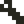
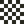
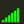
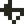
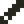

# マニュアル（ver. 0.1：開発段階の古いもの）

## Home

- **プロジェクト情報**には、ファイルリストで選択されたプロジェクトファイルの情報が表示されます。
    - **スクリーンショット**は、Debugモードで撮影されたスクリーンショットです。
    - **コメント**は、コード先頭に記述された、プロジェクトに関するコメントです。
- **新規作成**ボタンを押すと、空のプロジェクトを作成してStudioに遷移します。
- **フォルダタブ**で、ファイルリストを表示するフォルダを選択します。
    - **sample**フォルダは、アプリに同梱されているサンプルファイルが入っているフォルダです。ファイルをセーブしたり削除したりすることは出来ません。サンプルファイルのカスタマイズは可能ですが、セーブはprojectフォルダで行われます。
    - **project**フォルダは、ユーザー作成のプロジェクトが保存されるフォルダです。ファイルをセーブしたり削除することが出来ます。
- **ファイルリスト**には、フォルダタブで選択されているフォルダのファイルが表示されます。ファイルを選択して、行いたい操作を**ファイル操作**で選択します。

---

## Studio共通のUIと操作

### トップバーとボトムバー
トップバーとボトムバーは、全てのエディタで共通のUIです。

- **ヒントメッセージ**には、タッチしているUIのヒントや、一時的な通知などが表示されます。
- **ステータスメッセージ**には、現在の状態に関連する情報が表示されます。
- **プロジェクト名**には、現在エディット中のプロジェクト名が表示されます。
-  **x8メニュー**
-  **ファイルメニュー**
-  **エディットメニュー**
-  **オプションメニュー**
-  **Debugモード**
-  **Codeエディタ**
-  **Gfxエディタ**
-  **Mapエディタ**
-  **Sfxエディタ**
-  **Phraseエディタ**
-  **Musicエディタ**
-  **Runモード**
-  **チートシート**
-  **Undo**（もとに戻す）
-  **Redo**（やり直す）

### ポップアップメニュー
ポップアップメニューは、ボタンをタッチしている間だけ現れるメニューです。タッチしたまま選択したい項目に移動し、タッチを放すことで確定されます。

###  タッチカーソル
**タッチカーソル**は、指でのタッチでは難しい細かい作業を行う場合に利用します。

- ボタン以外の部分をドラッグすると、タッチカーソルを移動できます。
- ボタンを押すと、タッチカーソルのポインタ（タッチカーソル上方の点）の位置をタッチができます。
- ボタンを押しながら移動すると、タッチカーソルのポインタの位置でラッグができます。

###  スクリーンキーボード
**スクリーンキーボード**は、ハードウエアキーボードを使わずに、文字入力を行う場合に利用します。**Shift**、**Ctrl**、**Alt**の修飾キーはON/OFFのトグルです。**Off**キーを押すと全ての修飾キーがOFFになります。**Mode**キーで、通常文字 → 特殊文字 → カナ、の順に入力モードが切り替わります。（USキーボードではカナはありません）

---

## Codeエディタ

- **コードエリア**には、プログラムコードが表示されます。ここでプログラミングを行います。
-  **コード切り替え**は、編集するコードを、直前に編集していたコードと切り替えます。
- **コード選択**は、編集するコードを選択します。

### コード補完とコードスニペット
コードエリアに文字を入力すると、補完候補があれば補完ポップアップが表示されます。

- そのまま文字入力を続けると、候補が絞られます。
- 上下キーで候補を選択して、Enterキーで確定出来ます。
- Escキーを押すかカーソル移動操作を行うと、ポップアップは消えます。
- 補完中にTabキーを押すと、補完候補に対応するコードスニペットを入力できます。

---

## Gfxエディタ

- **エディットビュー**では、Gfxビューで選択されたエリアをエディットします。
- **Gfxビュー**では、エディットするGfxエリアを選択します。
- **スタンプビュー**には、キャプチャされたスタンプデータが表示されます。
-  **抜き設定**は、スタンプデータの`color:0`の抜き設定を切り替えます。
- **カラーパレット**は、描画ツールで参照されるカラーを選択します。
- **描画ツール**
    -  ペン1
    -  ペン2
    -  ペン3
    -  スタンプデータを描画する
    -  スタンプデータをキャプチャする
-  **選択ツール**は、エディットビューでエリアを選択します。
- **エディットエリア選択**
    -  選択エリアに関係なくエディットを可能にします。
    -  選択エリアの内側だけをエディットを可能にします。
    -  選択エリアの外側だけをエディットを可能にします。
-  グリッドを表示します。
-  エディットするGfxエリアの形とサイズを固定します。

-  **チップ属性エディット**
    - チップ(8x8)に対応する1byte(8bit)の属性データをエディットします。
    - 8色のカラーパレットで、エディットする属性のビットを選択出来ます。

---

## Mapエディタ

- **エディットビュー**では、Mapエリア選択ビューで選択されたエリアをエディットします。
- **Gfxビュー**では、エディットビューに設定するチップ矩形を選択します。
- **スタンプビュー**には、キャプチャされたスタンプデータが表示されます。
- **Mapエリア選択ビュー**では、エディットするMapエリアを選択します。
- **Mapエリア選択カーソル**は、Mapエリア選択ビューの選択矩形を移動します。
- **描画ツール**
    -  Gfxビューで選択されているチップを配置する
    -  スタンプデータを配置する
    -  スタンプデータをキャプチャする
-  **選択ツール**は、エディットビューでエリアを選択します。
- **エディットエリア選択**
    -  選択エリアに関係なくエディットを可能にします。
    -  選択エリアの内側だけをエディットを可能にします。
    -  選択エリアの外側だけをエディットを可能にします。
-  グリッドを表示します。
-  Gfxビューで選択されたチップ矩形の形とサイズを固定します。

---

## Sfxエディタ

- **エディットビュー**では、Sfxを構成する16個のノートを、タッチでエディット出来ます。
    - **ノート**の表示は、水平の線と付随する数値が波形とピッチオフセットを、緑のブロックがボリューム値を表しています。
    - エディットビュー下部のマークをドラッグして、ループ位置を設定できます。
-  エディットするSfxを選択します。
-  Sfxの有効／無効を切り替えます。
-  他のSfxからコピーして設定します。
-  再生スピードを設定します。数値が小さいほど速くなります。
-  ループの有効／無効を切り替えます。有効な場合は、エディットビューでループ位置を設定できます。
- **ピッチツール**
    -  **ピッチエディット**
        - MIDIキーボードで、選択中のノートのピッチを変更出来ます。
        - エディットビューをタッチして、ノートのピッチを変更出来ます。
    -  **ピッチペン**
        - MIDIキーボードでピッチを選択した後、エディットビューをタッチすることで、ノートにそのピッチを設定出来ます。
-  **ボリュームツール**は、エディットビューをタッチして、ノートのボリュームを設定出来ます。
- **波形ツール**は、エディットビューをタッチして、ノートの波形を設定出来ます。
    -  サイン波
    -  矩形波
    -  のこぎり波
    -  三角波
    -  ノイズ
-  Sfxを再生します。
-  Sfxの再生を停止します。
-  MIDIキーボードでピッチオフセットを指定して、試し弾きが出来ます。
- **MIDIキーボード**
    - 黄色い枠は、`ピッチオフセット:0`を表しています。
    - オレンジ色のマークは、選択されているピッチ（**ピッチペン**で参照される）を表しています。

---

## Phraseエディタ

- **エディットビュー**では、Phraseを構成する16個のSfxトリガーx4トラックを、タッチでエディット出来ます。
    - **Sfxトリガー**の表示は上から、オクターブ＋ピッチ、Sfx番号、ボリューム、を表しています。
    - エディットビュー下部のマークをドラッグして、Phraseの長さを設定できます。
    - エディットビュー下部のマークをドラッグして、試し弾き時の再生開始位置を設定できます。
- **トラックボリューム**では、各トラックのボリュームを設定できます。
-  エディットするPhraseを選択します。
-  Phraseの有効／無効を切り替えます。
-  他のPhraseからコピーして設定します。
-  再生スピードを設定します。単位はBPMです。
- **ピッチツール**
    -  **ピッチエディット**
        - MIDIキーボードで、選択中のトリガーのピッチを変更出来ます。
        - エディットビューをタッチして、トリガーのピッチを変更出来ます。
    -  **ピッチペン**
        - MIDIキーボードでピッチを選択した後、エディットビューをタッチすることで、トリガーにそのピッチを設定出来ます。
- **ボリュームツール**は、エディットビューをタッチして、トリガーのボリュームを設定出来ます。
    -  無音（＝トリガーなし）
    -        ボリューム:1〜7
-  **Sfxツール**は、エディットビューをタッチして、トリガーのSfx番号を設定出来ます。
- **エフェクトツール**
    -  **Tie**は、次のトリガーとの間に自動で無音部分を挟む処理を禁止します。
    -  **Mute**は、トリガーが無音の場合、無音を再生します（音を止めます）。
-  Phraseを再生します。
-  Phraseの再生を停止します。
-  MIDIキーボードでピッチオフセットを指定して、試し弾きが出来ます。
- **MIDIキーボード**
    - 黄色い枠は、`ピッチオフセット:0`を表しています。
    - オレンジ色のマークは、選択されているピッチ（**ピッチペン**で参照される）を表しています。

---

## Musicエディタ

- **エディットビュー**では、Musicを構成する32個のPhraseトリガーを、タッチで選択出来ます。
    - **Phraseトリガー**の表示は上から、Phrase番号、ジャンプ先、ジャンプ回数、を表しています。
    - Phraseトリガー上部のマークをドラッグして、選択中のPhraseトリガーのジャンプ先を設定できます。
    - Phraseトリガー下部のマークをドラッグして、Musicの長さを設定できます。
    - Phraseトリガー下部のマークをドラッグして、試し弾き時の再生開始位置を設定できます。
-  エディットするMusicを選択します。
-  Musicの有効／無効を切り替えます
-  他のMusicからコピーして設定します。
-  再生スピードを設定します。単位はBPMです。
-  **エディットツール**は、選択中のPhraseトリガーの内容をエディットします。
    -  選択中のPhraseトリガーのPhrase番号を設定します。
    -  選択中のPhraseトリガー再生後にジャンプする回数を設定します。1回以上ジャンプする場合は、エディットビューでジャンプ先を設定できます。
-  Musicを再生します。
-  Musicの再生を停止します。
-  MIDIキーボードでピッチオフセットを指定して、試し弾きが出来ます。
- **MIDIキーボード**
    - 黄色い枠は、ピッチオフセット:0を表しています。

---

## Debugモード

- **ディスプレイ**には、ゲーム画面が表示されます。
    -  **ログ表示**がONの場合、ゲーム画面上に各ログの１行目が表示されます。タッチでログを選択すると、下部のウィンドウにそのログの詳細が表示されます。
    - **プログラムが停止した際は、ログでエラーの内容を確認してください。**
-  デバッグ実行をスタート／ストップします。
-  デバッグ実行をポーズ／再開します。
-  x8マシンをリセットします。
-  Home画面のプロジェクト情報に表示されるスクリーンショットを撮影します。
-  ログの表示／非表示を切り替えます。
-  ログをクリアします。

---

## Runモード

- **電源スイッチ**は、x8マシンの電源をON/OFFするスライドスイッチです。左右にスライドで切り替えます。
- **戻るボタン**は、Runモードに遷移する直前の画面に戻ります。**電源スイッチがOFFの場合だけ有効です。**

