# Manual

## Home_Screen

You can play the included sample games and manage user-generated files.

- The information of the project file selected in the file list is displayed in **Project Information**.
    - **Screenshot** is a screenshot taken in Debug mode.
    - **Project comment** is a comment written at the beginning of the code. Up to four lines of comments will be displayed here, starting with the first line of code with a `--`.
-  **New Project** button will create an empty project and move to Studio.
- The **Folder tab** selects the folder to display the file list.
    -  **Sample folder** is the folder that contains the sample files bundled with the app. It is not possible to save or delete files. You can customize the sample file, but the save is done in the project folder.
    -  **Project folder** is the folder where user-created projects are stored. You can save and delete files.
- The **file list** shows the files in the folder selected on the Folder tab. Select a file and then select the operation you want to perform with **file operation**.
- The **file operation** manipulates the selected file.
    - Open the selected project in  **Open** and go to Studio.
    - Start the project selected in  **Play** directly in Run mode.
    - Deletes the file selected in  **deletion**.

---

## Studio_Common_UI_and_Operations

Here you can create a game using various editors and Debug mode.

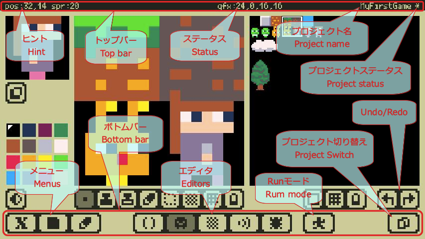

### Top Bar and Bottom Bar
The top and bottom bars are the same UI for all editors.

- **Hint** show hints about the UI you're touching, temporary notifications, etc.
- The **Status** displays information related to the current status.
- **Project name** shows the name of the project that is currently being edited.
- The **Project Status** shows the status of the project (`-` no change, `*` with change).
- **Menus**
    -  **x8 Menu**
        - Information on this application and links to support pages, etc.
    -  **File Menu**
        - manipulation of open project files, etc.
    -  **Optional Menu**
        - Input settings, etc.
- **Editor**
    -  **Code Editor**
    - 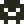 **Gfx Editor**
    -  **Map Editor**
    -  **Sfx Editor**
    -  **Debug Mode**
- Run mode**
    -  **Run Mode**.
- **Undo/Redo**
    -  **Undo** (undo)
    -  **Redo** (redo)

###  Touch Cursor
The **touch cursor** is used to perform detailed operations that are difficult to perform with a finger.

- You can move the touch cursor by dragging any part of it except the buttons.
- When you press the button, you can touch the position of the pointer of the touch cursor (the point above the touch cursor).
- If you hold down a button and move it, you can drag it at the position of the pointer of the touch cursor.

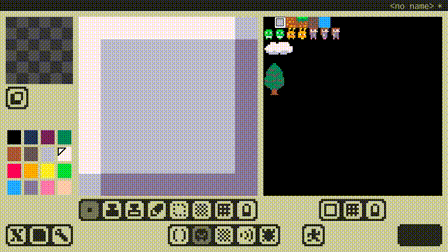

###  Screen Keyboard
**On-screen keyboard** is used for text input without using an external keyboard. The `Shift`, `Ctrl`, and `Alt` modifier toggles have a locking toggle to the left of them, and if not locked, modifiers are turned off after one character input. Press the `Mode` key to switch the input mode from **normal characters** to **special characters** to **katakana**. (The kana is only for JP keyboard.)

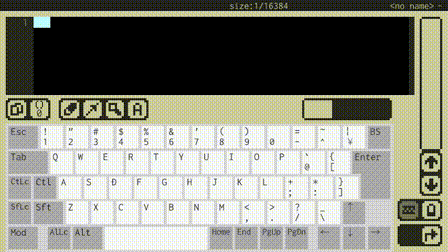

---

## Code_Editor

You can program in the Lua language. x8's own API and Lua's standard libraries (except for some) are available.

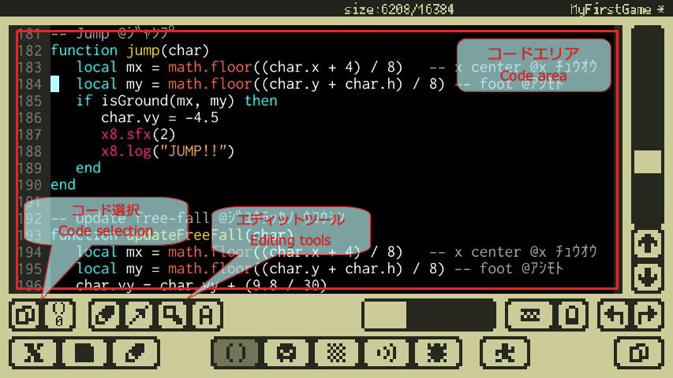

- The program code is displayed in the **Code area**. This is where the programming comes in.
- **Code selection**
    -  **Switching the Code** switches the code to be edited with the code you have just edited.
    -  **Code Selection** selects the code to be edited.
- **Editing tools**
    -  **Edit Menu** is the menu for editing functions such as copy and paste.
    -  **Movement Menu** is a menu for moving the cursor, such as moving the page or moving to the top of the line.
    -  **Search Menu** is the menu for the search function.
    -  **Input Mode Menu** is a menu to switch the input mode.

### Code Completion and Code Snippets
When you type a character in the code area, a completion pop-up will open if there is a potential completion. You can also open the word with `Alt+Tab` (if there is a candidate completion) by hovering the cursor over the end of the word.

- Keep typing to narrow down the list.
- You can select a candidate with `Tab`,`Shift+Tab` and confirm it with `Enter`.
- Pressing `Ctrl+Tab` or `Esc` or moving the cursor will close the pop-up.
- During completion, you can use `Alt+Tab` to enter a code snippet corresponding to the completion candidate.

---

## Gfx_Editor

You can create image data to be used for sprites and maps.

- In **Editing view**, the area selected in the Gfx view will be edited.
- In **Gfx view**, select the Gfx area to be edited.
- The **Stamp view** shows the captured stamp data.
    -  toggles the setting of `color:0` for stamp data.
- The **Color palette** selects the color referenced by the drawing tool.
- **Drawing tools**
    -  Drawing with a pen (touch and select, release to confirm)
        -  Pixel Pen
        -  square pen
        -  Round pen
    -  Draw the stamp data.
    -  Capture the stamp data
    - Editing chip attributes
    -  Select an area in the edit view.
    -  Choose the effect for the selected area
        -  Allows you to edit regardless of the selected area.
        -  Allows you to edit only the inside of the selected area.
        -  Allows you to edit only outside of the selection area.
    -  Display the grid.
- **Gfx Selection Tool**
    -  Fix the shape and size of the Gfx selection area to be edited.
    -  Display the grid.

-  **Chip attribute edit**
    - 1 byte (8bit) attribute data corresponding to chip (8x8) is edited.
    - The eight color palettes correspond to the bit positions of the attribute data to be edited.
    - You can turn on the corresponding bit by painting in the edit view.

---

## Map_Editor

Image data created with the Gfx editor can be lined up as chips to create larger image data.

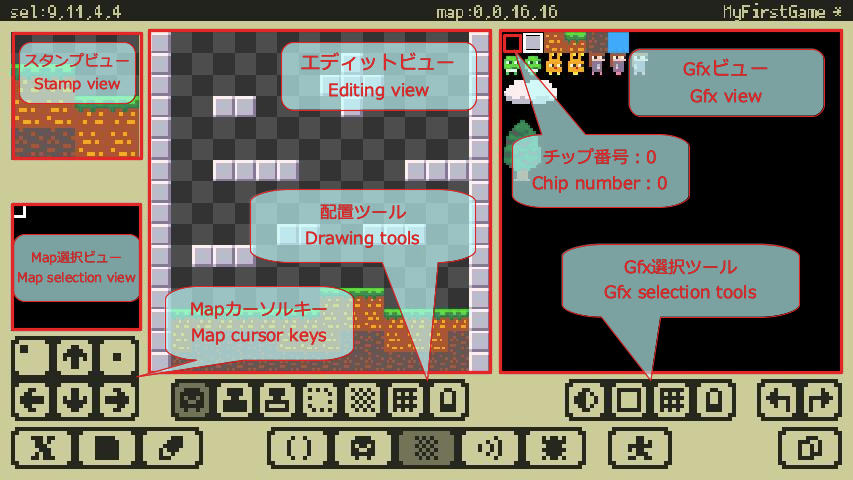

- In **Editing view**, you can edit the area selected in the Map Selection view.
- In **Gfx view**, select the tip rectangle to be set in the edit view.
- **Chip number: 0** will not be drawn in the Map Editor or in the actual map drawing (no chip). As a sprite, it is drawn without distinguishing it from other areas.
- The **Stamp view** shows the captured stamp data.
- In **Map selection view**, you can select the map area to be edited by touch.
- **Map cursor keys** manipulate the selection rectangle of the map selection view.
    -   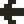  Move the selection area.
    -  Reset the selection area to the top left.
    -  Fix the top left of the current selection area. You can change the size of the area by moving the cursor while it is fixed.
- **Placement tools**
    -  Place the selected chip in the Gfx view
    -  Placing the stamp data
    -  Capture the stamp data
    -  Select an area in the edit view.
    -  Choose the effect for the selected area
        -  Allows you to edit regardless of the selected area.
        -  Allows you to edit only the inside of the selected area.
        -  Allows you to edit only outside of the selection area.
    -  Display the grid.
- **Gfx Selection Tool**
    -  Fix the shape and size of the Gfx selection area to be edited.
    -  Display the grid.

---

## Sfx_Editor

It is possible to create short sound data such as sound effects.

- The **editing view** allows you to edit the 16 notes that make up Sfx with a touch.
    - In the display of **notes**, the wavy line and associated numbers represent the waveform and pitch offset, and the green block represents the volume value.
- **Edit tool**.
    -  Select the Sfx you want to edit.
    -  Enable/disable Sfx.
    -  Copy and set from other Sfx.
    - 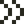 Set the playback speed. The smaller the number, the faster it will be.
    - 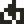 Enable/disable the loop. When enabled, you can drag  under the edit view to set the loop position.
    -  You can set the pitch by touching the note. You can also set the pitch with the adjustment keys.
    -  You can set the pitch of the selected note by touch on the keyboard. The selected position will automatically move to the right. You can also set the pitch with the adjustment keys.
    -  You can set the volume of a note by touching it. You can also set the volume with the adjustment keys.
    -  You can set the waveform of the note by touching it. (Select with touch, release and fix)
        -  Sine Wave
        -  Square Wave(1:1)
        -  square Wave(1:3)
        -  Square Wave(1:7)
        -  Sawtooth Wave (1:7)
        -  Triangular Wave
        -  White Noise
        - 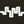 Noise (with pitch)
    -  You can specify the pitch offset on the keyboard to play a trial tune.
- **Playback tool**
    -  Play Sfx.
    -  Stop playing Sfx.
- **Keyboards**.
    - The yellow frame represents the `pitch offset:0`.

---

## Debug_Mode

In this mode, you can run and test a game under development.

- **Debug Tools**
    -  Starts/stops the debugging process.
    -  Pause/unpause the debugging execution.
    -  Reset the virtual machine.
    - 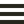 Toggles between showing and hiding the log view.
    -  Clear the log.
    -  Take a screenshot of the project information on the Home screen.
- **Log View**
    -  When Log View is ON, the first line of each log will be displayed on the game screen. When you select a log by touch, the log details view will show the details of that log.
    - Touch the **Log Detail View** to open the **Log Detail Window**.
- **Log Detail Window**
    - When the error part is displayed in the log, it is possible to move to the error position in the Code editor by pushing the `Go to Error` button.
- **Volume**
    - You can change the volume of the virtual machine. If the virtual machine is paused for any reason, it is automatically set to 0.
- **Gamepad Buttons**
    - These are the buttons of the gamepad of the virtual machine. The red number indicates the bit position of the button information to be retrieved by the API.

---

## Run_Mode

This is the mode of playing the completed game.

- Pressing the **menu button** will open a menu where you can perform a **restart** or **quit** of the virtual machine.

---

## Screen_Keyboard

The app has its own built-in screen keyboard.

- You can select a screen keyboard from the following in **Input Settings** in  **Options menu**.
    - **QWERTY JP** makes it a Japanese keyboard. You can enter **kana**.
    - **QWERTY US** for the English keyboard. You cannot type **kana**.

---

## External_Keyboard

External keyboard input is supported.

- For **external keyboards**, English (US) and Japanese (JIS) keyboards in QWERTY arrangement are supported.
- Since the connected keyboard type is not automatically determined, it is necessary to set the connected keyboard type in **Options Menu** → **Input Settings** → **External Keyboard**.
    - **QWERTY US** recognizes it as an English (US) keyboard with a QWERTY array. Kana cannot be entered.
    - **QWERTY JP** recognizes **some third party Japanese (JIS) keyboards**. You can enter kana.
    - It is recognized as a Japanese (JIS) keyboard by **Apple JP**. You can enter kana.
- If it's a genuine Apple keyboard, set it to **QWERTY US** or **Apple JP**.
- The `caps lock` key does not work as a **CapsLock**. It works as `control` key if the input can be obtained by the application side.

### External Keyboard Settings and Operation Check Status

|Status|Model|Arrangement|Setting|
|:--:|:---|:--:|:---|
|OK|Apple Wireless Keyboard 2011 English(US)|US|**QWERTY US**|
|OK|Magic Keyboard Japanese(JIS)|JIS|**Apple JP**|
|OK|Anker Ultra-Slim Bluetooth Keyboard (A7726)|US|**QWERTY US**|
|OK|Logicool K380 Multi-Device Bluetooth Keyboard (Japanese layout)|JIS|**QWERTY US** or **QWERTY JP** `*`|
|Unchecked|Other English(US) keyboards|US|**QWERTY US**|
|Unchecked|Other Apple Japanese(JIS) keyboards|JIS|**Apple JP**|
|Unchecked|Other Third Party Keyboards|JIS|**QWERTY US**|

- Please note that third party Japanese (JIS) keyboards are basically set to **QWERTY US**.
- `*` Some third party Japanese (JIS) keyboards can be set to **QWERTY JS**, so that you can input keys as marked. However, for the following, use a different key instead.
    - Type `\` (backslash) with the `kanji` key.
    - Type `_` (underscore) with `Shift+Kanji`.
    - Type `|` (pipe) with `Shift+0`.
    - Enter a half-width kana character `ﾛ` with the `Kanji` key.
    - Enter a half-width kana character `ｰ` with `Shift+Kanji`.
- `*` The following models have been confirmed to work with **QWERTY JS** setting among the Japanese (JIS) keyboards made by a third party.
    - Logicool K380 Multi-Device Bluetooth Keyboard (Japanese Array)

---

## Shortcut_Keys

Both the screen keyboard and the external keyboard support the same shortcut keys.

- The meaning of the key symbol
    - `#` means to press the Shift key at the same time.
    - `^` means to press the Ctrl key at the same time.
    - `&` means to press the Alt key at the same time.

### Code Editor

- **You can move while selecting a key or shortcut while holding down the Shift key.**

|Key|Function|
|:--:|:---|
|`&Tab`|indent a line|
|`#Tab`|outdent a line|
|`^Tab`|Open the completion popup if possible at the cursor position|
|`^Enter`|Insert line at the top|
|`#^Enter`|Insert line underneath|
|`^↑`|PageUp|
|`^↓`|PageDown|
|`^←`|To the previous word boundary|
|`^→`|To the next word boundary|
|`&↑`|Go to top of text|
|`&↓`|to the end of the text|
|`&←`|to the top of the line|
|`&→`| end of line|
|`^A`|All selections|
|`^C`|Copy|
|`^D`|delete (not add to copy buffer)|
|`^F`|Open the forward search pop-up|
|`#^F`|Open the backward search pop-up|
|`^&G`|Glyph input mode|
|`^K`|Delete from the cursor to the end of the line|
|`^&K`|Katakana input mode|
|`^L`|Scroll so that the cursor is at the center of the screen|
|`^&N`|Normal Input Mode|
|`^V`|Paste|
|`#^V`|Paste at the beginning of the line|
|`^X`|Cut (add to copy buffer)|
|`^Z`|Ando|
|`#^Z`|Redo|

### Code Editor Completion Popup

|Key|Function|
|:--:|:---|
|`Enter`|Conclude and close|
|`Esc`|Cancel and close|
|`Tab`|Go to the next candidate|
|`#Tab`|To the previous candidate|
|`&Tab`|Switch between completion mode and snippet mode|
|`^Tab`|Cancel and close|

### Code Editor Search Window

|Key|Function|
|:--:|:---|
|`^F`|Go to the next forward search result|
|`#^F`|Go to the next backward search result|

