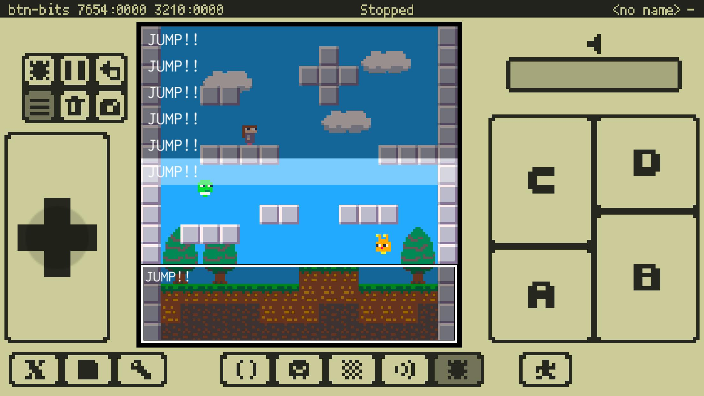

# プレスキット

###  レトロで小さなゲームをつくるアプリ「x8studio」配信中

〜気軽に楽しくプログラミングをはじめよう〜

---

## x8studioの特徴

### 架空のマシンとゲーム開発環境

「x8studio」（エックスエイトスタジオ）には小さな機能にデザインされた架空のマシン「x8」（エックスエイト）とそのゲーム開発環境が含まれています。x8の制限されたマシンスペックは誰でも気軽にゲーム開発やプログラミングを楽しめるように工夫されています。

### 小さな画面のスマートフォンを考慮したUI

タッチする手が被らないように下から順に配置されたボタンや、細かなポインティングを可能にするタッチカーソルなど、画面が小さなスマートフォンでも操作ができるように工夫されています。

### プログラミングの作成環境

Codeエディタを利用してプログラムを記述することができます。プログラミングにはアプリ独自の画面キーボードまたは外部キーボード入力を利用でき、簡単なコード補完もサポートしています。プログラミングに利用するLua言語はシンプルで覚えやすい言語仕様でありながら、いろいろなプログラミングの考え方（プログラミングパラダイム）をサポートし、かつ高速なスクリプト言語です。

### グラフィックスとサウンドの作成環境

GfxエディタやMapエディタを利用していわゆるスプライトやマップを作成できます。Sfxエディタを利用してレトロなチップチューン風のサウンドエフェクトを作成できます。専門知識がなくても波形、ピッチ、ボリュームなどをタッチで直感的に設定できます。
**Gfxエディタ、Mapエディタ、Sfxエディタの利用にはサブスクリプションが必要です。**

### ゲームのテストと実行環境

Debugモードでは開発用のログ出力やプログラムエラーを確認したり、エラーの場所へジャンプしたりすることもできます。出来上がったゲームは架空のマシンを模したRunモードでプレイできます。

### 同梱サンプル

サンプルとしてすぐに遊べる簡単なシューティングゲーム、アクションパズルゲーム、チュートリアル的なプロジェクトなどが同梱されています。

---

## アプリ概要

- 名称: x8studio
- 配信開始日: 2020年4月9日
- 価格: アプリは無料、サブスクリプションは最初の2週間無料で以降 200円／月
- 対応機種: iOS 12.0以降のiPhone、iPad、およびiPod touchに対応
- App Store: https://apps.apple.com/jp/app/id1483337008
- 公式サイト: https://takezoff.github.io/x8support/
- 紹介動画: https://youtu.be/5V8oF8Ywjwo

---

## お問い合わせ

- 開発者: Takezo
- Email: takezoff.com@gmail.com
- Twitter: https://twitter.com/takezoffcom

---

## アイコン

 アプリアイコン／1024x1024

 アプリアイコン／192x192

---

## スクリーンショット

")
")

