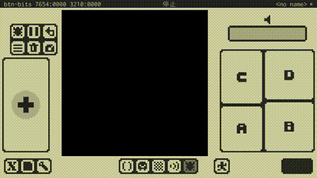
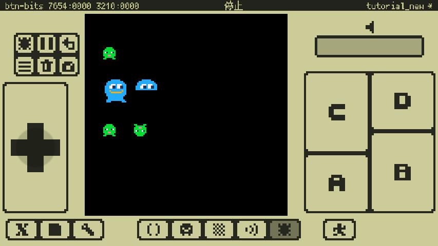
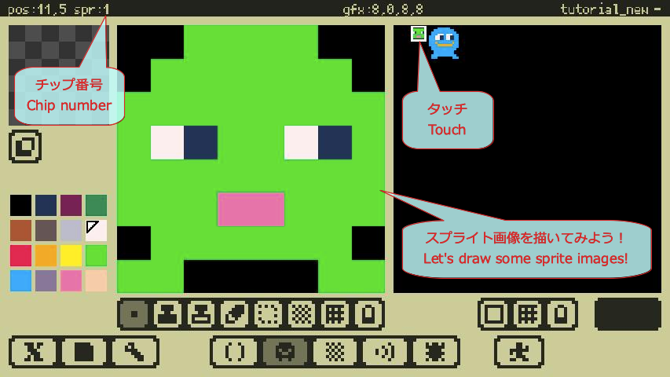
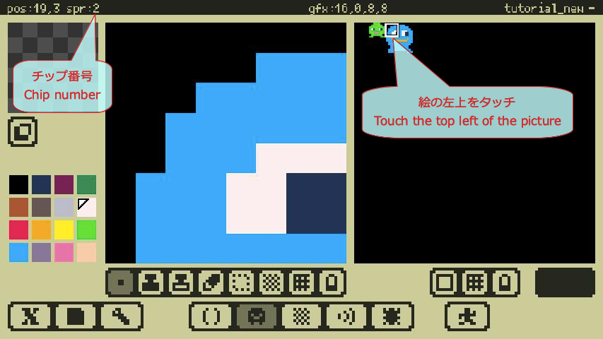
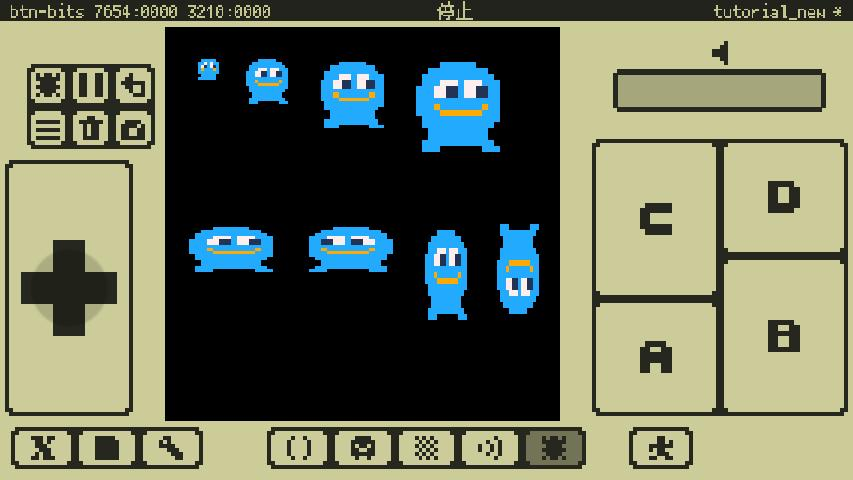
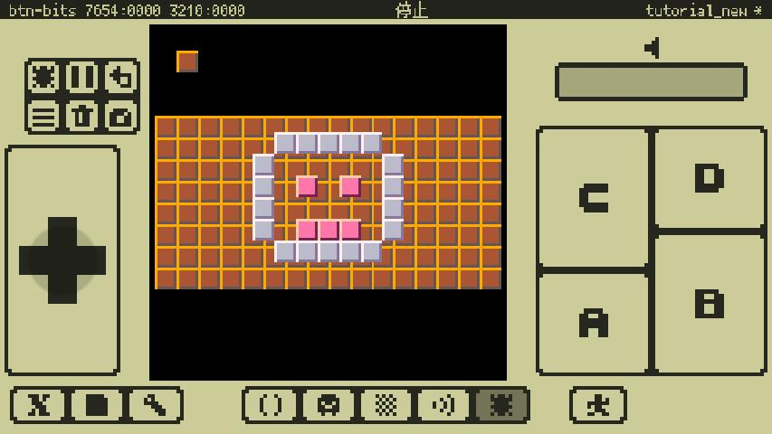
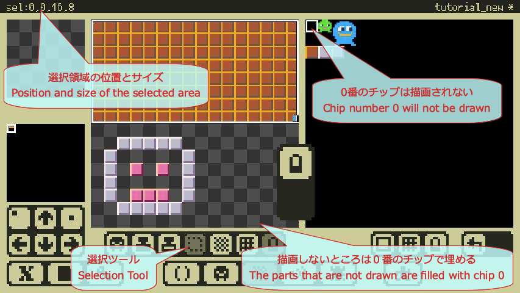

# Programming Tutorial

## In the beginning

- Programs can be written from **[Code editor](manual_en.md#Code_Editor)** using **[Lua language](manual_en.md#Lua_Materials)**.
- Please note that **only ASCII code (half-width alphanumeric symbols) and some characters (kana and special symbols)** are supported by the Code Editor.
- If you open this page on the device where the app is running, you can copy and paste the program code introduced below through the clipboard of the device. Pasting is done in the Code Editor **Cp from CB**.
- You can copy and paste the program code in **[Reference Project](manual_en.md#Project_Switch)** by loading the tutorial project.

---

## Hello World!


Let's try displaying the string on the screen.
```
x8.fnt("Hello World!",0,0)
```
- `fnt(..)` is an instruction (function) to display a string on the screen. (sometimes called API).
- `x8.` is a proprietary API of x8. To use x8 proprietary API, prefix it with `x8.`.
- The function passes the information (arguments) required for processing. The part enclosed by `"` is a string to be displayed, and the subsequent `0,0` indicates the coordinates (x,y) on the screen.

---

## Comment on the program

You can write notes (comments) in the program that are not interpreted as a program.
```
-- Comment @ｺﾒﾝﾄ

--[[
   This is
   all comments.
   @ｺﾚﾊ ｽﾍﾞﾃ ｺﾒﾝﾄ
]]

x8.fnt("Hello World!",0,0) -- Comments until the end of the line @ｷﾞｮｳﾏﾂﾏﾃﾞ ｺﾒﾝﾄ
```
- After the `--` and up to the end of the line is a comment. (end-of-line comment)
- Everything between `--[[` to `]]` is a comment. (Block comment).

---

## Draw figures


Try to draw figures on the screen.

```
-- Draw shapes on the screen. @ｶﾞﾒﾝﾆ ｽﾞｹｲｦ ﾋﾞｮｳｶﾞ

-- Draw a pixel. @ﾋﾟｸｾﾙｦ ﾋﾞｮｳｶﾞ
x8.pixel(30,20,7)

-- Draw a straight line. @ﾁｮｸｾﾝｦ ﾋﾞｮｳｶﾞ
x8.line(70,30,110,10,8)

-- Draw a filled rectangle. @ﾇﾘﾂﾌﾞｻﾚﾀ ｸｹｲｦ ﾋﾞｮｳｶﾞ
x8.rect(20,50,60,70,9)

-- Draw a rectangle. @ｸｹｲｦ ﾋﾞｮｳｶﾞ
x8.rectbdr(80,45,100,75,11)

-- Draw a filled circle. @ﾇﾘﾂﾌﾞｻﾚﾀ ｴﾝｦ ﾋﾞｮｳｶﾞ
x8.circ(40,100,10,12)

-- Draw a circle. @ｴﾝｦ ﾋﾞｮｳｶﾞ
x8.circbdr(90,100,15,13)
```
- `pixel()` draws a point on the screen.
- `line()` draws a line on the screen, specifying the starting point (x,y) and the ending point (x,y).
- `rectbdr()` draws a rectangle on the screen with the top-left(x,y) and bottom-right(x,y) rectangles.
- `rect()` draws a filled rectangle on the screen with top left(x,y) and bottom right(x,y) points.
- `circbdr()` draws a circle on the screen with the center (x,y) and the radius.
- `circ()` draws a circle filled with the center (x,y) and the radius.

---

## Create a main loop


Let's try to make a loop that goes around infinitely so that the program doesn't end.
This will be the main loop, which is common in games.
```
-- Main Loop @ﾒｲﾝﾙｰﾌﾟ

count = 0 -- Frame counter @ﾌﾚｰﾑｶｳﾝﾀ

-- Infinite loop @ﾑｹﾞﾝﾙｰﾌﾟ
while true do

   -- You must always call wait() in an infinite loop. @ﾑｹﾞﾝﾙｰﾌﾟﾅｲﾃﾞﾊ ｶﾅﾗｽﾞ wait() ｦ ﾖﾌﾞ
   x8.wait()

   -- Clean the screen. @ｶﾞﾒﾝｦ ｸﾘｱ
   x8.cls()

   -- Here is the processing in the frame. @ｺｺﾆ ﾌﾚｰﾑﾃﾞﾉ ｼｮﾘｦ ｷｼﾞｭﾂｼﾏｽ
   x8.fnt(count, 0, 0)
   count = count + 1

end
```
- Note that you must always call `wait()` in an infinite loop.
- If the `wait()` is not specified, the program stops in a certain time due to a timeout error.
- `cls()` erases all objects drawn on the screen.

---

## Draw a lot of shapes at random


Draw a lot of circles at random.

```
-- Draw a lot of circles. @ﾀｸｻﾝﾉ ｴﾝｦ ﾋﾞｮｳｶﾞ

-- Main loop. @ﾒｲﾝﾙｰﾌﾟ
while true do

   -- Wait for frame update. @ﾌﾚｰﾑｺｳｼﾝｦ ﾏﾂ
   x8.wait()

   -- Draw a circle at random. @ｴﾝｦ ﾗﾝﾀﾞﾑﾆ ﾋﾞｮｳｶﾞ
   x = math.random(128)
   y = math.random(128)
   r = math.random(20)
   c = math.random(15)
   x8.circ(x, y, r, c)

end
```
- `math.random(n)` returns a random number from 1 to n.

---

## Clear the screen


For each frame, Let's try to draw a figure after clearing the screen.

```
-- Clear the screen. @ｶﾞﾒﾝｦ ｸﾘｱｽﾙ

-- Main loop. @ﾒｲﾝﾙｰﾌﾟ
while true do

   -- Wait for 20 frames update. @20ﾌﾚｰﾑ ﾏﾂ
   x8.wait(20)

   -- Clear the screen. @ｶﾞﾒﾝｦ ｸﾘｱｽﾙ
   x8.cls()

   -- Draw a circle at random. @ﾗﾝﾀﾞﾑﾆ ｴﾝｦ ﾋﾞｮｳｶﾞ
   x = math.random(128)
   y = math.random(128)
   r = math.random(20)
   c = math.random(15)
   x8.circ(x, y, r, c)

end
```
- `cls()` erases all objects drawn on the screen.
- `wait(n)` waits for n frames here. The default n is 1.

---

## Move the figure


We will try to move the figure by changing the position of drawing the figure in each frame.
```
-- Move the circle. @ｴﾝｦ ｳｺﾞｶｽ

x = 20 -- x
v = 2  -- velocity @ｿｸﾄﾞ

-- Main loop. @ﾒｲﾝﾙｰﾌﾟ
while true do

   -- Wait for frame update. @ﾌﾚｰﾑｺｳｼﾝｦ ﾏﾂ
   x8.wait()

   -- Clear the screen. @ｶﾞﾒﾝｦ ｸﾘｱｽﾙ
   x8.cls()

   -- Draw the circle. @ｴﾝｦ ﾋﾞｮｳｶﾞ
   x8.circ(x, 50, 10, 3)

   -- Update the position of the circle. @ｴﾝﾉ ｻﾞﾋｮｳｦ ｺｳｼﾝ
   x = x + v

   -- Invert velocity at screen edge. @ｶﾞﾒﾝﾉﾊｼﾃﾞ ｿｸﾄﾞｦ ﾊﾝﾃﾝ
   if (x < 20) or (x > 100) then v = -v end

end
```
- Common animations are usually accomplished by changing the position and image slightly at each frame.

---

## Get the input of the buttons



Let's try to get the input of the button and display the status of the button.
```
-- Get button input. @ﾎﾞﾀﾝﾉ ﾆｭｳﾘｮｸｦ ｼｭﾄｸ

-- Main loop. @ﾒｲﾝﾙｰﾌﾟ
while true do

   -- Wait for frame update. @ﾌﾚｰﾑｺｳｼﾝｦ ﾏﾂ
   x8.wait()

   -- Clear the screen. @ｶﾞﾒﾝｦ ｸﾘｱｽﾙ
   x8.cls()

   -- Show button trigger status. @ﾎﾞﾀﾝﾉ ﾄﾘｶﾞｰﾉ ｼﾞｮｳﾀｲｦ ﾋｮｳｼﾞ
   x8.color(7)
   if x8.btntrg(0) then x8.rect(10-2, 50-2, 20+2, 60+2) end -- ←
   if x8.btntrg(1) then x8.rect(40-2, 50-2, 50+2, 60+2) end -- →
   if x8.btntrg(2) then x8.rect(25-2, 35-2, 35+2, 45+2) end -- ↑
   if x8.btntrg(3) then x8.rect(25-2, 65-2, 35+2, 75+2) end -- ↓
   if x8.btntrg(4) then x8.circ(95, 70, 6+2) end -- Ⓐ
   if x8.btntrg(5) then x8.circ(110,55, 6+2) end -- Ⓑ
   if x8.btntrg(6) then x8.circ(80, 55, 6+2) end -- Ⓒ
   if x8.btntrg(7) then x8.circ(95, 40, 6+2) end -- Ⓓ

   -- Draw buttons. @ﾎﾞﾀﾝｦ ﾋﾞｮｳｶﾞ
   x8.color(1)
   x8.rect(10, 50, 20, 60) -- ←
   x8.rect(40, 50, 50, 60) -- →
   x8.rect(25, 35, 35, 45) -- ↑
   x8.rect(25, 65, 35, 75) -- ↓
   x8.circ(95, 70, 6) -- Ⓐ
   x8.circ(110,55, 6) -- Ⓑ
   x8.circ(80, 55, 6) -- Ⓒ
   x8.circ(95, 40, 6) -- Ⓓ

   -- Show button press status. @ﾎﾞﾀﾝﾉ ｵｳｶﾉ ｼﾞｮｳﾀｲｦ ﾋｮｳｼﾞ
   x8.color(7)
   if x8.btnprs(0) then x8.rect(10+2, 50+2, 20-2, 60-2) end -- ←
   if x8.btnprs(1) then x8.rect(40+2, 50+2, 50-2, 60-2) end -- →
   if x8.btnprs(2) then x8.rect(25+2, 35+2, 35-2, 45-2) end -- ↑
   if x8.btnprs(3) then x8.rect(25+2, 65+2, 35-2, 75-2) end -- ↓
   if x8.btnprs(4) then x8.circ(95, 70, 6-2) end -- Ⓐ
   if x8.btnprs(5) then x8.circ(110,55, 6-2) end -- Ⓑ
   if x8.btnprs(6) then x8.circ(80, 55, 6-2) end -- Ⓒ
   if x8.btnprs(7) then x8.circ(95, 40, 6-2) end -- Ⓓ
end
```
- `btnprs(n)` returns `true` or `false` if the button number n is currently pressed.
- `btntrg(n)` returns `true` or `false` whether the button number n has been changed from unpressed to pressed in this frame.

---

## Control the figure with button input


Try to move the figure by entering buttons, changing the color and size of the figure.
```
-- Move circle with button input. @ﾎﾞﾀﾝﾆｭｳﾘｮｸﾃﾞ ｴﾝｦ ｳｺﾞｶｽ

x = 50 -- x
y = 50 -- y
r = 20 -- radius @ﾊﾝｹｲ
c = 7  -- color @ｶﾗｰ
v = 2  -- velocity @ｿｸﾄﾞ

-- Main loop. @ﾒｲﾝﾙｰﾌﾟ
while true do

   -- Wait for frame update. @ﾌﾚｰﾑｺｳｼﾝｦ ﾏﾂ
   x8.wait()

   -- Clear the screen. @ｶﾞﾒﾝｦ ｸﾘｱｽﾙ
   x8.cls()

   -- Move with direction buttons. @ﾎｳｺｳﾎﾞﾀﾝﾃﾞ ｲﾄﾞｳ
   if x8.btnprs(0) then x = x - v end -- ←
   if x8.btnprs(1) then x = x + v end -- →
   if x8.btnprs(2) then y = y - v end -- ↑
   if x8.btnprs(3) then y = y + v end -- ↓

   -- Change color and size with A and B button. @Aﾎﾞﾀﾝﾄ Bﾎﾞﾀﾝﾃﾞ ｲﾛﾄ ｻｲｽﾞｦ ｶｴﾙ
   if x8.btntrg(4) then c = math.random(15) end -- Ⓐ
   if x8.btntrg(5) then r = math.random(30) end -- Ⓑ

   -- Draw the circle @ｴﾝｦ ﾋﾞｮｳｶﾞ
   x8.circ(x, y, r, c)
end
```
- It will be a basic way to move your character around in the game.

---

## Show sprites



Let's try to show the sprite on the screen.

A sprite is an image of a Gfx chip (in 8x8 dot units) on the screen.
When you draw the picture you want to display as a sprite in the Gfx editor, touch the top left corner of the picture to memorize the chip number.




When you're ready, you can specify the chip number and display the sprite.
```
-- x8.spr(n,x,y[,w[,h,[,flpx[,flpy]]]])

-- Draw a 1x1 size chip. @1x1ｻｲｽﾞﾉ ﾁｯﾌﾟｦ ﾋﾞｮｳｶﾞｽﾙ
x8.spr(1, 10, 20)

-- Draw a 2x2 size chip. @2x2ｻｲｽﾞﾉ ﾁｯﾌﾟｦ ﾋﾞｮｳｶﾞｽﾙ
x8.spr(2, 10, 40, 2, 2)

-- Draw a 2x2 size chip with a 2x1 size. @2x2ｻｲｽﾞﾉ ﾁｯﾌﾟｦ 2x1ｻｲｽﾞﾃﾞ ﾋﾞｮｳｶﾞｽﾙ
x8.spr(2, 30, 40, 2, 1)

-- Flip left and right to draw. @ｻﾕｳﾊﾝﾃﾝｼﾃ ﾋﾞｮｳｶﾞｽﾙ
x8.spr(1, 10, 70, 1, 1, true)

-- Flip up and down to draw. @ｼﾞｮｳｹﾞﾊﾝﾃﾝｼﾃ ﾋﾞｮｳｶﾞｽﾙ
x8.spr(1, 30, 70, 1, 1, false, true)
```

- You can use `spr(n,x,y)` to display the `n` numbered chip on the screen at `x,y`. You can specify the display size in **chip units** with `w,h`, and flip left/right/upper/down with `flpx,flpy`.
- Sprites are the easiest way to describe characters, bullets, etc. in a game.

---

## Display Gfx images



Let's try to display the Gfx image on the screen.

Once you've drawn the picture you want to display in the Gfx editor, drag and select the image area to remember its position and size in Gfx.


When you are ready to display the image, specify the position and size in Gfx and try to display the image.
```
-- x8.gfx(gx,gy,gw,gh,x,y[,w[,h[,flpx[,flpy]]]])

-- Scaling and drawing Gfx images without changing the aspect ratio.
-- @Gfxｶﾞｿﾞｳｦ ﾀﾃﾖｺﾋｦ ｶｴｽﾞﾆ ｶｸｼｭｸｼﾃ ﾋﾞｮｳｶﾞｽﾙ
x8.gfx(16, 0, 16, 16,  8, 8,  8,  8) -- 8x8
x8.gfx(16, 0, 16, 16, 24, 8, 16, 16) -- 16x16
x8.gfx(16, 0, 16, 16, 48, 8, 24, 24) -- 24x24
x8.gfx(16, 0, 16, 16, 80, 8, 32, 32) -- 32x32

-- Flip and draw Gfx images in different aspect ratios.
-- @Gfxｶﾞｿﾞｳｦ ﾀﾃﾖｺﾋｦ ｶｴﾃ ﾊﾝﾃﾝｼﾃ ﾋﾞｮｳｶﾞｽﾙ
x8.gfx(16, 0, 16, 16,   4, 64, 32, 16) -- 32x16
x8.gfx(16, 0, 16, 16,  44, 64, 32, 16, true) -- 32x16,left-right reversal @ｻﾕｳﾊﾝﾃﾝ
x8.gfx(16, 0, 16, 16,  84, 64, 16, 32) -- 16x32
x8.gfx(16, 0, 16, 16, 108, 64, 16, 32, false, true) -- 16x32,upside down @ｼﾞｮｳｹﾞﾊﾝﾃﾝ
```

- `gfx(gx,gy,gw,gh,x,y)` can display a picture of position `gx,gy` and size `gw,gh` in Gfx at position `x,y` on the screen. You can specify the display size in **pixel units** with `w,h`, and flip left/right/upper/down with `flpx,flpy`.
- In Gfx, if you display a size that is not an integer multiple of the size or a size divided by an integer, the picture will be slightly distorted, but this is a specification.
- `gfx()` can be more elaborate than `spr()`.

---

## Show map



Let's see the map on the screen.

After creating the map you want to display in the Map Editor, remember the location and size of the map area by using the selection tool.



When you are ready, you can try to display the map by specifying the position and size in the map.
```
-- x8.map(mapx,mapy,x,y[,mapw[,maph]])

-- Draw one map chip. @ﾏｯﾌﾟﾁｯﾌﾟｦ ﾋﾄﾂ ﾋﾞｮｳｶﾞｽﾙ
x8.map(0, 0, 8, 8) -- 1x1

-- Draw back map first. @ｵｸﾉ ﾏｯﾌﾟｦ ｻｷﾆ ﾋﾞｮｳｶﾞｽﾙ
x8.map(0, 0, 0, 32, 16, 8) -- 16x8

-- Draw the map in front. @ﾃﾏｴﾉ ﾏｯﾌﾟｦ ﾋﾞｮｳｶﾞｽﾙ
x8.map(1, 9, 36, 38, 7, 6) -- 7x6
```

- A `map(mapx,mapy,x,y)` shows a chip at the position `mapx,mapy` in a map at the position `x,y` on the screen. You can specify the **size in chips** by `mapw,maph`.
- The **0 chip** (the chip in the upper left corner of the Gfx) functions as a chip that is not drawn (**no chip**). If you don't want to draw (and you want to make it transparent), you can fill in the area with the chip.
- If you want to overlay it, you can draw it from the map at the back.
- `map()` is a general method to display a wide range of pictures, such as a background image.

---


