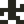
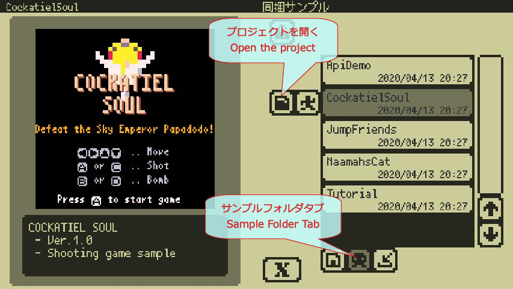
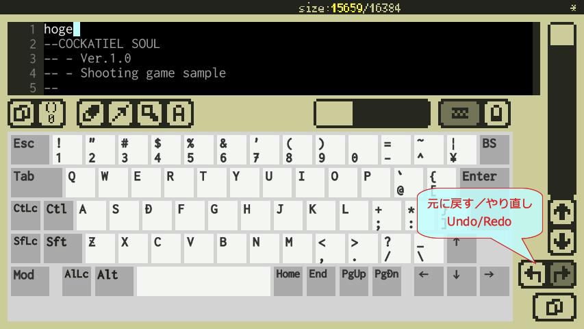
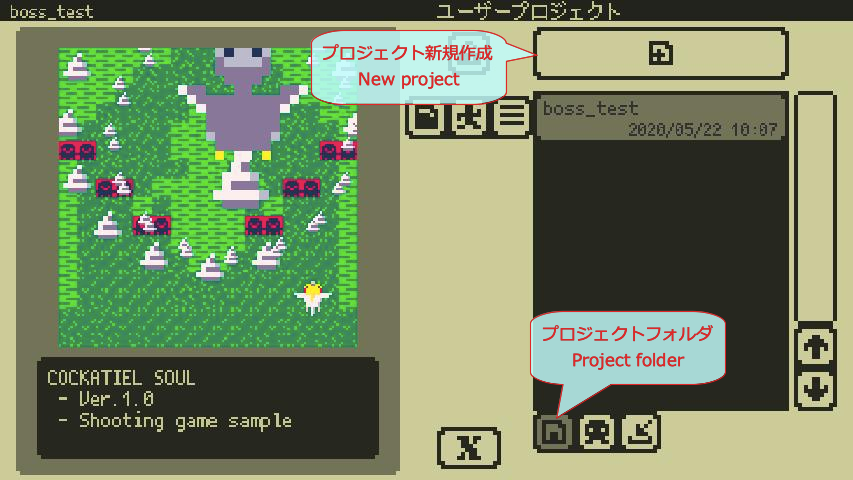
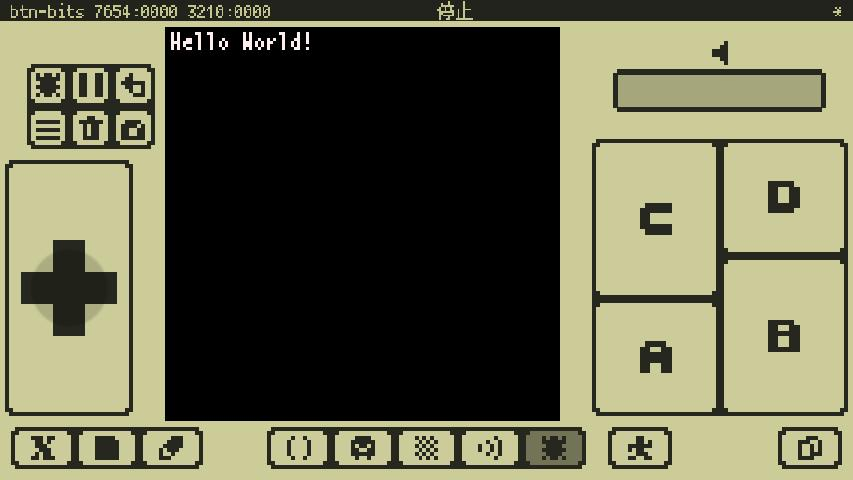

# クイックスタート

## 1.サンプルゲームを遊んでみよう

### Home画面

アプリを起動すると下のような[Home画面](manual.md#Home画面)が表示されます。
ここは同梱されているサンプルを開いたりユーザーが作ったファイルを管理したりできる画面です。

-  **サンプルフォルダ**タブを選択します。
- シューティングゲームのサンプル`CockatielSoul`を選びます。
-  **あそぶ**ボタンで**x8マシン**が起動してゲームが始まります。


### Runモード

- ゲームを遊ぶ[Runモード](manual.md#Runモード)です。画面の左右にあるゲームパッドボタンを操作してゲームを遊んでみてね。
-  **メニュー**ボタンで開くメニューの**終了**を選べばHome画面に戻れます。


#### **おめでとうございます！サンプルゲームで遊べるようになりました！**

---

## 2.サンプルゲームの中を見てみよう

サンプルゲームのプロジェクトの中身を覗いてみましょう。

### プロジェクトを開く

-  **サンプルフォルダ**タブを選択します。
- シューティングゲームのサンプル`CockatielSoul`を選びます。
-  **開く**ボタンでプロジェクトを開いてスタジオに遷移します。



### Codeエディタ

- プロジェクトを開くと最初に表示されるのが  **[Codeエディタ](manual.md#Codeエディタ)**です。このサンプルゲームのプログラムが書いてあります。画面右端のスクロールバーでスクロールして見てみましょう。


### 文字入力とUndo

-  **[画面キーボード](manual.md#画面キーボード)**ボタンでキーボードを出してなにか入力してみましょう。（[外部キーボード](manual.md#外部キーボード)にも対応しています。）
-  **Undo**（元に戻す）ボタンで今行った変更を元に戻せます。押し続けると可能な限りUndoし続けます。



### Gfxエディタ

-  **[Gfxエディタ](manual.md#Gfxエディタ)**を開いてみましょう。このサンプルゲームで使われているグラフィックス素材を見ることが出来ます。
- 右側のビューで見たい範囲をドラッグすると左側のビューに反映されます。ゲームで出てくるキャラクターたちの画像データを見られます。
- 画面が小さくて難しい場合は[タッチカーソル](manual.md#Studio共通のUIと操作)を出してボタンを押しながらドラッグすることで、細かい位置を正確にドラッグ出来ます。


### Mapエディタ

-  **[Mapエディタ](manual.md#Mapエディタ)**を開いてみましょう。このサンプルゲームで使われているマップデータを見ることが出来ます。
- **Map選択ビュー**をドラッグすると**エディットビュー**に反映されます。ゲームでスクロールする地形や敵の配置などのデータを見られます。


### Sfxエディタ

-  **[Sfxエディタ](manual.md#Sfxエディタ)**を開いてみましょう。このサンプルゲームで使われているサウンドデータを見られます。
-  **Sfx選択**で効果音を選ぶとその内容がエディタに表示されます。
-  **再生**ボタンと  **停止**ボタンで効果音を再生／停止出来ます。


### プロジェクトを閉じる

- ひととおり見終わったら画面左下の  **ファイルメニュー**から**閉じる**を選択します。プロジェクトを閉じてHome画面に戻ります。

#### **おめでとうございます！ゲームの中がどうなっているのか見られるようになりました！**

---

## 3.サンプルゲームを改造してみよう

サンプルゲームを改造して別名で保存してみましょう。

### プログラムの変更

- シューティングゲームのサンプル`CockatielSoul`を開き**Codeエディタ**に移動します。
-  **画面キーボード**を出し、カーソルキー（`←` `→` `↑` `↓`）で`10`行目に移動します。
- `TEST_BOSS`の`T`にカーソルを移動し、`BS`キーを何回か押して行頭まで削除します。間違えたら  **Undo**してやり直しましょう。
- 変更したらもう一度  をタップして**画面キーボード**を消します。


### Debugモード

-  **[Debugモード](manual.md#Debugモード)**に移動してプログラムを実行してみましょう。ここでは開発中のゲームをテスト出来ます。
-  **デバッグ実行**ボタンで実行を開始します。  **一時停止**ボタンで実行のポーズ／ポーズ解除ができます。
- ゲームをスタートするといきなりボス（大きな鳥）が出てくるようになりました。ボス戦からスタートするようプログラムに仕込まれた設定を有効にしたため、ゲームの動作が変わったことを確認出来ます。


### スクリーンショット

- 適当な場面で  **一時停止**します。
-  **スクリーンショット**ボタンを押すと[Home画面](manual.md#Home画面)用のスクリーンショットを設定でるウィンドウが開きますので、**設定**してウィンドウを閉じます。
- 設定したスクリーンショットは後ほどホーム画面で確認出来ます。


### 名前をつけて保存

- 改造したゲームに名前をつけて保存しましょう。画面左下の  **ファイルメニュー**を開き**名前を付けて保存...**を選択するとプロジェクトを保存するためのウィンドウが開きます。
-  **画面キーボード**で適当な名前を付けて`Enter`キーでファイルが保存されます。ここでは`boss_test`としています。ファイル名に使える文字数と文字種には制限があります。拡張子も付けられません。
- ゲームを保存したらプロジェクトを閉じてHome画面に戻ります。


### プロジェクトフォルダ

- ユーザーが作成したプロジェクトファイルは  **プロジェクトフォルダ**に保存されます。先程の`boss_test`が保存され、スクリーンショットも反映されているのが確認出来ます。


#### **おめでとうございます！サンプルを改造して別のプロジェクトとして保存出来るようになりました！**

---

## 4.新しいプロジェクトを作成してプログラムを書いてみよう

プロジェクトを新規作成してプログラミングを始めてみましょう。

### プロジェクト新規作成

- **Home画面**の  **プロジェクト新規作成**ボタンで空のプロジェクトを新規に作成します。



### プログラムを書く

- **Codeエディタ**で  **[画面キーボード](manual.md#画面キーボード)**を出して以下のように入力します。（[外部キーボード](manual.md#外部キーボード)にも対応しています。）
```
x8.fnt("Hello World!",0,0)
```
- 文字を入力していると**[補完ポップアップ](manual.md#Codeエディタ)**が出てきますが、今は気にせず入力を続けましょう。


### プログラムを実行する

- **Debugモード**に移動し  **デバッグ実行**してみます。プログラムが正しければマシン画面の左上に`Hello World!`と表示されます。
- うまく表示されない場合は**Codeエディタ**に戻ってプログラムが正しく入力されているか確認して下さい。



#### **おめでとうございます！x8マシンのプログラミングに成功しました！**

- この初めてのプロジェクトを取っておきたい場合は  **ファイルメニュー**の**保存**でプロジェクトを保存しましょう。最初に保存する際はファイル名を入力するウィンドウが開きます。

### もう少しやってみる

- **Codeエディタ**に戻って先程入力したプログラムの下に以下を追加します。
```
x8.circ(40,40,10,9)
```


- 再び**Debugモード**に移動して実行してみます。プログラムが正しければ`Hello World!`に加えて**オレンジ色の円**も表示されます。
- うまく表示されない場合は**Codeエディタ**に戻ってプログラムが正しく入力されているか確認して下さい。


#### **おめでとうございます！プログラムにより画面に図形を描けるようになりました！**

---

## 5.全ての機能を利用するには...

初期状態ではプログラミング以外のエディタ機能がロックされていて編集出来ません。

- Home画面の  **購入ウィンドウ**からサブスクリプション**「全機能アンロック」**を購入すると以下のような全ての機能が利用可能になります！
    - Gfxエディタ、Mapエディタによるゲームのグラフィックス作成機能
    - Sfxエディタによるゲームの効果音作成機能
    - その他、将来のアップデートで追加される機能など
- 購入についての詳しい説明は**購入ウィンドウ**の**ヘルプ**をご確認下さい。
- **Codeエディタによるプログラミング機能は無料のままご利用いただけます！**

---

## 6.このあとは...

#### **おめでとうございます！ゲームを作る準備が出来ました！このあとは...**

- このままプログラミングのチュートリアルを進めたい方は[プログラミングチュートリアル](programming_tutorial.md)へどうぞ。
- x8studioの詳しい使い方を知りたい方は[マニュアル](manual.md)へどうぞ。
- x8独自のAPIについて詳しく知りたい方は[APIリファレンス](api_reference.md)へどうぞ。

#### **ゲームプログラミングの楽しさを少しでも知ってもらえたら嬉しいです！**
