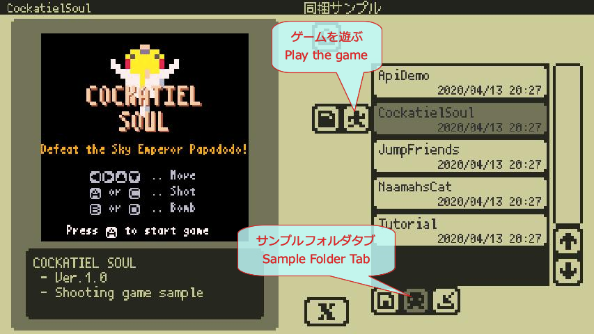
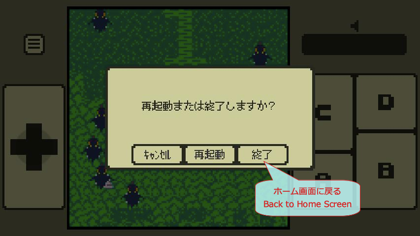
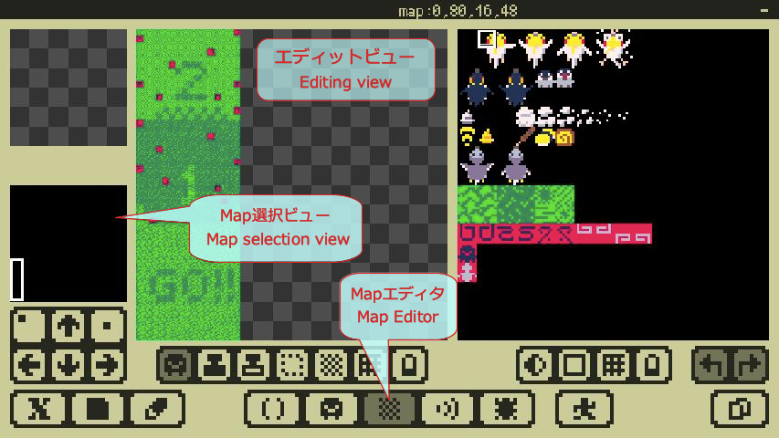
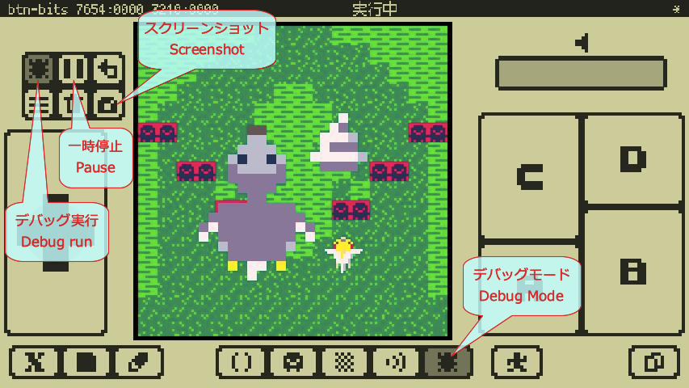
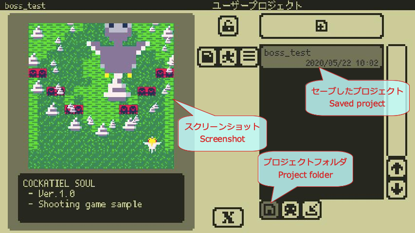
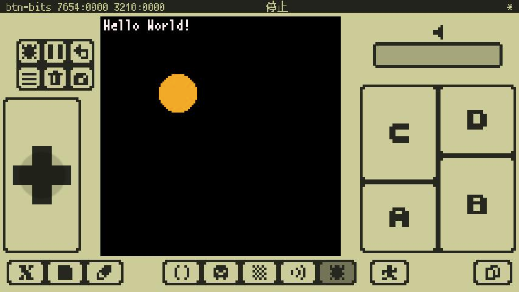

# Quick Start

## 1. Let's play a sample game

### Home Screen

When you launch the app, the [Home Screen](manual_en.md#Home Screen) will be displayed as shown below.
This is the screen where you can open the bundled samples and manage user-generated files.

-  **Select the sample folder** tab.
- Pick a sample `CockatielSoul` of the shooter game.
-  **Play** button will start **x8 machine** and the game will start.



### Run Mode

- Play the game [Run Mode](manual_en.md#Run_Mode). Try playing the game using the gamepad buttons on the left and right of the screen.
-  You can go back to the Home screen by selecting **Exit** in the menu that opens by clicking the **menu** button.




#### **Congratulations! You can now play the sample game!**

---

## 2. Let's take a look inside the sample game

Let's take a peek inside a sample game project.

### Open the Project

-  **Select the sample folder** tab.
- Pick a sample `CockatielSoul` of the shooter game.
-  **Open** button to open the project and transition to the studio.


### Code Editor

- The first thing you see when you open the project is  **[Code Editor](manual_en.md#Code_Editor)**. Here's the program for this sample game. Scroll through the scroll bar on the far right side of the screen to see what's going on.


### Character Input and Undo

-  **[Screen Keyboard](manual_en.md#Screen_Keyboard)** button to open the keyboard and type something. ([External Keyboard](manual_en.md#External_Keyboard) is also supported.)
-  **Undo** (Undo) button will undo the changes you just made. Press and hold to keep Undoing as long as possible.


### Gfx Editor

- Let's open  **[Gfx Editor](manual_en.md#Gfx_Editor)**. You can see the graphics material used in this sample game.
- If you drag the area you want to see in the right view, it will be reflected in the left view. You can see the image data of the characters that appear in the game.
- If the screen is too small and difficult, you can drag with  [Touch Cursor](manual_en.md#Studio_Common_UI_and_Operations) and push the button to move the cursor precisely.


### Map Editor

- Let's open  **[Map Editor](manual_en.md#Map_Editor)**. You can see the map data used in this sample game.
- If you drag **Map Selection View**, it will be reflected in **Edit View**. You'll be able to see data such as terrain and enemy placement as you scroll through the game.



### Sfx Editor

- Let's open  **[Sfx Editor](manual_en.md#Sfx_Editor)**. You can see the sound data used in this sample game.
- If you select a sound effect with  **Sfx selection**, the content will be displayed in the editor.
- You can play/stop the sound effect by  **play** button and  **stop** button.


### Close the Project

- When you have finished viewing the file, select **Close** from the  **file menu**. Close the project and return to the Home screen.

#### **Congratulations! Now you can see what's going on in the game!**

---

## 3. Let's modify the sample game

Let's modify the sample game and save it under a different name.

### Changes to the Program

- Open the shooting game sample `CockatielSoul` and go to the **Code editor**.
- Put out the  **screen keyboard** and use the cursor keys (`←` `→` `↑` `↓`) to move to the `10` line.
- Move the cursor to the `T` of `TEST_BOSS` and press the `BS` key several times to delete it at the beginning of the line. If you make a mistake,  **Undo** and start over.
- Tap  again to remove the **screen keyboard**.


### Debug Mode

- Let's go to  **[Debug mode](manual_en.md#Debug_Mode)** and run the program. This is where you can test the game you are developing.
-  **Debug Run** button to start execution.  **Pause** button allows you to pause/unpause the execution.
- As soon as you start the game, the boss (the big bird) starts to appear. You can confirm that the game behavior has changed because You enabled a setting that was programmed to start with a boss fight.



### Screenshot

- In an appropriate scene  **Pause**.
-  **Screenshot** button opens a window where you can set up a screenshot for [Home Screen](manual_en.md#Home_Screen), **Set** and close the window.
- You can check the screenshot later on the home screen.


### Save As

- Save your modded game with a name. Open the  **file menu** and select **Save As...** to open a window to save the project.
- Name the file with  **screen keyboard** and press `Enter` key to save the file. In this case, we use `boss_test`. There is a limit to the number of characters and character types that can be used in a file name. You can't even add an extension.
- Once the game is saved, close the project and return to the Home screen.


### Project Folder

- User-created project files are saved in the  **project folder**. You can see that the `boss_test` is saved and the screenshot is also reflected.



#### **Congratulations! Now You can modify the sample and save it as a separate project!**

---

## 4. Create a new project and write a program

Start programming by creating a new project.

### New Project Creation

- On the **Home Screen**, select the  **Project Folder** tab.
-  **New Project** button to create a new, empty project.


### Write a Program

- In **Code editor**, extract  **[Screen Keyboard](manual_en.md#Screen_Keyboard)** and enter the following ([External Keyboard](manual_en.md#External_Keyboard) is also supported.)
```
x8.fnt("Hello World!",0,0)
```
- When you are typing characters, **[Completion Popup](manual_en.md#Code_Editor)** will appear, but don't worry about that for now, just keep typing.


### Execute the Program

- **Go to debug mode** and  **Run debug**. If the program is correct, you will see `Hello World!`.
- If this doesn't work, please go back to the **Code editor** and make sure that the program is entered correctly.


#### **Congratulations on successfully programming the x8 machine!**

- If you want to save this first project, use **Save** in the  **file menu** to save the project. The first time you save the file, a window will open where you can enter a file name.

### I'll Try a Little More

- Go back to the **Code editor** and add the following to the program you just typed
```
x8.circ(40,40,10,9)
```


- Go to **Debug mode** again and try to run it. If the program is correct, you will see a **orange circle** in addition to the `Hello World!`.
- If this doesn't work, please go back to the **Code editor** and make sure that the program is entered correctly.



#### **Congratulations! You can now program and draw shapes on the screen!**

---

## 5. How to use all the features...

By default, all editor functions except for programming are locked and cannot be edited.

- From the  **purchase window** on the Home screen, **"Unlock All Features"** Purchasing a subscription will enable all of the following features!
    - Ability to create game graphics using the Gfx and Map editors
    - Game sound effects creation using the Sfx editor.
    - Other features to be added in future updates, etc.
- Please see the **Help** in the **Purchase Window** for detailed instructions on how to purchase.
- **Programming with the Code Editor is still available for free!**

---

## 6. After this...

#### **Congratulations! You're ready to make a game! After this...**

- If you want to continue with the programming tutorial, go to [Programming Tutorial](programming_tutorial_en.md).
- If you want to know more about how to use x8studio, go to [Manual](manual_en.md).
- If you want to learn more about x8's unique API, please visit [API Reference](api_reference_en.md).

#### **I'd love it if you could get to know a little bit about the fun of game programming!**
