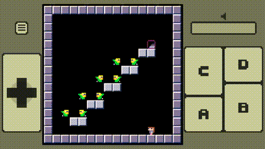
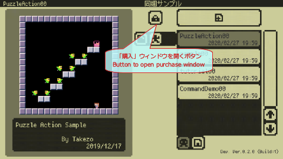
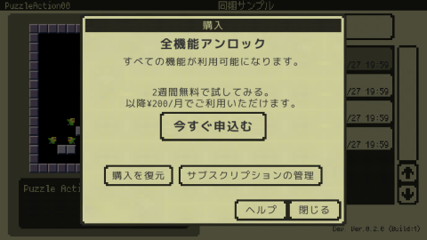

#  オープンβテストのお知らせ

## オープンβテストです！
ご意見ご感想などいただけたらとても嬉しいです！もちろん気軽に遊んでいただくだけでも大歓迎です！

---

## 必要なプラットフォーム
iOS 12.0以降のiPhone、iPadが必要です。

---

## 実施概要

### 実施期間

2020年2月28日(金) 〜 未定

### 参加人数

- 最初はごく少人数で初めて様子を見ながら少しづつ増やしていく予定です。
- 参加人数が上限に達した場合はテストにご参加いただけません、予めご了承ください。

### オープンβテストに関する情報

- 参加人数の変更などオープンβテストに関する情報は随時[Twitter](https://twitter.com/takezoffcom)にてご連絡いたします。

---

## 参加手順

- テストに利用する端末のブラウザで[こちら](https://testflight.apple.com/join/LjPgHgJi)の案内ページに移動してください。
- テストには「TestFlight」アプリを利用します。まだインストールされていない場合は案内ページの説明に従ってインストールしてください。
- 案内ページの説明にしたがって「x8studio」のテストを開始して下さい。
- 「x8studio」アプリがインストールされましたら、以降は「x8studio」アプリを直接起動できます。

---

## 全機能アンロック

x8studioでは自動更新サブスクリプションを採用予定です。
全ての機能を利用するには、「購入」ウィンドウで「全機能アンロック」サブスクリプションの購入手続きを行う必要があります。
**※TestFlightでのテスト期間中は、App内課金はすべて無料です**

無料の機能及び、有料の機能の詳細については、「購入」ウィンドウの「ヘルプ」ボタンで表示される「x8studioでの購入について」で確認できます。

---

## 注意事項

下記の注意事項をご理解頂いた上で、オープンβテストにご参加頂きますようお願いいたします。

- **オープンβテストで作成されたプロジェクトファイルは、製品版には引き継がれません。**
- **TestFlightでのテスト期間中は、App内課金はすべて無料です。**
- **TestFlightでのApp内課金はベータテスト中のみ無料です。テスト中に購入したApp内課金は、App Storeバージョンには引き継がれません。**
- オープンβテストの実施に伴う通信料などは、参加者のご負担となります。
- オープンβテストの参加人数や実施期間は、予告なく変更、中止させて頂く場合がございます。
- オープンβテストでは、予告なく仕様などが調整される場合がございます。
- オープンβテストの参加によって生じた一切の損害、損失、不利益などに関し、当方はいかなる責任も負いません。
- 個人情報の取り扱いにつきましては、[プライバシーポリシー](PrivacyPolicy.md)をご確認ください。

