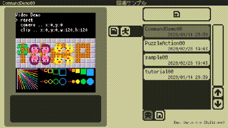

#  オープンβテストのお知らせ（2020/03/02）

## 現在オープンβテストを実施中です
どなたでもご参加いただけます！ご意見ご感想などいただけたらとても嬉しいです！もちろん気軽に遊んでいただくだけでも大歓迎です！

---

## 必要なプラットフォーム

- iOS 12.0以降のiPhone、iPadが必要です。

---

## 対応言語

- 日本語と英語に対応しています。

---

## 実施概要

### 実施期間

- 2020年2月28日(金) 〜 未定

### オープンβテストに関する情報

- オープンβテストに関する情報は随時[Twitter](https://twitter.com/takezoffcom)にてご連絡いたします。

---

## 参加手順

- テストに利用する端末のブラウザで[こちら](https://testflight.apple.com/join/LjPgHgJi)の案内ページに移動してください。
- テストには「TestFlight」アプリを利用します。まだインストールされていない場合は案内ページの説明に従ってインストールしてください。
- 案内ページの説明にしたがって「x8studio」のテストを開始して下さい。
- 「x8studio」アプリがインストールされましたら、以降は「x8studio」アプリを直接起動できます。

---

## 注意事項

下記の注意事項をご理解頂いた上で、オープンβテストにご参加頂きますようお願いいたします。

- **オープンβテストで作成されたプロジェクトファイルは、製品版には引き継がれません。**
- **オープンβテストでは、ゲーム内課金のテストは行いません。**
- オープンβテストの参加人数や実施期間は、予告なく変更、中止させて頂く場合がございます。
- オープンβテストでは、予告なく仕様などが調整される場合がございます。
- オープンβテストの参加によって生じた一切の損害、損失、不利益などに関し、当方はいかなる責任も負いません。
- 個人情報の取り扱いにつきましては、[プライバシーポリシー](PrivacyPolicy.md)をご確認ください。

