# チュートリアル #01

## はじめに

このチュートリアルでは、シンプルなブロック崩しを題材に、x8studioでのLuaプログラミングについて説明します。プログラミングが初めての方でも大丈夫！！

[B.BREAKER]()

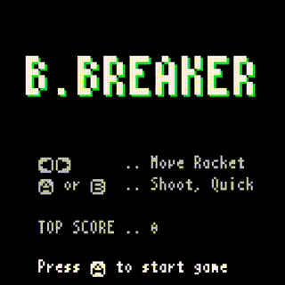

プログラミング自体が初めての方も進めていけるように、厳密で網羅的であるよりも、わかりやすく最小限であることを心がけました。

---

## プログラムの作成と実行

### プロジェクト作成

まずはプロジェクトが無いと何も始まらないので作ります。Home画面でプロジェクトフォルダを選択します。すると**プロジェクト新規作成**ボタンが表示されるので、これを押すと新しいプロジェクトが開きます。

### 実行と確認

プログラムは[Codeエディタ]()で書きます。プログラムを実際に書いたものを**ソースコード**とか**コード**とか言ったりします。まだコードは空っぽですが、試しに実行してみましょう。

[Debugモード]()に行って**Debug実行**すると…何も起きません。**ログビュー**を表示すると実行時のエラーや結果が見られるので見てみます。

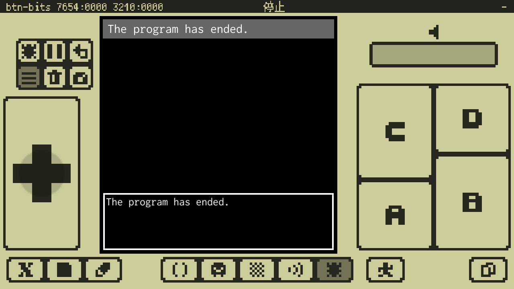

これは「プログラムは正常に終了した」という意味です。OKです。

Codeエディタに戻って下のコードを書いてみましょう。

```
x8.fnt("Hello World!",40)
```

外部キーボードが接続されていれば、そのままキー入力出来ます。外部キーボードが無ければ、**画面キーボード**を使います。

Hint: 外部キーボードをお持ちであれば、是非ご利用ください。プログラミングがとても楽になります。また、このページをx8studioが起動している端末で開いているなら、コードを直接コピーして、**CBからペースト**で貼り付けられます。

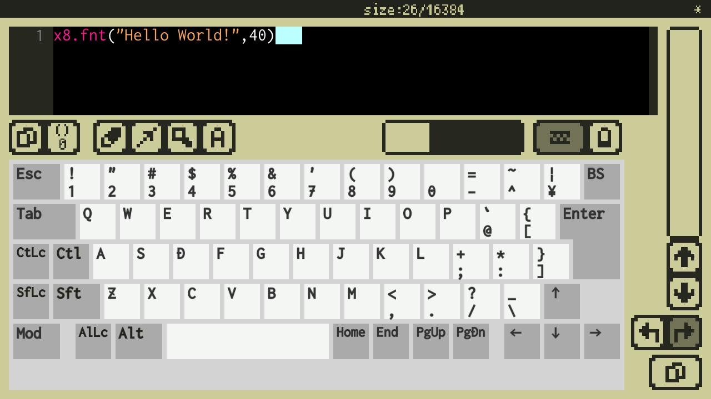

文字を入力していると**補完ポップアップ**が出てきます。目的のワードが出たら`Enter`キーで確定してもいいし、無視してキー入力を続けても大丈夫です。補完中に`Tab`または`Shift+Tab`で候補を切り替えられます。

コードが書けたらDebugモードに移動して実行してみましょう。先程のコードが正確に入力されていれば…何も起きません。

ログビューを見るとなにかエラーが出ています。ログビューの下の方にあるログ詳細ビューをタッチして、ログ詳細ウィンドウを開きます。

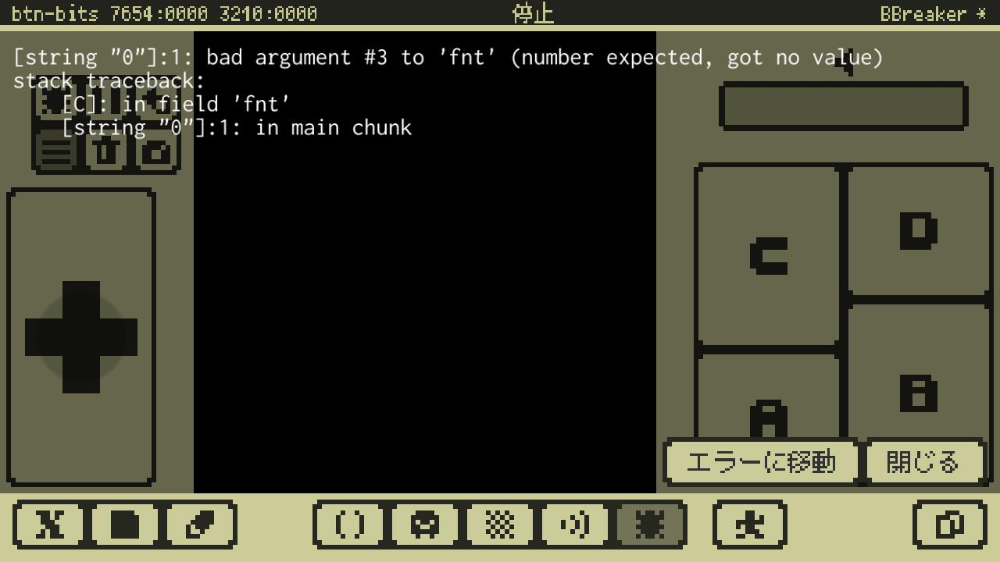

ここにはエラーの起こった場所や理由が書いてあります。今は気にせず**エラーに移動**ボタンを押して、Codeエディタのエラーが起きた行に移動します。

コードを修正します。実はさっきのコードは、最後の方に`,60`が足りませんでした。正しくは、

```
x8.fnt("Hello World!",40,60)
```

です（ごめんなさい、今度は本当です）。修正したら改めてDebugモードで確認します。


うまく行けばマシンの画面中央付近に`Hello World!`と表示され、プログラムも正常に終了していることがわかります。

念のためプロジェクトを[セーブ](quick_start.md#名前をつけて保存)しておきましょう。

プログラムの作成と実行についての説明はおしまいです。次行きましょー！！

---

## 今回のゲームについて

今回説明するゲーム[B.BREAKER]()を[参照読み込み]()で開いて、少し遊んでみましょう。

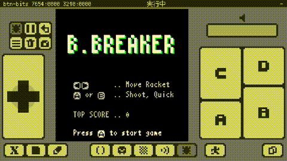

これはシンプルなブロック崩しゲームです。ゲームの仕様はだいたいこんな感じです。

- タイトルシーン、プレイシーン、ゲームオーバーシーンの3つのシーンがある。
- タイトルシーン
    - ゲームタイトル、操作説明、トップスコアを表示する。
    - `Ⓐ`が押されたらプレイシーンへ移る。
- プレイシーン
    - `Ⓐ`または`Ⓑ`が押されたらボールを発射してプレイを開始する。
    - `←`または`→`でラケットを移動する。このとき`Ⓐ`または`Ⓑ`を押していると移動が速くなる。
    - ラケットでボールを打ち返せる。ラケットに当たる位置でボールの跳ね返る方向が変わる。
    - ブロックはボールをぶつけて破壊できる。ブロックを1つ破壊するとスコアが1増える。3種類の硬さの違うブロックがある。
    - 全てのブロックを破壊するとステージクリア。クリアするとブロックは元に戻るが、スコアは継続される。
    - 最初にボールを3つ持っている。ボールが画面下に行ったらミスとなりボールが1つ減る。ボールが無くなったらゲームオーバーシーンに移る。
- ゲームオーバーシーン
    - ゲームオーバーのメッセージを表示して一定時間経ったらタイトルシーンに移る。

コードは全部で300行くらいです。長いようですが順番にゆっくり見てけば大丈夫です。次行きましょー！！

---

## タイトル表示とプログラムの基礎

以前入力したコードがあれば消してから、以下のコードを入力して実行してみましょう。

```
x8.fntscale(3, 3)
title = "B.BREAKER"
tw = x8.fntmeas(title)
x8.fnt(title, (128 - tw) * 0.5 + 1, 24 + 1, 11) -- Shadow
x8.fnt(title, (128 - tw) * 0.5, 24, 7)
```

Note: 括弧（`()`、`[]`、`{}`）や引用符（`'`、`"`）は、行をまたぐこともありますが、開始と終了で必ず対になります。これらの対応が取れているか確認することが重要です。

うまくいくと、こうなります。

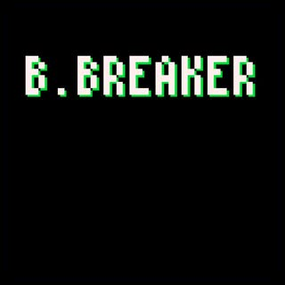

### プログラムの流れ

このコードにはターゲットマシン（この場合はx8マシン）にやって欲しいことが、やって欲しい順に書いてあります。意味は行ごとにこんな感じです。

1. 文字表示の大きさを、縦横3倍に設定する
1. 文字列`"B.BREAKER"`を、変数`title`に入れる
1. `title`の横幅を、変数`tw`に入れる
1. x位置:`(128 - tw) * 0.5 + 1`、y位置:`24 + 1`、色番号:`11`の設定で、`title`を画面に文字として表示する
1. x位置:`(128 - tw) * 0.5`、 y位置:`24`、色番号:`7`の設定で、`title`を画面に文字として表示する

この場合、1行がプログラムの**文**という単位です。実行させたい順番に文を並べたものがプログラムです。
文は先頭から順番に実行されます。縦に並べて書けば上から下へ、横に並べて書けば左から右へ実行されます。文が無くなったらそこでプログラムは終了します。
読みやすいように文は1文づつ縦に並べて書きましょう。

### Lua言語とx8独自API

コードはLua言語で書きます。でも、Lua言語だけでは画面に絵を描いたり、音を鳴らしたり、パッドの入力を取得したりすることは出来ません。このようなx8マシン固有の機能を利用するために、x8独自の方法（API）が用意されています。
`x8.`で始まる部分がx8独自API（以降API）で、`.x8.name(..)`のような形をしています。これは後で説明する**関数**というもので、APIにはx8マシンを利用するためのいろいろな名前（`name`の部分）の関数が用意されています。

### コメント

4行目のこの部分`-- Shadow`は**コメント**と呼ばれる単なるメモ書きです。`--`から行末までがコメントになり、プログラムとしては解釈されず無視されます。
複数行に渡ってコメントにしたい場合は、`--[[`と`]]`で囲みます。タイトル表示のコードはしばらく使わないので、全てコメントにしておきます。コードをコメントにして無効にすることを**コメントアウト**と言います。


```
--[[
x8.fntscale(3, 3)
title = "B.BREAKER"
tw = x8.fntmeas(title)
x8.fnt(title, (128 - tw) * 0.5 + 1, 24 + 1, 11) -- Shadow
x8.fnt(title, (128 - tw) * 0.5, 24, 7)
]]
```


何も起こらなくなりました。OKです。

### 文字列の表示と関数呼び出し

以下のコードを見てください。

```
x8.fnt("hoge piyo", 40, 60, 9)
```

実行するとこうなります。


`fnt`は画面に**文字列**を表示するAPIの**関数**です。API関数には必ず頭に`x8.`を付けます。

文字列とは`p`とか`3`とか`+`とかの**文字**を並べたもので、スペースも文字です。何文字でもよく、0文字でも大丈夫です。そのまま書くとどこからどこまでが文字列なのか分からないので、これ`"`かこれ`'`の対で囲んで書きます。この場合`hoge piyo`が文字列です。

関数とは、ひとまとまりのコードのことで、普通は`fnt`のように名前が付いています。API関数は最初から用意されていて、中身を見ることは出来ません。
関数名に`()`を付けて書くと関数を**呼び出す**ことができ、関数内に書かれたコードに制御が移ります（実行されます）。関数内のコードが終了すると制御が呼び出し元に戻ってきます。
関数は呼び出されるときに、**引数**を受け取る場合があります。引数は`()`の内側にカンマ`,`区切りで書きます。`fnt`は`fnt(str,x,y,col)`という形で呼び出すことができ、`str`が表示する文字列、`x,y`が**表示位置**のx,y座標、`col`が表示の**色番号**です。色番号は省略出来ます。

表示位置を指定する時は、`x,y`の座標で指定します。横がx軸、縦がy軸、画面サイズは128x128なので、画面左上端が`0,0`、右下端が`127,127`です。

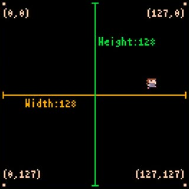

コードで色を指定する時は、0から15までの色番号で指定します。初期状態では0番は透明です。

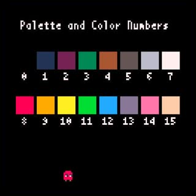

結局このコードは、「API関数`fnt`を呼ぶことで、文字列`hoge piyo`を、画面座標`40,60`に、`9`番の色で表示する」という意味になります。

### 戻り値と変数と代入とログ

以下のコードを見てください。

```
text = "hoge piyo"
w, h = x8.fntmeas(text)
x8.log("x:"..w..",".."h:"..h)
```

実行するとこうなります。画面には何も表示されませんが、ログビューになにか表示されています。

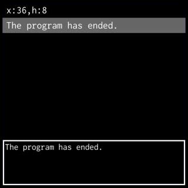

コードの1行目は**変数**`text`に文字列`"hoge piyo"`を`=`で**代入**しています。

**変数**とは**値**を入れておく場所のことで、好きな名前を付けられます。ただし、使える文字は、アルファベット、数字、`_`だけで、数字で始まってはいけません。

**値**には、数値、文字列、関数などいくつかの種類（**型**）があります。コードの中で、値が特定の型でないといけない場合もありますが、可能な限り自動で変換してくれます。

**代入**とは変数に値を入れることで、`=`を挟んで左側の変数に右側の値を入れます。左側も右側もカンマ`,`区切りでいくつも指定できます。

コードの2行目は`w,h`にAPI関数`x8.fntmeas(text)`の**戻り値**を代入しています。

**戻り値**とは関数呼び出しから戻るとき関数が返す値のことで、関数によって何をいくつ返すか（または何も返さないか）が決まっています。関数呼び出しから戻ると、呼び出し部分は、その戻り値に置き換わります。

`x8.fntmeas`は、文字列の表示サイズを戻り値として返す関数です。サイズは幅、高さの2つの値で返されます。この場合、`"hoge piyo"`の表示幅が`w`に、表示高さが`h`に代入されます。

コードの3行目は**ログ**出力を行っています。

**ログ**は、ログビューで確認できるテキストのことです。`x8.log`は、文字列をログ出力する関数で、実行中のあるタイミングで変数の中身を見たいときなど、ちょっとなにかを確認したい時などに便利な関数です。

`..`は、その左右の文字列を連結する事ができ、`"x:"..w`は`x:`の直後に表示幅（を文字列に変換したもの）を連結した文字列になります。

結局このコードは、「`hoge piyo`の幅と高さを`x:幅,h:高さ`の形でログに出力する」という意味になります。

### タイトル表示は何をしている？

タイトル表示のコードを読む準備が整いました。コメントにしていたタイトル表示のコードを元に戻しましょう。

```
x8.fntscale(3, 3)
title = "B.BREAKER"
tw = x8.fntmeas(title)
x8.fnt(title, (128 - tw) * 0.5 + 1, 24 + 1, 11) -- Shadow
x8.fnt(title, (128 - tw) * 0.5, 24, 7)
```

以前触れた行ごとの意味をもう一度見てみましょう。

1. 文字表示の大きさを、縦横3倍に設定する
1. 文字列`"B.BREAKER"`を、変数`title`に入れる
1. `title`の横幅を、変数`tw`に入れる
1. x位置:`(128 - tw) * 0.5 + 1`、y位置:`24 + 1`、色番号:`11`の設定で、`title`を画面に文字として表示する
1. x位置:`(128 - tw) * 0.5`、 y位置:`24`、色番号:`7`の設定で、`title`を画面に文字として表示する

1行目の`x8.fntscale(3, 3)`は文字表示の大きさを、縦の倍率、横の倍率で指定するAPI関数です。引数を省略した場合はもとの大きさ（縦横1倍）に戻されます。

2行目はもうでてきました。変数に文字列を代入しているだけです。

3行目もでてきましたが、戻り値が2つなのに変数は1つです。この場合、最初の戻り値（幅）が`tw`に入り、2番目の戻り値は捨てられます。

4行目は後回しにします..

5行目は`title`を文字として表示しています。`fnt`にx座標を渡す引数のところに**計算式**が書いてあります。このように値を書く代わりに計算式を書くことも出来ます。`+`、`-`、`(`、`)`は普通の算数の記号と同じ意味で、`*`は乗算です。ここでは文字列の横位置が画面の中央にくるよなx座標を計算しています。

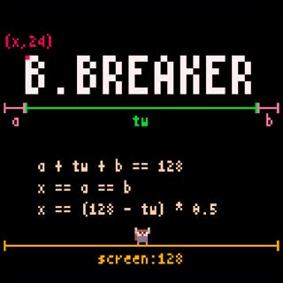

4行目は、5行目で表示する文字列に対して、右と下の影の部分を**描画**しています。予め色違いの同じ文字列を、右に`+1`、下に`+1`ずらして描いておくことで、後で描いた文字列が影付きに見える効果を狙っています。

Hint: いままで画面になにか出すことを**表示**と言ってきました。でも実際には、マシン内にキャンバスのような場所があり、そこに文字や絵をどんどん描いていき、あるタイミングでそれを1枚の画像として画面に表示する、という処理を行っています。以降、何かをキャンバスに描くことを意識する場合は**描画**と言いいます。

これでタイトル表示についてはおしまいです。次行きましょー！！

## シーンとシーン遷移

ゲームは特徴が異なる場面（**シーン**）ごとに分けて作成したほうが、作りやすいしコードの見通しも良くなります。また、場面が切り替わることを**シーン遷移**と言います。

以下のコードを見てください。

```
while true do

   -- Title Scene
   x8.cls()
   x8.fnt("TITILE", 40, 40)
   while true do
      if x8.btntrg(4) then break end
      x8.wait()
   end

   x8.wait()

   -- Play Scene
   x8.cls()
   x8.fnt("PLAY", 40, 50)
   while true do
      if x8.btntrg(4) then break end
      x8.wait()
   end

   -- Game Over Scene
   x8.cls()
   x8.fnt("GAME OVER", 40, 60)
   x8.wait(30 * 3)

end
```

これを実行するとこうなります。

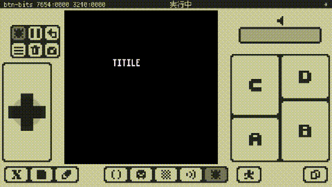

これは簡単なシーン遷移です。**このプログラムは終了しません。**`TITLE`シーンで**Aボタン**を押すと`PLAY`シーンに遷移します。`PLAY`シーンで**Aボタン**を押すと`GAME OVER`シーンに遷移します。`GAME OVER`シーンでは**3秒後**に自動で`TITLE`シーンに遷移します。

### 制御構造とインデント

`while`は、プログラムの流れを制御する構造（**制御構造**）を作る文（**制御構文**）です。処理を繰り返す（**ループ**する）する時に使うもので、こんな形をしています。

> `while` 式 `do` ブロック `end`

`while`文を実行した時、式が**真**なら`do`と`end`で囲まれた**ブロック**（一連の文の並び）を実行し、`end`まで来たら`while`に戻ります（ループします）。式が**偽**なら`end`の次に制御を移します（ループを抜けます）。

`true`は**ブーリアン**型という、値が`true`と`false`の2つしか無い型の値です。`true`は真、`false`は偽と解釈されます。

`if`も、条件によって制御を分岐したい時に使う制御構文です。上記の場合はこんな形をしています。

> `if` 式 `then` ブロック `end`

`if`文を実行した時、式が真なら`then`と`end`で囲まれたブロックを実行します。式が偽なら`end`の次に制御を移します。`if`文はもう少し複雑な分岐も出来ますが、今は先に進みます。

`break`文はそれを囲んでいる最も内側のループを抜けて、制御をループブロックの次へ移します。

ブロックは入れ子構造にすることが出来ます。このコードの場合もこんな感じで入れ子構造になっています。

```
whileブロック#1開始

   whileブロック#2開始
      ifブロック#1開始 〜 ifブロック#1終了
   whileブロック#2終了

   whileブロック#3開始
      ifブロック#2開始 〜 ifブロック#2終了
   whileブロック#3終了

whileブロック#1終了
```

ブロックの開始と終了の対応に注意してください。コードがブロックの内側になるたびに行頭の空白を増やして書いているのは、この入れ子構造を視認しやすくするためです。この字下げのことを**インデント**といいます。

Note: インデントはプログラムの実行には関係ありませんが、人間が見てコードの構造を正しく認識するためにはとても重要です。

Hint: インデントには`Tab`キーでの空白入力が便利です。

### フレームループとボタン入力

`TITLE`シーンの部分を見ていきます。

```
   -- Title Scene
   x8.cls()
   x8.fnt("TITILE", 40, 40)
   while true do
      if x8.btntrg(4) then break end
      x8.wait()
   end
```

`x8.cls`は画面をクリアする（0番の色で塗りつぶす）関数です。

`while`ループの条件式が`true`なので、ブロックの実行を永遠に繰り返します（**無限ループ**します）。

`x8.btntrg`は、今回の**フレーム**でボタンの**トリガー**（ボタンの**OFF**から**ON**への変化）が発生したかどうかの情報を返す関数です。`x8.btntrg(4)`と書いた場合、Aボタンのトリガーがあれば`true`を、無ければ`false`を返します。

ボタンとその番号の関係については以下の通りです。

♪ボタンと番頭の対応図

**フレーム**とは、画面の書き換えを含む、マシンの処理全体の1サイクルのことを言います。x8マシンでは通常、1秒あたり30回のフレーム処理が行われます。前回のフレームで押されていなかったボタンが、今回のフレームで押されると、今回のフレームでそのボタンのトリガーが発生します。

`x8.wait`はフレームを待つ（**マシンの処理サイクルを進める**）関数です。待つフレーム数を引数で指定します。フレーム数を省略すると1フレーム（次のフレームまで）待ちます。**`x8.wait`を呼ばないとフレームは進みません。**

Note: x8のプログラミングでは、無限ループ内には必ず`x8.wait`によるフレーム待ちを入れる必要があります。フレーム待ちを入れないとマシン全体の処理サイクルが進まないため、画面表示やパッド入力の更新が行われず、外見上マシンがフリーズしてしまいます。一定時間`x8.wait`が呼ばれないとタイムアウトエラーでプログラムは停止します。

結局この`TITLE`シーンのコードは、以下のような意味になります。

```
-- Title Scene
画面をクリアする
文字で"TITLE"と表示する
無限ループ
   Aボタンが押されたらループを抜ける
   フレーム更新
ループ終端
```

Hint: このように各シーンの作りは通常、フレーム待ちが入った無限ループの形になります。

### シーン遷移の全体を読む

シーン遷移のコードを読む準備が出来ました。結局、コード全体は以下のような意味になります。

```
無限ループ

   -- Title Scene
   画面をクリアする
   文字で"TITLE"と表示する
   無限ループ
      Aボタンが押されたらループを抜ける
      フレーム更新
   ループ終端

   1フレーム待つ

   -- Play Scene
   画面をクリアする
   文字で"PLAY"と表示する
   無限ループ
     Aボタンが押されたらループを抜ける
     フレーム更新
   ループ終端

   -- Game Over Scene
   画面をクリアする
   文字で"GAME OVER"と表示する
   3秒待つ

ループ終端
```

`PLAY`シーンの直前で**1フレーム待つ**のは、フレーム更新せずに`PLAY`シーンのトリガー判定を行うと、`TITLE`シーンを抜けた原因のトリガーを、`PLAY`シーンでも検出してしまうのを防ぐためです。試しにここをコメントアウトすると`PLAY`シーンがスキップされてしまうのがわかります。

最後の`3秒待つ`の**3秒**は、30フレームで1秒なので、`30 * 3`フレームは3秒という意味です。

これでシーンとシーン遷移の説明はおしまいです。次行きましょー！！

## 関数定義とゲーム全体の構造

以下のコードを見てください。

```
-- Main
function main()
   while true do
      titleScene()
      playScene()
      gameoverScene()
   end
end

-- Title Scene
function titleScene()
   x8.cls()
   x8.fnt("TITILE", 40, 40)
   x8.wait()
   while true do
      if x8.btntrg(4) then break end
      x8.wait()
   end
end

-- Game Over Scene
function gameoverScene()
   x8.cls()
   x8.fnt("GAME OVER", 40, 60)
   x8.wait(30 * 3)
end

-- Play Scene
function playScene()
   x8.cls()
   x8.fnt("PLAY", 40, 50)
   x8.wait()
   while true do
      if x8.btntrg(4) then break end
      x8.wait()
   end
end

-- Start the game
main()
```

これは、ゲーム全体の骨格だけを抜き出したものです。各シーンが分割されているのがわかります。

実行すると、[シーンとシーン遷移](programming_tutorial_01.md#シーンとシーン遷移)で紹介したサンプルコードと全く同じ動作になります。


### 関数定義

`function`は関数を作る（**関数定義**）ときに使います。こんな形をしています。

> `function` 関数名 `(` [パラメータリスト] `)` ブロック `end`

Note: このように文の形（**構文**）を説明する際に角括弧 **[ ]** と中括弧 **{ }** には特別な意味があります。**[a]** は **[a]** の部分が、あってもなくてもよいこをと表し、**{a}** は **{a}** の部分が、何回連続してもよく、また無くてもよいことを表しています。

**[パラメータリスト]**には引数を受け取るための変数名をカンマ`,`区切りで並べます。引数が不要なら[パラメータリスト]も不要です。

**ブロック**に関数が行う処理を書きます。

関数定義は実際には、関数を作って変数に代入する式で、**関数名は定義した関数を入れた変数名**です。関数定義は以下のように書くことも出来、意味も同じです。

> 変数名 `= function (` [パラメータリスト] `)` ブロック `end`

### メイン関数

`main`関数の部分を見てください。

```
-- Main
function main()
   while true do
      titleScene()
      playScene()
      gameoverScene()
   end
end
```

この関数は、ゲームの起点となり、各シーンを順番に呼び出す無限ループになっています。

Hint: このように、プログラムの起点となるような関数のことを**メイン関数**と呼ぶことがあります。Lua言語では特別な意味はないのですが、言葉としてはよく使います。

### 全体の構造

全体としてはこのような形になっています。

```
-- Main
メイン関数定義

-- Title Scene
タイトルシーン関数の定義

-- Game Over Scene
ゲームオーバーシーン関数定義

-- Play Scene
プレイシーン関数定義

-- Start the game
メイン関数の呼び出し
```

関数は定義しただけでは実行されないので、最後にメイン関数を呼び出して、実行を開始しています。

**メイン関数の呼び出し`main()`を最後に行うことには、重要な意味があります。**試しにメイン関数呼び出しを`function playScene()`の直前に移動すると、メイン関数内の`playScene()`のところでエラーになります。これは、`playScene`関数を定義するまえに呼び出してしまうためです。

**変数は最初の代入が行われるまで、値が`nil`（値が無いという意味）になっています。**変数`playScene`を、その関数定義を実行する前に呼び出そうとすると、まだ値が`nil`なのでエラー（`nil`は呼び出せない）になってしまいます。

Note: うっかりして、代入するまえの変数を使ってしまい、エラーになることがよくあります。処理の流れと、変数への最初の代入がどこかに注意するとよいです。

シーン毎に関数に分けられ、全体の流れがメイン関数にまとまっています。将来、シーンを追加したり順番を変えたくなっても、新しいシーン関数を追加してメイン関数を修正するだけなので、変更が少なくて済みそうです。

Hint: シーンや機能毎にプログラムを分けて書くのは、そうしないとごちゃごちゃして困るようになってからで大丈夫です。最初のうちは何も気にせずガンガンコードを書いちゃいましょう。

関数定義とゲーム全体の構造につての説明はおしまいです。次行きましょー！！

## プレイシーン以外の全て

以下のコードを見てください。

```
INFO_Y = 118

top_score = 0

-- Main
function main()
   -- Initialize
   top_score = 0
   -- Game scenes
   while true do
      titleScene()
      playScene()
      gameoverScene()
   end
end

-- Title Scene
function titleScene()
   -- Clear screen
   x8.cls()
   -- Draw title
   x8.fntscale(3, 3)
   local title = "B.BREAKER"
   local tw = x8.fntmeas(title)
   x8.fnt(title, (128 - tw) * 0.5 + 1, 24 + 1, 11) -- Shadow
   x8.fnt(title, (128 - tw) * 0.5, 24, 7)
   -- Draw operating instructions
   x8.fntscale()
   local prst = "Press Ⓐ to start game"
   local prstw = x8.fntmeas(prst)
   x8.fnt(x8.enc("←→"), 16, 70, 6)
   x8.fnt(x8.enc("Ⓐ or Ⓑ"), 16, 80, 6)
   x8.fnt(".. Move Racket", 56, 70, 6)
   x8.fnt(".. Shoot, Quick", 56, 80, 6)
   -- Draw message
   x8.fnt(x8.enc(prst), (128 - prstw) * 0.5, INFO_Y, 7)
   -- Draw top score
   x8.fnt("TOP SCORE", 16, 100, 6)
   x8.fnt(".. "..top_score, 56, 100, 6)
   -- Wait
   while true do
      -- Press A to start game
      if x8.btntrg(4) then break end
      -- Next frame
      x8.wait()
   end
end

-- Game over scene
function gameoverScene()
   -- Clear screen
   x8.cls()
   -- Draw message
   x8.fntscale()
   local message = "GAME OVER"
   local w, h = x8.fntmeas(message)
   local y = 56
   x8.fnt(message, (128 - w) * 0.5, (128 - h) * 0.5, 8)
   -- Wait
   x8.wait(30 * 3)
end

-- Play Scene
function playScene()
   x8.cls()
   x8.fnt("PLAY", 40, 50)
   x8.wait()
   while true do
      if x8.btntrg(4) then break end
      x8.wait()
   end
   top_score = top_score + 100
end

-- Start the game
main()
```

これを実行するとこうなります。

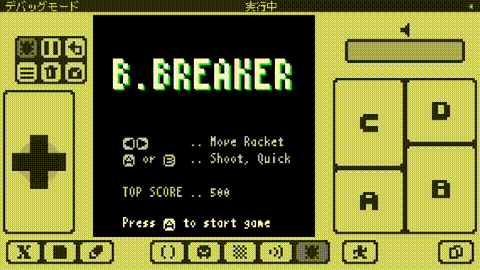

これは**B.BREAKER**の完全なコードから、プレイシーンの詳細だけを除いたものです。ほとんどが、既に理解出来る内容であることが分かると思います。まだ説明していない、残りの部分を見ていきます。

### ローカル変数とグローバル変数

変数の前に`local`を付けると、そこで新しい**ローカル変数**が作られます（**ローカル宣言**されます）。今まで紹介してきた`local`を付けない変数は全て**グローバル変数**です。

**ローカル変数**は、その宣言を含む最も内側のブロック内の、その宣言よりあとからしか参照できません（**見えません**）。この変数が**見える**範囲のことを**スコープ**と言います。ローカル変数は、限られた範囲での利用であったり、一時的な利用である場合に使います。

**グローバル変数**はどこからでも見えます。プログラム内の複数の場所から、共通の変数を利用したい場合に使います。

Hint: **スコープ**について、詳しくは[可視性ルール](lua_basics.md#可視性ルール)を参照してください。

### 特殊文字

x8で利用出来る文字フォントには、いくつか独自の特殊文字があります。特殊文字の入力には、キートップに特殊文字が表示されるため、画面キーボードが便利です。

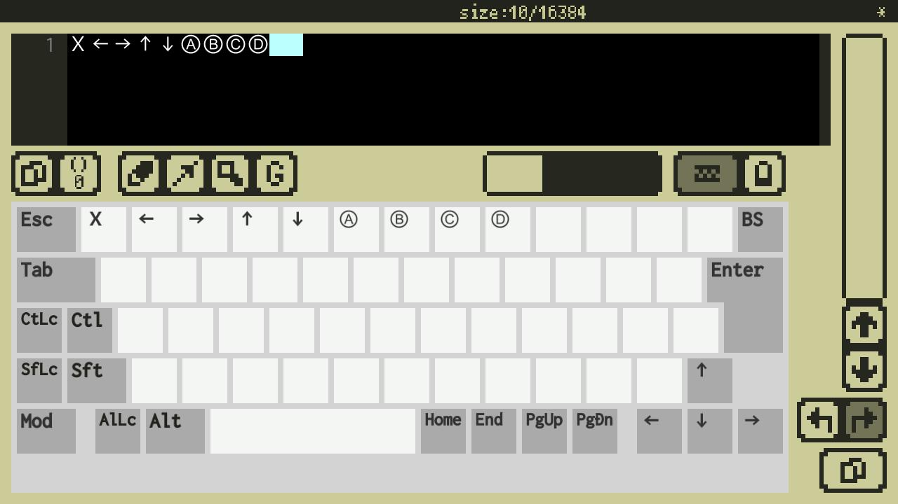

以下のコードを見てください。

```
x8.fnt("Press Ⓐ to start game", 18, 30)
x8.fnt(x8.enc("Press Ⓐ to start game"), 18, 60)
```

これを実行するとこうなります。

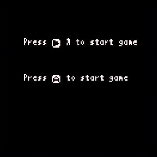

コードの1行目の結果が上、2行目の結果が下です。上では`Ⓐ`の部分が意図したものと違う表示になっています。下では`Ⓐ`が正しく表示されています。

2行目で使われている`x8.enc`は、文字列に含まれるカタカナや特殊文字の文字コードを、Lua言語が扱える文字コードに変換して返す関数です。カタカナや特殊文字を含む文字列を利用する場合は、必ず`x8.enc`で変換してから利用しないと文字化けしてしまいます。

これでプレイシーン以外の全ての説明はおしまいです。次行きましょー！！

## ラケットの表示と操作

### 画面に図形を表示する

以下のコードと実行結果を見てください。

```
x8.rect(40, 50, 70, 60, 9)
```

♪矩形表示

`x8.rect(x0,y0,x1,y1[,col])`は、画面に四角形や正方形（**矩形**）を描画する関数です。矩形の左上の座標を`x0,y0`で、右下の座標を`x1,y1`で、色を`col`で指定します。`col`は省略できます。

**矩形は`x1,y1`の座標を含むため、この場合の幅は、`30`ではなく`31`であることに注意してください。**高さについても同様です。

Note: このように関数呼び出しの形を説明する際、対応する角括弧`[ ]`で囲まれた部分は、その部分を一括して省略できることを表しています。例えば、`x8.fntscale([sclx[,scly]])`の場合、`scly`または、`sclx,scly`を省略することはできますが、`sclx`だけを省略することはできないことに注意してください。

このゲームでは、ラケット、ボール、ブロックをすべて、`x8.rect`を使って表示しています。

### ラケットを動かす

以下のコードと実行結果を見てください。

```
x = 32
y = 108
w = 24
h = 4
v = 2

while true do
   -- Move
   if x8.btnprs(0) then -- ←
      x = x - v
   elseif x8.btnprs(1) then -- →
      x = x + v
   end
   -- Draw
   x8.cls()
   x8.rect(x, y, x + w - 1, y + h - 1)
   -- Next frame
   x8.wait()
end
```

♪ラケットの動き

これは、ラケットを表示して`←`と`→`のボタンで動かすだけのコードです。ラケットが画面外に出てしまいますが今は気にしません。

`elseif`は`if`文の制御構造の一部です。既に紹介した`if`文ですが、本当はこんな形をしています。

> `if` 式 `then` ブロック {`elseif` 式 `then` ブロック} [`else` ブロック] `end`

**式**の結果が真なら**`then`ブロック**を実行し、偽なら**`else`ブロック**を実行します。偽の場合`elseif`でさらに制御を分けることができます。

式の結果について、`false`と`nil`は偽とみなされ、それ以外のすべての値（`0`や空文字列`""`なども）は真とみなされます。

```
a = 0
if a == 0 then
    a = 1           -- ここに来る
end
if a == 0 then
    a = 100         -- ここには来ない
elseif a == 1 then
    a = 101         -- ここに来る
else
    a = 102         -- ここには来ない
end
x = a               -- x:101
```

`x8.btnprs`は、現フレームでボタンが押されているかどうかの情報を返します。`x8.btnprs(0)`の場合、現フレームで`←`ボタンが押されていれば`true`、押されていなければ`false`を返します。`x8.btnprs(1)`は`→`ボタンの情報を返します。

変数`x`、`y`はラケット矩形の座標、`w`、`h`はラケット矩形の幅と高さです。**変数`v`は1フレームあたりの移動量です。**

Hint: このコードでは`y`や`v`など、コード中で変更されることがない数値も、コードの先頭で変数に入れています。こうしておくと、ただの数値より意味が分かりやすいし、後で数値を変更したくなっても1箇所の変更で済みます。

結局このコードは、以下のような意味になります。

```
while true do
   -- Move
   `←`が押されていたら
      `x`座標を`v`だけ左にずらす
   でなければ、`→`が押されていたら
      `x`座標を`v`だけ右にずらす
   -- Draw
   画面をクリアする
   ラケットを座標`x,y`に表示する
   -- Next frame
   フレームを更新する
end
```

フレーム更新を含む無限ループなので、ループ内の処理は1/30秒毎に1回（毎秒30回）実行されます。今回の入力によってラケット位置を少しずらし、前回描いた画面をクリアして、新しい位置にラケットを描く、ということを毎フレーム繰り返しています。

Hint: このように、短い時間毎の処理を高速で繰り返すことで、連続して動いているように見せるのが、リアルタイムっぽいゲームの基本的な作り方です。

### ラケットの完全な動き

以下のコードを見てください。

```
SCREEN_W = 128
x = 32
y = 108
w = 24
h = 4

while true do
   -- Move
   local v = 2.0
   if x8.btnprs(4) or x8.btnprs(5) then -- Ⓐ or Ⓑ
      v = v * 3.0
   end
   if x8.btnprs(0) then -- ←
      x = x - v
   elseif x8.btnprs(1) then -- →
      x = x + v
   end
   if x < 0 then
      x = 0
   elseif (x + w) > SCREEN_W then
      x = SCREEN_W - w
   end
   -- Draw
   x8.cls()
   x8.rect(x, y, x + w - 1, y + h - 1)
   -- Next frame
   x8.wait()
end
```

これは、ラケット表示と操作の完全なコードです。新しいことがいくつか出てきたので、先にそれらを説明します。

#### 演算子と式

`if`文の**式**に出てくる`or`、`<`、`>`のことを**演算子**といいます。

**演算**とは計算することをいいます。**演算子**とは演算を表す記号のことで、いくつかの引数を取って1つの値を返します。今まで出てきた`+`、`-`、`*`なども**算術演算子**という演算子です。

**式**に書かれた演算や関数呼び出しなどが実行されることを、式が**評価**されるといいます。式は評価されると、結果として必ず値になります。逆にいうと、実行結果が値にならないコードを式の部分に書くことはできません。

#### 算術演算子

**算術演算子**は普通の数値計算を行う演算子のことで、以下のものがあります。

- `+` : 加算
- `-` : 減算
- `*` : 乗算
- `/` : 浮動小数点数除算（小数部もちゃんと計算されます）
- `//` : 切り捨て除算（結果の小数部は切り捨てられます）
- `%` : 剰余
- `^` : 累乗
- `-` : 単項マイナス（独立した`-3`とかのマイナス）

例えば評価結果`x`は以下のようになります。

```
x = 3 ^ 3       -- x:27
x = 3.6 ^ 2.4   -- x:21.633460842026
x = 9 / 4       -- x:2.25
x = 9 / 2.5     -- x:3.6
x = 9 // 4      -- x:2
x = 9.3 // 4    -- x:2.0
x = 9 % 4       -- x:1
x = 9 % 4.3     -- x:0.4
```

#### 関係演算子

`<`と`>`は**関係演算子**といい、記号を挟んで左右2つの引数を取り、記号の意味する関係になっているかどうかを、`true`か`false`で返します。関係演算子には以下のものがあります。

- `==` : 左の値と右の値が等しい
- `~=` : 左の値と右の値が等しくない
- `<` : 左の値が右の値より小さい
- `>` : 左の値が右の値より大きい
- `<=` : 左の値が右の値より小さい、または等しい
- `>=` : 左の値が右の値より大きい、または等しい

```
x = 3 == 3      -- x:true
x = 3 ~= 3      -- x:false
x = 5 < 8       -- x:true
x = "6" == 6    -- x:false
```

#### 論理演算子

`if`文の式に出てくる`or`は**論理演算子**といいます。論理演算子には`and`、`or`、`not`があります。

- `not` : 右の引数の真偽を反転して、結果を`true`か`false`で返します。**引数が真なら結果は偽、引数が偽なら結果は真になります。**
- `and` : 左の引数が`false`か`nil`であればその引数を返し、そうでなければ右の引数を返します。**引数が両方とも真なら結果は真、それ以外なら結果は偽になります。**
- `or` : 左の引数が`nil`でも`false`でもなければその引数を返し、そうでなければ右の引数を返します。**引数のどちらか一方でも真なら結果は真、それ以外なら結果は偽になります。**

Hint: `and`と`or`の動作がややこしいですが、`if`文や`while`文などの**条件式**で使われた場合は、**引数の真偽と結果の真偽の関係**だけに注目すれば大丈夫です。

```
x = not 10              -- x:false
x = not nil             -- x:true
x = 10 or 20            -- x:10
x = nil or "a"          -- x:"a"
x = nil and 10          -- x:nil
x = false and nil       -- x:false
x = false or nil        -- x:nil
x = 10 and 20           -- x:20
```

#### 演算子の優先順位

複数の演算が並んだ場合、どの演算を先に行うかについては、演算子の[優先順位]()で決まります。
今まで出てきた演算子の優先順位は以下のとおりです。より上にあるほど先に演算されます。

- `^`
- `not` `-`(単項マイナス)
- `*` `/` `//` `%`
- `+` `-`
- `<` `>` `<=` `>=` `~=` `==`
- `and`
- `or`

普通の数式と同じように、括弧`( )`を使って式の優先度を変えることができます。

Hint: 演算子の優先順位に不安があるときは、気軽に括弧`( )`を使っちゃいましょう。あとから見返したときにもわかりやすいです。

#### コードの説明

コードを見ていく準備が整いました。最初のコードはこうでした。

```
SCREEN_W = 128
x = 32
y = 108
w = 24
h = 4

while true do
   -- Move
   local v = 2.0
   if x8.btnprs(4) or x8.btnprs(5) then -- Ⓐ or Ⓑ
      v = v * 3.0
   end
   if x8.btnprs(0) then -- ←
      x = x - v
   elseif x8.btnprs(1) then -- →
      x = x + v
   end
   if x < 0 then
      x = 0
   elseif (x + w) > SCREEN_W then
      x = SCREEN_W - w
   end
   -- Draw
   x8.cls()
   x8.rect(x, y, x + w - 1, y + h - 1)
   -- Next frame
   x8.wait()
end
```

これは、[ラケットを動かす](#ラケットを動かす) で説明したコードに、2つの部分が追加されたものです。

1つ目は、入力によるラケット移動の直前にある、この部分です。

```
   local v = 2.0
   if x8.btnprs(4) or x8.btnprs(5) then -- Ⓐ or Ⓑ
      v = v * 3.0
   end
```

ループ開始時に毎回`v`を`2.0`に設定してから、もし`Ⓐ`か`Ⓑ`のボタンが押されていたら、`v`を`3.0`倍にしています。

これは、`Ⓐ`か`Ⓑ`を押しながらラケットを操作した場合、ラケットの動きを速くする処理です。ループ開始時に速度をリセットすることで、加速し続けないようにしています。

2つ目は、入力によるラケット移動の直後にある、この部分です。

```
   if x < 0 then
      x = 0
   elseif (x + w) > SCREEN_W then
      x = SCREEN_W - w
   end
```

これは、直前の移動でラケットが画面からはみ出たら、画面内に戻す処理です。

♪位置強制の図

これでラケットの表示と操作についてはおしまいです。次行きましょー！！


