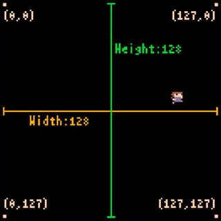
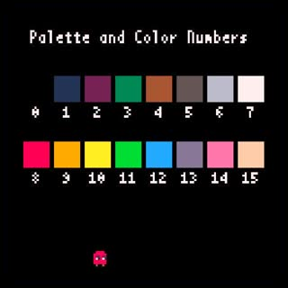

# 3. タイトル表示とプログラムの基礎

ここではゲームタイトルを表示するコードを見ながら、プログラムについての基礎的なことを説明します。

---

## タイトル表示のコード

以前入力したコードがあれば消してから、以下のコードを入力して実行してみましょう。

```
x8.fntscale(3, 3)
title = "B.BREAKER"
tw = x8.fntmeas(title)
x8.fnt(title, (128 - tw) * 0.5 + 1, 24 + 1, 11) -- Shadow
x8.fnt(title, (128 - tw) * 0.5, 24, 7)
```

Note: 括弧（`()`、`[]`、`{}`）や引用符（`'`、`"`）は、行をまたぐこともありますが、開始と終了で必ず対になります。これらの対応が取れているか注意しましょう。

うまくいくと以下のようになります。


---

## プログラムの流れ

このコードにはx8マシンにやって欲しいことが、やって欲しい順に書いてあります。意味は行ごとにこんな感じです。（まだ理解できなくても大丈夫です）

1. 文字表示の大きさを、縦横3倍に設定する
1. 文字列`"B.BREAKER"`を、変数`title`に入れる
1. `title`の横幅を、変数`tw`に入れる
1. x位置:`(128 - tw) * 0.5 + 1`、y位置:`24 + 1`、色番号:`11`の設定で、`title`を画面に文字として表示する
1. x位置:`(128 - tw) * 0.5`、 y位置:`24`、色番号:`7`の設定で、`title`を画面に文字として表示する

この場合、1行がプログラムの**文**という単位です。**実行させたい順番に文を並べたものがプログラムです。**

文は先頭から順番に実行されます。縦に並べて書けば上から下へ、横に並べて書けば左から右へ実行されます。文が無くなったらそこでプログラムは終了します。読みやすいように文は1文づつ縦に並べて書きましょう。

---

## Lua言語とx8独自API

コードはLua言語で書きます。でも、Lua言語だけでは画面に絵を描いたり、音を鳴らしたり、パッドの入力を取得したりすることは出来ません。このようなx8マシン固有の機能を利用するために、x8独自の方法（**API**）が用意されています。

`x8.`で始まる部分がx8独自API（以降API）で、`x8.func(..)`のような形をしています。これは後で説明する**関数**というもので、APIにはx8マシンを利用するためのいろいろな名前（`func`の部分）の関数が用意されています。

Hint: **API**は、**Application Programming Interface** の頭文字です。ここでは、x8プログラミングのために用意された関数などのことです。

---

## コメント

4行目のこの部分`-- Shadow`は**コメント**と呼ばれる単なるメモ書きです。`--`から行末までがコメントになり、プログラムとしては解釈されず無視されます。

複数行に渡ってコメントを書きたい場合は、メモ書きを`--[[`と`]]`で囲みます。タイトル表示のコードはしばらく使わないので、全てコメントにしておきます。コードをコメントにして無効にすることを**コメントアウト**と言います。

```
--[[
x8.fntscale(3, 3)
title = "B.BREAKER"
tw = x8.fntmeas(title)
x8.fnt(title, (128 - tw) * 0.5 + 1, 24 + 1, 11) -- Shadow
x8.fnt(title, (128 - tw) * 0.5, 24, 7)
]]
```


実行しても何も起こらなくなりました。OKです。

---

## 文字列の表示と関数呼び出し

以下のコードとその実行結果を見てください。

```
x8.fnt("hoge piyo", 40, 60, 9)
```


`x8.fnt`は画面に**文字列**を表示するAPIの**関数**です。API関数には必ず`x8.`で始まります。

**文字列**とは`p`とか`3`とか`+`とかの**文字**を並べたもので、空白も文字です。文字列は何文字でもよく、0文字の（空の）文字列もあります。そのまま書くと、どこからどこまでが文字列なのか分からないので、ダブルクォーテーション`"`またはシングルクォーテーション`'`の対で囲んで書きます。この場合`hoge piyo`が文字列です。

**関数**とは、ひとまとまりのコードのことで、普通は`fnt`のように名前が付いています。API関数は最初から用意されていて、中身を見ることは出来ません。

関数名に`()`を付けて書くと関数を**呼び出す**ことができ、関数内に書かれたコードに**制御が移ります**（実行されます）。関数内のコードが終了すると**制御が呼び出し元に戻ってきます。**

関数は呼び出されるときに、**引数**を受け取る場合があります。引数は`()`の内側にカンマ`,`区切りで書きます。

`x8.fnt`は`x8.fnt(str,x,y,col)`という形で呼び出すことができ、`str`が表示する文字列、`x,y`が**表示位置**のx,y座標、`col`が表示の**色番号**です。色番号は省略出来ます。

表示位置を指定する時は、`x,y`の座標で指定します。**横がx軸、縦がy軸、画面サイズは128x128です。画面左上端が`0,0`、右下端が`127,127`です。**



コードで色を指定する時は、**0から15までの色番号で指定します。初期状態では0番は透明です。**



結局先程のコードは、「API関数`x8.fnt`を呼ぶことで、文字列`hoge piyo`を、画面座標`40,60`に、`9`番の色で表示する」という意味になります。

---

## 戻り値と変数と代入とログ

以下のコードとその実行結果を見てください。

```
text = "hoge piyo"
w, h = x8.fntmeas(text)
x8.log("x:"..w..",".."h:"..h)
```


画面には何も表示されませんが、ログビューになにか表示されています。

コードの1行目は**変数**`text`に文字列`"hoge piyo"`を`=`で**代入**しています。

**変数**とは**値**を入れておく場所のことで、好きな名前を付けられます。ただし、使える文字は、アルファベット、数字、アンダースコア`_`だけで、数字で始まってはいけません。

**値**には、数値、文字列、関数などいくつかの種類（**型**）があります。コードの中で、値が特定の型でないといけない場合もありますが、可能な限り自動で変換してくれます。

**代入**とは変数に値を入れることで、`=`を挟んで左側の変数に右側の値を入れます。左側も右側もカンマ`,`区切りでいくつも指定できます。

コードの2行目は変数`w,h`にAPI関数`x8.fntmeas(text)`の**戻り値**を代入しています。

**戻り値**とは関数呼び出しから戻るとき関数が返す値のことで、関数によって何をいくつ返すか（または何も返さないか）が決まっています。関数呼び出しから戻ると、呼び出し部分はその戻り値に置き換わります。

`x8.fntmeas`は、文字列の表示サイズを戻り値として返す関数です。サイズは幅、高さの2つの値で返されます。この場合、`"hoge piyo"`の表示幅が`w`に、表示高さが`h`に代入されます。

コードの3行目は**ログ**出力を行っています。

**ログ**はログビューで確認できるテキストのことで、`x8.log`関数で出力することができます。

`..`は、その左右の文字列を連結する事ができ、`"x:"..w`は`x:`の直後に表示幅（を文字列に変換したもの）を連結した文字列になります。

結局このコードは、「`hoge piyo`の幅と高さを`x:幅,h:高さ`の形でログに出力する」という意味になります。

Hint: ログ出力は、実行中の変数の中身を確認したり、制御が実際にはどこを通っているかを調べたりなど、プログラムをデバッグする（間違いを修正する）際によく使います。

---

## タイトル表示コードの説明

タイトル表示のコードを読む準備が整いました。コメントにしていたタイトル表示のコードを元に戻しましょう。

```
x8.fntscale(3, 3)
title = "B.BREAKER"
tw = x8.fntmeas(title)
x8.fnt(title, (128 - tw) * 0.5 + 1, 24 + 1, 11) -- Shadow
x8.fnt(title, (128 - tw) * 0.5, 24, 7)
```


最初に紹介した、行ごとの意味をもう一度見てみましょう。

1. 文字表示の大きさを、縦横3倍に設定する
1. 文字列`"B.BREAKER"`を、変数`title`に入れる
1. `title`の横幅を、変数`tw`に入れる
1. x位置:`(128 - tw) * 0.5 + 1`、y位置:`24 + 1`、色番号:`11`の設定で、`title`を画面に文字として表示する
1. x位置:`(128 - tw) * 0.5`、 y位置:`24`、色番号:`7`の設定で、`title`を画面に文字として表示する

1行目の`x8.fntscale(3, 3)`は文字表示の大きさを、縦の倍率、横の倍率で指定するAPI関数です。引数を省略した場合はもとの大きさ（縦横1倍）に戻されます。

2行目はもうでてきました。変数に文字列を代入しているだけです。

3行目もでてきましたが、戻り値が2つなのに変数は1つです。この場合、最初の戻り値（幅）が`tw`に入り、2番目の戻り値（高さ）は捨てられます。

4行目は後回しにします..

5行目は`title`を文字として表示しています。`x8.fnt`にx座標を渡す引数のところに**計算式**が書いてあります。このように値を書く代わりに計算式を書くことも出来ます。`+`、`-`、`(`、`)`は普通の算数の記号と同じ意味で、`*`は乗算です。ここでは文字列の横位置が画面の中央にくるよなx座標を計算しています。（下図の`==`は**同じ**という意味です）


4行目は、5行目で表示する文字列に対して、右と下の影の部分を**描画**しています。予め色違いの同じ文字列を、右に`+1`、下に`+1`ずらして描いておくことで、後で描いた文字列が影付きに見える効果を狙っています。

Hint: いままで画面になにか出すことを**表示**と言ってきました。でも実際には、マシン内のキャンバスのような場所に文字や絵をどんどん描いていき、あるタイミングでそれを1枚の画像として画面に表示する、という処理を行っています。以降、何かをキャンバスに描くことを意識する場合は**描画**と言います。

#### これで **タイトル表示とプログラムの基礎** はおしまいです。次行きましょー！！

[次へ](tutorial_01_04.md)

[このチュートリアルのトップへ](tutorial_01.md)
