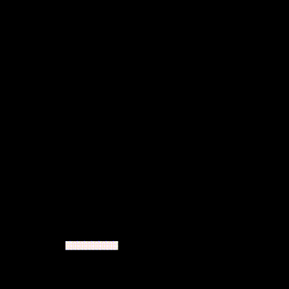
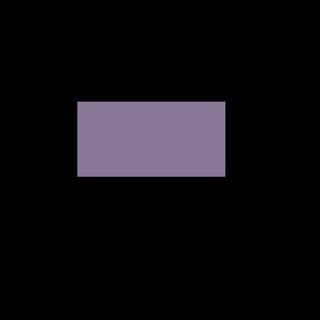
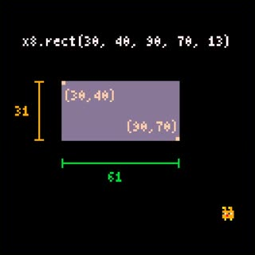
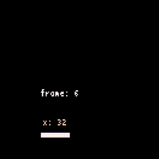

# 7. ラケットの表示と動き

いよいよプレイシーンの説明に入っていきます。

ここではラケットの表示と動きについて説明します。

---

## ラケットを動かすコード

以下のコードとその実行結果を見てください。

```
x = 32
y = 108
w = 24
h = 4
v = 2

while true do
   -- Move
   if x8.btnprs(0) then -- ←
      x = x - v
   elseif x8.btnprs(1) then -- →
      x = x + v
   end
   -- Draw
   x8.cls()
   x8.rect(x, y, x + w - 1, y + h - 1)
   -- Next frame
   x8.wait()
end
```



これは、ラケットを表示して`←`と`→`のボタンで動かすだけのコードです。ラケットが画面外に出てしまいますが今は気にしません。

---

## 画面に図形を表示する

`x8.rect(x0,y0,x1,y1[,col])`は、画面に四角形や正方形などの**矩形**を描画する関数です。矩形の左上の座標を`x0,y0`で、右下の座標を`x1,y1`で、色を`col`で指定します。`col`は省略できます。

Note: このように関数呼び出しの形を説明する際、角括弧`[ ]`で囲まれた部分は、その部分を**一括して省略**できることを表しています。この`[ ]`は入れ子構造になる場合があります。例えば、`x8.fntscale([sclx[,scly]])`の場合、`scly`、または`sclx,scly`のセットを省略することはできますが、`sclx`だけを省略することはできないことに注意してください。

例えば、以下のコードは、

```
x8.rect(30, 40, 90, 70, 13)
```

このような実行結果になります。



**矩形は`x1,y1`の座標を含むため、この場合の幅は`60`ではなく`61`であることに注意してください。**高さについても同様です。



このゲームでは、ラケット、ボール、ブロックをすべて、`x8.rect`を使って表示しています。

---

## ifの詳細

`elseif`は`if`文の制御構造の一部です。既に紹介した`if`文ですが、本当はこんな形をしています。

> `if` 式 `then` ブロック {`elseif` 式 `then` ブロック} [`else` ブロック] `end`

**式**の結果が真なら**`then`ブロック**を実行し、偽なら**`else`ブロック**を実行します。偽の場合`elseif`でさらに制御を分けることができます。

**[ ]** と **{ }** の意味を思い出してください。**[`else` ブロック]** の部分はあってもなくてもよいです。**{`elseif` 式 `then` ブロック}** の部分は何回連続してもよく、また無くてもよいです。

**式の結果が`false`か`nil`なら偽と判断され、それ以外のすべての値（`0`や空文字列`""`なども）なら真と判断されます。**

Note: 条件判断において、`false`と`nil`以外はすべて`真`です。これ大事です。

以下は`if`文による分岐の例です。

```
if 0 then
   -- ここに来る
else
   -- ここには来ない
end

if nil then
   -- ここには来ない
else
   -- ここに来る
end

if false then
   -- ここには来ない
elseif "" then
   -- ここに来る
elseif true then
   -- 上で分岐しているので、ここには来ない
else
   -- ここには来ない
end
```

---

## コード全体の説明

もう一度、ラケットを動かすコード全体を見てみましょう。

```
x = 32
y = 108
w = 24
h = 4
v = 2

while true do
   -- Move
   if x8.btnprs(0) then -- ←
      x = x - v
   elseif x8.btnprs(1) then -- →
      x = x + v
   end
   -- Draw
   x8.cls()
   x8.rect(x, y, x + w - 1, y + h - 1)
   -- Next frame
   x8.wait()
end
```

`x8.btnprs`は、現フレームでボタンが押されているかどうかの情報を返します。`x8.btnprs(0)`の場合、現フレームで`←`ボタンが押されていれば`true`、押されていなければ`false`を返します。`x8.btnprs(1)`は`→`ボタンの情報を返します。

Note: `x8.btnprs`と`x8.btntrg`の違いに注意してください。`x8.btnprs`は現在ボタンが **ON** かどうかを、`x8.btntrg`は前回から今回でボタンが **OFF** → **ON** になったかどうかを返します。ラケットはボタンを押しっぱなしでも移動させたいので`x8.btnprs`を使っています。

変数`x`、`y`はラケット矩形の座標を、`w`、`h`はラケット矩形の幅と高さを格納しています。**変数`v`は1フレームあたりの移動量です。**

Hint: このコードでは`y`や`v`など、コード中で変更されることがない数値も、コードの先頭で変数に入れています。こうしておくと、ただの数値より意味が分かりやすいし、後で数値を変更したくなっても1箇所の変更で済みます。


結局このコードは、以下のような意味になります。

```
変数の初期化

while true do
   -- Move
   ← が押されていたら
      x 座標を v だけ左にずらす
   でなければ、 → が押されていたら
      x 座標を v だけ右にずらす
   -- Draw
   画面をクリアする
   ラケットを座標 x,y に表示する
   -- Next frame
   フレームを更新する
end
```

本体部分はフレーム更新を含む無限ループなので、ループ内の処理が1/30秒毎に1回（毎秒30回）実行されます。

現フレームの入力によってラケット位置を少しずらし、画面をクリアしたのち、新しい位置にラケットを描く、ということを毎フレーム繰り返しています。

このコードは、ごく短い時間間隔で、位置を少しづつずらすことにより、パラパラ漫画のアニメーションのようにラケットを動かしています。



Hint: 毎フレーム必ず、`x8.cls()`で画面をクリアしてから描画しているのがポイントです。画面をクリアしないと、以前に描画したものが全て残っているので動いているように見えません。

Hint: このように、短い時間毎の処理を高速で繰り返すことで、連続して動いているように見せるのが、リアルタイムっぽいゲームの基本になります。


#### これで **ラケットの表示と動き** の説明はおしまいです。次行きましょー！！

[次へ](tutorial_01_08.md)

[このチュートリアルのトップへ](tutorial_01.md)
