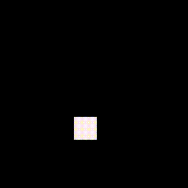
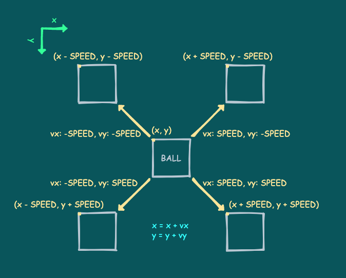
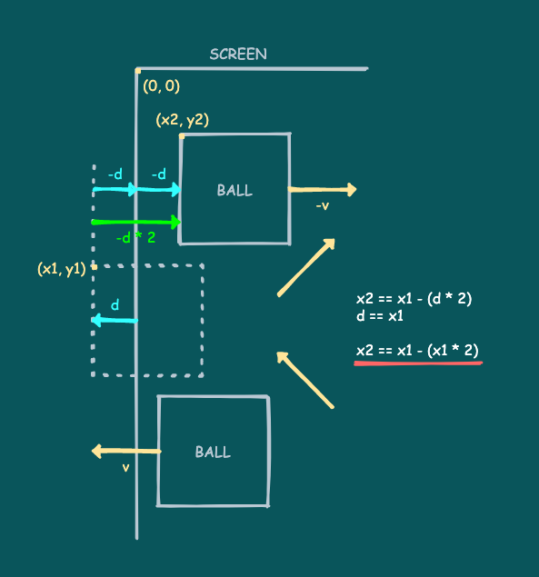
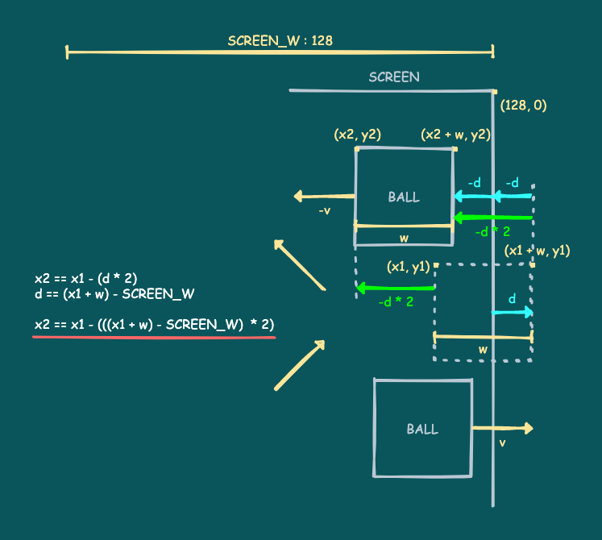

# 9. ボールの表示とバウンド

ここではボールを表示して動かしたり、壁でバウンドしたりする部分を説明します。

---

## ボールの表示とバウンドのコード

以下のコードとその実行結果を見てください。

```
SCREEN_W = 128
SPEED = 1.5
x = 50
y = 80
w = 16
h = 16
vx = 0
vy = 0

while true do
   -- Shoot
   if x8.btntrg(4) then -- Ⓐ
      x = math.random(10, 110)
      y = 108
      if (x % 2) == 0 then
         vx = SPEED
      else
         vx = -SPEED
      end
      vy = -SPEED
   end
   -- Move
   x = x + vx
   y = y + vy
   -- Bounce by the left wall
   if x < 0 then
      x = x - (x * 2)
      vx = -vx
   -- Bounce by the right wall
   elseif (x + w) > SCREEN_W then
      x = x - (((x + w) - SCREEN_W) * 2)
      vx = -vx
   end
   -- Bounce by the above wall
   if y < 0 then
      y = y - (y * 2)
      vy = -vy
   end
   -- Draw
   x8.cls()
   x8.rect(x, y, x + w - 1, y + h - 1)
   -- Next frame
   x8.wait()
end
```



これは、ボールの移動と壁（左右と上の画面端）でのバウンド処理を行うコードです。`Ⓐ`ボタンを押すと画面下部のランダムな位置からボールを発射します。

---

## ボールの移動

`x`、`y`がボールの現在位置、`vx`、`vy`が現在のボールの移動量です。`w`、`h`はボールのサイズですが、見やすいようにちょっと大きくしてあります。

`SPEED`は向きを持たない（方向に関係ない）、**1フレーム当たのり移動量**です。

ラケットのときと同じように、ボールも位置を少しづつずらしていくことで動かします。ボールを移動させているのはこの部分です。

```
   -- Move
   x = x + vx
   y = y + vy
```

ボールのx座標にx方向の移動量を、y座標にy方向の移動量をそれぞれ加算しています。

このゲームの場合、x方向もy方向も移動速度は同じなので、以下の4通り（斜め45度）の移動だけになります。



---

## ランダムな値の作り方

`math.random`は、ランダムな数値（**乱数**）を作って返す**Lua標準ライブラリ**の関数です。

Hint: **Lua標準ライブラリ**は、Lua言語が提供している便利な機能をまとめたもの（**ライブラリ**）です。`math.`の部分は`random`が**数学関数ライブラリ**`math`に含まれているという意味です。標準ライブラリには他にもたくさんの便利な機能があります。詳しくは[ここに一覧](../lua_stdlib.md)があります。

`math.random([m [, n]])` のような形で呼び出すことができ、引数の指定方法と返される値は以下の通りです。

- 引数を指定せずに呼ぶと、`0`から`1`までのランダムな**小数**を返します。
- `m`と`n`を指定して呼ぶと、`m`から`n`までのランダムな**整数**を返します。（`m <= n`であること）
- `math.random(n)`は`math.random(1,n)`と同じ意味になります。

以下の部分は、`Ⓐ`ボタンでボールを発射する処理です。

```
   -- Shoot
   if x8.btntrg(4) then -- Ⓐ
      x = math.random(10, 110)
      y = 108
      if (x % 2) == 0 then
         vx = SPEED
      else
         vx = -SPEED
      end
      vy = -SPEED
   end
```

`Ⓐ`ボタンが押されたら、ボールの座標と各軸方向の移動量を設定しています。

y座標は固定ですが、x座標には`10`から`110`までのランダムな整数を設定しています。

yの移動量は負の値（上に移動）に固定ですが、xの移動量はx座標（ランダムな整数）が偶数なら正（右に移動）、奇数なら負（左に移動）の値を設定しています。`(x % 2) == 0`は「`x`を`2`で割った余りが`0`と等しい」という意味なので、xが偶数なら真、奇数なら偽になります。

結局上記のコードでは、ボールを特定のy位置から上に発射しますが、x位置と左右の移動方向はランダムに設定しています。

Hint: **乱数**の作成は、ゲーム開発のいろんな場面で使われるとても重要な機能です。`math.random`を使って、自分が欲しい形式のランダムな数値を作れることはとても大事です。

---

## ボールのバウンド

以下の部分がボールのバウンド処理です。

```
   -- Bounce by the left wall
   if x < 0 then
      x = x - (x * 2)
      vx = -vx
   -- Bounce by the right wall
   elseif (x + w) > SCREEN_W then
      x = x - (((x + w) - SCREEN_W) * 2)
      vx = -vx
   end
   -- Bounce by the above wall
   if y < 0 then
      y = y - (y * 2)
      vy = -vy
   end
```

処理はx,yの軸ごとに行います。ボールの矩形が画面の左右上の端からはみ出したら、はみ出した分だけ壁と反対に移動させます。また、移動量の符号を反転して移動方向を反対にします。

左壁の場合はこんなふうです。（上壁も同様です）



図中の`d`がはみ出した分の移動量です。`d`の符号に注意してください。

表示の基準位置が左上なため、右壁の処理がややこしいですが、やっていることはどの方向も同じです。



下壁について何もしていなので、画面の下に消えたボールはずっと動き続けますが、ここでは気にしません。

---

残りの部分は、画面のクリア、描画、フレーム待ちです。全体はお決まりのフレームループになっています。


#### これで **ボールの表示とバウンド** の説明はおしまいです。次行きましょー！！

[次へ](tutorial_01_10.md)

[このチュートリアルのトップへ](tutorial_01.md)
