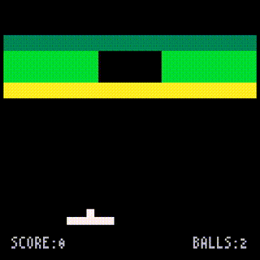

# 16. プレイシーンの全て

**B.BREAKER**のコードで説明していない部分もあと少しです。

ここではプレイシーンの残りの部分について説明します。

---

## プレイシーンのコード

以下のコードとその実行結果を見てください。

```
SCREEN_W = 128
SCREEN_H = 128

BALL_SIZE = 4
BALL_SPEED = 1.5

RACKET_X = 32
RACKET_Y = 108
RACKET_W = 24
RACKET_H = 4
RACKET_SPEED = 2.0

INFO_Y = 118

block_lines = {
   { 3, 3, 3, 3, 3, 3, 3, 3 },
   { 2, 2, 2, 0, 0, 2, 2, 2 },
   { 2, 2, 2, 0, 0, 2, 2, 2 },
   { 1, 1, 1, 1, 1, 1, 1, 1 },
}

block_colors = { 10, 11, 3 }

top_score = 0

-- Play scene
function playScene()
   local rem_balls = 3 -- Number of remaining balls
   local score = 0
   local racket = { x = RACKET_X, y = RACKET_Y, w = RACKET_W, h = RACKET_H }
   local ball = { x = 0, y = 0, w = BALL_SIZE, h = BALL_SIZE, vx = 0, vy = 0 }

   ::RESET::

   -- Create blocks
   local blocks = {}
   for i = 1, #block_lines do
      local line = block_lines[i]
      for j = 1, #line do
         local n = line[j]
         if n > 0 then
            -- Create a block
            blocks[#blocks + 1]
               = { x = (j - 1) * 16, y = (i - 1) * 8 + 16, w = 16, h = 8, n = n }
         end
      end
   end

   ::RETRY::

   local is_started = false

   -- Use one ball
   rem_balls = rem_balls - 1

   -- Wait to clear input
   x8.wait()

   -- The main loop in the game
   while true do

      -- Only valid blocks
      local new_blocks = {}
      for i = 1, #blocks do
         local block = blocks[i]
         if block.n > 0 then
            new_blocks[#new_blocks + 1] = block
         end
      end
      blocks = new_blocks

      -- If there are no blocks, it's clear
      if #blocks == 0 then break end

      -- Move the racket
      local racket_speed = RACKET_SPEED
      if x8.btnprs(4) or x8.btnprs(5) then -- Ⓐ or Ⓑ
         racket_speed = racket_speed * 3.0
      end
      if x8.btnprs(0) then -- ←
         racket.x = racket.x - racket_speed
      elseif x8.btnprs(1) then -- →
         racket.x = racket.x + racket_speed
      end
      if racket.x < 0 then
         racket.x = 0
      elseif (racket.x + racket.w) > SCREEN_W then
         racket.x = SCREEN_W - racket.w
      end

      -- Shoot the ball
      if not is_started and (x8.btntrg(4) or x8.btntrg(5)) then -- Ⓐ or Ⓑ
         is_started = true
         ball.vx = BALL_SPEED
         ball.vy = -BALL_SPEED
         x8.sfx(0)
      end
      
      -- Move the ball
      if is_started then
         ball.x = ball.x + ball.vx
         ball.y = ball.y + ball.vy
      else
         ball.x = racket.x + (racket.w * 0.5) - (ball.w * 0.5)
         ball.y = racket.y - ball.h
      end

      -- Bounce by the left wall
      if ball.x < 0 then
         ball.x = ball.x - (ball.x * 2)
         ball.vx = -ball.vx
         x8.sfx(0)
      -- Bounce by the right wall
      elseif (ball.x + ball.w) > SCREEN_W then
         ball.x = ball.x - (((ball.x + ball.w) - SCREEN_W) * 2)
         ball.vx = -ball.vx
         x8.sfx(0)
      end
      -- Bounce by the above wall
      if ball.y < 0 then
         ball.y = ball.y - (ball.y * 2)
         ball.vy = -ball.vy
         x8.sfx(0)
      end
      -- Check for mistake
      if ball.y > SCREEN_H then break end

      -- The ball and the racket hit check
      if (ball.vy > 0) and isHit(ball, racket) then
         local rx = (ball.x + (ball.w * 0.5)) - racket.x
         local rate = rx / racket.w
         if ((rate <= 0.25) and (ball.vx > 0))
         or ((rate >= 0.75) and (ball.vx < 0)) then
            ball.vx = -ball.vx
         end
         ball.vy = -ball.vy
         --
         x8.sfx(0)
      end

      -- The Ball and blocks hit check
      for i = 1, #blocks do
         local block = blocks[i]
         if (block.n > 0) and isHit(ball, block) then
            block.n = block.n - 1
            -- Update score
            score = score + 1
            --
            x8.sfx(1)
            local dx = 0
            -- The ball is boring into the block from the left
            if ball.vx > 0 then
               dx = (ball.x + ball.w) - block.x
            -- The ball is boring into the block from the right
            elseif ball.vx < 0 then
               dx = ball.x - (block.x + block.w)
            end
            local dy = 0
            -- The ball was bored into the block from above
            if ball.vy > 0 then
               dy = (ball.y + ball.h) - block.y
            -- The ball was wedged into the block from underneath
            elseif ball.vy < 0 then
               dy = ball.y - (block.y + block.h)
            end
            -- Bouncing the ball
            if math.abs(dx) < math.abs(dy) then
               ball.x = ball.x - (dx * 2)
               ball.vx = -ball.vx
            else
               ball.y = ball.y - (dy * 2)
               ball.vy = -ball.vy
            end
         end
      end

      -- Clear screen
      x8.cls()

      -- Draw blocks
      for i = 1, #blocks do
         local block = blocks[i]
         if block.n > 0 then
            x8.rect(block.x, block.y,
                    block.x + block.w - 1, block.y + block.h - 1,
                    block_colors[block.n])
         end
      end

      -- Draw racket
      x8.rect(racket.x, racket.y,
              racket.x + racket.w - 1, racket.y + racket.h - 1)

      -- Draw ball
      x8.rect(ball.x, ball.y,
              ball.x + ball.w - 1, ball.y + ball.h - 1)

      -- Draw information
      x8.fnt("SCORE:"..score, 4, INFO_Y, 6)
      x8.fnt("BALLS:"..rem_balls, 96, INFO_Y, 6)

      -- Next frame
      x8.wait()
   end

   -- Clear
   if #blocks == 0 then
      -- Draw message
      x8.fntscale()
      local message = "CLEAR!"
      local w, h = x8.fntmeas(message)
      x8.fnt(message, (128 - w) * 0.5, (128 - h) * 0.5, 10)
      -- Wait
      x8.wait(30 * 3)
      -- Reset
      goto RESET
   end

   -- Miss
   do
      -- Draw message
      x8.fntscale()
      local message = "MISS!"
      local w = x8.fntmeas(message)
      x8.fnt(message, (128 - w) * 0.5, 72, 8)
      -- Wait
      x8.wait(30 * 2)
   end

   -- Retry
   if rem_balls > 0 then goto RETRY end

   -- Update top score
   if score > top_score then top_score = score end
end

-- Hit check between objects
function isHit(a, b)
   return (a ~= b)
      and (a.x <= (b.x + b.w - 1)) and (b.x <= (a.x + a.w - 1))
      and (a.y <= (b.y + b.h - 1)) and (b.y <= (a.y + a.h - 1))
end

-- Start
playScene()
```



これは前回の[ブロック崩しのコード](tutorial_01_15.md)に、スコア表示やミス演出などのゲームとして必要な処理を追加したものです。

また、これがプレイシーンの完全なコードでもあります。残りボール数が無い状態でミスするとプレイシーンは終了し、プログラムも終了します。

前回からの変更部分を見ていきます。

---

## スコアや残りボール数など

スコアや残りボール数の管理など、細かい変更部分を先に説明しておきます。

まず、コードの先頭部分を見てください。

```
INFO_Y = 118
```

```
top_score = 0
```

2つグローバル変数が追加されています。`top_score`はトップスコア、`INFO_Y`は今回のスコアと残りボール数の文字情報を表示するy位置です。

`top_score`がグローバル変数なのは他のシーンからも参照したり、ゲーム中ずっと値を保持したりするためです。ゲームの開始時に一度だけ`0`に初期化されます。

`INFO_Y`がグローバル変数なのは文字情報の表示位置を調整しやすくするためです。

次に、`playScene`関数の先頭を見てください。2つのローカル変数が追加されています。

```
   local rem_balls = 3 -- Number of remaining balls
   local score = 0
```

`rem_balls`は残りボール数です。プレイシーンが開始されるたびに`3`に初期化されます。

`score`は今回のスコアです。プレイシーンが開始されるたびに`0`に初期化されます。

次に、フレームループ直前のこの部分を見てください。

```
   ::RETRY::

   local is_started = false

   -- Use one ball
   rem_balls = rem_balls - 1

   -- Wait to clear input
   x8.wait()
```

`RETRY`はミスした場合に飛んでくるラベルです。ミスするたびに残りボール数`rem_balls`を`- 1`してからフレームループに戻ります。

ここで`x8.wait()`しているのは、タイトルシーンで検出したトリガーをそのまま検出してしまうのを防ぐためです。

次に、フレームループ内でボールとブロックの当たり判定を行ってるこの部分を見てください。

```
      -- The Ball and blocks hit check
      for i = 1, #blocks do
         local block = blocks[i]
         if (block.n > 0) and isHit(ball, block) then
            block.n = block.n - 1
            -- Update score
            score = score + 1
```

ボールがブロックに当たり、ブロックの耐久度を減らした直後に、今回のスコア`score`を`+ 1`しています。ボールがブロックに当たる毎に1点獲得します。

次に、フレームループ末尾のこの部分を見てください。

```
      -- Draw information
      x8.fnt("SCORE:"..score, 4, INFO_Y, 6)
      x8.fnt("BALLS:"..rem_balls, 96, INFO_Y, 6)
```

これは、今回のスコアと残りボール数の文字情報を表示している部分です。y位置を調整しやすくしています。

この描画処理は他の全ての描画処理よりもあとに置かれているため、他の表示物と重なった場合は一番手前に表示されます。

最後に、`playScene`関数末尾のこの部分を見てください。

```
   -- Retry
   if rem_balls > 0 then goto RETRY end

   -- Update top score
   if score > top_score then top_score = score end
```

残りボール数`rem_balls`がまだあれば`RETRY`に飛びます。さもなければスルーしてプレイシーンを抜けます。

プレイシーンを抜ける直前に、今回のスコア`score`がトップスコア`top_score`より大きければトップスコアを更新しています。

---

## クリア時の演出

フレームループを抜けた直後のこの部分を見てください。

```
   -- Clear
   if #blocks == 0 then
      -- Draw message
      x8.fntscale()
      local message = "CLEAR!"
      local w, h = x8.fntmeas(message)
      x8.fnt(message, (128 - w) * 0.5, (128 - h) * 0.5, 10)
      -- Wait
      x8.wait(30 * 3)
      -- Reset
      goto RESET
   end
```

これはクリア時の演出を行う部分です。ブロック情報配列`blocks`の要素数が`0`ならクリアとなります。

クリアすると、画面に`CLEAR!`と表示して`30 * 3`フレーム（3秒）待ったあと`RESET`に飛びます。`RESET`に飛ぶとブロックが再配置されてプレイが再開します。

`CLEAR!`の表示位置はx,y両方の座標ともセンタリングされています。

---

## ミス時の演出

クリア演出直後のこの部分を見てください。

```
   -- Miss
   do
      -- Draw message
      x8.fntscale()
      local message = "MISS!"
      local w = x8.fntmeas(message)
      x8.fnt(message, (128 - w) * 0.5, 72, 8)
      -- Wait
      x8.wait(30 * 2)
   end
```

これはミス時の演出を行う部分です。ここに到達したら必ずミス演出が行われます。

特に条件もないのに`do`ブロックで囲んでいるのは、ローカル変数`message`と`w`の[スコープをブロックで限定](tutorial_01_06.md#ローカル変数とグローバル変数)したいからです。

Hint: このように`do`ブロックを使えば、`w`のように既に使われていそうな名前でも、衝突の心配なく気軽に使えます。

ミス演出は画面に`MISS!`と表示して`30 * 2`フレーム（2秒）待つだけです。プレイ再開などの処理はミス演出の後に行われます。

`MISS!`の表示位置はx座標だけセンタリングされています。

---

他の部分は前回のコードと全く同じです。


 
#### これで **プレイシーンの全て** の説明はおしまいです。次行きましょー！！

[次へ](tutorial_01_17.md)

[このチュートリアルのトップへ](tutorial_01.md)
