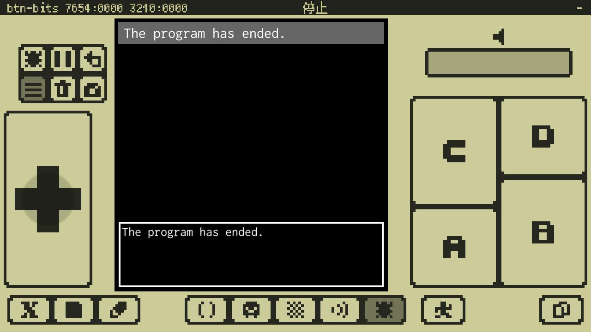
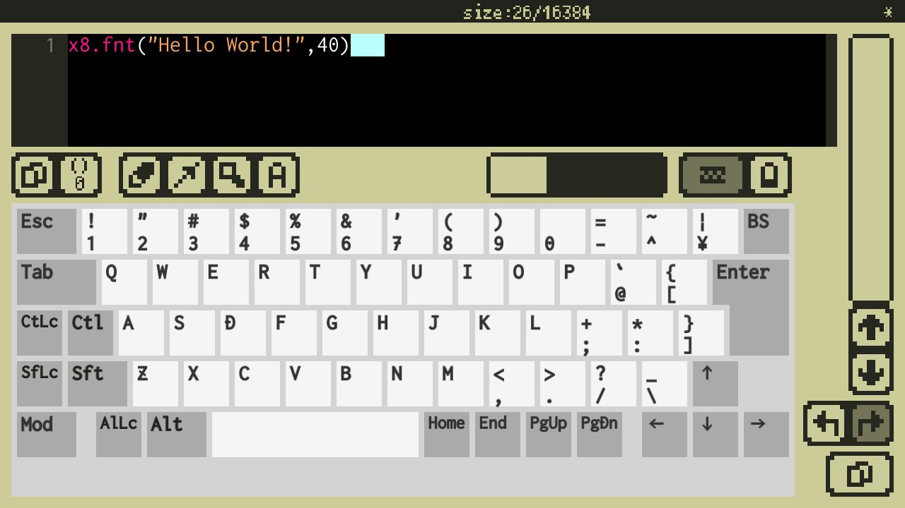
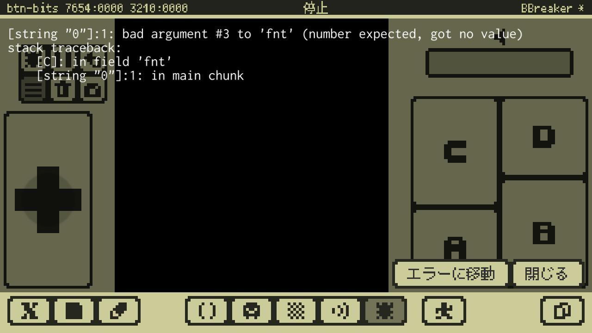

# プログラムの作成と実行

ここでは、プログラムを作成して実行する流れを見ていきます。

---

## プロジェクト作成

まずはプロジェクトが無いと何も始まらないので作ります。Home画面で**プロジェクトフォルダ**を選択します。すると**プロジェクト新規作成**ボタンが表示されるので、これを押すと新しいプロジェクトが開きます。

---

## プログラムの実行

プログラムは[Codeエディタ](manual.md#Codeエディタ)で書いていきます。プログラムを実際に書いたものを**ソースコード**とか**コード**とか言ったりします。

まだコードは空っぽですが、試しに実行してみましょう。[Debugモード](manual.md#Debugモード)に行って**デバッグ実行**すると…何も起きません。

**ログビュー**を表示すると実行時のエラーや結果が見られるので見てみます。



これは「プログラムは正常に終了した」という意味です。OKです。

---

## プログラムの作成

Codeエディタに戻って下のコードを書いてみましょう。

```
x8.fnt("Hello World!",40)
```

外部キーボードが接続されていれば、そのままキー入力出来ます。[外部キーボード](manual.md#外部キーボード)が無ければ、[画面キーボード](manual.md#画面キーボード)を使います。

Hint: もし外部キーボードをお持ちなら是非使ってみてください。プログラミングがとても楽になります。また、このページをx8studioが起動している端末で開いていれば、コードをコピーして、**CBからペースト**で貼り付けられます。



文字を入力していると[補完ポップアップ](#コード補完とコードスニペット)が出てきます。目的のワードが出たら`Enter`キーで確定してもいいし、無視してキー入力を続けても大丈夫です。補完中に`Tab`または`Shift+Tab`で候補を切り替えられます。

---

## プログラムの動作確認と修正

コードが書けたらDebugモードに移動して実行してみましょう。先程のコードが正確に入力されていれば…何も起きません。

ログビューを見るとなにかエラーが出ています。ログビューの下の方にある**ログ詳細ビュー**をタッチして、**ログ詳細ウィンドウ**を開きます。



ここにはエラーの起こった場所や理由が書いてあります。今は気にせず**エラーに移動**ボタンを押して、Codeエディタのエラーが起きた行に移動します。

コードを修正します。実はさっきのコードは、最後の方に`,60`が足りませんでした。正しくは以下の通りです（ごめんなさい、今度は本当です）。

```
x8.fnt("Hello World!",40,60)
```

修正したら改めてDebugモードで確認します。


うまく行けばマシン画面の真ん中くらいに`Hello World!`と表示され、プログラムも正常に終了していることがわかります。

念のためプロジェクトを[セーブ](quick_start.md#名前をつけて保存)しておきましょう。

#### これで **プログラムの作成と実行** はおしまいです。次行きましょー！！

[次へ](tutorial_01_02.md)

[このチュートリアルのトップへ](tutorial_01.md)
