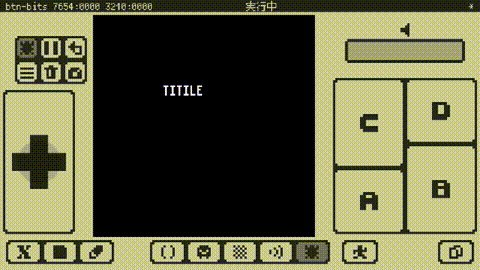
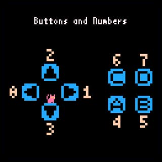

# シーンとシーン遷移

ゲーム全体のコードが長くなってくると、特徴が異なる場面（タイトルとかゲーム中とか）ごとに分けたほうが、作りやすいしコードも読みやすくなります。この場面のことを**シーン**といい、場面が切り替わることを**シーン遷移**といいます。

ここではシーンとシーン遷移について説明します。

---

## シーン遷移のコード

以下のコードとその実行結果を見てください。

```
while true do

   -- Title Scene
   x8.cls()
   x8.fnt("TITILE", 40, 40)
   while true do
      if x8.btntrg(4) then break end
      x8.wait()
   end

   x8.wait()

   -- Play Scene
   x8.cls()
   x8.fnt("PLAY", 40, 50)
   while true do
      if x8.btntrg(4) then break end
      x8.wait()
   end

   -- Game Over Scene
   x8.cls()
   x8.fnt("GAME OVER", 40, 60)
   x8.wait(30 * 3)

end
```



これは簡単なシーン遷移です。**このプログラムは終了しません。**シーンは以下の3つです。

- **タイトルシーン**では画面に`TITLE`と表示されます。**Aボタンを押すと**プレイシーンに遷移します。
- **プレイシーン**では画面に`PLAY`と表示されます。**Aボタンを押すと**ゲームオーバーシーンに遷移します。
- **ゲームオーバーシーン**では画面に`GAME OVER`と表示されます。**3秒待つと**タイトルシーンに遷移します。

---

## 制御構造とインデント

`while`は、プログラムの流れを制御する構造（**制御構造**）を作る文（**制御構文**）です。処理を繰り返す（**ループ**する）際に使うもので、こんな形をしています。

> `while` 式 `do` ブロック `end`

`while`文を実行した時、式が**真**なら`do`と`end`で囲まれた**ブロック**を実行し、`end`まで来たら`while`に戻ります（**ループします**）。式が**偽**なら`end`の次に制御を移します（**ループを抜けます**）。

制御構造で条件判断に使われる式を**条件式**といい、実行時に**真**か**偽**のどちらになるかが判定され、それによって制御の流れが変わります。**条件判断においては`nil`と`false`は偽であり、それ以外の値（`0`や空文字列`""`なども）は全て真です。**（`nil`は値が無いという意味です）

**ブロック**とは一連の文の並びのことで、制御構造の一部としても使われますが、自由に作ることもできます。

`true`は**ブーリアン型**という、値が`true`と`false`の2つしか無い型の値です。`true`は真、`false`は偽と解釈されます。

`if`も、条件によって制御を分岐したい時に使う制御構文です。上記の場合はこんな形をしています。

> `if` 式 `then` ブロック `end`

`if`文を実行した時、式が真なら`then`と`end`で囲まれたブロックを実行します。式が偽なら`end`の次に制御を移します。`if`文はもう少し複雑な分岐も出来ますが、今は先に進みます。

`break`文はそれを囲んでいる最も内側のループを抜けて、制御をループブロックの次へ移します。（**ループを抜けます**）

ブロックは入れ子構造にすることが出来ます。このコードも以下のような形の入れ子構造になっています。

```
whileブロック#1開始

   whileブロック#2開始
      ifブロック#1開始 〜 ifブロック#1終了
   whileブロック#2終了

   whileブロック#3開始
      ifブロック#2開始 〜 ifブロック#2終了
   whileブロック#3終了

whileブロック#1終了
```

ブロックの開始と終了の対応に注目してください。コードがブロックの内側になるたびに行頭の空白を増やしている（字下げしている）のは、この入れ子構造を見た目に分かりやすくするためです。この字下げのことを**インデント**といいます。

Note: インデントはプログラムの実行には関係ありませんが、人間が見てコードの構造を正しく認識するためにとても重要です。

Hint: インデントには`Tab`キーでの空白入力が便利です。

---

## フレームループとボタン入力

タイトルシーンのコードを見ていきます。

```
   -- Title Scene
   x8.cls()
   x8.fnt("TITILE", 40, 40)
   while true do
      if x8.btntrg(4) then break end
      x8.wait()
   end
```

`x8.cls`は画面をクリアする（0番の色で塗りつぶす）関数です。

`while`ループの条件式が`true`なので、ブロックの実行を永遠に繰り返します（**無限ループ**します）。

`x8.btntrg`は、今回の**フレーム**でボタンの**トリガー**（ボタンの**OFF**から**ON**への変化）が発生したかどうかの情報を返す関数です。`x8.btntrg(4)`の場合、Aボタンのトリガーがあれば`true`を、無ければ`false`を返します。

ボタンとその番号の関係は以下の通りです。



**フレーム**とは、画面の書き換えを含む、マシンの処理全体の1サイクルのことを言います。x8マシンでは通常、1秒あたり30回のフレーム処理が行われます。前回のフレームで押されていなかったボタンが、今回のフレームで押されると、今回のフレームでそのボタンの**トリガー**が発生します。

`x8.wait`はフレームを待つ（**マシンの処理サイクルを進める**）関数です。待つフレーム数を引数で指定します。フレーム数を省略すると1フレーム（次のフレームまで）待ちます。**`x8.wait`を呼ばないとフレームは進みません。**

Note: x8のプログラミングでは、無限ループ内には必ず`x8.wait`によるフレーム待ちを入れる必要があります。フレーム待ちを入れないとマシン全体の処理サイクルが進まないため、画面表示やパッド入力の更新が行われず、マシンがフリーズしたような状態になってしまいます。一定時間`x8.wait`が呼ばれないとタイムアウトエラーでプログラムは停止します。

結局この`TITLE`シーンのコードは、以下のような意味になります。

```
   -- Title Scene
   画面をクリアする
   画面に文字列"TITLE"を表示する
   無限ループ
      Aボタンが押されたらループを抜ける
      フレーム更新
   ループ終端
```

Hint: インタラクティブなシーンの骨格は、普通このように、1フレーム分の処理とフレーム待ちが入った無限ループの形をしています。

---

## シーン遷移の全体の説明

シーン遷移のコードを読む準備が出来ました。もう一度、コード全体を見てみましょう。

```
while true do

   -- Title Scene
   x8.cls()
   x8.fnt("TITILE", 40, 40)
   while true do
      if x8.btntrg(4) then break end
      x8.wait()
   end

   x8.wait()

   -- Play Scene
   x8.cls()
   x8.fnt("PLAY", 40, 50)
   while true do
      if x8.btntrg(4) then break end
      x8.wait()
   end

   -- Game Over Scene
   x8.cls()
   x8.fnt("GAME OVER", 40, 60)
   x8.wait(30 * 3)

end
```

結局このコードは以下のような意味になります。

```
無限ループ

   -- Title Scene
   画面をクリアする
   画面に文字列"TITLE"を表示する
   無限ループ
      Aボタンが押されたらループを抜ける
      フレーム更新
   ループ終端

   1フレーム待つ

   -- Play Scene
   画面をクリアする
   画面に文字列"PLAY"を表示する
   無限ループ
     Aボタンが押されたらループを抜ける
     フレーム更新
   ループ終端

   -- Game Over Scene
   画面をクリアする
   画面に文字列"GAME OVER"を表示する
   3秒待つ

ループ終端
```

シーン毎の無限ループが並び、全体もまた無限ループになっています。最後にいくつか補足があります。

プレイシーンの直前で**1フレーム待つ**のは、フレーム更新せずにプレイシーンのトリガー判定を行うと、タイトルシーンで発生した（これでループを抜けた）トリガーを、そのままプレイシーンでも検出してしまうのを防ぐためです。試しにここをコメントアウトするとプレイシーンがスキップされてしまうのがわかります。

最後の**3秒待つ**は、1秒が30フレームなことから、`30 * 3`フレームで3秒待つ、ということです。


#### これで **シーンとシーン遷移** の説明はおしまいです。次行きましょー！！
