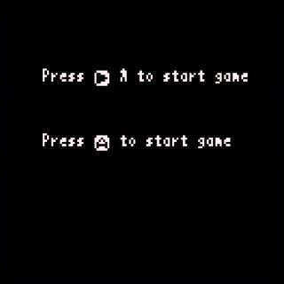

# プレイシーン以外の全て

プレイシーンまでもう一息です。プレイシーンの説明に行く前に、他の全てを片付けてしまいましょう。

ここではプレイシーン以外の全てを説明します。

---

## プレイシーンを除く全コード

以下のコードとその実行結果を見てください。

```
INFO_Y = 118

top_score = 0

-- Main
function main()
   -- Initialize
   top_score = 0
   -- Game scenes
   while true do
      titleScene()
      playScene()
      gameoverScene()
   end
end

-- Title Scene
function titleScene()
   -- Clear screen
   x8.cls()
   -- Draw title
   x8.fntscale(3, 3)
   local title = "B.BREAKER"
   local tw = x8.fntmeas(title)
   x8.fnt(title, (128 - tw) * 0.5 + 1, 24 + 1, 11) -- Shadow
   x8.fnt(title, (128 - tw) * 0.5, 24, 7)
   -- Draw operating instructions
   x8.fntscale()
   local prst = "Press Ⓐ to start game"
   local prstw = x8.fntmeas(prst)
   x8.fnt(x8.enc("←→"), 16, 70, 6)
   x8.fnt(x8.enc("Ⓐ or Ⓑ"), 16, 80, 6)
   x8.fnt(".. Move Racket", 56, 70, 6)
   x8.fnt(".. Shoot, Quick", 56, 80, 6)
   -- Draw message
   x8.fnt(x8.enc(prst), (128 - prstw) * 0.5, INFO_Y, 7)
   -- Draw top score
   x8.fnt("TOP SCORE", 16, 100, 6)
   x8.fnt(".. "..top_score, 56, 100, 6)
   -- Wait
   while true do
      -- Press A to start game
      if x8.btntrg(4) then break end
      -- Next frame
      x8.wait()
   end
end

-- Game over scene
function gameoverScene()
   -- Clear screen
   x8.cls()
   -- Draw message
   x8.fntscale()
   local message = "GAME OVER"
   local w, h = x8.fntmeas(message)
   local y = 56
   x8.fnt(message, (128 - w) * 0.5, (128 - h) * 0.5, 8)
   -- Wait
   x8.wait(30 * 3)
end

-- Play Scene
function playScene()
   x8.cls()
   x8.fnt("PLAY", 40, 50)
   x8.wait()
   while true do
      if x8.btntrg(4) then break end
      x8.wait()
   end
   top_score = top_score + 100
end

-- Start the game
main()
```


これは**B.BREAKER**の完全なコードから、プレイシーンの詳細だけを除いたものです。ちょっと長いですが、全体の構造はわかっているし、詳細もほとんど知っていることばかりです。これから残り部分を説明していきます。

---

## ローカル変数とグローバル変数

変数の前に`local`を付けると、そこで**新しいローカル変数が作られます**（**ローカル宣言**されます）。今まで紹介してきた`local`を付けない変数は全て**グローバル変数**です。

**ローカル変数**は、その宣言を含む最も内側のブロック内の、その宣言より後方からしか参照できません（**見えません**）。この変数が**見える**範囲のことを**スコープ**と言います。ローカル変数は、変数が見える範囲を限定したい場合や、一時的な利用に限定したい場合に便利です。

**グローバル変数**はどこからでも見えます。プログラム内のいろんな場所から利用したい変数には、グローバル変数を使います。

Hint: 新しいグローバル変数を使う際は、**既に同じ名前のグローバル変数がないか注意する必要があり**、名前の衝突を避けようと変数名も長くなりがちです。ローカル変数なら`x`や`y`などの短い変数名を、名前の衝突を気にせずに使えるうえ、コードも見やすく、デバッグもしやすくなります。ローカル変数で済むところはできるだけローカル変数を使いましょう。

Hint: **スコープ**の詳細については[可視性ルール](lua_basics.md#可視性ルール)を見てください。

---

## 特殊文字

x8で利用出来る文字フォントには、いくつか独自の**特殊文字**があります。特殊文字の入力には、入力される文字がキートップに表示される[画面キーボード](manual.md#画面キーボード)が分かりやすくて便利です。


以下のコードとその実行結果を見てください。

```
x8.fnt("Press Ⓐ to start game", 18, 30)
x8.fnt(x8.enc("Press Ⓐ to start game"), 18, 60)
```



コードの1行目の結果が上、2行目の結果が下です。上では、文字列中の`Ⓐ`が正しく表示されていません。下では、`Ⓐ`を含め文字列が正しく表示されています。

2行目の`x8.enc`は、文字列に含まれるカタカナや特殊文字の文字コードを、Lua言語が扱える文字コードに変換して返す関数です。この場合、文字列中の`Ⓐ`がLua言語が扱える文字コードに変換されるので、結果正しく表示されます。

Note: カタカナや特殊文字を含む文字列を利用する場合は、必ず最初に`x8.enc`で変換してから利用します。そうしないと文字化けしてしまいます。

---

## コード全体の説明

コードを読む準備が出来ました。もう一度、コード全体を見てみましょう。

```
INFO_Y = 118

top_score = 0

-- Main
function main()
   -- Initialize
   top_score = 0
   -- Game scenes
   while true do
      titleScene()
      playScene()
      gameoverScene()
   end
end

-- Title Scene
function titleScene()
   -- Clear screen
   x8.cls()
   -- Draw title
   x8.fntscale(3, 3)
   local title = "B.BREAKER"
   local tw = x8.fntmeas(title)
   x8.fnt(title, (128 - tw) * 0.5 + 1, 24 + 1, 11) -- Shadow
   x8.fnt(title, (128 - tw) * 0.5, 24, 7)
   -- Draw operating instructions
   x8.fntscale()
   local prst = "Press Ⓐ to start game"
   local prstw = x8.fntmeas(prst)
   x8.fnt(x8.enc("←→"), 16, 70, 6)
   x8.fnt(x8.enc("Ⓐ or Ⓑ"), 16, 80, 6)
   x8.fnt(".. Move Racket", 56, 70, 6)
   x8.fnt(".. Shoot, Quick", 56, 80, 6)
   -- Draw message
   x8.fnt(x8.enc(prst), (128 - prstw) * 0.5, INFO_Y, 7)
   -- Draw top score
   x8.fnt("TOP SCORE", 16, 100, 6)
   x8.fnt(".. "..top_score, 56, 100, 6)
   -- Wait
   while true do
      -- Press A to start game
      if x8.btntrg(4) then break end
      -- Next frame
      x8.wait()
   end
end

-- Game over scene
function gameoverScene()
   -- Clear screen
   x8.cls()
   -- Draw message
   x8.fntscale()
   local message = "GAME OVER"
   local w, h = x8.fntmeas(message)
   local y = 56
   x8.fnt(message, (128 - w) * 0.5, (128 - h) * 0.5, 8)
   -- Wait
   x8.wait(30 * 3)
end

-- Play Scene
function playScene()
   x8.cls()
   x8.fnt("PLAY", 40, 50)
   x8.wait()
   while true do
      if x8.btntrg(4) then break end
      x8.wait()
   end
   top_score = top_score + 100
end

-- Start the game
main()
```

### グローバル変数

最初に2つのグローバル変数`INFO_Y`と`top_score`があります。何の変数か調べるため、[Codeエディタ](manual.md#Codeエディタ)の**検索機能**で検索して、変数が使われているところを見てみましょう。

変数名の上にカーソルを合わせてから、**検索メニュー**の**前方検索**（またはショートカット`Ctrl+F`）で検索ウィンドウを開きます。すると、検索する文字列に変数名が設定された状態でウィンドウが開くので、そのまま検索して使われているところを見てみます。


`INFO_Y`は、タイトルシーンでの`"Press Ⓐ to start game"`を表示するy座標です。

Hint: メッセージのy座標をわざわざ変数に入れて使っているのは、開発時にy座標を調整しやすくするためです。このように、あとで調整したい値は、変数に入れて目立つところ（プログラムや関数定義の先頭など）にまとめておくと、作業がしやすくなります。

`top_score`は、タイトルシーンで`"TOP SCORE"`の右に表示される数値です。本来はトップスコアの値が入りますが、このコードではプレイシーンを抜けるたびに`+ 100`しています。

Hint: トップスコアの値をグローバル変数に入れているのは、プログラム内のいろんな場所から利用するためです。グローバル変数は、目立つところ（プログラムの先頭など）にまとめておくと、作業がしやすくなります。

###  メイン関数

次はメイン関数です。

```
-- Main
function main()
   -- Initialize
   top_score = 0
   -- Game scenes
   while true do
      titleScene()
      playScene()
      gameoverScene()
   end
end
```

メイン関数については[ここで説明](tutorial_01_05.md#メイン関数)しました。各シーンを順番に呼び出す無限ループがあります。ループの前に`top_score`を`0`クリアするコードが追加されています。

Hint: トップスコアのクリアのように、最初の状態に設定するようなことを**初期化**するといいます。トップスコアは最初に一度だけ初期化すればよいので、シーン遷移ループの前で行っています。

### タイトルシーン関数

次はタイトルシーン関数です。

```
-- Title Scene
function titleScene()
   -- Clear screen
   x8.cls()
   -- Draw title
   x8.fntscale(3, 3)
   local title = "B.BREAKER"
   local tw = x8.fntmeas(title)
   x8.fnt(title, (128 - tw) * 0.5 + 1, 24 + 1, 11) -- Shadow
   x8.fnt(title, (128 - tw) * 0.5, 24, 7)
   -- Draw operating instructions
   x8.fntscale()
   local prst = "Press Ⓐ to start game"
   local prstw = x8.fntmeas(prst)
   x8.fnt(x8.enc("←→"), 16, 70, 6)
   x8.fnt(x8.enc("Ⓐ or Ⓑ"), 16, 80, 6)
   x8.fnt(".. Move Racket", 56, 70, 6)
   x8.fnt(".. Shoot, Quick", 56, 80, 6)
   -- Draw message
   x8.fnt(x8.enc(prst), (128 - prstw) * 0.5, INFO_Y, 7)
   -- Draw top score
   x8.fnt("TOP SCORE", 16, 100, 6)
   x8.fnt(".. "..top_score, 56, 100, 6)
   -- Wait
   while true do
      -- Press A to start game
      if x8.btntrg(4) then break end
      -- Next frame
      x8.wait()
   end
end
```

ちょっとごちゃごちゃしていますが、要約すると以下のようになります。

```
-- Title Scene
function titleScene()
   -- Clear screen
   画面をクリアする
   -- Draw title
   タイトルを表示する
   -- Draw operating instructions
   操作方法を表示する
   -- Draw message
   Ⓐ押下を促すメッセージを表示する
   -- Draw top score
   トップスコアを表示する
   -- Wait
   Ⓐボタンが押されるのを待つ
end
```

**タイトルを表示する**部分は、[ここで説明](tutorial_01_03.md#タイトル表示コードの説明)しました。横位置をセンタリングしつつ、影を付けるため2回描画しています。

**操作方法を表示する**部分で`x8.fntscale()`しているのは、タイトル表示で変更された文字の表示倍率を元に戻すためです。

**操作方法を表示する**部分と**トップスコアを表示する**部分では、ボタンとその説明、`"TOP SCORE"`とその値など、各パーツ毎に位置を指定して表示しています。特殊文字を含む文字列は、必ず`x8.enc`を通していることに注意してください。

**Ⓐ押下を促すメッセージを表示する**部分のx座標の計算式は、タイトル表示と同じく横位置のセンタリングを行うものです。

```
   x8.fnt(x8.enc(prst), (128 - prstw) * 0.5, INFO_Y, 7)
```

**Ⓐボタンが押されるのを待つ**部分は、[ここで説明](tutorial_01_04.md#フレームループとボタン入力)しました。無限ループが`x8.wait()`を含むことに注意してください。

### ゲームオーバーシーン関数

次はゲームオーバーシーン関数です。

```
-- Game over scene
function gameoverScene()
   -- Clear screen
   x8.cls()
   -- Draw message
   x8.fntscale()
   local message = "GAME OVER"
   local w, h = x8.fntmeas(message)
   local y = 56
   x8.fnt(message, (128 - w) * 0.5, (128 - h) * 0.5, 8)
   -- Wait
   x8.wait(30 * 3)
end
```

画面に`"GAME OVER"`を表示して3秒待ったらおしまいです。

`x8.fnt`の座標指定の計算式で、縦と横をセンタリングしているので、画面の中央に表示されます。

### プレイシーン関数

次はプレイシーン関数です。

```
-- Play Scene
function playScene()
   x8.cls()
   x8.fnt("PLAY", 40, 50)
   x8.wait()
   while true do
      if x8.btntrg(4) then break end
      x8.wait()
   end
   top_score = top_score + 100
end
```

画面に`"PLAY"`を表示して、Ⓐボタンが押されるまで無限ループで待ちます。ループを抜けたらトップスコアに`+ 100`しておしまいです。プレイシーンを抜けるたびにトップスコアが`+100`されます。

### メイン関数呼び出し

最後にメイン関数を呼び出して、ゲームの実行を開始しています。以上！！


#### これで **プレイシーン以外の全て** の説明はおしまいです。次行きましょー！！

[次へ](tutorial_01_07.md)

[このチュートリアルのトップへ](tutorial_01.md)
