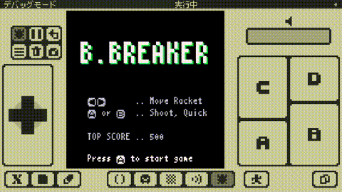
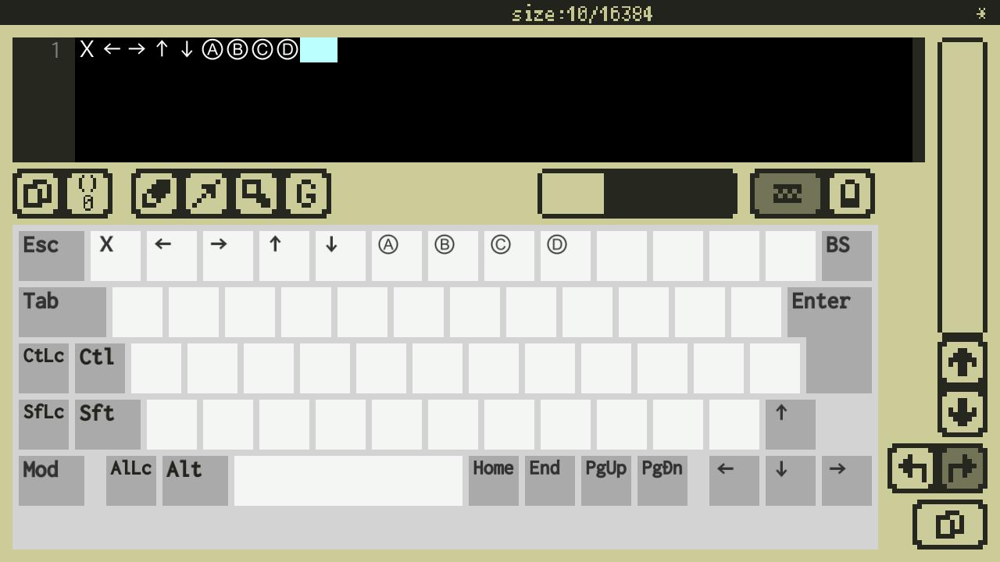

# プレイシーン以外の全て

以下のコードを見てください。

```
INFO_Y = 118

top_score = 0

-- Main
function main()
   -- Initialize
   top_score = 0
   -- Game scenes
   while true do
      titleScene()
      playScene()
      gameoverScene()
   end
end

-- Title Scene
function titleScene()
   -- Clear screen
   x8.cls()
   -- Draw title
   x8.fntscale(3, 3)
   local title = "B.BREAKER"
   local tw = x8.fntmeas(title)
   x8.fnt(title, (128 - tw) * 0.5 + 1, 24 + 1, 11) -- Shadow
   x8.fnt(title, (128 - tw) * 0.5, 24, 7)
   -- Draw operating instructions
   x8.fntscale()
   local prst = "Press Ⓐ to start game"
   local prstw = x8.fntmeas(prst)
   x8.fnt(x8.enc("←→"), 16, 70, 6)
   x8.fnt(x8.enc("Ⓐ or Ⓑ"), 16, 80, 6)
   x8.fnt(".. Move Racket", 56, 70, 6)
   x8.fnt(".. Shoot, Quick", 56, 80, 6)
   -- Draw message
   x8.fnt(x8.enc(prst), (128 - prstw) * 0.5, INFO_Y, 7)
   -- Draw top score
   x8.fnt("TOP SCORE", 16, 100, 6)
   x8.fnt(".. "..top_score, 56, 100, 6)
   -- Wait
   while true do
      -- Press A to start game
      if x8.btntrg(4) then break end
      -- Next frame
      x8.wait()
   end
end

-- Game over scene
function gameoverScene()
   -- Clear screen
   x8.cls()
   -- Draw message
   x8.fntscale()
   local message = "GAME OVER"
   local w, h = x8.fntmeas(message)
   local y = 56
   x8.fnt(message, (128 - w) * 0.5, (128 - h) * 0.5, 8)
   -- Wait
   x8.wait(30 * 3)
end

-- Play Scene
function playScene()
   x8.cls()
   x8.fnt("PLAY", 40, 50)
   x8.wait()
   while true do
      if x8.btntrg(4) then break end
      x8.wait()
   end
   top_score = top_score + 100
end

-- Start the game
main()
```

これを実行するとこうなります。



これは**B.BREAKER**の完全なコードから、プレイシーンの詳細だけを除いたものです。ほとんどが、既に理解出来る内容であることが分かると思います。まだ説明していない、残りの部分を見ていきます。

## ローカル変数とグローバル変数

変数の前に`local`を付けると、そこで新しい**ローカル変数**が作られます（**ローカル宣言**されます）。今まで紹介してきた`local`を付けない変数は全て**グローバル変数**です。

**ローカル変数**は、その宣言を含む最も内側のブロック内の、その宣言よりあとからしか参照できません（**見えません**）。この変数が**見える**範囲のことを**スコープ**と言います。ローカル変数は、限られた範囲での利用であったり、一時的な利用である場合に使います。

**グローバル変数**はどこからでも見えます。プログラム内の複数の場所から、共通の変数を利用したい場合に使います。

Hint: 新しいグローバル変数を使う際は、既に同じ名前のグローバル変数がないか注意が必要です。また、名前の衝突を避けようとして、つい変数名が長くなってしまいます。ローカル宣言を利用すると、`x`や`y`などの短い変数名を、名前の衝突を気にせずに使えてとても便利です。**スコープ**について、詳しくは[可視性ルール](lua_basics.md#可視性ルール)を参照してください。

## 特殊文字

x8で利用出来る文字フォントには、いくつか独自の特殊文字があります。特殊文字の入力には、キートップに特殊文字が表示されるため、画面キーボードが便利です。



以下のコードを見てください。

```
x8.fnt("Press Ⓐ to start game", 18, 30)
x8.fnt(x8.enc("Press Ⓐ to start game"), 18, 60)
```

これを実行するとこうなります。


コードの1行目の結果が上、2行目の結果が下です。上では`Ⓐ`の部分が意図したものと違う表示になっています。下では`Ⓐ`が正しく表示されています。

2行目で使われている`x8.enc`は、文字列に含まれるカタカナや特殊文字の文字コードを、Lua言語が扱える文字コードに変換して返す関数です。カタカナや特殊文字を含む文字列を利用する場合は、必ず`x8.enc`で変換してから利用しないと文字化けしてしまいます。

これでプレイシーン以外の全ての説明はおしまいです。次行きましょー！！
