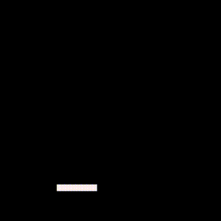
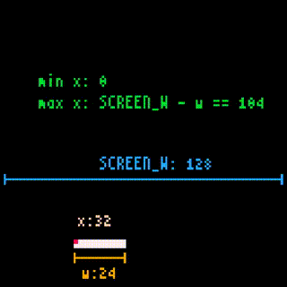

# ラケットの操作と演算子

ラケットを表示して動かせるようになりました。

ここではラケットの移動を制限したり、素早く動かしたりする部分を説明します。

---

## ラケット操作の完全なコード

以下のコードとその実行結果を見てください。

```
SCREEN_W = 128
x = 32
y = 108
w = 24
h = 4

while true do
   -- Move
   local v = 2.0
   if x8.btnprs(4) or x8.btnprs(5) then -- Ⓐ or Ⓑ
      v = v * 3.0
   end
   if x8.btnprs(0) then -- ←
      x = x - v
   elseif x8.btnprs(1) then -- →
      x = x + v
   end
   if x < 0 then
      x = 0
   elseif (x + w) > SCREEN_W then
      x = SCREEN_W - w
   end
   -- Draw
   x8.cls()
   x8.rect(x, y, x + w - 1, y + h - 1)
   -- Next frame
   x8.wait()
end
```



これは、ラケット操作の完全なコードです。`Ⓐ`または`Ⓑ`を押していると素早く移動でき、画面からはみ出したりもしません。

---

## 演算子と式の評価

`if`文の条件式に出てくる`or`、`<`、`>`のことを**演算子**といいます。

**演算**とは計算のことをいい、演算するとは計算することをいいます。

**演算子**とは演算を表す記号のことで、いくつかの引数を取って1つの値を返します。今まで出てきた`+`、`-`、`*`なども**算術演算子**という演算子です。

式に書かれた演算や関数呼び出しなどが実行されることを、式が**評価**されるといいます。式は評価されると、結果として必ず値になります。逆にいうと、実行結果が値にならないコードを式として書くことはできません。

---

## 算術演算子

**算術演算子**は普通の数値計算を行う演算子のことで、以下のものがあります。

- `+` : 加算
- `-` : 減算
- `*` : 乗算
- `/` : 浮動小数点数除算（小数部もちゃんと計算されます）
- `//` : 切り捨て除算（結果の小数部は切り捨てられます）
- `%` : 剰余
- `^` : 累乗
- `-` : 単項マイナス（独立した`-3`とかのマイナス）

例えば評価結果`x`は以下のようになります。

```
x = 3 ^ 3       -- x:27
x = 3.6 ^ 2.4   -- x:21.633460842026
x = 9 / 4       -- x:2.25
x = 9 / 2.5     -- x:3.6
x = 9 // 4      -- x:2
x = 9.3 // 4    -- x:2.0
x = 9 % 4       -- x:1
x = 9 % 4.3     -- x:0.4
```

Hint: **算術演算子**について、[詳しい説明はこちら](lua_basics.md#算術演算子)にありますが、ややこしいことは後回しで大丈夫です。

---

## 関係演算子

`<`と`>`は**関係演算子**といいます。関係演算子は、それを挟んで左右2つの引数を取り、演算子が意味する関係であれば`true`、違えば`false`を返します。関係演算子には以下のものがあります。

- `==` : 左の値と右の値が等しい
- `~=` : 左の値と右の値が等しくない
- `<` : 左の値が右の値より小さい
- `>` : 左の値が右の値より大きい
- `<=` : 左の値が右の値より小さい、または等しい
- `>=` : 左の値が右の値より大きい、または等しい

```
x = 3 == 3      -- x:true
x = 3 ~= 3      -- x:false
x = 5 < 8       -- x:true
x = "6" == 6    -- x:false
```

Hint: **関係演算子**について、[詳しい説明はこちら](lua_basics.md#関係演算子)にありますが、ややこしいことは後回しで大丈夫です。

---

## 論理演算子

`if`文の式に出てくる`or`は**論理演算子**といいます。論理演算子には`and`、`or`、`not`があります。

- `not` : 右の引数の真偽を反転して、結果を`true`か`false`で返します。**引数が真なら結果は偽、引数が偽なら結果は真になります。**
- `and` : 左の引数が`false`か`nil`であればその引数を返し、そうでなければ右の引数を返します。**引数が両方とも真なら結果は真、それ以外なら結果は偽になります。**
- `or` : 左の引数が`nil`でも`false`でもなければその引数を返し、そうでなければ右の引数を返します。**引数のどちらか一方でも真なら結果は真、それ以外なら結果は偽になります。**

Hint: `and`と`or`の動作がややこしいですが、`if`文や`while`文などの**条件式**の中で使われる場合は、**引数の真偽と結果の真偽の関係**だけに着目すれば大丈夫です。

```
x = not 10              -- x:false
x = not nil             -- x:true
x = 10 or 20            -- x:10
x = nil or "a"          -- x:"a"
x = nil and 10          -- x:nil
x = false and nil       -- x:false
x = false or nil        -- x:nil
x = 10 and 20           -- x:20
```

Hint: **論理演算子**について、[詳しい説明はこちら](lua_basics.md#論理演算子)にありますが、ややこしいことは後回しで大丈夫です。

---

## 演算子の優先順位

普通 `2 + 3 * 5` のような計算をする場合、乗算の`3 * 5`を、加算の`2 + 3`より先に計算します。同様に、複数の演算が並んだ場合、**演算子の優先順位**により、どの演算が優先されるかが決まっています。
今まで出てきた演算子の優先順位は以下のとおりです。より上にあるほど先に演算されます。

- `^`
- `not` `-`(単項マイナス)
- `*` `/` `//` `%`
- `+` `-`
- `<` `>` `<=` `>=` `~=` `==`
- `and`
- `or`

普通の数式と同じように、括弧`( )`を使って式の優先度を変えることができます。

Hint: 演算子の優先順位に不安があるときは、気軽に括弧`( )`を使っちゃいましょう。あとから見返したときにもわかりやすいです。

Hint: **演算子の優先順位**について、[詳しい説明はこちら](lua_basics.md#優先順位)にありますが、ややこしいことは後回しで大丈夫です。

---

## コードの説明

もう一度、ラケット操作のコード全体を見てみましょう。

```
SCREEN_W = 128
x = 32
y = 108
w = 24
h = 4

while true do
   -- Move
   local v = 2.0
   if x8.btnprs(4) or x8.btnprs(5) then -- Ⓐ or Ⓑ
      v = v * 3.0
   end
   if x8.btnprs(0) then -- ←
      x = x - v
   elseif x8.btnprs(1) then -- →
      x = x + v
   end
   if x < 0 then
      x = 0
   elseif (x + w) > SCREEN_W then
      x = SCREEN_W - w
   end
   -- Draw
   x8.cls()
   x8.rect(x, y, x + w - 1, y + h - 1)
   -- Next frame
   x8.wait()
end
```

これは、[ラケットを動かすコード](tutorial_01_08.md#コード全体の説明) に、2つの部分が追加されたものです。

### 素早く動かす

1つ目は、フレームループの開始直後にある、この部分です。

```
   local v = 2.0
   if x8.btnprs(4) or x8.btnprs(5) then -- Ⓐ or Ⓑ
      v = v * 3.0
   end
```

毎回新しい`v`を作り`2.0`に設定しています。そのあと、もし、`Ⓐ`押されている`or`"**または**"`Ⓑ`が押されているなら、`v`を`3.0`倍にしています。

これは、`Ⓐ`か`Ⓑ`を押しながらラケットを操作すると、ラケットの動きが速くなる処理です。ループ開始時に速度をリセットすることで、加速し続けないようにしています。

### 移動制限

2つ目は、入力によるラケット移動の直後にある、この部分です。

```
   if x < 0 then
      x = 0
   elseif (x + w) > SCREEN_W then
      x = SCREEN_W - w
   end
```

もし、`x`が`0`**より小さい**なら`x`を`0`に固定し、`x + w`が`SCREEN_W`**より大きい**なら`x`を`SCREEN_W - w`に固定しています。

これは、直前の移動処理の結果ラケットが画面からはみ出ていたら、画面内に戻す処理です。



これにより、ラケットを描画する際は常に、ラケットの座標が画面内に収まるよう調整済みになっています。


#### これで **ラケットの操作と演算子** の説明はおしまいです。次行きましょー！！
