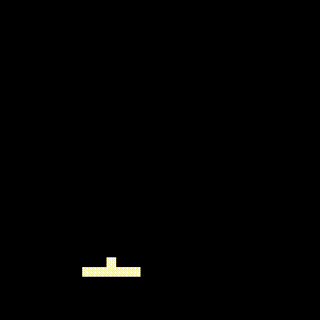
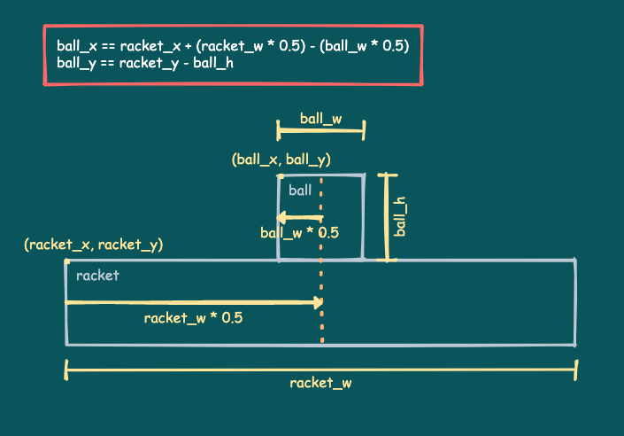
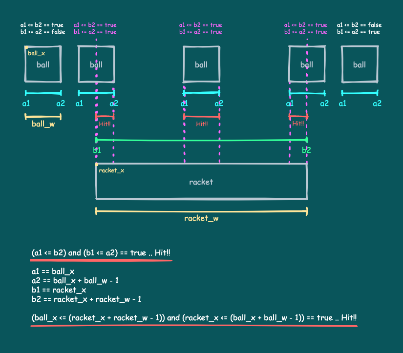

# ボールを打ち返す

ここではラケットでボールを打ち返す処理を説明します。

---

## ボールを打ち返すコード

以下のコードとその実行結果を見てください。

```
SCREEN_W = 128
SCREEN_H = 128
BALL_SPEED = 1.5
RACKET_SPEED = 2.0

ball_x = 50
ball_y = 80
ball_w = 4
ball_h = 4
ball_vx = 0
ball_vy = 0

racket_x = 32
racket_y = 108
racket_w = 24
racket_h = 4

is_started = false

while true do

   -- Move the racket
   local racket_speed = RACKET_SPEED
   if x8.btnprs(4) or x8.btnprs(5) then -- Ⓐ or Ⓑ
      racket_speed = racket_speed * 3.0
   end
   if x8.btnprs(0) then -- ←
      racket_x = racket_x - racket_speed
   elseif x8.btnprs(1) then -- →
      racket_x = racket_x + racket_speed
   end
   if racket_x < 0 then
      racket_x = 0
   elseif (racket_x + racket_w) > SCREEN_W then
      racket_x = SCREEN_W - racket_w
   end

   -- Shoot the ball
   if not is_started and (x8.btntrg(4) or x8.btntrg(5)) then -- Ⓐ or Ⓑ
      is_started = true
      ball_vx = BALL_SPEED
      ball_vy = -BALL_SPEED
   end

   -- Move the ball
   if is_started then
      ball_x = ball_x + ball_vx
      ball_y = ball_y + ball_vy
   else
      ball_x = racket_x + (racket_w * 0.5) - (ball_w * 0.5)
      ball_y = racket_y - ball_h
   end

   -- Bounce by the left wall
   if ball_x < 0 then
      ball_x = ball_x - (ball_x * 2)
      ball_vx = -ball_vx
   -- Bounce by the right wall
   elseif (ball_x + ball_w) > SCREEN_W then
      ball_x = ball_x - (((ball_x + ball_w) - SCREEN_W) * 2)
      ball_vx = -ball_vx
   end
   -- Bounce by the above wall
   if ball_y < 0 then
      ball_y = ball_y - (ball_y * 2)
      ball_vy = -ball_vy
   end

   -- Check for mistake
   if ball_y > SCREEN_H then
      is_started = false
   end

   -- The ball and the racket hit check
   if (ball_vy > 0) then
      if (ball_x <= (racket_x + racket_w - 1))
         and (racket_x <= (ball_x + ball_w - 1))
         and (ball_y <= (racket_y + racket_h - 1))
         and (racket_y <= (ball_y + ball_h - 1))
      then
         ball_vy = -ball_vy
      end
   end

   -- Draw
   x8.cls()
   x8.rect(racket_x, racket_y,
           racket_x + racket_w - 1, racket_y + racket_h - 1)
   x8.rect(ball_x, ball_y,
           ball_x + ball_w - 1, ball_y + ball_h - 1)

   -- Next frame
   x8.wait()
end
```



これは、いままでに説明してきたラケットとボールの処理と、ラケットでボールを打ち返す処理を合わせたものです。

最初ボールはラケットにくっついていて、`Ⓐ`か`Ⓑ`のボタンを押すと右上に発射されます。ボールを画面下に落とすと、また、ボールはラケットにくっついた状態に戻ります。

新しいことは何もないので、早速説明していきます。

---

## 変数

最初は、先頭に並んでいる変数の部分です。

```
SCREEN_W = 128
SCREEN_H = 128
BALL_SPEED = 1.5
RACKET_SPEED = 2.0

ball_x = 50
ball_y = 80
ball_w = 4
ball_h = 4
ball_vx = 0
ball_vy = 0

racket_x = 32
racket_y = 108
racket_w = 24
racket_h = 4

is_started = false
```

`SCREEN_W`、`SCREEN_H`は画面の幅と高さ、`BALL_SPEED`、`RACKET_SPEED`はボールとラケットの1フレームあたりの移動量です。

`ball_`で始まるものはボールに関する変数、`racket_`で始まるものはラケットに関する変数です。これらの変数はそれぞれの動きの説明のときにでてきたものと同じですが、変数名の衝突を避けるために名前が長くなっています。

`is_started`はプレイがスタートしたかどうかを表します。ボールが動き始めたら`true`、ラケットにくっついた状態なら`false`です。

Hint: 変数名が大文字だったり小文字だったりするのは、その変数の性質を見る人に分かりやすくするためで、Lua言語的な意味はありません。この場合、実行中に値が変化しない変数（**定数**）は全て大文字の名前にしています。このように名前の付け方（**命名規則**）に自分なりのルールを決めておくと、あとでプログラムが読みやすくなります。

---

## ラケットの動き

フレームループの処理に入ります。この部分はラケットの動きの処理です。

```
   -- Move the racket
   local racket_speed = RACKET_SPEED
   if x8.btnprs(4) or x8.btnprs(5) then -- Ⓐ or Ⓑ
      racket_speed = racket_speed * 3.0
   end
   if x8.btnprs(0) then -- ←
      racket_x = racket_x - racket_speed
   elseif x8.btnprs(1) then -- →
      racket_x = racket_x + racket_speed
   end
   if racket_x < 0 then
      racket_x = 0
   elseif (racket_x + racket_w) > SCREEN_W then
      racket_x = SCREEN_W - racket_w
   end
```

これはよく見ると、既に説明した[ラケット操作のコード](tutorial_01_08.md)とほとんど同じです。違うのは変数名が長くなったのと、ラケットのスピードが予め変数に入っていることだけです。

---

## ボールの動きとミスのチェック

この部分はボールの動きとミスのチェックを行う処理です。

```
   -- Shoot the ball
   if not is_started and (x8.btntrg(4) or x8.btntrg(5)) then -- Ⓐ or Ⓑ
      is_started = true
      ball_vx = BALL_SPEED
      ball_vy = -BALL_SPEED
   end

   -- Move the ball
   if is_started then
      ball_x = ball_x + ball_vx
      ball_y = ball_y + ball_vy
   else
      ball_x = racket_x + (racket_w * 0.5) - (ball_w * 0.5)
      ball_y = racket_y - ball_h
   end

   -- Bounce by the left wall
   if ball_x < 0 then
      ball_x = ball_x - (ball_x * 2)
      ball_vx = -ball_vx
   -- Bounce by the right wall
   elseif (ball_x + ball_w) > SCREEN_W then
      ball_x = ball_x - (((ball_x + ball_w) - SCREEN_W) * 2)
      ball_vx = -ball_vx
   end
   -- Bounce by the above wall
   if ball_y < 0 then
      ball_y = ball_y - (ball_y * 2)
      ball_vy = -ball_vy
   end

   -- Check for mistake
   if ball_y > SCREEN_H then
      is_started = false
   end
```

これもよく見ると、既に説明した[ボールの動きのコード](tutorial_01_09.md)とほとんど同じです。変数名が長くなっていること以外の違っている部分を説明します。

最初に`Ⓐ`か`Ⓑ`ボタンでボールを発射する処理があります。発射の際、ボールの方向を右上に設定し、`is_started`を`true`にしてプレイをスタートしています。

次にボールの移動処理があります。プレイがスタートしている場合、ボールの位置にx,yの移動量を加算して動かしているのは以前と同じです。プレイがスタートしていない場合、ボールの位置をラケットの位置に合わせて更新することで、ラケットにくっつけています。

新しいボールの位置は、ラケットの位置から以下のように求めるています。



次に壁でのバウンド処理がありますが、ここは以前と全く同じです。

最後にミスをチェックしている処理があります。ボールが画面の下に出たらミスになり、`is_started`を`false`にしてプレイがスタートする前の状態に戻しています。

---

## ボールとラケットの当たり判定

この部分が今回のポイントで、ボールとラケットの当たり判定を行う処理です。

```
   -- The ball and the racket hit check
   if (ball_vy > 0) then
      if (ball_x <= (racket_x + racket_w - 1))
         and (racket_x <= (ball_x + ball_w - 1))
         and (ball_y <= (racket_y + racket_h - 1))
         and (racket_y <= (ball_y + ball_h - 1))
      then
         ball_vy = -ball_vy
      end
   end
```

最初に`if (ball_vy > 0) then`で、ボールの移動が下向きのときだけに限定しているのは、当たり判定を必要なときだけ行うようにするためです。ボールが上向きに移動している場合や、ボールがラケットにくっついている場合は、当たり判定を行いません。

次の長い`if`文が実際に当たり判定を行っています。ボールがラケットに当たったら、ボールのyの移動方向を反転（移動量の符号を反転）して打ち返します。

```
      if (ball_x <= (racket_x + racket_w - 1))
         and (racket_x <= (ball_x + ball_w - 1))
         and (ball_y <= (racket_y + racket_h - 1))
         and (racket_y <= (ball_y + ball_h - 1))
      then
         ball_vy = -ball_vy
      end
```

当たり判定はx,yの軸ごとに行っています。x軸については以下の通りです。



y座標は全て同じと仮定してx座標だけに着目します。

ボールの左右の位置を**a1**、**a2**、ラケットの左右の位置を**b1**、**b2**として、ラケットとボールの位置関係を考えると、図のような5通りが考えられます。

このうち、ボールとラケットが当たる（線分が重なる）のは、**a1 <= b2** と **b1 <= a2** が**両方とも真**の場合だけです。

2つの条件式が**両方とも真**の場合だけ結果を真にしたいときは、2つの条件式を**and**で繋ぎます。

結局、具体的なx軸上の条件式はこうなります。

```
(ball_x <= (racket_x + racket_w - 1)) and (racket_x <= (ball_x + ball_w - 1))
```

y軸上についてもx軸上と同様です。条件式はこうなります。

```
(ball_y <= (racket_y + racket_h - 1)) and (racket_y <= (ball_y + ball_h - 1))
```

実際には、x軸とy軸の**両方の条件式が真**の場合だけ当たります。2つの条件式を**and**で繋いで、最終的に当たり判定の条件式はこうなります。

```
    (ball_x <= (racket_x + racket_w - 1))
    and (racket_x <= (ball_x + ball_w - 1))
    and (ball_y <= (racket_y + racket_h - 1))
    and (racket_y <= (ball_y + ball_h - 1))
```

先程の`if`文の条件式になりました。

---

残りの部分は、画面のクリア、描画、フレーム待ちで、全体はお決まりのフレームループです。


#### これで **ボールを打ち返す** の説明はおしまいです。次行きましょー！！

[次へ](tutorial_01_11.md)

[このチュートリアルのトップへ](tutorial_01.md)
