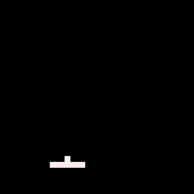
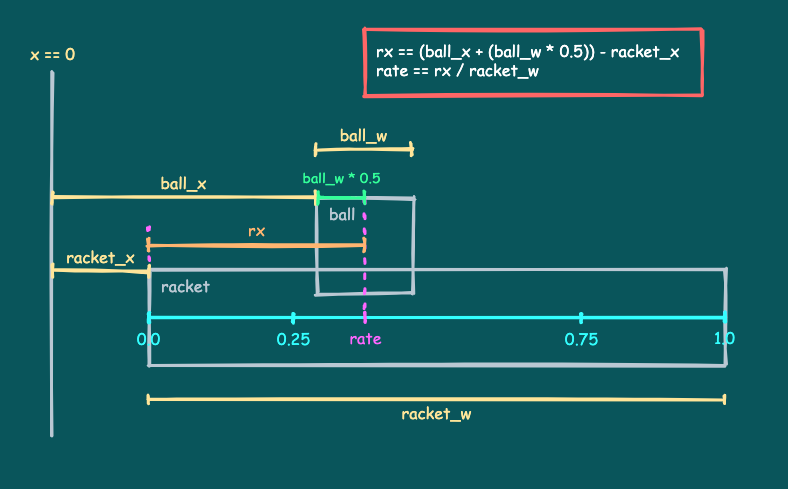

# 来たほうに打ち返す

ここではボールをラケットの端で打つことにより、ボールが来た方向へ打ち返せるようにする処理を説明します。

---

## ボールを打ち返すコード

以下のコードとその実行結果を見てください。

```
SCREEN_W = 128
SCREEN_H = 128
BALL_SPEED = 1.5
RACKET_SPEED = 2.0

ball_x = 50
ball_y = 80
ball_w = 4
ball_h = 4
ball_vx = 0
ball_vy = 0

racket_x = 32
racket_y = 108
racket_w = 24
racket_h = 4

is_started = false

while true do

   -- Move the racket
   local racket_speed = RACKET_SPEED
   if x8.btnprs(4) or x8.btnprs(5) then -- Ⓐ or Ⓑ
      racket_speed = racket_speed * 3.0
   end
   if x8.btnprs(0) then -- ←
      racket_x = racket_x - racket_speed
   elseif x8.btnprs(1) then -- →
      racket_x = racket_x + racket_speed
   end
   if racket_x < 0 then
      racket_x = 0
   elseif (racket_x + racket_w) > SCREEN_W then
      racket_x = SCREEN_W - racket_w
   end

   -- Shoot the ball
   if not is_started and (x8.btntrg(4) or x8.btntrg(5)) then -- Ⓐ or Ⓑ
      is_started = true
      ball_vx = BALL_SPEED
      ball_vy = -BALL_SPEED
   end

   -- Move the ball
   if is_started then
      ball_x = ball_x + ball_vx
      ball_y = ball_y + ball_vy
   else
      ball_x = racket_x + (racket_w * 0.5) - (ball_w * 0.5)
      ball_y = racket_y - ball_h
   end

   -- Bounce by the left wall
   if ball_x < 0 then
      ball_x = ball_x - (ball_x * 2)
      ball_vx = -ball_vx
   -- Bounce by the right wall
   elseif (ball_x + ball_w) > SCREEN_W then
      ball_x = ball_x - (((ball_x + ball_w) - SCREEN_W) * 2)
      ball_vx = -ball_vx
   end
   -- Bounce by the above wall
   if ball_y < 0 then
      ball_y = ball_y - (ball_y * 2)
      ball_vy = -ball_vy
   end

   -- Check for mistake
   if ball_y > SCREEN_H then
      is_started = false
   end

   -- The ball and the racket hit check
   if (ball_vy > 0) then
      if (ball_x <= (racket_x + racket_w - 1))
         and (racket_x <= (ball_x + ball_w - 1))
         and (ball_y <= (racket_y + racket_h - 1))
         and (racket_y <= (ball_y + ball_h - 1))
      then
         local rx = (ball_x + (ball_w * 0.5)) - racket_x
         local rate = rx / racket_w
         if ((rate <= 0.25) and (ball_vx > 0))
         or ((rate >= 0.75) and (ball_vx < 0)) then
            ball_vx = -ball_vx
         end
         ball_vy = -ball_vy
      end
   end

   -- Draw
   x8.cls()
   x8.rect(racket_x, racket_y,
           racket_x + racket_w - 1, racket_y + racket_h - 1)
   x8.rect(ball_x, ball_y,
           ball_x + ball_w - 1, ball_y + ball_h - 1)

   -- Next frame
   x8.wait()
end
```



これは、前回の[ボールを打ち返すコード](tutorial_01_10.md)とほとんど同じです。打ち返す部分の処理が少しだけ変わっています。

左から来たボールをラケットの左端に当てるか、右から来たボールをラケットの右端に当てると、ボールが来た方向へ跳ね返ります。

ボールを打ち返す処理はこの部分です。

```
   -- The ball and the racket hit check
   if (ball_vy > 0) then
      if (ball_x <= (racket_x + racket_w - 1))
         and (racket_x <= (ball_x + ball_w - 1))
         and (ball_y <= (racket_y + racket_h - 1))
         and (racket_y <= (ball_y + ball_h - 1))
      then
         local rx = (ball_x + (ball_w * 0.5)) - racket_x
         local rate = rx / racket_w
         if ((rate <= 0.25) and (ball_vx > 0))
         or ((rate >= 0.75) and (ball_vx < 0)) then
            ball_vx = -ball_vx
         end
         ball_vy = -ball_vy
      end
   end
```

ボールとラケットの当たり判定の処理は変わりませんが、ボールがラケットに当たった際の処理が変更されています。

```
      then
         local rx = (ball_x + (ball_w * 0.5)) - racket_x
         local rate = rx / racket_w
         if ((rate <= 0.25) and (ball_vx > 0))
         or ((rate >= 0.75) and (ball_vx < 0)) then
            ball_vx = -ball_vx
         end
         ball_vy = -ball_vy
      end
```

---

## ラケットに対するボールの位置

まず、x座標だけに着目して、ボールがラケットのどのあたりに当たったかを調べます。



`rx`は、ラケット左端からボール中央までの距離です。

`rate`は、ラケットの左端を`0.0`、右端を`1.0`としたとき、ボールの中央がどのあたりにあるかの値です。

この`rate`を、ラケットに対するボールの位置として使います。

---

## 来た方に打ち返す処理

`if`文で、以下の条件のうちどちらか一方でも真なら（**or**）、ボールのx方向の速度を反転して、来た方に跳ね返しています。

- `rate`が`0.25`以下（ラケットの左1/4に当たった）で、かつ（**and**）、ボールの速度が正（ボールは左から来た）
- `rate`が`0.75`以上（ラケットの右1/4に当たった）で、かつ（**and**）、ボールの速度が負（ボールは右から来た）

最後にy方向の速度を反転して上に跳ね返している部分は、以前と同じです。

---

あとは、前回のコードと全く同じです。


#### これで **来たほうに打ち返す** の説明はおしまいです。次行きましょー！！

[次へ](tutorial_01_12.md)

[このチュートリアルのトップへ](tutorial_01.md)
