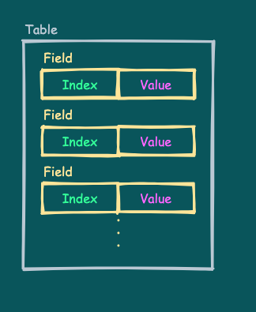
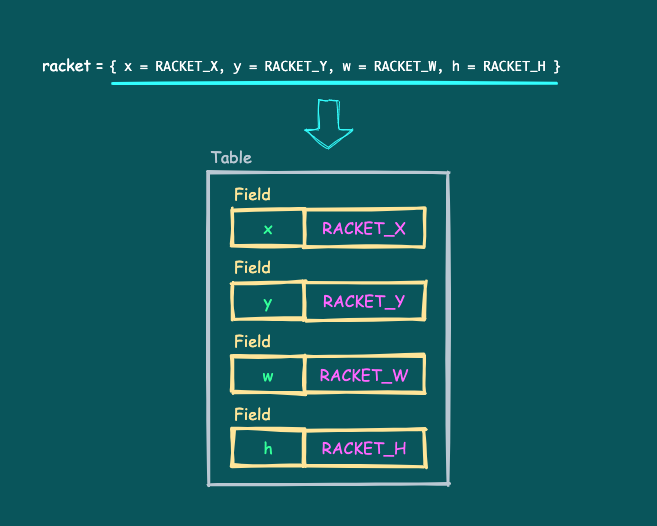
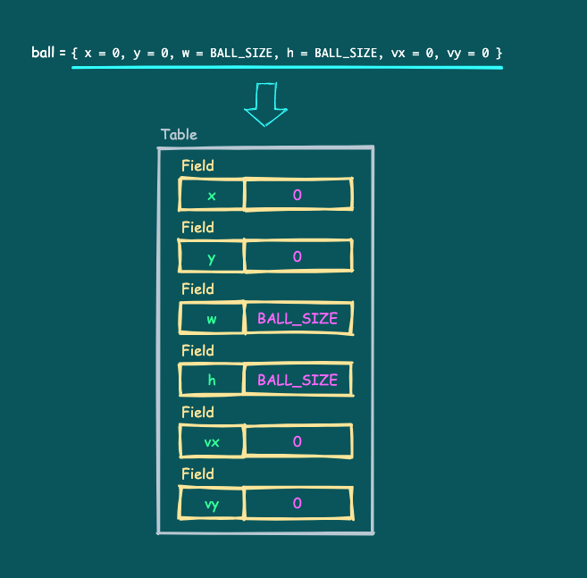

# テーブルと当たり判定関数

ラケットのボールがどういうコードで動いているのかわかりました。

ここではそれらが実際のゲームのコードで、どのように書かれているかを説明します。

---

## 実際のラケットとボールのコード

以下のコードとその実行結果を見てください。

```
SCREEN_W = 128
SCREEN_H = 128

BALL_SIZE = 4
BALL_SPEED = 1.5

RACKET_X = 32
RACKET_Y = 108
RACKET_W = 24
RACKET_H = 4
RACKET_SPEED = 2.0

-- Play scene
function playScene()
   local racket = { x = RACKET_X, y = RACKET_Y, w = RACKET_W, h = RACKET_H }
   local ball = { x = 0, y = 0, w = BALL_SIZE, h = BALL_SIZE, vx = 0, vy = 0 }

   ::RETRY::

   local is_started = false

   -- The main loop in the game
   while true do

      -- Move the racket
      local racket_speed = RACKET_SPEED
      if x8.btnprs(4) or x8.btnprs(5) then -- Ⓐ or Ⓑ
         racket_speed = racket_speed * 3.0
      end
      if x8.btnprs(0) then -- ←
         racket.x = racket.x - racket_speed
      elseif x8.btnprs(1) then -- →
         racket.x = racket.x + racket_speed
      end
      if racket.x < 0 then
         racket.x = 0
      elseif (racket.x + racket.w) > SCREEN_W then
         racket.x = SCREEN_W - racket.w
      end

      -- Shoot the ball
      if not is_started and (x8.btntrg(4) or x8.btntrg(5)) then -- Ⓐ or Ⓑ
         is_started = true
         ball.vx = BALL_SPEED
         ball.vy = -BALL_SPEED
         x8.sfx(0)
      end
      
      -- Move the ball
      if is_started then
         ball.x = ball.x + ball.vx
         ball.y = ball.y + ball.vy
      else
         ball.x = racket.x + (racket.w * 0.5) - (ball.w * 0.5)
         ball.y = racket.y - ball.h
      end

      -- Bounce by the left wall
      if ball.x < 0 then
         ball.x = -ball.x
         ball.vx = -ball.vx
         x8.sfx(0)
      -- Bounce by the right wall
      elseif (ball.x + ball.w) > SCREEN_W then
         ball.x = SCREEN_W - ((ball.x + ball.w) - SCREEN_W) - ball.w
         ball.vx = -ball.vx
         x8.sfx(0)
      end
      -- Bounce by the above wall
      if ball.y < 0 then
         ball.y = -ball.y
         ball.vy = -ball.vy
         x8.sfx(0)
      end
      -- Check for mistake
      if ball.y > SCREEN_H then break end

      -- The ball and the racket hit check
      if (ball.vy > 0) and isHit(ball, racket) then
         local rx = (ball.x + (ball.w * 0.5)) - racket.x
         local rate = rx / racket.w
         if ((rate <= 0.25) and (ball.vx > 0))
         or ((rate >= 0.75) and (ball.vx < 0)) then
            ball.vx = -ball.vx
         end
         ball.vy = -ball.vy
         --
         x8.sfx(0)
      end

      -- Clear screen
      x8.cls()

      -- Draw racket
      x8.rect(racket.x, racket.y,
              racket.x + racket.w - 1, racket.y + racket.h - 1)

      -- Draw ball
      x8.rect(ball.x, ball.y,
              ball.x + ball.w - 1, ball.y + ball.h - 1)

      -- Next frame
      x8.wait()
   end

   -- Retry
   goto RETRY

end

-- Hit check between objects
function isHit(a, b)
   return (a ~= b)
      and (a.x <= (b.x + b.w - 1)) and (b.x <= (a.x + a.w - 1))
      and (a.y <= (b.y + b.h - 1)) and (b.y <= (a.y + a.h - 1))
end

-- Start
playScene()
```


これは、**B.BREAKER**の実際のコードから、ラケットとボールを動かすのに必要な部分を抜き出したものです。

この実行結果は、前回の[来たほうに打ち返すコード](tutorial_01_11.md)の挙動と**全く同じ**です。違うのはコードの書き方だけです。

---

## 全体の流れとgoto文

まず、全体的に見てみます。

少し減りましたが、先頭にグローバル変数が並んでいるのは前回と同じです。

フレームループを含む主な処理が、`playScene`関数にまとめられました。その後に`isHit`という関数も追加されています。

最後に`playScene`関数を呼んでプレイを開始しています。

次に、`playScene`関数の内容をざっと見てみます。

変数名など細かい違いはありますが、全体としては前回のコードとほぼ同じ処理であることがわかると思います。

最初に`racket`と`ball`というローカル変数がありますが、これは後で説明します。

前回のコードではミスすると`is_started`を`false`にしていましたが、今回は以下のように`while`ループを抜けています。

```
      -- Check for mistake
      if ball.y > SCREEN_H then break end
```

`while`ループを抜けると、以下の`goto`文のところに来ます。

```
   -- Retry
   goto RETRY
```

`goto`文はこんな形をしていて、**ラベル名**で指定された**ラベル**に制御を移します。

> `goto` ラベル名

この場合`RETRY`がラベル名で、`playScene`関数の最初の方にある以下の**ラベル文**のところに制御が移ります。

```
   ::RETRY::
```

**ラベル文**は以下のような形をしています。ラベル文自体がなにかすることはなく、`goto`文の飛び先になるだけです。

> `::` ラベル名 `::`

`::RETRY::`に飛んでくると`is_started`を`false`にして、また`while`ループに入っていくので、結果として処理の流れは前回と同じになります。

Hint: `goto`文はうまく使うと便利なのですが、たくさん使うと処理の流れを追うのが難しくなります。とはいえ、はじめのうちは気にせず使ってみましょう。そのうち使い所もわかってくると思います。

---

## テーブル

### テーブルとは

`playScene`関数の最初にある`racket`と`ball`は**テーブル**型の変数です。

```
   local racket = { x = RACKET_X, y = RACKET_Y, w = RACKET_W, h = RACKET_H }
   local ball = { x = 0, y = 0, w = BALL_SIZE, h = BALL_SIZE, vx = 0, vy = 0 }
```

上の行は、ラケットに関するデータを新しく作ったテーブルにまとめて、変数`rackte`に代入しています。
下の行も同様に、ボールに関するデータをテーブルにまとめて、変数`ball`に代入しています。

**テーブル**とは複数のデータをさまざまな構造で格納することが出来る仕組みです。具体的には、いくつかの**フィールド**を格納したもので、フィールドの数は0個（空のテーブル）でも1個でもたくさんでも大丈夫です。

**フィールド**とは、**インデックス**と**値**がペアになったものです。



### テーブルの作成

テーブルは**テーブルコンストラクタ**と呼ばれる**式**で作ります。こんな形をしています。

> `{` [フィールドリスト] `}`

この式の結果がテーブル型の値になるので、変数に格納したりして使います。変数`racket`と`ball`に代入されている部分（`=`の右側の部分）もテーブルコンストラクタです。

**フィールドリスト**はフィールドを`,`または`;`区切りで並べたものです。フィールドリストがなければ、空のテーブルになります。

フィールドの書き方にはいくつかありますが、このコードの場合はこんな形をしています。

> 名前 `=` 式

**名前**はフィールドを指定するための**インデックス**になります。

**式**の部分がフィールドに格納する**値**（データ）です。

`racket`と`ball`のテーブルはこのようなデータ構造になります。




Note: 上図で例えば`racket`の`x`の値として、変数`RACKET_X`自体が格納されているように見えますが、実際には`RACKET_X`の値のコピーが格納されます。これは、`RACKET_X`が数値型であり**値を保持する型**だからです。値を保持する型については後で説明します。

### フィールドのアクセス

フィールドの**値**には、ピリオド`.`に続けて**インデックス**を指定することでアクセスできます。例えば、`racket`の`x`の値を取得、設定したい場合は以下の通りです。

```
a = racket.x    -- get
racket.x = 100  -- set
```

フィールドの追加や削除はいつでもできます。存在しないインデックスに値を設定すると、そのインデックスと値を持った新しいフィールドが追加されます。値に`nil`を設定するとそのフィールドは削除されます。

存在しないインデックスで値を取得すると結果は`nil`になります。これは、**値が`nil`のフィールドが存在するわけではない**ことに注意してください。`nil`の値を持つフィールドは作れません。

### テーブルのいいところ

前回のコードの先頭にあったボールとラケット関連の変数が今回無くなっているのは、それらが`ball`と`racket`のテーブルにまとめられたからです。コードを見ると例えば、`ball_x`から`ball.x`というように、変数からテーブルフィールドに変更されているのがわかります。

テーブルにまとめたことで変数名の衝突も回避され、長い変数名を付けなくてよくなりました。また、ラケットとボールの情報を、`racket`と`ball`を使ってまとめて扱う事ができるようになります。

Hint: テーブルはLuaで唯一のデータを構造化するしくみですが、工夫次第でいろんなデータ構造を作ることができます。ここで説明していない使い方もあるので、おいおい説明していきます。

---

## 値を保持する型と参照を保持する型

型には**値を保持する型**と、**参照を保持する型**があります。今まで出てきた型については以下の通りです。

- 値を保持する型： 数値、文字列、ブーリアン、`nil`
- 参照を保持する型： テーブル、関数

**値を保持する型**について代入、引数渡し、戻り値受け取りを行うと、値がコピーされて渡されます。**渡された値を変更しても渡した側の値に影響はありません。**

**参照を保持する型**について代入、引数渡し、戻り値受け取りを行うと、値はコピーされず、同じ値への**参照**（紐付けられたタグのようなもの）が渡されます。**渡された値（参照先）を変更すると渡した側の値も変更されます。**

Note: テーブル型が参照を保持する型であることに注意してください。代入や関数呼び出しで渡されたテーブルの内容を変更すると、渡した側のテーブルの内容も変更されます。これは両方が**同じテーブル型の値を参照しているためです。**違うテーブルとして使いたい場合は、テーブルを新しく作り、必要に応じて中身をコピーします。

---

## 当たり判定処理の汎用化

コードの最後の方にある`isHit`関数は当たり判定の部分を関数にしたものです。当たり判定のところでこれが呼ばれています。

```
-- Hit check between objects
function isHit(a, b)
   return (a ~= b)
      and (a.x <= (b.x + b.w - 1)) and (b.x <= (a.x + a.w - 1))
      and (a.y <= (b.y + b.h - 1)) and (b.y <= (a.y + a.h - 1))
end
```

### 前回の当たり判定コード

前回のコードで、当たり判定は以下のようなコードでした。

```
if (ball_x <= (racket_x + racket_w - 1))
   and (racket_x <= (ball_x + ball_w - 1))
   and (ball_y <= (racket_y + racket_h - 1))
   and (racket_y <= (ball_y + ball_h - 1))
then
   -- HIT!!
end
```

条件式がちょっと複雑です。ブロックとの当たり判定も増えることを考えると、このコードをあちこちに書くより、関数にして一箇所にまとめたほうがよさそうです。

また、ラケットとボールに限定することなく、2つの矩形の当たり判定を行うようにすれば、ブロックとの当たり判定にも使えそうです。

### 当たり判定コードの関数化

当たり判定の部分をそのまま関数にするとこうなります。

```
function isHit(ax, ay, aw, ah, bx, by, bw, bh)
   return (ax <= (bx + bw - 1)) and (bx <= (ax + aw - 1))
      and (ay <= (by + bh - 1)) and (by <= (ay + ah - 1))
end
```

2つの矩形 **a** と **b** の位置とサイズ（x,y,w,h）を引数でもらって、ヒットしていたら`true`、それ以外なら`false`を返しています。`ax, ay, aw, ah`が矩形 **a** の情報、`bx, by, bw, bh`が矩形 **b** の情報です。

### 引数をテーブルにする

このままでもよいのですが、せっかくラケットとボールの情報をテーブルにしたので、引数もテーブルにしてみましょう。

```
function isHit(a, b)
   and (a.x <= (b.x + b.w - 1)) and (b.x <= (a.x + a.w - 1))
   and (a.y <= (b.y + b.h - 1)) and (b.y <= (a.y + a.h - 1))
end
```

引数がスッキリしました。矩形の情報`x`、`y`、`w`、`h`をフィールドに持つテーブル`a`と`b`を引数でもらっています。

引数のテーブルに期待するフィールドが存在しないとエラーになりますが、ちゃんと使えば大丈夫です。

これで、ボールとラケットの当たり判定を`isHit(ball, racket)`と書けるのようになりました。ブロックについても同様にテーブルにすれば大丈夫でしょう。

### 自分自身との当たり判定

最後に`isHit(racket, racket)`のように、うっかり同じテーブル同士の（自分自身との）当たり判定をしてしまった場合は、当たらないようにしておきます。

```
function isHit(a, b)
   return (a ~= b)
      and (a.x <= (b.x + b.w - 1)) and (b.x <= (a.x + a.w - 1))
      and (a.y <= (b.y + b.h - 1)) and (b.y <= (a.y + a.h - 1))
end
```

条件式に`a ~= b`（`~=`の左右が等しくない）を加えました。従来の条件式が真で、かつ、`a`と`b`が違う（参照先が違う）場合にだけ`true`を返します。

これで、今回の当たり判定関数になりました。

---

前回のコードからの変更点は以上です。


#### これで **テーブルと当たり判定関数** の説明はおしまいです。次行きましょー！！

次へ（工事中）

[このチュートリアルのトップへ](tutorial_01.md)
