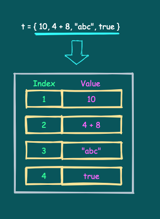
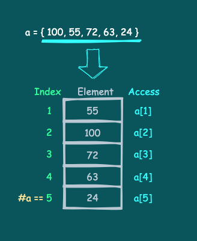
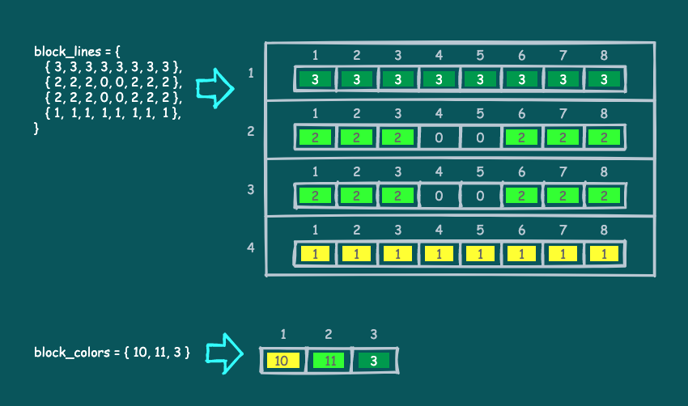
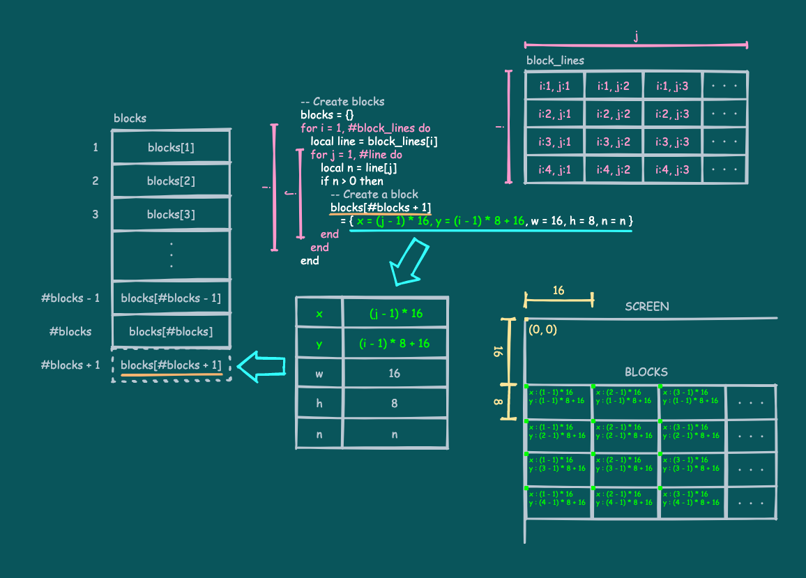
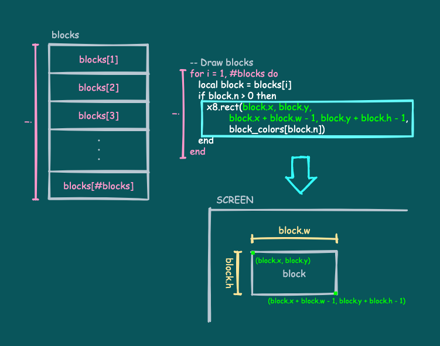

# ブロックの表示と配列

ブロックの処理に入っていきます。

ここではブロックの初期情報の作成と表示について説明します。

---

## ブロック表示のコード

以下のコードとその実行結果を見てください。

```
block_lines = {
   { 3, 3, 3, 3, 3, 3, 3, 3 },
   { 2, 2, 2, 0, 0, 2, 2, 2 },
   { 2, 2, 2, 0, 0, 2, 2, 2 },
   { 1, 1, 1, 1, 1, 1, 1, 1 },
}

block_colors = { 10, 11, 3 }

-- Create blocks
blocks = {}
for i = 1, #block_lines do
   local line = block_lines[i]
   for j = 1, #line do
      local n = line[j]
      if n > 0 then
         -- Create a block
         blocks[#blocks + 1]
            = { x = (j - 1) * 16, y = (i - 1) * 8 + 16, w = 16, h = 8, n = n }
      end
   end
end

-- Draw blocks
for i = 1, #blocks do
   local block = blocks[i]
   if block.n > 0 then
      x8.rect(block.x, block.y,
              block.x + block.w - 1, block.y + block.h - 1,
              block_colors[block.n])
   end
end
```


これは、ブロックの初期情報の作成と表示を行う部分だけを抜き出したコードです。ブロックを表示するとプログラムは終了します。

---

## 配列としてのテーブル

コードを見ていく前に、テーブルについてもう少し詳しく説明します。

### インデックスと値とコンストラクタ

前回[テーブルについて説明](tutorial_01_12.md#テーブル)しました。テーブルはフィールドの集まりで、フィールドはインデックスと値のペアでした。

今まで`racket`テーブルのインデックス`x`のフィールドにアクセスするような場合、以下のように書いてきました。

```
a = racket.x    -- get
racket.x = 100  -- set
```

これは角括弧`[ ]`を使って以下のようにも書けます。

```
a = racket["x"]     -- get
racket["x"] = 100   -- set
```

`x`が文字列なことに注意してください。実はインデックスも普通の値で、`nil`以外のあらゆる値を使えます。インデックスは本来上記のように`[ ]`を使って指定します。`racket.x`のような書き方は、インデックスの型が文字列の場合にだけ使える特別な書き方です。

値についても`nil`以外のあらゆる値を格納でき、テーブル内にいろいろな型の値が混在しても大丈夫です。

ここで、テーブルコンストラクタのフィールドの書き方をもう一つ紹介します。

```
t = { 10, 4 + 8, "abc", true }
```

上記のように、フィールドは **名前`=`式** ではなく **式** だけで書くことも出来ます。この形式の場合、インデックスは自動的に**`1`から始まる連番の整数**となります。



Hint: テーブルコンストラクタのフィールドの書き方は他にもありますが、ひとまずこれで十分です。さらに[詳しい説明はここ](lua_basics.md#テーブルコンストラクタ)にあります。

以下は全て正しいコードです。

```
a = {}
a[53] = 100
a[-0.3] = false
a["abc"] = "xyz"
a[true] = { x = 3, y = "hoge", z = false }

b = { "abc".."def", 7 == 7, { 2, true, "foo" }, -0.4 / 2 }

c = { a, b }
```

### シーケンスと配列

テーブルが**シーケンス**である場合、そのテーブルは**配列**として使うことができます。

**シーケンス**とは、**空のテーブル`{}`を含む、インデックスが`1`から始まる連続する自然数だけ（途中に値の抜けがない）であるテーブル**のことを言います。

**配列**とは、複数のデータ（**要素**）を隙間なく並べて格納し、インデックス（**添字**）を利用して**n**番目のデータにアクセスできるようなデータ構造のことです。

先程紹介したように、テーブルコンストラクタのフィールドを **式** だけで書くと、インデックスは自動的に`1`からの連番になるため、作成されたテーブルはそのまま配列として使えます。

また、配列に要素を追加したり削除したりしても、シーケンスとしての条件を満たしていれば、配列として使えます。



Note: シーケンスのインデックス（配列の添字）は`1`から始まることに注意してください。`0`からではありません。

### 長さ演算子

**長さ演算子** `#` は右に1つの引数をとり、その長さを返します。引数には文字列かテーブルを渡せますが、**テーブルの場合はそれがシーケンスである必要があります。**

以下はいくつかの例です。最後の例では、配列`t`の末尾に要素を追加することで配列のサイズを伸ばしています。

```
x = #"abcdef"   -- x:6

t = { 5, 3, 8 }
x = #t          -- x:3

t[#t + 1] = 7
x = #t          -- x:4
```

---

## for文

新しく出てきた制御構造についても説明しておきます。

`for`文はループを行うときによく使う便利な制御構文です。こんな形をしています。

> `for` ループ変数 `=` 式1 `,` 式2 [`,` 式3] `do` ブロック `end`

**ループ変数**はループ内でのローカル変数です。`for`文はループ変数を自動的に更新してくれます。

ループ変数が **式1** の値から始まり、**式3** の値（省略すると`1`）づつ増えながら、**式2** の値を超えない間、`do`ブロックを繰り返し実行します。式1、式2、式3は**ループが始まる前に一度だけ計算されます。**

以下が簡単な例です。`for`文の右にあるコメントは、ループ変数がループ毎にどのような値を取るかを表しています。

```
a = 0
for i = 1, 4 do     -- i:1,2,3,4
    a = a + i
end
x = a               -- x:10

b = 0
for i = 0, 10, 3 do -- i:0,3,6,9
    b = b + i
end
x = b               -- x:18
```

Hint: `for`文は配列を巡回するときなどに頻繁に使います。ちょっとややこしいですが、使っていればすぐ慣れるので大丈夫です。

---

## 配置情報の配列

それではコードを見ていきます。最初に`block_lines`と`block_colors`という2つのテーブルが作られています。

```
block_lines = {
   { 3, 3, 3, 3, 3, 3, 3, 3 },
   { 2, 2, 2, 0, 0, 2, 2, 2 },
   { 2, 2, 2, 0, 0, 2, 2, 2 },
   { 1, 1, 1, 1, 1, 1, 1, 1 },
}

block_colors = { 10, 11, 3 }
```

`block_lines`は全ブロックの配置とそれぞれのブロックの耐久度を表すテーブルです。テーブルの中にさらにテーブルが並んでいて、どのテーブルも配列であることが分かります。

内側の各配列がブロック配置の横一列に対応し、それを縦に並べることで、全体として2次元のマス目状にブロックの配置情報を格納しています。

配置情報は、`0`ならその位置にブロックが無いことを表し、`1`以上ならその位置のブロックの耐久度を表します。`1`ならボールが1回当たると消える黄色いブロック、`2`なら薄い緑色のブロック、`3`なら濃い緑色のブロックです。

`block_colors`はブロックの耐久度に対応する色番号を表す配列です。耐久度がそのままインデックスとして使え、黄色、薄い緑色、濃い緑色と並んでいます。



---

## ブロック情報配列の作成

次にこの部分を見てください。

```
-- Create blocks
blocks = {}
for i = 1, #block_lines do
   local line = block_lines[i]
   for j = 1, #line do
      local n = line[j]
      if n > 0 then
         -- Create a block
         blocks[#blocks + 1]
            = { x = (j - 1) * 16, y = (i - 1) * 8 + 16, w = 16, h = 8, n = n }
      end
   end
end
```

ここでは新しく作成した配列`blocks`に、全ブロックの初期情報を格納しています。

`for`文が2重の入れ子構造になっています。`block_lines`は配列の中にさらに配列が並んだ構造であることを思い出してください。

外側の`i`のループが`block_lines`の縦方向の巡回、内側の`j`のループが横方向の巡回と見なすことができ、結果として全ての要素を巡回しています。

`blocks`は、まず空の状態で作成します。新しい要素を常に`blocks[#blocks + 1]`に追加することで、**インデックスが連番で値の抜けもない**状態を維持しながら配列を伸ばしていきます。

`blocks`に追加する要素はブロックの情報をまとめたテーブルです。`x`、`y`、`w`、`h`がブロックを表示する際の矩形情報、`n`は初期の耐久度です。`w`、`h`は全て同じですが、`x`、`y`はそれぞれ違うので`i`と`j`から計算しています。

耐久度が`0`のブロック情報は`blocks`に登録しません。



---

## ブロックの表示

最後にこの部分を見てください。

```
-- Draw blocks
for i = 1, #blocks do
   local block = blocks[i]
   if block.n > 0 then
      x8.rect(block.x, block.y,
              block.x + block.w - 1, block.y + block.h - 1,
              block_colors[block.n])
   end
end
```

ここでは先ほど作成した`blocks`配列の要素を全て巡回して、耐久度が`0`より大きいブロックを矩形で表示しています。矩形の色番号は`block_colors`配列から、耐久度`block.n`をインデックスとして取得しています。



---


#### これで **ブロックの表示と配列** の説明はおしまいです。次行きましょー！！

[次へ](tutorial_01_14.md)

[このチュートリアルのトップへ](tutorial_01.md)

