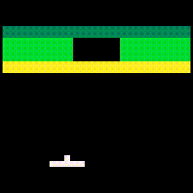
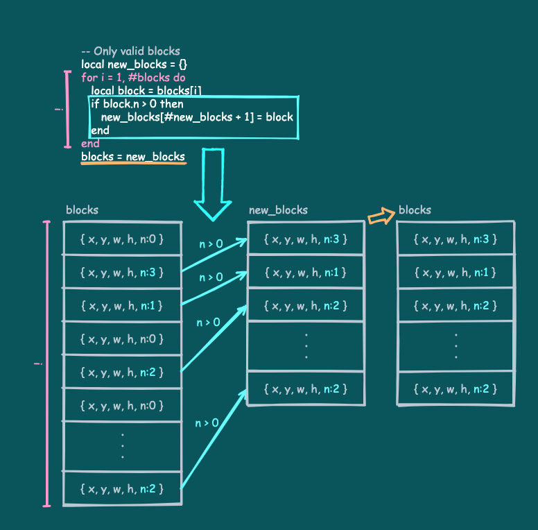

# ブロックの破壊

ブロックが表示できるようになりました。

ここではブロックを破壊する処理について説明します。

---

## ブロック破壊のコード

以下のコードとその実行結果を見てください。

```
SCREEN_W = 128
SCREEN_H = 128

BALL_SIZE = 4
BALL_SPEED = 1.5

RACKET_X = 32
RACKET_Y = 108
RACKET_W = 24
RACKET_H = 4
RACKET_SPEED = 2.0

block_lines = {
   { 3, 3, 3, 3, 3, 3, 3, 3 },
   { 2, 2, 2, 0, 0, 2, 2, 2 },
   { 2, 2, 2, 0, 0, 2, 2, 2 },
   { 1, 1, 1, 1, 1, 1, 1, 1 },
}

block_colors = { 10, 11, 3 }

-- Play scene
function playScene()
   local racket = { x = RACKET_X, y = RACKET_Y, w = RACKET_W, h = RACKET_H }
   local ball = { x = 0, y = 0, w = BALL_SIZE, h = BALL_SIZE, vx = 0, vy = 0 }

   ::RESET::

   -- Create blocks
   local blocks = {}
   for i = 1, #block_lines do
      local line = block_lines[i]
      for j = 1, #line do
         local n = line[j]
         if n > 0 then
            -- Create a block
            blocks[#blocks + 1]
               = { x = (j - 1) * 16, y = (i - 1) * 8 + 16, w = 16, h = 8, n = n }
         end
      end
   end

   ::RETRY::

   local is_started = false

   -- The main loop in the game
   while true do

      -- Only valid blocks
      local new_blocks = {}
      for i = 1, #blocks do
         local block = blocks[i]
         if block.n > 0 then
            new_blocks[#new_blocks + 1] = block
         end
      end
      blocks = new_blocks

      -- If there are no blocks, it's clear
      if #blocks == 0 then break end

      -- Move the racket
      local racket_speed = RACKET_SPEED
      if x8.btnprs(4) or x8.btnprs(5) then -- Ⓐ or Ⓑ
         racket_speed = racket_speed * 3.0
      end
      if x8.btnprs(0) then -- ←
         racket.x = racket.x - racket_speed
      elseif x8.btnprs(1) then -- →
         racket.x = racket.x + racket_speed
      end
      if racket.x < 0 then
         racket.x = 0
      elseif (racket.x + racket.w) > SCREEN_W then
         racket.x = SCREEN_W - racket.w
      end

      -- Shoot the ball
      if not is_started and (x8.btntrg(4) or x8.btntrg(5)) then -- Ⓐ or Ⓑ
         is_started = true
         ball.vx = BALL_SPEED
         ball.vy = -BALL_SPEED
         x8.sfx(0)
      end
      
      -- Move the ball
      if is_started then
         ball.x = ball.x + ball.vx
         ball.y = ball.y + ball.vy
      else
         ball.x = racket.x + (racket.w * 0.5) - (ball.w * 0.5)
         ball.y = racket.y - ball.h
      end

      -- Bounce by the left wall
      if ball.x < 0 then
         ball.x = ball.x - (ball.x * 2)
         ball.vx = -ball.vx
         x8.sfx(0)
      -- Bounce by the right wall
      elseif (ball.x + ball.w) > SCREEN_W then
         ball.x = ball.x - (((ball.x + ball.w) - SCREEN_W) * 2)
         ball.vx = -ball.vx
         x8.sfx(0)
      end
      -- Bounce by the above wall
      if ball.y < 0 then
         ball.y = ball.y - (ball.y * 2)
         ball.vy = -ball.vy
         x8.sfx(0)
      end
      -- Check for mistake
      if ball.y > SCREEN_H then break end

      -- The ball and the racket hit check
      if (ball.vy > 0) and isHit(ball, racket) then
         local rx = (ball.x + (ball.w * 0.5)) - racket.x
         local rate = rx / racket.w
         if ((rate <= 0.25) and (ball.vx > 0))
         or ((rate >= 0.75) and (ball.vx < 0)) then
            ball.vx = -ball.vx
         end
         ball.vy = -ball.vy
         --
         x8.sfx(0)
      end

      -- The Ball and blocks hit check
      for i = 1, #blocks do
         local block = blocks[i]
         if (block.n > 0) and isHit(ball, block) then
            block.n = block.n - 1
         end
      end

      -- Clear screen
      x8.cls()

      -- Draw blocks
      for i = 1, #blocks do
         local block = blocks[i]
         if block.n > 0 then
            x8.rect(block.x, block.y,
                    block.x + block.w - 1, block.y + block.h - 1,
                    block_colors[block.n])
         end
      end

      -- Draw racket
      x8.rect(racket.x, racket.y,
              racket.x + racket.w - 1, racket.y + racket.h - 1)

      -- Draw ball
      x8.rect(ball.x, ball.y,
              ball.x + ball.w - 1, ball.y + ball.h - 1)

      -- Next frame
      x8.wait()
   end

   -- Reset
   if #blocks == 0 then goto RESET end

   -- Retry
   goto RETRY

end

-- Hit check between objects
function isHit(a, b)
   return (a ~= b)
      and (a.x <= (b.x + b.w - 1)) and (b.x <= (a.x + a.w - 1))
      and (a.y <= (b.y + b.h - 1)) and (b.y <= (a.y + a.h - 1))
end

-- Start
playScene()
```



これは、以前説明した[ラケットとボールのコード](tutorial_01_12.md)を元に、前回の[ブロック表示のコード](tutorial_01_13.md)と、ブロックを破壊する処理を組み込んだものです。

ボールがブロックでバウンドする処理を入れていないので、ボールはブロックを破壊しながら直進します。

全体の流れは**ラケットとボールのコード**と全く同じなので、そこにブロック関連の処理がどう組み込まれているかを見ていきます。

---

## ブロックの配置と色番号のテーブル

コードの先頭から見ていきます。

前回の[ブロック配置及び色番号のテーブル](tutorial_01_13.md#配置情報の配列)と同じものがコードの先頭にまとめられています。見やすいところに置くことで、配置や色を調整しやすくしています。

```
block_lines = {
   { 3, 3, 3, 3, 3, 3, 3, 3 },
   { 2, 2, 2, 0, 0, 2, 2, 2 },
   { 2, 2, 2, 0, 0, 2, 2, 2 },
   { 1, 1, 1, 1, 1, 1, 1, 1 },
}

block_colors = { 10, 11, 3 }
```

---

## ブロック情報配列の作成

`playScene`に入ります。

最初にこの部分を見てください。

```
   ::RESET::

   -- Create blocks
   local blocks = {}
   for i = 1, #block_lines do
      local line = block_lines[i]
      for j = 1, #line do
         local n = line[j]
         if n > 0 then
            -- Create a block
            blocks[#blocks + 1]
               = { x = (j - 1) * 16, y = (i - 1) * 8 + 16, w = 16, h = 8, n = n }
         end
      end
   end

   ::RETRY::
```

これは前回の[ブロック情報配列の作成](tutorial_01_13.md#ブロック情報配列の作成)のコードと同じもので、フレームループに入る前に置かれています。また、直前にラベル`::RESET::`、直後にラベル`::RETRY::`があります。

`::RESET::`は全てのブロックを破壊した場合に`goto`文から**飛んでくる**（制御が移ってくる）場所です。ブロックが全て破壊されると、ここで再びブロック情報配列`blocks`を作成しなおしてからフレームループに入ります。

`::RETRY::`に飛んできた場合は、ブロックの状態を維持したままフレームループに入ります。

---

## ブロック情報配列の更新

フレームループに入ります。

次にこの部分を見てください

```
      -- Only valid blocks
      local new_blocks = {}
      for i = 1, #blocks do
         local block = blocks[i]
         if block.n > 0 then
            new_blocks[#new_blocks + 1] = block
         end
      end
      blocks = new_blocks

      -- If there are no blocks, it's clear
      if #blocks == 0 then break end
```

まず、`blocks`の要素のうち、耐久度`n`が`0`より大きいものだけを集めた新たな配列`new_blocks`を作成し、それを`blocks`に再び代入しています。これで`blocks`の要素は耐久度が残っている（破壊されていない）ブロックの情報だけになります。



フレームの最初に`blocks`の中身を更新することにより、以降で不必要なブロックに関する処理を行わないようにしています。

そして、更新した`blocks`が空ならステージクリアなのでフレームループを抜けています。

---

## ボールとブロックの当たり判定

次にこの部分を見てください

```
      -- The Ball and blocks hit check
      for i = 1, #blocks do
         local block = blocks[i]
         if (block.n > 0) and isHit(ball, block) then
            block.n = block.n - 1
         end
      end

```

これはボールとブロックの当たり判定を行っている部分です。

当たり判定関数`isHit`は、`x`、`y`、`w`、`h`をフィールドに持つテーブルであれば、受け取って判定できることを思い出してください。`blocks`内のブロック情報テーブルもこの条件を満たすので渡すことができます。

念のため耐久度が残っているブロックに限定すると、ボールとブロックが当たるのは`(block.n > 0) and isHit(ball, block)`が真の場合、ということになります。

当たった場合はブロックの耐久度を`1`減らしているだけです。耐久度が`0`になったブロックは次のフレームで`blocks`から取り除かれるので、ここではこれで十分です。

---

## ブロックの描画

次にこの部分を見てください

```
      -- Draw blocks
      for i = 1, #blocks do
         local block = blocks[i]
         if block.n > 0 then
            x8.rect(block.x, block.y,
                    block.x + block.w - 1, block.y + block.h - 1,
                    block_colors[block.n])
         end
      end
```

これは前回の[ブロックの表示](tutorial_01_13.md#ブロックの表示)と全く同じコードです。

耐久度が`0`より大きいブロックだけを描画していることに注意してください。直前の当たり判定で破壊されたブロックは描画されません。

ブロックの描画処理はラケットとボールの描画処理より前に置かれている（先に実行される）ので、表示が重なった場合はブロックが一番奥に表示されるかたちになります。

---

## プレイの再開

フレームループを抜けます。

最後にこの部分を見てください

```
   -- Reset
   if #blocks == 0 then goto RESET end

   -- Retry
   goto RETRY
```

フレームループを抜けた直後、`blocks`が空だったら`::RESET::`に飛んでいます。`::RESET::`に飛ぶと`blocks`を作り直してプレイが再開されます。

`blocks`が空でなければ`::RETRY::`に飛ぶので、ブロックの状態はそのままでプレイが再開されます。

---

ブロック関連の追加部分は以上です。その他の部分は[ラケットとボールのコード](tutorial_01_12.md)と全く同じです。


#### これで **ブロックの破壊** の説明はおしまいです。次行きましょー！！

[次へ](tutorial_01_15.md)

[このチュートリアルのトップへ](tutorial_01.md)

