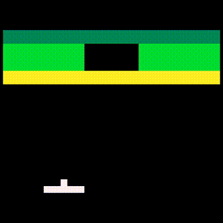
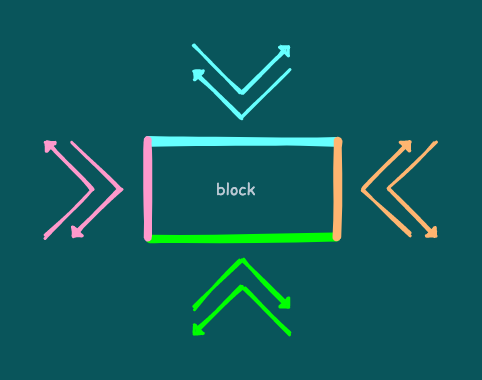
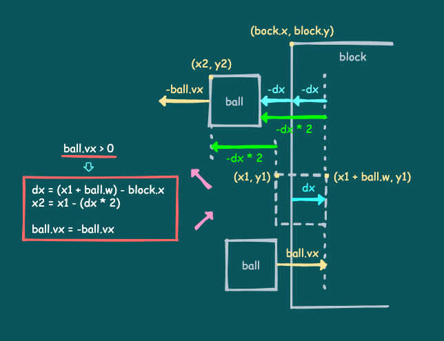
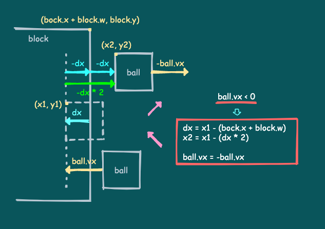
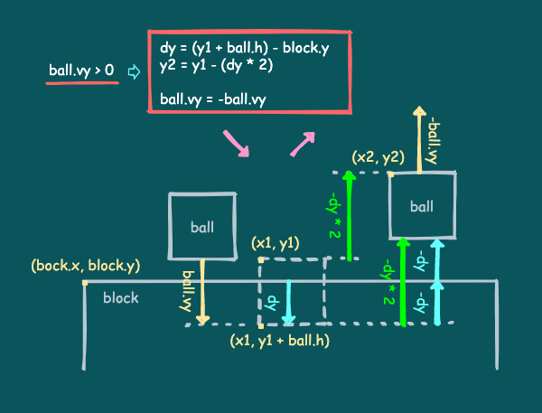
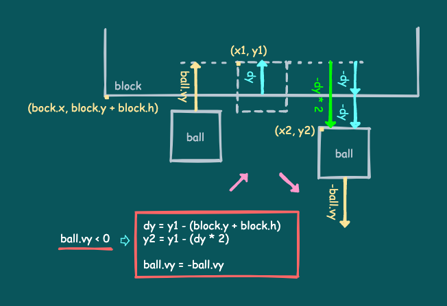
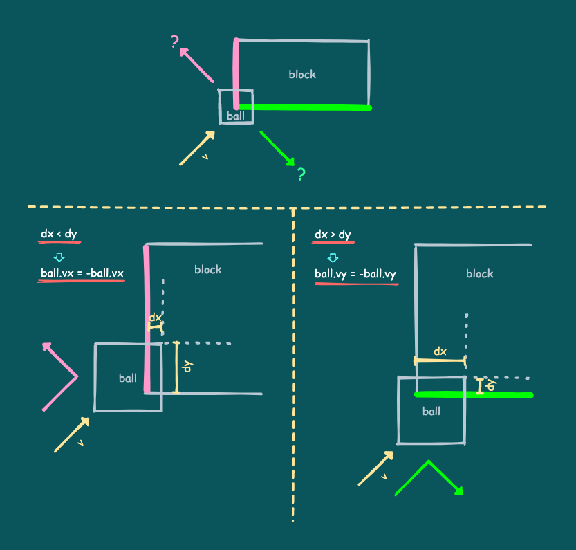

# 15. ブロックでのバウンド

ブロック崩しを実装するのに必要な処理のうち、説明していない部分はあと少しです。

ここではボールがブロックでバウンドする処理について説明します。

---

## ブロック崩しのコード

以下のコードとその実行結果を見てください。

```
SCREEN_W = 128
SCREEN_H = 128

BALL_SIZE = 4
BALL_SPEED = 1.5

RACKET_X = 32
RACKET_Y = 108
RACKET_W = 24
RACKET_H = 4
RACKET_SPEED = 2.0

block_lines = {
   { 3, 3, 3, 3, 3, 3, 3, 3 },
   { 2, 2, 2, 0, 0, 2, 2, 2 },
   { 2, 2, 2, 0, 0, 2, 2, 2 },
   { 1, 1, 1, 1, 1, 1, 1, 1 },
}

block_colors = { 10, 11, 3 }

-- Play scene
function playScene()
   local racket = { x = RACKET_X, y = RACKET_Y, w = RACKET_W, h = RACKET_H }
   local ball = { x = 0, y = 0, w = BALL_SIZE, h = BALL_SIZE, vx = 0, vy = 0 }

   ::RESET::

   -- Create blocks
   local blocks = {}
   for i = 1, #block_lines do
      local line = block_lines[i]
      for j = 1, #line do
         local n = line[j]
         if n > 0 then
            -- Create a block
            blocks[#blocks + 1]
               = { x = (j - 1) * 16, y = (i - 1) * 8 + 16, w = 16, h = 8, n = n }
         end
      end
   end

   ::RETRY::

   local is_started = false

   -- The main loop in the game
   while true do

      -- Only valid blocks
      local new_blocks = {}
      for i = 1, #blocks do
         local block = blocks[i]
         if block.n > 0 then
            new_blocks[#new_blocks + 1] = block
         end
      end
      blocks = new_blocks

      -- If there are no blocks, it's clear
      if #blocks == 0 then break end

      -- Move the racket
      local racket_speed = RACKET_SPEED
      if x8.btnprs(4) or x8.btnprs(5) then -- Ⓐ or Ⓑ
         racket_speed = racket_speed * 3.0
      end
      if x8.btnprs(0) then -- ←
         racket.x = racket.x - racket_speed
      elseif x8.btnprs(1) then -- →
         racket.x = racket.x + racket_speed
      end
      if racket.x < 0 then
         racket.x = 0
      elseif (racket.x + racket.w) > SCREEN_W then
         racket.x = SCREEN_W - racket.w
      end

      -- Shoot the ball
      if not is_started and (x8.btntrg(4) or x8.btntrg(5)) then -- Ⓐ or Ⓑ
         is_started = true
         ball.vx = BALL_SPEED
         ball.vy = -BALL_SPEED
         x8.sfx(0)
      end
      
      -- Move the ball
      if is_started then
         ball.x = ball.x + ball.vx
         ball.y = ball.y + ball.vy
      else
         ball.x = racket.x + (racket.w * 0.5) - (ball.w * 0.5)
         ball.y = racket.y - ball.h
      end

      -- Bounce by the left wall
      if ball.x < 0 then
         ball.x = ball.x + (-ball.x * 2)
         ball.vx = -ball.vx
         x8.sfx(0)
      -- Bounce by the right wall
      elseif (ball.x + ball.w) > SCREEN_W then
         ball.x = ball.x - (((ball.x + ball.w) - SCREEN_W) * 2)
         ball.vx = -ball.vx
         x8.sfx(0)
      end
      -- Bounce by the above wall
      if ball.y < 0 then
         ball.y = ball.y + (-ball.y * 2)
         ball.vy = -ball.vy
         x8.sfx(0)
      end
      -- Check for mistake
      if ball.y > SCREEN_H then break end

      -- The ball and the racket hit check
      if (ball.vy > 0) and isHit(ball, racket) then
         local rx = (ball.x + (ball.w * 0.5)) - racket.x
         local rate = rx / racket.w
         if ((rate <= 0.25) and (ball.vx > 0))
         or ((rate >= 0.75) and (ball.vx < 0)) then
            ball.vx = -ball.vx
         end
         ball.vy = -ball.vy
         --
         x8.sfx(0)
      end

      -- The Ball and blocks hit check
      for i = 1, #blocks do
         local block = blocks[i]
         if (block.n > 0) and isHit(ball, block) then
            block.n = block.n - 1
            --
            x8.sfx(1)
            local dx = 0
            -- The ball is boring into the block from the left
            if ball.vx > 0 then
               dx = (ball.x + ball.w) - block.x
            -- The ball is boring into the block from the right
            elseif ball.vx < 0 then
               dx = ball.x - (block.x + block.w)
            end
            local dy = 0
            -- The ball was bored into the block from above
            if ball.vy > 0 then
               dy = (ball.y + ball.h) - block.y
            -- The ball was wedged into the block from underneath
            elseif ball.vy < 0 then
               dy = ball.y - (block.y + block.h)
            end
            -- Bouncing the ball
            if math.abs(dx) < math.abs(dy) then
               ball.x = ball.x - (dx * 2)
               ball.vx = -ball.vx
            else
               ball.y = ball.y - (dy * 2)
               ball.vy = -ball.vy
            end
         end
      end

      -- Clear screen
      x8.cls()

      -- Draw blocks
      for i = 1, #blocks do
         local block = blocks[i]
         if block.n > 0 then
            x8.rect(block.x, block.y,
                    block.x + block.w - 1, block.y + block.h - 1,
                    block_colors[block.n])
         end
      end

      -- Draw racket
      x8.rect(racket.x, racket.y,
              racket.x + racket.w - 1, racket.y + racket.h - 1)

      -- Draw ball
      x8.rect(ball.x, ball.y,
              ball.x + ball.w - 1, ball.y + ball.h - 1)

      -- Next frame
      x8.wait()
   end

   -- Reset
   if #blocks == 0 then goto RESET end

   -- Retry
   goto RETRY

end

-- Hit check between objects
function isHit(a, b)
   return (a ~= b)
      and (a.x <= (b.x + b.w - 1)) and (b.x <= (a.x + a.w - 1))
      and (a.y <= (b.y + b.h - 1)) and (b.y <= (a.y + a.h - 1))
end

-- Start
playScene()
```



これは、前回の[ブロック破壊のコード](tutorial_01_14.md)に、ボールがブロックでバウンドする処理を追加したものです。

また、これが**B.BREAKER**のプログラムにおける**ブロック崩し**の実装です。

---

## バウンドの方針

このゲームではボールの動きを4方向に限定しています。ブロックでのバウンドについても、下図のような8通りのバウンドに限定しています。



矢印がバウンド時のボールの動きです。色はボールの動きとそれが当たった辺の対応を表しています。

---

## 各辺でのバウンド

ブロックの各辺でのバウンドも、壁でのバウンドと考え方は全く同じです。

以降の図で`dx`、`dy`は、ボールがブロックに対してどれくらいめり込んだかの、座標軸ごとの値です。`x1`、`y1`は、めり込んだ際のボールの位置、`x2`、`y2`は求めたいバウンド後のボールの位置です。

### 左右の辺でのバウンド

y軸についてはそのまま移動するだけなので、x軸についてだけ着目します。ボールのx速度が負の場合は`dx`も負になることに注意してください。




### 上下の辺でのバウンド

x軸についてはそのまま移動するだけなので、y軸についてだけ着目します。ボールのy速度が負の場合は`dy`も負になることに注意してください。




---

## 角でのバウンド

ところで、ブロックの角にボールが当たった場合はどうなるでしょう？

このゲームでは下図のようなルールでバウンドする方向を決めています。



この図では、ボールが左下から来てブロックの左下角に当たった場合の、2通りのバウンド方向とその条件を表しています。

`dx`、`dy`は、ボールが座標軸ごとにブロックにめり込んだ長さです。

図のように、**めり込む長さがより小さい方の軸上でバウンドする**ことで自然に見せています。

このルールは左下以外の角でバウンドする場合も同様です。また、各辺でバウンドする場合にも適用されます。

---

## 実際のバウンドのコード

それでは実際のコードで、ブロックでのバウンド処理について見てみましょう。

以下の部分がボールとブロックの当たり判定とバウンド処理を行っている部分です。前回のコードと違うのはこの部分だけです。

```
      -- The Ball and blocks hit check
      for i = 1, #blocks do
         local block = blocks[i]
         if (block.n > 0) and isHit(ball, block) then
            block.n = block.n - 1
            --
            x8.sfx(1)
            local dx = 0
            -- The ball is boring into the block from the left
            if ball.vx > 0 then
               dx = (ball.x + ball.w) - block.x
            -- The ball is boring into the block from the right
            elseif ball.vx < 0 then
               dx = ball.x - (block.x + block.w)
            end
            local dy = 0
            -- The ball was bored into the block from above
            if ball.vy > 0 then
               dy = (ball.y + ball.h) - block.y
            -- The ball was wedged into the block from underneath
            elseif ball.vy < 0 then
               dy = ball.y - (block.y + block.h)
            end
            -- Bouncing the ball
            if math.abs(dx) < math.abs(dy) then
               ball.x = ball.x - (dx * 2)
               ball.vx = -ball.vx
            else
               ball.y = ball.y - (dy * 2)
               ball.vy = -ball.vy
            end
         end
      end
```

### 当たり判定とブロック耐久度の更新

最初に、当たり判定と当たった場合にブロックの耐久度を減らすコードがあります。ここまでは前回と全く同じです。

```
      -- The Ball and blocks hit check
      for i = 1, #blocks do
         local block = blocks[i]
         if (block.n > 0) and isHit(ball, block) then
            block.n = block.n - 1
```

このあとに、当たった場合のバウンド処理がつづきます。

### めり込んだ長さの計算

次のこの部分は、x軸上でボールがブロックにどれくらいめり込んだかの値`dx`を計算しています。

```
            local dx = 0
            -- The ball is boring into the block from the left
            if ball.vx > 0 then
               dx = (ball.x + ball.w) - block.x
            -- The ball is boring into the block from the right
            elseif ball.vx < 0 then
               dx = ball.x - (block.x + block.w)
            end
```

[左右の辺でのバウンド](tutorial_01_15.md#左右の辺でのバウンド)の図と見比べながら見てください。また、ボールのx速度`ball.vx`が負の場合は、`dx`も負になることに注意してください。

次のこの部分も同様に、y軸上でボールがブロックにどれくらいめり込んだかの値`dy`を計算しています。

```
            local dy = 0
            -- The ball was bored into the block from above
            if ball.vy > 0 then
               dy = (ball.y + ball.h) - block.y
            -- The ball was wedged into the block from underneath
            elseif ball.vy < 0 then
               dy = ball.y - (block.y + block.h)
            end
```

[上下の辺でのバウンド](tutorial_01_15.md#上下の辺でのバウンド)の図と見比べながら見てください。また、ボールのy速度`ball.vy`が負の場合は、`dy`も負になることに注意してください。

### 位置の補正と速度の反転

最後にこの部分で、バウンドによる位置の補正と速度の反転を行っています。

```
            -- Bouncing the ball
            if math.abs(dx) < math.abs(dy) then
               ball.x = ball.x - (dx * 2)
               ball.vx = -ball.vx
            else
               ball.y = ball.y - (dy * 2)
               ball.vy = -ball.vy
            end
```

`math.abs`は引数に数値をとって、その絶対値を返す標準ライブラリの関数です。`if math.abs(dx) < math.abs(dy)`は、`dx`と`dy`の絶対値を比べることで、めり込んだ長さの大小を比べています。

[角でのバウンド](tutorial_01_15.md#角でのバウンド)で説明したとおり、**めり込む長さがより小さい方の軸上でバウンドさせている**のが分かります。

---

他の部分は前回のコードと全く同じです。


#### これで **ブロックでのバウンド** の説明はおしまいです。次行きましょー！！

[次へ](tutorial_01_16.md)

[このチュートリアルのトップへ](tutorial_01.md)
